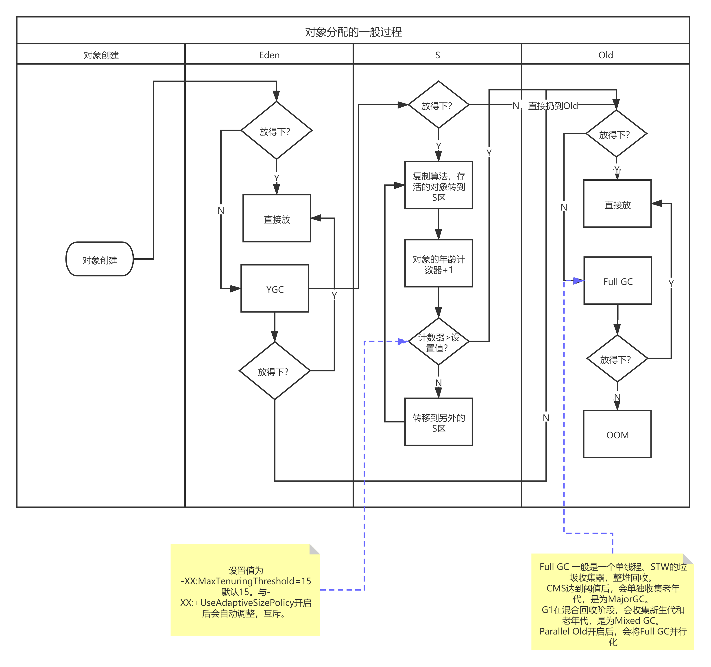
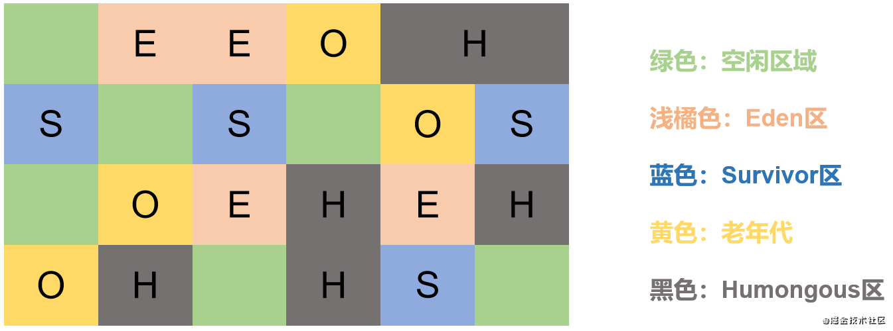
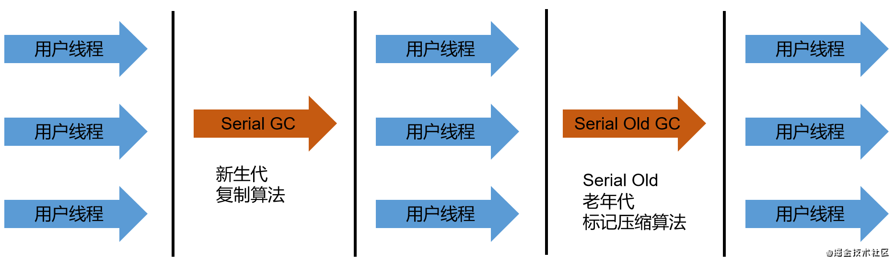
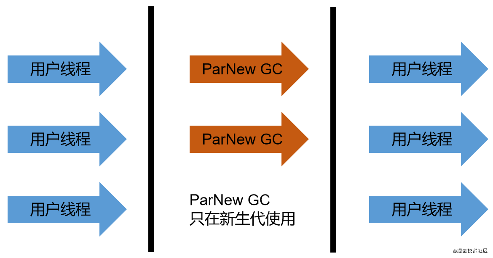
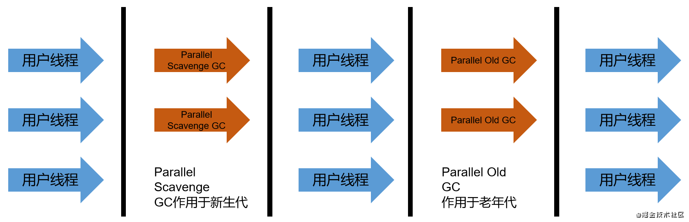
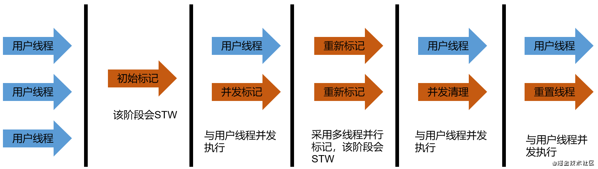
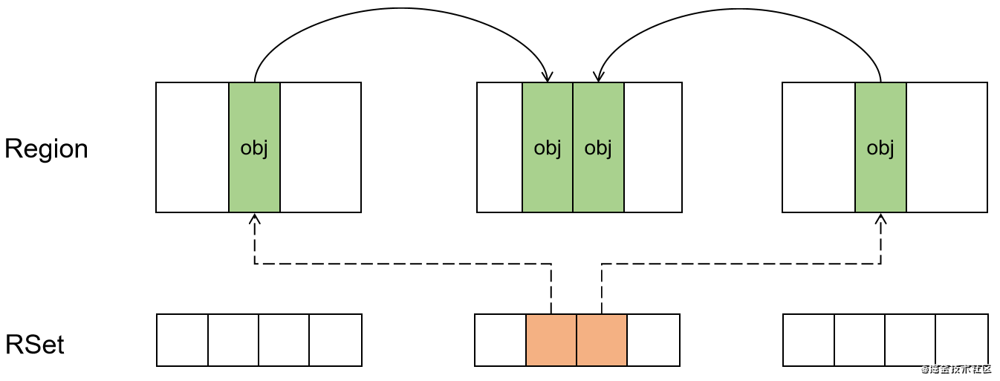
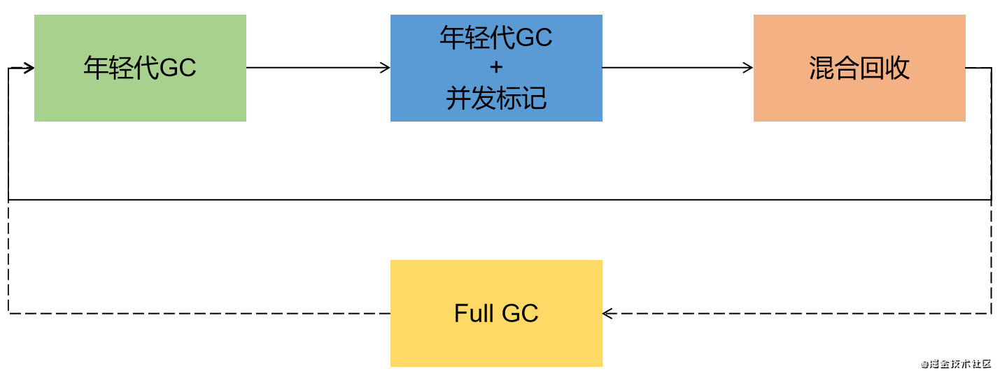
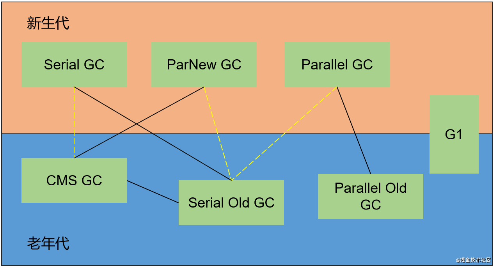
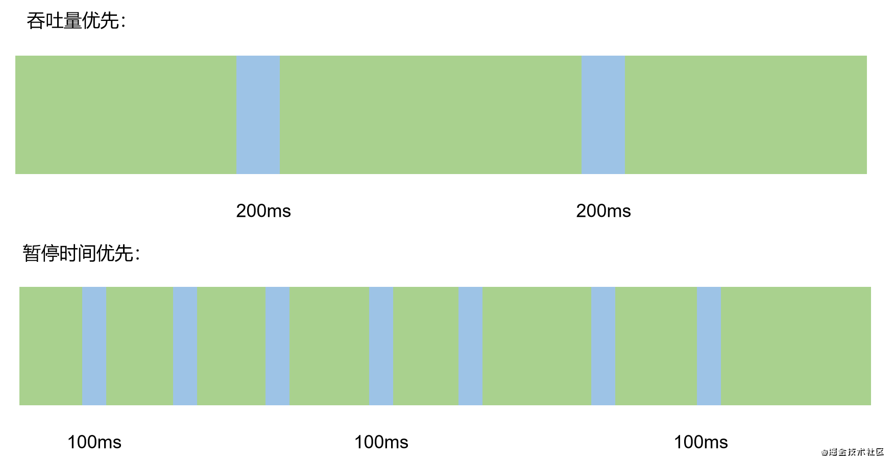

本篇文章中讲到的JVM，均是指HotSpot虚拟机，虚拟机有一套标准的协议，其他公司也有相关的JVM实现，如IBM的OpenJ9。

## JVM内存划分

### 方法栈

一个线程有一个方法栈，一个方法栈包含多个栈帧，一个栈帧对应一个方法。


方法运行时，产生的变量、临时计算结果等，存放在栈帧中。

如果当前栈帧调用了新的方法，那么新的方法对应的栈帧会被创建出来并压入栈中成为新的栈帧。

JAVA方法有两种返回函数的方式，一种是正常的函数返回，使用return指令；另一种是抛出异常；不管是哪种方式，都会导致栈帧被弹出。


#### 栈帧

栈帧中有五部分的数据，分别是：**局部变量表、操作数栈、方法返回地址、动态链接和一些附加信息**。

方法返回地址、动态链接和一些附加信息也统称为帧数据区。


- 局部变量表

局部变量表底层其实是一个数字数组，主要用于存储方法参数和定义在方法体内的局部变量。这些数据类型包括基本数据类型，对象引用和方法返回地址。存在于每个线程的每个栈的每个栈帧中，只在当前方法有效，在调用结束后，随着栈帧的销毁而销毁，不存在线程安全的问题。

局部变量表所需的容量大小是在编译期就确定下来的，不会在运行期间改变。在类的字节码文件中，可以看到经编译确定下来的大小。


在局部变量表中，32位以内的类型占一个`slot`（包括方法返回地址），64位的类型占两个slot。byte、short、char在存储前被转为int，boolean也被转为int，0表示false，非0表示true。long和double占据两个slot。

slot是局部变量表最基本的存储单元，如果当前帧是由构造方法或者实例方法创建的，那么该对象引用this将会存放在index=0的slot处。slot是可以重用的，当一个局部变量过了期作用域，那么该槽位可会会被回收，以达到节省资源的目的。

方法嵌套调用的次数由栈的大小决定。如果一个方法的参数和局部变量很多，会使局部变量表膨胀，导致栈帧占用空间增加，压缩嵌套调用的次数。


局部变量与成员变量的区别：

| 成员变量                                                     | 类变量                                                       | 局部变量                                     |
| ------------------------------------------------------------ | ------------------------------------------------------------ | -------------------------------------------- |
| 使用前经过初始化赋值。随着对象的创建，会在堆空间分配实例变量空间，并进行默认赋值 | 在链接的准备阶段，给类变量赋默认值，在初始化阶段（静态代码块），给类变量显性赋值 | 在使用前，必须进行显式赋值，否则编译不通过； |


在栈帧中，与性能调优关系最为密切的部分就是局部变量表(其实也没多少可GC的)，在方法执行时，虚拟机使用局部表量表完成方法的传递。局部变量表也是重要的垃圾回收根节点，只要在局部变量中直接或间接引用的对象，都不会被回收。


- 操作数栈（表达式栈）

Java中的操作数栈，使用数组实现。Java虚拟机的解释引擎是基于栈的执行引擎，其中的栈便是指操作数栈。


它主要用于保存计算过程的中间结果，同时作为计算过程中变量临时的存储空间。操作数栈是JVM执行引擎的一个工作区，当一个方法开始执行时，对应的新栈帧就会被创建出来，此时为空栈。


每一个操作数栈都拥有一个明确的栈深度用于存储数值，其所需的最大深度在编译期就已经确定，保存在方法的Code属性中，为max_stack值。

栈中，32bit的数据占一个单位深度，64位占两个深度。如果被调用的方法有返回值的话，那么其返回值将会被压入当前栈帧的操作数栈中，并更新PC寄存器中下一条需要执行的字节码指令。


为了优化操作数栈的执行效率，JVM还使用了`栈顶缓存技术`：

> 将栈帧中，操作数栈栈顶的元素全部缓存在CPU的寄存器中，以此减少对内存的读写次数，提高执行效率。


题外话：i++和++i的区别：i++，先将i从栈顶取出，参与其他计算，然后进行加1再放回栈中；++i，先进行加1操作，再参与其他计算，再放回栈中；


- 动态链接

字节码文件中定义了一个常量池，动态链接就是指向运行时常量池的方法引用。

源文件被编译到字节码文件中时，所有变量和方法引用都作为符号引用保存在class文件的常量池中，`动态链接的作用就是为了讲这些符号引用转换为调用方法的直接引用`


- 方法返回地址

方法返回地址存放调用当前方法PC寄存器的值。

方法可能正常结束，也可能因异常结束，无论通过哪种方式退出，在方法退出后都返回到该方法的被调用位置。方法正常退出时，调用者的PC寄存器的值作为返回地址，即调用该方法的指令的下一条指令的地址。而因异常结束的，返回地址是要通过异常表来确定，栈帧中一般不会保存这部分信息。即`异常结束的方法不会给调用者产生任何的返回值`

方法执行过程中抛出异常时的异常处理，存储在一个异常处理表，方便在发生异常的时候找到处理异常的代码。在遇到异常时，没有在异常表中搜索到匹配的异常处理，就会导致方法结束。


常见的返回指令有：

| 名称    | 说明                                             |
| ------- | ------------------------------------------------ |
| ireturn | 返回值是boolean、byte、char、short、int          |
| lreturn | long                                             |
| freturn | foat                                             |
| dreturn | double                                           |
| areturn | 引用类型                                         |
| return  | void的方法、实例初始化方法、类和接口的初始化方法 |


- 附加信息

栈帧允许携带与Java虚拟机实现相关的一些附加信息。例如对程序调试提供支持的信息。


### 方法区

方法区用于存储已被JVM加载的类型信息、域信息、方法信息、常量、静态变量、即时编译器编译后的代码缓存等。

方法区在启动时被创建，是线程共享的区域，可以设置通过参数设置大小。方法区的大小决定了系统可以存放多少个类，如果系统定义了太多的类，导致方法区溢出，则会抛出`OutOfMemoryError:PermGen space`或者`OutOfMemoryError:Metaspace`(加载太多jar，反射太多类)

方法区有一个别名，叫做non-heap(非堆)，是因为在JVM规范中，说明方法区在逻辑上属于堆的一部分。但是一些简单的实现可能不会选择去进行垃圾收集或者内存压缩。


#### 方法区的内部结构

方法区用于存储已被JVM加载的类型信息、域信息、方法信息、常量、静态变量、即时编译器编译后的代码缓存等。

方法区存放类信息，运行时常量池(字符串常量)

- 类型信息

对每个加载的类型（类class，接口interface，枚举enum、注解annotation），JVM必须在方法区中存储以下的类型信息

1、类型的有效名称(全名 = 包名**.**类名)

2、类型的直接父类的完整有效名

3、类型的修饰符，public、abstract、final

4、类型直接接口的有序列表


- 域(Field，成员变量)信息

JVM必须在方法区中保存类型的所有域的相关信息，以及域的声明顺序

域信息包括：域名称、域类型、域修饰符(public、private、protected、final、volatale、transient的某个子集)


non-final的类变量

静态变量和类关联在一起，随着类的加载而加载，它们成为类数据在逻辑上的一部分

类变量被类的所有实例共享，及时没有实例也可以访问

static final全局常量

被声明为final的类变量的处理方法，在编译的时候就已经被分配了


- 方法信息

JVM必须保存所有方法的以下信息：

方法名称

方法的返回类型

方法的参数数量和类型（按顺序）

方法的修饰符，public，private、protected、static、final、synchronized、native、abstract

方法的字节码（bytecodes）、操作数栈、局部变量表及大小（abstract和native方法除外）

异常表，每个异常处理的开始位置、结束位置、代码处理在程序计数器中的偏移位置、被捕获的异常类的常量池索引；abstract和native方法除外


- 常量

| -        | 运行时常量池                         | 常量池                                                       |
| :------- | ------------------------------------ | ------------------------------------------------------------ |
| 存放位置 | 方法区                               | 字节码文件                                                   |
| 作用     | 存放编译器生成的各种字面量和符号引用 | 存放字面量和堆类型、域和方法的符号引用，用以减少class文件的大小 |
| 是否唯一 | JVM会为每个类型维护一个常量池        | 每个字节码文件都有一个常量池                                 |

运行时常量池包含多种不同的常量，包括编译器就已经明确的数值字面量，也包括运行期解析后才能获得的方法或者字段引用，此时不再是常量池中的符号地址，而是真实地址，体现了运行时常量池相对于class文件常量池的具有`动态性`

当创建类或接口的运行时常量池时，如果构造运行时常量池所需的内存空间超过了方法区所能提供的最大则，则会OOM


#### 方法区的演变

在Java7以前，习惯把方法区成为`永久代`，在Java8之后，`元空间`取代了永久代


为什么要用元空间取代永久区？主要是为了实现与JRockit的融合，JRockit并没有永久代，而是使用的直接内存。另外，永久代的空间大小很难确定，容易触发Full GC，在某些场景下还会OOM；对永久代进行调优也很困难，。而`元空间并不在虚拟机中，而是使用直接内存`，所以元空间的大小仅受本地内存的限制。


本质上，方法区和永久代并不等价，只有，在JVM规范中并没有对实现方法区做统一要求。如JRockit和J9并没有永久代的概念。

在JVM划分内存成为方法区，容易造成方法区的的OOM，所以在Java8之后，采用了元空间(Metaspace)来代替。元空间本质与永久代类似，都是对方法区的实现，不过`元空间直接使用本地内存，较少会OOM`。


在JDK1.6以前，静态变量存放在永久代中；JDK1.7以后，将字符串常量池、静态变量移除，保存在堆中；JDK1.8之后，去除了永久代，类型信息、字段、方法、常量保存在本地内存的元空间中，但字符串常量池、静态变量仍在堆中。


#### 堆、栈、方法区的交互关系


```java
Object   obj = new Object();
方法区    栈         堆     
```

栈存放对象的引用，堆存放对象的数据，对象的数据中有类型存放于方法区


堆抛的异常，OutOfMemoryError:Java heap space

方法区抛的异常，OutOfMemoryError:Metaspace

栈抛的异常，StackOverflowError


#### 方法区的大小

法区的空间的大小可以是固定的，也可以动态进行调整。

- Java7以前，可以通过`-XX:PermSize`设置永久代初始分配空间，默认20.75M，`-XX:MaxPermSize`设置永久代的最大可分配空间，32位机器默认为64M，64位默认为82M；当方法区的容量超过了-XX:MaxPermSize就会OOM
- Java8，-XX:PermSize改为`-XX:MetaspaceSize`，-XX:MaxPermSize改为`-XX:MaxMetaspaceSize`；两个参数的默认值在不同环境下存在差异，windows环境下，-XX:MetaspaceSize为21M，-XX:MaxMetaspaceSize为-1，即不限制


-XX:MetaspaceSize，对于64位的服务器JVM来说，其默认值为21值，这是一个水位线，当触及这个水位线时，将会触发一次Full GC并卸载没用的类(即这些类的加载器不再存活)，然后这个水位线会被重置。新的水位线取决于GC后释放了多少元空间，如果释放的空间不足，则在不超过-XX:MaxMetaspaceSize的情况下提高水位线，如果释放的空间过多，则适当降低该值。

如果初始化的水位线过低，则会进行多次FullGC进行调高，为了避免Full GC，应该讲-XX:MetaspaceSize设置为一个较高的值。


### 堆区

在Java7以前，堆空间在逻辑上划分为：新生区+老年区+`永久代`；在Java8及之后分为：新生区+老年区+`元空间`

永久代和元空间，是方法区的具体实现，方法区又叫non-heap，所以永久代和元空间实际上不归属于堆，只是逻辑划分而已。

存储在JVM的Java对象可以被划分成两类，一类是生面周期比较短的瞬时对象，这些类的创建和消亡都非常迅速；另一类对象的生命周期却非常长，在某些极端情况下，还能够与JVM的生命周期保持一直，如`Runtime`类


为什么要进行内存分带？大量数据表明，不同对象的生命周期不同，70%~90%的对象时临时对象，对对象进行分代可以更有目的的进行GC，优化GC性能。


#### 新生代

新生代可以划分为`Eden`、`Survivor0`和`Survivor1`，Survivor0和Survivor1有时也叫作from、to。

- Eden：对象(几乎所有)最开始创建的位置。
- Survivor0和Survivor1：Eden区没有被GC清除的对象会被放到S0和S1中，S0和S1大小一致，只有一个空间用来存储对象，另一个区用来全量GC。


绝大部分的Java对象都是在新生代销毁，IBM研究表明，新生代80%的对象都是朝生夕死。

#### 老年代

堆空间除了新生代就是老年代啦。。


#### 对象在堆区的分配过程



#### 与堆内存设置相关的参数

- `-Xms`，表示堆的起始内存（新生代和老年代）

全称为-XX:InitialHeapSize

X是JVM的运行参数，ms是memory start。默认单位为字节，有k、m、g


- `-Xmx`，表示堆的最大内存

全称为-XX:MaxHeapSize


默认的堆空间大小：

-Xms = 计算机内存大小 /64

-Xmx = 计算机内存大小 /4

一旦超过了-Xmx所制定的最大内存时，将会抛出`OutOfMemoryError`。通常会将两个参数设置成相同的值，让垃圾回收完后，不需要重新分隔计算堆区的大小，进而提高性能。


可以通过以下程序查看JVM的堆大小：

```java
// -Xms 堆的起始值，s0,s1区只算其中的一个
long initalMemory = Runtime.getRuntime().totalMemory() / 1024 / 1024
// -Xmx 堆的最大值
long maxMemory = Runtime.getRuntime().maxMemory() / 1024 / 1024
```


关闭自适应的内存分配策略

-XX:-UseAdaptiveSizePolicy：-为关闭，+为开启，默认开启


配置新生代和老年代在对结构的占比

- 默认`-XX:NewRatio=2`，表示新生代占1，老年代占2，新生代占整个堆的1/3；可以修改为-XX:NewRatio=4，表示新生代占1，老年代占4，新生代占整个堆的1/5

- 在HotSpot中，Eden和S0、S1的默认比例为8:1:1，可以通过`-XX:SurvivorRatio`=8调整比例


配置新生代的最大内存大小

- `-Xmn`，一般默认即可，有设置就以这个参数为准。


## 垃圾回收算法

在JVM中，与垃圾相关的算法大致有其中，其中为了识别垃圾对象，需要使用可达性分析算法进行查找。找到之后，需要进行清理，可以使用清除算法、复制算法、清除压缩算法。

而分代算法、分区算法、增量回收算法，则作为一种宏观的算法思想，在垃圾回收的整个过程中发挥作用。


### 可达性分析算法

可达性分析算法也叫**根搜索算法**，跟踪性垃圾收集。相对于引用计数算法而言，可达性分析算法不仅同样具备简单和执行高效的特点，而且能够有效的解决循环依赖的问题，防止内存泄漏。


可达性分析算法是以跟对象集合(GC Roots)为起始点，从上到下的方式搜索`被跟对象集合所连接的目标对象是否可达`。存活的对象都会被根对象集合直接或间接连接着，搜索所走过的路径成为引用链(Reference Chain)。

如果目标对象没有任何引用链相连，则是不可达的，就以为着该对象已经死亡，可以标记为垃圾对象。


GC Roots包括以下几类：

- 虚拟机栈中引用的对象，如各个线程栈帧中使用到的参数、局部变量等

- 本地方法栈JNI引用的对象

- 常量、静态属性引用的对象

- 被同步锁synchronized持有的对象

- Java虚拟机的内部引用，如基本数据类型对应的Class，一些常驻对象（NPE，OOM等），类加载器

- 反应JVM内部情况的JMXBean，JVMTI中注册回调、本地代码缓存等。


除上述外，还有可能临时性的加入其他的对象，共同构成GC Roots，如`分代收集`和`局部回收`。


一般来说，Root采用栈的方式存放变量和指针，所以如果一个指针，它保存了堆内存里面的对象，但自己又不存放在堆内存中，那么他就是一个Root。

如果只针对堆中的某一块区域进行垃圾回收，必须考虑到这个区域的对象完全有可能被其他区域的对象所引用，这是就需要将关联区域的对象也加入到GC Roots中，才能保证可达性分析的准确性。


使用可达性分析算法， 必须在一个能保证一致性的快照中进行，这也是导致Stop The World的一个重要原因，因为枚举根节点时必须要停顿。


### 清除算法

该算法是一种非常基础和常见的垃圾手机算法，于1960年应用于Lisp语言。

当堆内存的有效空间(availabe memory)被耗尽的时候，就会停止整个程序(Stop The World)，然后进行两项工作，一是进行标记、二是进行清除。


标记：收集器（Collector）从引用根节点开始遍历，标记所有被引用的对象，一般是`在对象的header中记录为可达对象`。


清除：收集器对堆内存从头到尾进行串行遍历，如果发现某个对象在其header中没有标记为可达对象，则将其清除。**清除并不是真的置空，而是把需要清除的对象的地址保存在空闲的地址列表中，下次需要时，直接覆盖**。


优点：容易理解、容易实现。

缺点：需要两次遍历，效率不高；进行GC时整个程序STW，体验较差；产生较多的内存碎片，碎片空间难利用。


### 复制算法

该算法与1963年出现，被引入到了Lisp的另一个实现版本中。

该算法的核心思想是：将内存空间分为两块，每次只使用其中的一块，在垃圾回收时，将正在使用的内存中的存活对象，复制到未使用的内存块中。之后清除正在使用的内存块中的所有对象。交换两个内存块的角色，完成垃圾回收。堆内存中的Survivor区就是基于该算法。


优点：简单高效、不会造成内存碎片；

缺点：有一半的内存空间无法被使用；对于G1这种分拆成大量region的GC，复制而不是移动，意味着GC需要维护region之间对象的引用关系，不管是内存占用和时间开销都很大。极端情况下，整个区域所有的对象都存活，那么每个对象都要回收一遍。

应用场景：内存区域中的垃圾对象很多，复制算法需要复制的存活对象很少（适合新生代使用，新生代都是用的复制算法）。


### 压缩算法

在堆的老年代，经GC后存活的对象很多，不适合使用复制算法。而标记清除算法容易产生较多的内存碎片，为此在标记清除算法的基础上，标记压缩算法应运而生。该算法与1970年发布，现在已经广泛应用到各种垃圾收集器中。


该算法的标记阶段和标记清除算法一样。第二阶段则是将所有存活的对象移动到内存的一端，按顺序排放。之后再清除边界外的所有空间。


标记：开销与存活对象成正比

清除：开销与内存区域大小成正比

压缩：开销与存活对象的大小成正比


**该算法其实就是在标记清除算法的中间，加入一次内存整理**。


优点：不会产生内存碎片；能够完整的利用整个内存空间；

缺点：需要维护对象之间的引用关系；加入了整理阶段，性能较差；移动对象的过程中，需要STW。


- 三种算法的对比

|          | 标记清除算法         | 复制算法                             | 标记压缩算法         |
| -------- | -------------------- | ------------------------------------ | -------------------- |
| 速度     | 中等                 | 最快                                 | 最慢                 |
| 空间开销 | 少，但会产生内存碎片 | 高，需要两倍的内存，不会产生内存碎片 | 少，不会产生内存碎片 |
| 移动对象 | 否                   | 是                                   | 是                   |


### 分代算法

在JVM的内存中，不同对象的生命周期是不一样的，因此，需要**根据不同生命周期的对象采用不同的收集方式**，以提高GC效率。


如HTTP请求中的Session对象、线程、Socket连接等，这类对象存活时间较长；如方法运行时的临时对象、String对象等，存活时间非常短，甚至有些对象只用一次就会被回收。


目前几乎所有的GC，都是采用的分代收集算法进行垃圾回收。


在HotSpot中，各个内存区域采用的算法各不相同：

- 年轻代

年轻代特点：区域相对于老年代较小，**对象生命周期短、存活率低、GC频繁**

这种情况使用**复制算法**回收整理，速度最快。复制算法的效率只和当前存活的对象有关，因此很使用于年轻代的回收。而复制算法内存利用率不高的问题，通过HotSpot的两个Survivor区得到缓解（两个区域内存都不大）


- 老年代

老年代特点：区域较大，**对象生命周期长、存活率高、GC较少**

老年代存在大量存活率高的对象，复制算法明显不合适；**一般是由标记-清除或者标记压缩算法混合实现**。

HotSpot的CMS回收器，便是基于标记清除算法实现，回收效率比较高。对于内存碎片问题，CMS采用标记压缩的Serial Old回收器作为补偿措施，当内存回收不佳时(碎片导致Concurrent Mode Failure)，采用Serial Old执行Full GC以达到对老年代内存的整理。


> 一句话总结：每个对象的存活时间不同，区分处理


### 分区算法

一般来说，在相同条件下，堆空间越大，一次GC所需要的时间就越长，STW停顿也就越长。为了更好的控制GC的停顿时间，可以将一大块内存区域分割成多个小块，根据目标的停顿时间，每次合理的收集若干个小空间的，而不是整个堆。从而控制GC所产生的停顿。

每一个小区间都独立使用，独立回收，好处就是可以控制一次回收多少个小区间(要是对象太大，单个小区间放不下呢？)。





G1 GC 便实现了该算法的思想


分代算法和分区算法的区别：

分代算法将内存按照对象的生命周期分成两个部分，分区算法将整个堆空间划分成连续的小区间。

> 一句话总结：内存区域太大了，把它拆细才能更好的GC


### 增量回收算法

在垃圾回收的过程中，难以避免的会出现Stop The World的状态，在STW下，应用程序的所有线程都会被挂起，暂停一切工作，等待垃圾回收完成。如果STW过长，将会严重影响用户体验和系统稳定。因此，便诞生实时的垃圾收集的**增量收集算法**。


如果一次性将所有的垃圾进行处理，需要造成系统长时间的停顿，那么就可以让垃圾收集线程和应用程序线程交替执行。每次，**垃圾收集线程只收集一小片区域的内存空间，接着切换到应用程序线程，依次反复，直到垃圾收集完成**（那要是一直都收集不完呢？？）。


**增量收集算法的基础任然是传统的标记清除和复制算法**，增量收集算法只是通过对线程冲突的妥善处理，允许垃圾收集线程分阶段完成垃圾收集。


缺点：

	在垃圾回收的过程中，间歇性的执行应用程序代码，虽然能减少系统的停顿时间，但是造成GC的效率不高，线程切换和上下文切换，会使垃圾回收的成本上升，降低系统的吞吐量。


> 一句话总结：全量GC的STW太长了，减少每次GC的范围就能减少STW


## 垃圾回收器

什么是GC？

垃圾回收器Garbage Collector

垃圾回收名词Garbage Collection

垃圾回收动作（Do）Garbage Collection

一般指垃圾回收器。


常见的GC名词释义：

Young GC = Minor GC ，指Eden区的垃圾回收行为

Old GC = Full GC + Mix GC + Majar GC，Old GC指老年代的垃圾回收行为。**老年代满了，必定会触发Full GC** 。使用CMS垃圾回收器时，在老年代达到一定阈值后，会触发Majar GC。使用G1垃圾回收器时，在堆区达到一定阈值后，会触发Mix GC。Majar GC特指CMS垃圾回收器在老年代的垃圾回收行为。Mix GC特指G1对整堆的垃圾回收行为。

Full GC != Old GC，Full GC在很多资料中，被描述成老年代的GC，实际上这是不对的，因为方法区满了也会发生Full GC。同样，在很多资料中，Full GC被描述成单线程的，但实际上，在使用Parallel Old垃圾回收器时，Full GC会并行化。在JDK11时，G1并发失败，也会触发Full GC，但此时Full GC也会并行化。


### Serial




Serial 是最基本、历史最悠久的单线程(串行)垃圾收集器，JDK1.3以前新生代唯一的选择；

**在九十年代的硬件市场中，大部分CPU都是单核心，为了避免并发争抢导致性能下降，单线程垃圾收集器才是当时最佳的选择**。至今，在Client模式下的JDK，该收集器仍是新生代默认的版本。

Serial使用**复制算法**进行垃圾收集，在运行期间会**STW**，除了作用于新生代外，该收集器还有作用于老年代的Serial Old版本，使用标记压缩算法。

涉及到Eden、Survivor区的垃圾回收，均是采用复制算法。


**Serial Old可以与新生代的Serial、Parallel Scavenge配合使用，并作为CMS的后备垃圾收集器**。


优点：

	简单高效，对单个CPU的环境，Serial没有雨其他线程交互的高效，效率更高
	
	在客户端的Java应用，计算机的硬件水平不高，内存也不大（几十兆~一两百兆），即使是单线程进行垃圾回收也有很低的延时。

通过`-XX:UseSerialGC`指定年轻代和老年代都是用Serial回收器。 可以加上`-XX:+PrintCommandLineFlags`查看命令行相关的参数(包含垃圾回收器)，也可以输入`jinfo -flag UseSerialGC pid`查看参数是否使用，pid为Java进程ID；


### ParNew




ParNew其实就是Serial的多线程版本，是一款并行回收器，Par是parallel、New是新生代，很明显，该回收器只能在新生代使用。

ParNew对比Serial，除了采用并行回收外，没有任何区别，也是采用的**复制算法**，同样会造成**STW**。ParNew不一定会比Serial更高效，如单核心的机器，效率就没那么高。

ParNew和Parallel Scavenge都是并行的垃圾收集器，不过底层的实现不一样，**ParNew能和CMS搭配使用**。

可以通过`-XX:+UseParNewGC`手动指定ParNew GC进行垃圾回收，不过仅仅表示在新生代使用，不影响老年代。由于是并行回收，可以使用`-XX：ParallelGCThreads`设置执行回收的线程数，不设置的话默认和CPU线程数相同。


### Parallel



Parallel Scavenge 也是一款并行回收的收集器，采用**复制算法**，运行时会**STW**，**新生代为Parallel Scavenge，老年代为Parallel Old**。

**Parallel Old于JDK1.6出现，采用标记压缩算法，用以替代Serial Old**，两款Parallel是JDK1.8的默认组合，在Server模式有非常优秀的性能

Parallel和ParNew同样是并行收集器，那么在已经存在ParNew的情况下，Parallel会不会显得多余？其实并不会，他们底层实现的代码有很大的差别，而且**Parallel更专注于提高程序的吞吐量，能够设置自适应策略**。

高吞吐量的GC适用于不需要太多交互的任务，如批处理、订单处理、工资支付、科学计算等。


#### 相关参数


- `-XX:+UseParallelGC`，手动指定年轻代使用Parallel Scavenge GC，老年代为`-XX:+ParallelOldGC`，两个参数开启一个，另一个也会被激活（互相激活）。
- `-XX:ParallelGCThreads`，设置年轻代Parallel的线程数，在默认情况下，CPU核心小于8，与核心数相同。大于8时，ParallelGCThreads = 3+(5 * cpu_threads /8)。
- `-XX:MaxGCPauseMillis`，设置垃圾收集器的最大停顿时间，单位为毫秒，**使用该参数需谨慎**。
- `-XX:GCTimeRatio`，设置垃圾收集时间占总时间的比例，用于衡量吞吐量的大小，取值为(0,100)，默认值为99，也几乎是垃圾回收的时间不超过1%。与-XX:MaxGCPauseMillis存在一定的矛盾，暂定时间越长，ratio就容易超过规定的比例。
- `-XX:+UseAdaptiveSizePolicy`，设置自适应调节策略。在这种模式下，Eden和Survivor的比例，晋升老年代的对象年龄会被自动调整，已达到在堆大小、吞吐量和停顿时间的平衡点。在手动调优的比较困难的情况下，可以使用该参数，仅需指定`-Xmx`、`GCTimeRatio`和`MaxGCPauseMillis`，让虚拟机自己完成调优工作。


#### Full GC 并行化

老年代内存满时，JVM会触发一个单线程，STW的GC进行回收，为Full GC。

在使用Parallel Old GC的情况下，JVM会用Parallel Old GC的多线程并行回收，替代Full GC ，是为Full GC并行化。


### CMS




CMS全称为Concurrent Mark Sweep，作用于老年代，于JDK1.5时发布，从名字上看，采用了**标记清除算法和多线程并发收集**，其被认为是具有划时代意义的回收器，**第一次实现了让垃圾回收线程和用户线程同时工作**

**CMS在设计之初，关注的重点是尽可能的缩短垃圾收集时，用户线程的暂停时间**。可以用于重视服务响应速度，希望系统停顿时间最短的应用。


#### 三色标记

CMS存在并发标记、并发清除的状态，在这个过程中，CMS会用三种颜色对对象进行标记，以判断哪些对象是存活的。


三种颜色分别为黑色、灰色、白色

- 黑色：对象本身及其所有引用都被扫描过
- 灰色：对象本身被扫描过
- 白色：没有被GC扫描


#### 垃圾回收过程 

初始标记：在GC开始时，所有对象均为白色，初始标记会遍历GC Roots，所以将GC Roots直接关联的对象置为灰色。

并发标记：遍历灰色对象的所有引用，灰色对象变为黑色，将其引用对象置为灰色。

重新标记：遍历如果产生新的GC Root则将其置为黑色，并遍历其引用，将其引用对象置为灰色。将失效（漏标和错标）的灰色对象置为白色。

并发清除：JVM清除未被标记的白色对象。

重置线程状态。


### G1

G1全称Garbage First(垃圾优先)，现在的硬件水平特别是CPU和内存发展迅速，如按摩店家的顶级CPU能达到64核心128线程的规格，内存条单根可达256GB，以往的GC在现在的硬件平台上表现不是很好，不能充分发挥硬件资源，由此，G1便应运而生(针对多CPU核心大内存的机器)。**官方给G1的设计目标是在延迟可控的情况下，获得尽可能高的吞吐量，需要担起“全功能收集器”的重任**。

G1是一款并行回收器，基于**分区算法**，把堆内存分割为很多独立的区域(Region)，使用不同的Region来表示Eden、Survivor0、Survivor1和老年代，因此，可以避免对整个堆区的垃圾收集。G1跟踪各个Region里面的垃圾堆积的价值大小(回收所获得的空间以及回收所需时间的经验值)，维护一个优先列表，根据允许收集的时间，优先回收价值最大的Region。这种方式优先清除高价值的垃圾，所以称为：垃圾优先。

G1早在JDK1.7时便已正式启用，移除了Experimental标识，是JDK9之后的默认垃圾回收器，取代了(ParNew + CMS)和(Parallel Scavenge + Parallel Old)的组合。因此，CMS在JDK9时便已被废弃。在JDK1.8时，需要使用`-XX:+UseG1GC`参数进行启动


#### 基于Region


开启G1垃圾收集器后，JVM会将Java堆划分为2048个大小相同的独立Region，每个Region大小根据堆空间大小而定，不过每个的范围在1MB~32MB之间。且为2^n，通过`-XX:G1HeapRegionSize`进行设置，所有Region大小相同，在JVM运行时不能改变。

G1仍然保有年轻代和老年代的相关概念，**G1也仍是分代算法的实现**，但整个堆空间被分隔为一个个Region后，新生代和老年代就不再是物理隔离的了，他们都是一部分Region的集合，通过Region的动态分配，实现逻辑上的连续。

一个Region有可能属于Eden、Survivor或者老年代的其中一种，如上图所示。此外G1垃圾收集器还增加了一种新的内存区域，叫做Humongous，即图中的H区，主要用于存储大对象，如大对象的内存占用超过1.5个Region，就放到H区中。

对于堆中的大对象，以往默认分配到老年代中，但如果大对象只是短期的大对象，就会造成老年代的频繁GC。所以G1才又划分了H区专门存放大对象，**如果一个H区放不下，G1会寻找连续的H区来存储**。为了能够找到连续的H区，必要时会启动Full GC，因此，H区也可以看做是老年代的一部分。

在堆内存被分隔成Region之后，原先归属于堆的TLAB（Thread Local）也被分配进了Region中。


#### 记忆集和写屏障

一个Region不能可能是孤立的，里面的对象可能被其他Region的对象所引用，判断对象存活时，需要保证结果的准确性。在其他分代算法的收集器也存在该问题，不过G1更突出。如果进行年轻代GC的时候，需要扫描老年代，那么就会导致年轻代GC效率低下。

因此，JVM的分代收集器都是使用了**记忆集Remembered Set**来避免全局扫描。



对于G1而言，每个Region都拥有一个独立的记忆集。每次有关对象引用的写操作时，都会产生一个**写屏障Write Barrier**，暂时中断操作，然后检查将要写入的引用指向的对象是否在不同的Region，如果不同，则通过CardTable把相关的引用信息记录到指向对象所在Region的记忆集中。如此，在进行垃圾收集时，枚举Region的记忆集，就能够避免全局进行扫描。

不过该方式会需要对对象的引用信息进行存储，**会额外消耗一些内存空间**，经众多的生产实践，大约为10~20%的内存。


#### 垃圾回收的主要环节



G1进行垃圾回收主要有三个环节，年轻代GC 、老年代并发标记、混合回收 （Mixed GC）。如果需要，单线程、独占式、高强度的Full GC仍然有可能执行 （Full GC作为一种GC失败后的保护机制）。


- 年轻代GC

当Eden区用尽时才开始进行Young GC(S区用尽不会发生GC)，暂停所有用户线程，创建回收的内存分段集合，启动多个GC线程并行收集，然后将Eden区移动存活对象至Survivor区或者老年代。

1、扫描根

根是指static变量指向的对象，正在执行的方法调用链上的局部变量等。根引用连同Rset记录的外部引用作为扫描存活对象的入口。

2、更新RSet

处理dirty card queue中的card，更新RSet，此阶段完成后，RSet能够准确的反映老年代对所在内存片段的对象引用情况。

对于应用程序的引用赋值语句`obj.ref =  new Object();`JVM会在之前和之后执行特殊的处理操作，在dirty card queue中入队一个保存了对象引用信息的card，G1在垃圾回收时，根据里面的card更新RSet，以保证RSet能够反映实时、准确的引用关系。

**RSet的处理需要线程同步，如果直接将赋值语句更新到RSet中，开销较大，比较耗性能**。

3、处理RSet

识别被老年代对象指向的Eden对象，这些被指向的Eden对象就是存活的对象。

4、复制对象

遍历整个对象树，Eden区存活的对象会被复制到Survivor区，如果达到阈值，则复制到老年代中，未达到阈值则阈值累加。如果Survivor不够，Eden区的对象直接晋升到老年代。

5、处理引用

处理Soft、Weak、Phantom、final、JNI Weak等引用关系，最终Eden区的数据为空，GC停止工作。


- 老年代并发标记

当堆内存使用率达到阈值（默认45%）时，开始老年代的并发标记。

1、初始标记

标记从根节点直接可达的对象，这个阶段是STW的，且会触发一次Young GC

2、根区域扫描

扫描Survivor区直接可达的老年代对象，并标记被引用的对象，这个过程必须在上一步的Young GC前完成

3、并发标记

在整个堆中进行并发标记(和应用程序并发进行)，此过程可能被Young GC中断，**若发现Region中的对象都是垃圾，那整个Region立即被回收**。同时，并发标记过程中，会计算每个区域对象存活的比例。

4、再次标记

由于在上一阶段，GC线程和用户线程并发运行，所以需要修正用户线程运行造成的变动。这一过程会造成STW，不过G1 采用比CMS更快的促使快照算法(Snapshot-At-The-Beginning)

5、独占清理

暂停用户线程，计算各个区域存活对象和GC回收的比例，并进行排序，识别可以混合回收的区域。这个阶段不会做垃圾清理。

6、并发清理

识别并清理完全空闲的区域。


- 混合回收

在老年代完成并发标记之后，马上开始混合回收。G1会将老年代存活的对象移动到空闲Region，这些Region则成为老年代的一部分。和年轻代不同，老年代不需要整个被回收，只需要回收一部分的老年代Region即可（全量回收STW时间较长）。

当越来越多的对象晋升到老年代，为了避免老年代内存的耗尽，也会触发Mixed GC。

并发标记结束后，老年代中全部为垃圾的Region被回收，部分为垃圾的Region内存分段被计算了出来，默认情况下，这些内存分段会分8次进行回收(可以通过`-XX:G1MixedGCCountTarget`设置)。

混合回收的回收集，包括八分之一的老年代内存分段，Eden区和Survivor的内存分段，混合回收也是采用的复制算法，只是多了老年代的内存分段。

由于老年代的内存分段分八次被回收，所以G1会优先回收垃圾多的内存分段，垃圾占比越高，越先被回收。可以通过`-XX:G1MixedGCLiveThresholdPercent`进行设置，默认为65%。

当然，混合回收并不一定要进行八次，该阈值可以通过`-XX:G1HeapWastePercent`进行设置，默认为10%，即允许堆内存有10%的内存被浪费，如果发现可以回收的垃圾占堆内存的比例低于10%，则不再进行混合回收，因为GC会花费很多时间，但回收的内存又很少，显然不划算。。


- Full GC

G1设计的初衷就是要避免Full GC的出现，但是如果上述的方式不能正常工作，G1会停止应用程序的执行，使用单线程的的内存回收算法进行垃圾收集，性能非常差，造成的STW时间会很长。

当堆内存太小，G1在复制存活对象的时候发现没有空的内存分段可用，则会回退到Full GC，这就得加内存解决了。

另外，当并发处理过程完成前，内存空间就已经耗尽，也会触发Full GC。


PS： Java10，将Full GC并行化，类似于Parallel GC


#### 优缺点

优点：

- 并发，G1的垃圾回收线程可以和用户线程交替执行，部分工作可以同时执行
- 并行，在回收期间，有多个线程同时工作，充分利用多核心CPU资源，不过此时会造成STW
- 分代收集，G1属于典型的分代型垃圾收集器，仍然有新生代、老年代等概念，只是在内存上，不要求这些区域保持物理连续，也不再坚持固定大小和数量。和之前的垃圾回收器不同，**G1能同时兼顾新生代和老年代**。
- 空间整合，因为G1将内存划分了一个个Region，回收也是以Region为基本单位，**Region之间采用复制算法，整体上也可以看做标记压缩算法，所以能有效的避免内存碎片**。
- 可预测的停顿时间模型(Soft Real Time)，G1在追求低停顿时间的同时，还会建立可预测的停顿时间模型，让使用者明确指定一个时间长度为M毫秒的时间片段内，消耗在垃圾收集的时间不得超过N毫秒。这归功与G1每次只选取部分区域进行垃圾收集，缩小的回收的范围，能更好的控制停顿时间。而且G1根据允许收集的时间，优先回收价值最大的Region，提高了回收的效率。相较于CMS，在情况良好时效果差不多，而在最差情况则优越很多。

缺点：

- G1在垃圾收集时产生的内存占用(Footprint)和程序运行时的额外执行负载(Overload)逗比CMS要高
- CMS在小内存上，大概率会优于G1，G1在大内存时才能充分发挥其优势。平衡点在6-8G之间。


#### 相关参数

- `-XX:+UseG1GC`，手动指定G1执行垃圾收集，JDK1.7、1.8需要使用，在JDK9之后默认开启。
- `-XX:G1HeapRegionSize`，设置每个Region的大小，值是2^n，范围是1MB~32MB之间，目标是根据最小的Java堆划分出去2048个区域，默认是堆内存的1/2000
- `-XX:MaxGcPauseMillis`，设置期望达到的最大GC停顿时间，JVM会尽力实现，但不保证达到，默认为200ms。
- `-XX:ParallelGcThreads`，设置STW工作线程数，最多为8。
- `-XX:ConcGCThreads`，设置并发标记的线程数，最好将其设置为ParallelGcThreads的四分之一左右。
- `-XX:IntiatingHeapOccupancyPercent`，设置触发并发GC周期的Java堆占用率阈值，超过此值就会触发GC，默认为45(45%的占用)。

G1的参数设置能够简化JVM的性能调优，开发人员只需**开启G1、设置堆的最大内存、设置最大停顿时间**即可。


### GC的组合关系




G1垃圾收集器作用于整个堆区。

图中黄色虚线中的Serial GC 和CMS GC、ParNew GC 和Serial Old GC 在Java8中已废弃，在Java9中已移除；Parallel GC 和Serial Old GC在Java14中弃用，估计在不久的将来也会被移除。

图中黑色实线关联CMS GC和Serial Old GC，表示Serial Old GC是CMS GC 的备选方案


- Serial + Serial Old 

CPU核心数比较小时，有比较优秀的性能和较低的CPU占用


- Parallel Scavenge + Parallel Old

Java8默认的GC组合。需要注意的是，Parallel Scavenge 不能与CMS一起使用。


- ParNew + CMS + Serial Old

CMS 不能搭配Parallel Scavenge，原因在于，**CMS和Parallel代码实现差异很大**，比如说，Parallel侧重于吞吐量的均衡，并有其均衡策略，而CMS侧重于较低的暂停时间。

例如：Parallel默认开启-XX:UseAdaptiveSizePolicy，而CMS默认关闭，并且，在使用CMS的情况下，显示开启该参数，也不会生效（在源代码层面，直接忽视掉）。

Serial Old作为CMS的后备GC，在Current Fail时使用。


- G1

自己和自己玩，但是可能会触发Current Fail，触发Full GC


## JVM调优

### 调优的目标

- 吞吐量

**运行用户代码时间占总运行时间(用户运行时间+内存回收时间)的比例**

比如，虚拟机运行了10分钟，其中垃圾回收花费了10秒，那吞吐量就是99.98%。


- 暂停时间

**执行垃圾收集时，用户线程被暂停的时间**

从用户的视角出发，GC的暂停时间尤为重要，甚至一个0.2s的GC，都会影响交互体验；对于一些顶级的服务来说，每次的响应时间甚至被限制在20ms以内，那么GC的暂停时间就会成为严重的瓶颈。

吞吐量和暂停时间的对比：



从图中可以得出结论，如果**以吞吐量优先，则必须降低内存回收的执行频率，单此的暂停时间边长**；**以暂停时间优先，那么就只能频繁的进行垃圾收集，导致吞吐量下降**。

所以一个较为普遍的标准是：**在最大吞吐量的情况下，尽可能的减少暂停时间**。


- 内存占用，JVM堆区所占内存的大小

- 垃圾收集开销，吞吐量的补数，垃圾收集所用时间与总运行时间的比例

- 收集频率，在一段时间内，垃圾收集发生的频率

- 速度，一个对象从诞生到被回收所经历的时间


在以上指标中，暂停时间、吞吐量和内存占用构成了一个“不可能三角”，即一款优秀的垃圾收集器，最对同时满足其中的两项。随着硬件技术的发展，服务器内存不断增大，内存占用的容忍度有所提高，因此在实际中，我们最为关注**吞吐量和暂停时间**


### 调优经验