### 一、排查日志

| 时间          | 事件                                                         |
| ------------- | ------------------------------------------------------------ |
| 7月11日 16:42 | 交付反馈，平台页面无法正常显示                               |
| 7月11日 17:31 | 开发联系交付进行处理，修改脚本、配置文件等，进行重启解决，并提出内存溢出导致平台异常 |
| 7月11日 17:43 | 开发联系交付，安装排查软件、在RCS上，加上排查的相关参数      |
| 7月12日 11:55 | 开发联系交付，对RCS服务，进行内存镜像进行导出。并将4.2G的RCS内存发送给开发 |
| 7月12日 15:49 | 开发收到交付发送的内存镜像文件，并进行分析                   |
| 7月12日 17:30 | 开发大致定位到引起内存泄漏的代码，并进行修复，在10.10.10.22服务器上进行验证 |
|               |                                                              |
| 7月13日 14:14 | 开发联系交付进行发包                                         |
| 7月13日 16:08 | 交付进行发包，并出现redis异常。开发进行指导处理，但是未解决，于是准备去现场解决 |
| 7月13日 17:55 | 开发出发，前往海鸥岛现场                                     |
| 7月13日 18:32 | 开发抵达现场，开始rcs发包、nginx配置、磁盘挂载配置、redis异常处理 |
| 7月13日 20:11 | 开发完成发版处理，并观察rcs的内存使用情况                    |
| 7月13日 21:30 | rcs内存无明显异常，开发撤离现场                              |
|               |                                                              |
| 7月14日 22:37 | 交付反馈无法显示页面，日志大量报错，经初步确认，内存泄漏仍然存在。内存镜像9.2G，无法发送，于是开发准备前往现场 |
| 7月15日 12:55 | 开发出发，前往海鸥岛现场                                     |
| 7月15日 14:32 | 开发抵达现场，排查内存泄漏                                   |
| 7月15日 17:12 | 开发完成排查和代码修改，并进行发版，同时巡查其他的问题       |
| 7月15日 17:32 | 开发发现告警图片无法正常生成，流媒体服务器请求404            |
| 7月15日 20:22 | 开发完成高级图片异常的处理，并观察rcs的内存使用情况          |
| 7月15日 21:55 | rcs内存无明显异常，开发撤离现场                              |


### 二、原因分析

#### 1 内存泄漏与内存溢出

- 内存泄漏（Memory Leak）

程序**不断的向Java虚拟机申请少量内存，但是没有释放**，这个过程叫做内存泄漏。内存泄漏经过长时间的累计，最终会导致Java虚拟机无法再分配内存，进而引起内存溢出。

导致内存溢出时，会导致其他线程无内存使用，进而大量报错，如数据库异常、redis异常、业务处理异常等。从服务器的日志表象来看，一般无法确定内存泄漏。


- 内存溢出（Out Of Memory，OOM）

内存溢出，就是Java虚拟机内存无法再分配了。

除了内存泄漏引起的内存溢出外，还存在其他情况的内存溢出。如程序正常运行需要2G的堆内存，但是虚拟机参数限定了1G，此时内存不够用，就会发生内存溢出。如程序2G的内存可以处理4000个并发，但是瞬时十几万个并发打过来，程序的内存无法处理十几万个业务请求，也会发生内存溢出。在操作系统资源不足时，也会报OOM，如文件描述符占满了，JVM无法创建线程，也会报这个错误。


#### 2 Java的引用关系

- 强引用(StrongReference)：最传统最基础的引用，指代码中普遍存在的引用赋值。即Object obj = new Object()。无论任何情况下，只要强引用的关系还存在，垃圾收集器就永远不会回收掉被引用的对象。

  

- 软引用(SoftReference)：在系统将要内存溢出之前，才会把软引用的对象列入回收范围进行二次回收。如果这次回收还没有足够的内存空间，才会抛OOM(并不是内存不足马上抛OOM)。

  

- 弱引用(WeakReference)：被弱引用关联的对象只能生存到下一次垃圾回收之前，当垃圾收集器工作时，无论内存空间是否充足，都会回收掉被弱引用关联的对象。可以用这个特性，来实现一个缓存，如WeakHashMap。

  

- 虚引用(PhantomReference)：一个对象是否有虚引用的存在，完全不会对其生存时间构成影响，也无法通过虚引用来获得一个对象的实例。为一个对象设置虚引用关联的唯一目的，就是能在对象被回收时收到一个系统通知。


软弱虚等引用的存在，并不会引起内存泄漏，只有强引用才会引起内存泄漏。


#### 3 内存镜像和代码分析

##### ① 内存镜像导出

jdk自带有jstat、jstack、jmap等常用的排查工具，但是一些精简版的jdk则不带这些排查工具。

内存镜像的导出，一般我们使用jmap，实例命令如下：

```sh
jmap -dump:live,format=b,file=filename.hprof pid
```

需要注意的是，需要指定-dump:live，含义为导出存货的对象，如果导出待回收的对象，则十分影响导出的速度，并且也会影响分析。

pid则是java进程的id。


##### ② 12日内存镜像分析

内存镜像一般使用[MAT](https://www.eclipse.org/mat/)（MemoryAnalyzerTool）打开进行分析。

- 概览图

  在大对象的深堆大小中，可以看到，有两个比较大的区块。深堆是指，对象及其关联引用的对象占用的内存大小。


- 支配树

  在支配树中，可以看到SipSubscribe深堆占用最多，MediaServerItem被大量创建


​	点开SipSubcribe继续观察，发现SipSubscribe中，含有大量的MediaServerItem对象，**初步确认，SipSubscribe的相关代码存在内存泄漏**

​	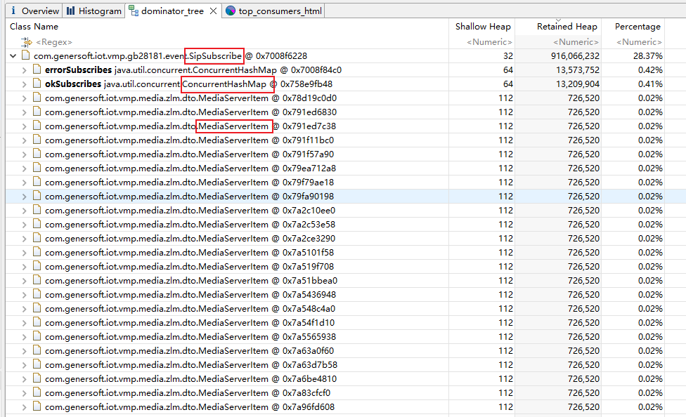

- 内存消费靠前的类

  在消费内存靠前的类中，除了在支配树中就已经确认的SipSubscribe之外，还有SIPClientTransactionImpl、TimerThread、ClassicElasticsearchPublisher

  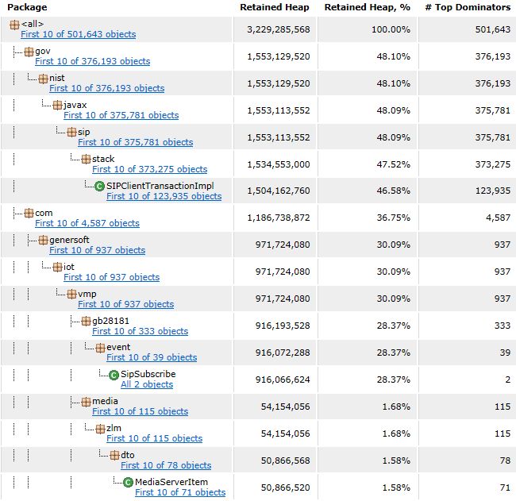

  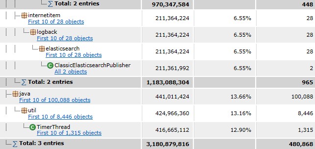

  

- OQL（Object Query Language）

  在支配树中，总共有50W 的对象，依次查询支配树、和内存消费的前几个类

  如SIPClientTransactionImpl，共有12W个对象，**可以确定，SIPClientTransactionImpl存在内存泄漏**

  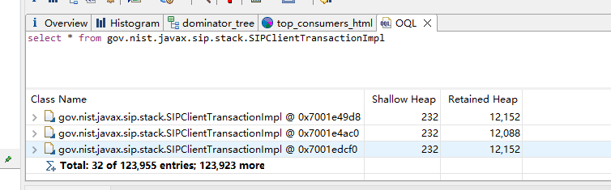

  

  如MediaServerItem对象，在支配树中虽然可以看到大量的对象，但经查询，实际上只有一千多个，应该不是造成此次内存泄漏的主要原因

  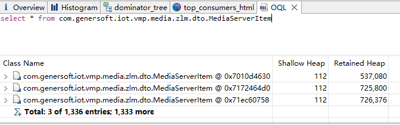

  

  如SipSubscribe对象，虽然其深堆占用了很多内存，但对象只有一个，**可以确定，SipSubscribe持有的对象存在内存泄漏**

  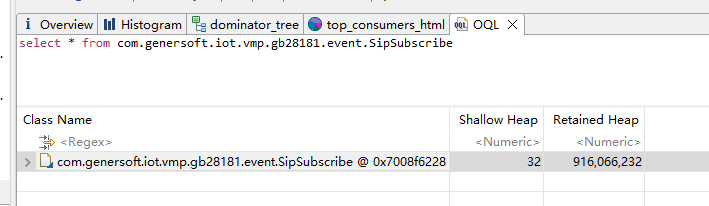

  

  如TimerThread，虽然只有一千余个对象，但经源码查询，其运行实体是一个线程，一千多个对象不多，但一千多个线程绝对很多，**可以确定，有关TimerThread的相关代码，可能没有及时关闭线程。**

  

  

##### ③ 12日代码分析

- SIPClientTransactionImpl

  先看下引用SIPClientTransactionImpl的对象，对引用的对象一个一个分析，其中SipStackImpl尤为可疑。

  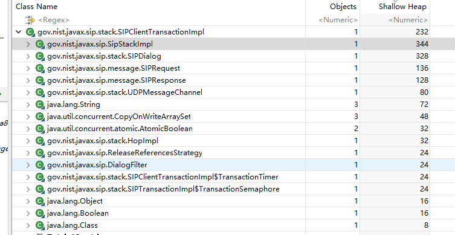

  SipStackImpl在项目代码中也有大量引用，那应该是它了没错

  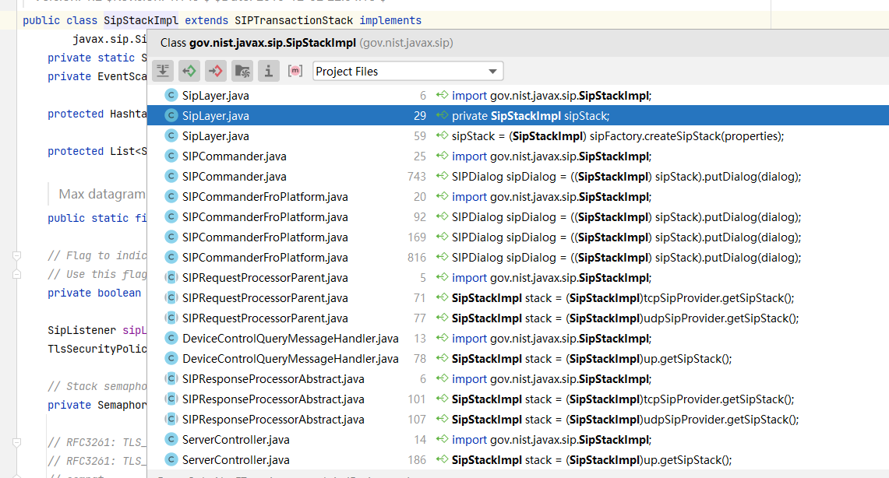

  SipStackImpl在项目中的代码没有明显异常，并且其源码也未见可以的地方，在头秃之时，看到其实现类SIPTransactionStack

  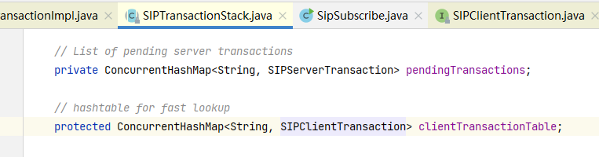

  SIPTransactionStack中，有较多的HashMap，而且其Value，SIPClientTransaction是一个接口，其实现类就是SIPClientTransactionImpl。

  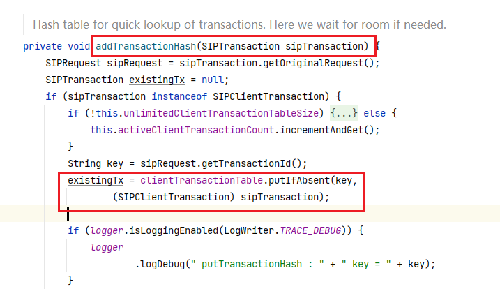

  在addTransactionHash中，可以看到SipTransaction被添加到了Map中。根据`hashtable for fast lookup`的含义来说，这个Map的作用只是用于快速路由的缓存。作为缓存，应该需要

  

  

  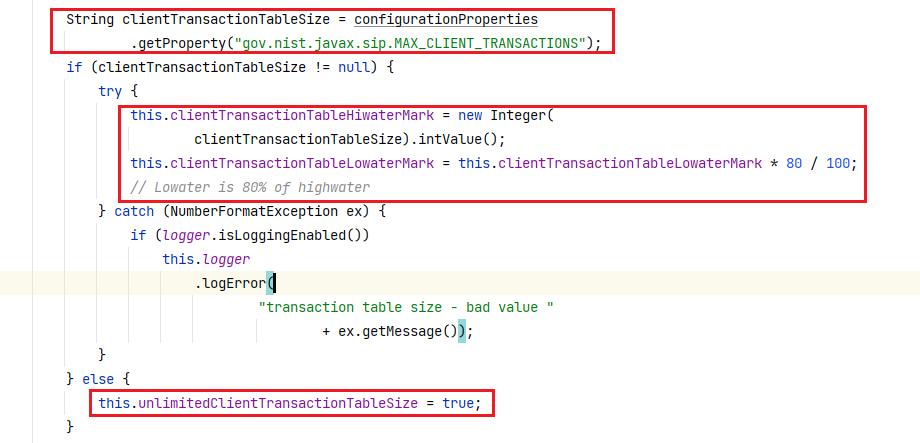

##### ④ 15日内存镜像分析

##### ⑤ 15日代码分析


### 三、常见的内存泄漏


### 四、常用的排查工具

#### 1、JDK自带


#### 2、MAT


#### 3、Arthas


### 五、事故总结

