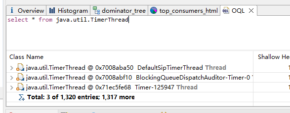

### 一、排查日志

| 时间          | 事件                                                         |
| ------------- | ------------------------------------------------------------ |
| 7月11日 16:42 | 交付反馈，平台页面无法正常显示                               |
| 7月11日 17:31 | 开发联系交付进行处理，修改脚本、配置文件等，进行重启解决，并提出内存溢出导致平台异常 |
| 7月11日 17:43 | 开发联系交付，安装排查软件、在RCS上，加上排查的相关参数      |
| 7月12日 11:55 | 开发联系交付，对RCS服务，进行内存镜像进行导出。并将4.2G的RCS内存发送给开发 |
| 7月12日 15:49 | 开发收到交付发送的内存镜像文件，并进行分析                   |
| 7月12日 17:30 | 开发定位到引起内存泄漏的代码，并进行修复，在10.10.10.22服务器上进行验证 |
|               |                                                              |
| 7月13日 14:14 | 开发联系交付进行发包                                         |
| 7月13日 16:08 | 交付进行发包，并出现redis异常。开发进行指导处理，但是未解决，于是准备去现场解决 |
| 7月13日 17:55 | 开发出发，前往海鸥岛现场                                     |
| 7月13日 18:32 | 开发抵达现场，开始rcs发包、nginx配置、磁盘挂载配置、redis异常处理 |
| 7月13日 20:11 | 开发完成发版处理，并观察rcs的内存使用情况                    |
| 7月13日 21:30 | rcs内存无明显异常，开发撤离现场                              |
|               |                                                              |
| 7月14日 22:37 | 交付反馈无法显示页面，日志大量报错，经初步确认，内存泄漏仍然存在。内存镜像9.2G，无法发送，于是开发准备前往现场 |
| 7月15日 12:55 | 开发出发，前往海鸥岛现场                                     |
| 7月15日 14:32 | 开发抵达现场，排查内存泄漏                                   |
| 7月15日 17:12 | 开发完成排查和代码修改，并进行发版，同时巡查其他的问题       |
| 7月15日 17:32 | 开发发现告警图片无法正常生成，流媒体服务器请求404            |
| 7月15日 20:22 | 开发完成高级图片异常的处理，并观察rcs的内存使用情况          |
| 7月15日 21:55 | rcs内存无明显异常，开发撤离现场                              |
|               |                                                              |
| 7月18日 16:24 | 交付反馈任然出现内存溢出                                     |
| 7月18日 16:24 | 开发与交付联系，尝试到出内存镜像，经多次尝试后仍无法导出（后续定位为命令问题）。 |
| 7月18日 19:11 | 开发发送重启脚本给交付，并加上OOM重启的配置                  |
|               |                                                              |
| 7月19日 09:11 | 开发去海鸥岛现场，调试内存泄漏、图片抓拍、强制跟踪、防控区等问题 |
| 7月19日 10:55 | 开发抵达现场，开始内存泄漏的排查和调试强制跟踪               |
| 7月19日 16:38 | 强制跟踪接口，修改查询条件为雷达编号                         |
| 7月19日 18:32 | 评估修改两个改动点后，内存泄漏修复完成                       |
| 7月19日 13:10 | 图片抓拍，修改查询条件为雷达编号。内存泄漏经15个小时的观察，未再出现 |


### 二、原因分析

#### 1 内存泄漏与内存溢出

- 内存泄漏（Memory Leak）

程序**不断的向Java虚拟机申请少量内存，但是没有释放**，这个过程叫做内存泄漏。内存泄漏经过长时间的累计，最终会导致Java虚拟机无法再分配内存，进而引起内存溢出。

导致内存溢出时，会导致其他线程无内存使用，进而大量报错，如数据库异常、redis异常、业务处理异常等。从服务器的日志表象来看，一般无法确定内存泄漏。

而且因为内存泄漏，需要经历一段时间的堆积，才会导致OOM，所以比起其他的异常，需要更长的时间进行复现。


- 内存溢出（Out Of Memory，OOM）

内存溢出，就是Java虚拟机内存无法再分配了。

除了内存泄漏引起的内存溢出外，还存在其他情况的内存溢出。

如程序正常运行需要2G的堆内存，但是虚拟机参数限定了1G，此时内存不够用，就会发生内存溢出。

如程序2G的内存可以处理4000个并发，但是瞬时十几万个并发打过来，程序的内存无法处理十几万个业务请求，也会发生内存溢出。

如操作系统资源不足时，也会报OOM，如文件描述符占满了，JVM无法创建线程，也会报这个错误。


#### 2 Java的引用关系

- 强引用(StrongReference)：最传统最基础的引用，指代码中普遍存在的引用赋值。即Object obj = new Object()。无论任何情况下，只要强引用的关系还存在，垃圾收集器就永远不会回收掉被引用的对象。

  

- 软引用(SoftReference)：在系统将要内存溢出之前，才会把软引用的对象列入回收范围进行二次回收。如果这次回收还没有足够的内存空间，才会抛OOM(并不是内存不足马上抛OOM)。

  

- 弱引用(WeakReference)：被弱引用关联的对象只能生存到下一次垃圾回收之前，当垃圾收集器工作时，无论内存空间是否充足，都会回收掉被弱引用关联的对象。可以用这个特性，来实现一个缓存，如WeakHashMap。

  

- 虚引用(PhantomReference)：一个对象是否有虚引用的存在，完全不会对其生存时间构成影响，也无法通过虚引用来获得一个对象的实例。为一个对象设置虚引用关联的唯一目的，就是能在对象被回收时收到一个系统通知。


软弱虚等引用的存在，并不会引起内存泄漏，只有强引用才会引起内存泄漏。


#### 3 内存镜像和代码分析

##### ① 内存镜像导出

jdk自带有jstat、jstack、jmap等常用的排查工具，但是一些精简版的jdk则不带这些排查工具。

内存镜像的导出，一般我们使用jmap，实例命令如下：

```sh
jmap -dump:live,format=b,file=filename.hprof pid
```

需要注意的是，需要指定-dump:live，含义为导出存活的对象，如果导出待回收的对象，则十分影响导出的速度，并且也会影响分析。

pid则是java进程的id。


##### ② 12日内存镜像分析

内存镜像一般使用[MAT](https://www.eclipse.org/mat/)（MemoryAnalyzerTool）进行分析。

- 概览图

  在大对象的深堆大小中，可以看到，有两个比较大的区块。深堆是指，对象及其关联引用的对象占用的内存大小。


- 支配树

  在支配树中，可以看到SipSubscribe深堆占用最多，MediaServerItem被大量创建


​	点开SipSubcribe继续观察，发现SipSubscribe中，含有大量的MediaServerItem对象，**初步确认，SipSubscribe的相关代码存在内存泄漏**

​	

- 内存消费靠前的类

  在消费内存靠前的类中，除了在支配树中就已经确认的SipSubscribe之外，还有SIPClientTransactionImpl、TimerThread、ClassicElasticsearchPublisher

  

  

  

- OQL（Object Query Language）

  在支配树中，总共有50W 的对象，依次查询支配树、和内存消费的前几个类

  如SIPClientTransactionImpl，共有12W个对象，**可以确定，SIPClientTransactionImpl存在内存泄漏**

  

  

  如MediaServerItem对象，在支配树中虽然可以看到大量的对象，但经查询，实际上只有一千多个，应该不是造成此次内存泄漏的主要原因

  

  

  如SipSubscribe对象，虽然其深堆占用了很多内存，但对象只有一个，**可以确定，SipSubscribe持有的对象存在内存泄漏**

  

  

  如TimerThread，虽然只有一千余个对象，但经源码查询，其运行实体是一个线程，一千多个对象不多，但一千多个线程绝对很多，**可以确定，有关TimerThread的相关代码，可能没有及时关闭线程。**

  

  

##### ③ 12日代码分析

- SIPClientTransactionImpl代码分析

  

  SIPClientTransactionImpl是一个GB-28181框架中使用的类，在我们自己写的代码并没有进行引用。所以先看下引用SIPClientTransactionImpl的对象，对引用的对象一个一个分析，其中SipStackImpl尤为可疑。

  

  SipStackImpl在项目代码中也有大量引用，那应该是它了没错

  

  

  SipStackImpl在项目中的代码没有明显异常，并且其源码也未见可以的地方，在头秃之时，看到其父类SIPTransactionStack

  

  SIPTransactionStack中，有较多的HashMap，而且其Value，SIPClientTransaction是一个接口，其实现类就是SIPClientTransactionImpl。

  

  

  在addTransactionHash中，可以看到SipTransaction被添加到了Map中。根据`hashtable for fast lookup`的含义来说，这个Map的作用只是用于快速路由的缓存。作为缓存，应该需要有大小限制、过期时间等。其基于HashMap，过期时间肯定是没有的，大小限制则要进一步的看代码

  

  

  通过进一步的源码查看，SIPTransactionStack会根据配置中的`gov.nist.javax.sip.MAX_CLIENT_TRANSACTIONS`，来初始化HashMap的高低水位线，通过该水位线进行限制。**没有设置则默认不限制，于是造成持续的堆积，进而造成溢出**。

  

  ```java
  //防止内存泄露
  properties.setProperty("gov.nist.javax.sip.MAX_SERVER_TRANSACTIONS", "1024");
  properties.setProperty("gov.nist.javax.sip.MAX_CLIENT_TRANSACTIONS", "1024");
  ```

  在相关代码中，进行配置

  

- SipSubscribe & TimerThread代码分析

在MAT的排查中，可以确定SipSubscribe的代码存在内存泄漏，所以先看下该类中代码是怎样的。

```java
@Component
public class SipSubscribe {

    private final Logger logger = LoggerFactory.getLogger(SipSubscribe.class);

    private Map<String, SipSubscribe.Event> errorSubscribes = new ConcurrentHashMap<>();
    private Map<String, SipSubscribe.Event> okSubscribes = new ConcurrentHashMap<>();
    private Map<String, Date> okTimeSubscribes = new ConcurrentHashMap<>();
    private Map<String, Date> errorTimeSubscribes = new ConcurrentHashMap<>();

    //    @Scheduled(cron="*/5 * * * * ?")   //每五秒执行一次
//    @Scheduled(fixedRate= 100 * 60 * 60 )
    @Scheduled(cron="0 0/5 * * * ?")   //每5分钟执行一次
    public void execute(){
        logger.info("[定时任务] 清理过期的SIP订阅信息");
        Calendar calendar = Calendar.getInstance();
        calendar.setTime(new Date());
        calendar.set(Calendar.MINUTE, calendar.get(Calendar.MINUTE) - 5);

        for (String key : okTimeSubscribes.keySet()) {
            if (okTimeSubscribes.get(key).before(calendar.getTime())){
//                logger.info("[定时任务] 清理过期的订阅信息： {}", key);
                okSubscribes.remove(key);
                okTimeSubscribes.remove(key);
            }
        }
        for (String key : errorTimeSubscribes.keySet()) {
            if (errorTimeSubscribes.get(key).before(calendar.getTime())){
//                logger.info("[定时任务] 清理过期的订阅信息： {}", key);
                errorSubscribes.remove(key);
                errorTimeSubscribes.remove(key);
            }
        }
        logger.debug("okTimeSubscribes.size:{}",okTimeSubscribes.size());
        logger.debug("okSubscribes.size:{}",okSubscribes.size());
        logger.debug("errorTimeSubscribes.size:{}",errorTimeSubscribes.size());
        logger.debug("errorSubscribes.size:{}",errorSubscribes.size());
    }
    public interface Event {
        void response(EventResult eventResult);
    }
}
```

该类的关键信息有：

@Component注解，Spring会扫描该注解，注入到Spring容器中，默认是单例模式，而不是原型模式，所以该类只会有一个，和OQL的结果互相作证。

存在较多的HashMap，用来存储摄像头、雷达等指令的会话。

函数式接口，Event，该类和TimerThread一起，作为摄像头、雷达等指令的回调。

@Scheduled注解，该注解含义是一个定时任务，从代码逻辑上看，是用来清除过期的指令。如摄像头和雷达、有些指令应答不及时、隔了几分钟之后，也没有应答的必要了，就应该清除掉。


可能存在的问题：

在remove掉HashMap的元素时，没有将对应的Event进行删除，导致Event泄露。

因为定时任务有删除HashMap中的元素，所以当时怀疑，是Event导致的内存泄露。


所以，应该要考虑，怎么去释放掉Event，及其线程资源。对于线程资源来说，程序执行完了，线程就关闭了，那么怎么让程序执行完？

当时考虑的做法是，在定时器中，手动触发回调，代码如下：

```java
@Scheduled(cron="0 0/5 * * * ?")
public void execute(){
    ...
        for (String key : okTimeSubscribes.keySet()) {
            if (okTimeSubscribes.get(key).before(calendar.getTime())){
                Event remove = okSubscribes.remove(key);
                // 手动触发timer，关闭定时任务
                remove.response(null);
                okTimeSubscribes.remove(key);
            }
        }
    ...
}
```


在map删除掉事件后，手动触发该event的回调。在改完之后，观察了一个多小时，内存表现都挺正常的，于是才离开现场，回深圳。


##### ④ 15日内存镜像分析

由于内存泄漏，是一个长期的过程，所以比较难进行观测，在12日的代码修复中，关于SipSubscribe的代码，并不能够很快的验证出，是否已经解决内存泄漏。在15日又发生了OOM，于是再进行一轮镜像分析。


SipSubsribe堆积还是那么多，说明12日的修复没起到作用。


##### ⑤ 15日代码分析

由于还是有SipSubscribe的堆积，所以，当时认为，修复的思路是对的，还是要手动释放掉Event，只是修复的代码有问题。

```java
@Scheduled(cron="0 0/5 * * * ?")
public void execute(){
    ...
        for (String key : okTimeSubscribes.keySet()) {
            if (okTimeSubscribes.get(key).before(calendar.getTime())){
                Event remove = okSubscribes.remove(key);
                // 手动触发timer，关闭定时任务
                remove.response(null);
                okTimeSubscribes.remove(key);
            }
        }
    ...
}
```


仔细查看上面的代码，在`remove.response(null);`时，其函数式接口的匿名实现类中，若有对传入的对象进行处理，而我们又传入了null的话，很容易发生空指针异常。

在代码中排查其匿名实现类，验证了上述的猜想。

如果okSubscribes已经进行了remove，而后event资源释放发生了异常，将会导致后续的okTimeSubscribes无法remove。反而会造成okTimeSubscribes的堆积。并且，外层是一个for循环，当元素2发生了异常，在元素2后面的其他元素，都因为异常而无法进行释放。


在认识到修复代码的缺陷后，再次进行修改。

```java
public void execute() {
 	...
        for (String key : okTimeSubscribes.keySet()) {
            try {
                if (okTimeSubscribes.get(key).before(calendar.getTime())) {
                    Event remove = okSubscribes.remove(key);
                    okTimeSubscribes.remove(key);
                    // 手动触发timer，关闭定时任务
                    remove.response(null);
                }
            } catch (Exception e) {
                logger.error("remove subscribe info encounter error , then key is {} ", key, e);
            }
        }
    ...
}
```

在HashMap都进行remove之后，再手动释放掉Event。并且在for循环内，进行try catch处理，吃掉可能出现的异常。于是改完再发一个版。


这里注意一个小细节，关于日志的打印，开发环境和服务器环境有一些区别。

开发环境，我们的IDE会自动将【控制台】和【日志文件】的日志结合进行打印。

而服务器环境，只有【日志文件】，e.printStack()，这种异常打印的方式，是将异常打印在【控制台】中，在服务器环境则无法进行打印。

所以应该使用logger对象，手动打印异常。

而使用logger打印异常，如果用`{}`打印异常，则日志框架无法对异常进行识别。因为人家接受的是一个字符串，直接附上异常对象，框架根本无法识别。如：

```java
log.("when error appear , key is {} , value is {} , exception is {}",key,value,exception)//异常无法识别
```


但是日志框架有一个约定，如果参数的最后一个对象是异常对象的话，则直接获取异常对象，打印其堆栈信息。如

```java
log.("when error appear , key is {} , value is {} ",key,value,exception)//只保留2个{}反而可以识别异常
```


##### ⑥ 19日内存镜像分析

在15日关于SipSubscribe的代码修复中，本质上是防御性处理。默认程序需要用那么多HashMap，默认程序就是要用到那么多Event进行回调。

于是在18日又发生了OOM，导出内存镜像再查看一次。


SipSubscribe还是占用了那么多的内存，说明15日的防御性处理，被打穿了。。。

此外还有一个ElasticSearch的堆积也比较多，这个在之前的排查中已经进行了修复，现场环境有一项配置文件没有改，所以没有生效。堆积的内存至多有200M，不是本次事故的主要原因，但可以算是次要原因。


##### ⑦ 19日代码分析

关于ElasticSearch的修复比较简单，因为没有用到ES，所以采集到的日志就先堆在内存中，没用发送到ES上。现在没有用到，代码和配置就先注释掉就好了。


而关于SipSubscribe，15日的防御性处理，已经被打穿的情况下。就需要考虑到，是什么样代码，导致了那么多的堆积，并尝试减少堆积。


回顾上游代码，可以看到：

```java
...
// 超时处理
Timer timer = new Timer();
SSRCInfo finalSsrcInfo = ssrcInfo;
timer.schedule(new TimerTask() {
    @Override
    public void run() {
        logger.info(String.format("play-time-out===%s, channelId====%s", device.getDeviceId(), channelId));

        SIPDialog dialog = streamSession.getDialogByStream(device.getDeviceId(), channelId, finalSsrcInfo.getStream());
        if (dialog != null) {
            logger.info("play-time-out=========1");
            timeoutCallback.run(1, "收流超时");
            // 点播超时回复BYE 同时释放ssrc以及此次点播的资源
            cmder.streamByeCmd(device.getDeviceId(), channelId, finalSsrcInfo.getStream(), null);
        } else {
            logger.info("play-time-out=========2");
            timeoutCallback.run(0, "点播超时");
            mediaServerService.releaseSsrc(mediaServerItem.getId(), finalSsrcInfo.getSsrc());
            mediaServerService.closeRTPServer(device.getDeviceId(), channelId, finalSsrcInfo.getStream());
            streamSession.remove(device.getDeviceId(), channelId, finalSsrcInfo.getStream());
        }
    }
}, userSetting.getPlayTimeout());
...
```


这里面的Timer就是含有TimerThread的类，创建出来后，用来做延时任务。

延时任务中，根据deviceId和channelId做相应的点播、受流处理。


由于15日的防御性措施被击穿，而现场的设备又不是很多的情况下。很有可能是多个deviceId和channelId，持有了多个TimerThread。这应该是不合理的，deviceId和channelId形成的key，只需要一个定时任务就行了。


基于上述的想法，做一个锁处理。

```java
String key = WVP_PLAY_REDIS_LOCK_PREFIX + device.getDeviceId() + "_" + channelId;
Object lock = redis.get(key);
if (lock == null) {
    redis.set(key, null, userSetting.getPlayTimeout() / 1000);
    // 超时处理
    Timer timer = new Timer();
    SSRCInfo finalSsrcInfo = ssrcInfo;
    timer.schedule(new TimerTask() {
        @Override
        public void run() {
            //do something
        }
    });
}
```

用redis做一个锁判断，之前如果已经有deviceId和channelId的延时任务了，那就不要再创建了。redis的过期时间，也与延时任务保持一致。

看看效果：


内存和线程在前期还是会持续的涨上去，但是因为deviceId和channelId的存在，在后期组件稳定。


在近来的代码改动中，也有一个可能存在问题的代码，如下：

```java
//获取摄像头列表
List<DeviceChannel> channelList = storager.queryChannelAll();
//获取流媒体存在的流的列表
List<MediaServerItem> serverItemList = mediaServerMapper.queryAll();
serverItemList.forEach(serverItem ->{
    for (DeviceChannel channel :channelList ){
        try {
            play(channel.getDeviceId(), channel.getChannelId());
        }
    }
});
```

先从数据库中获取相应的摄像头和流列表，然后再将deviceId和channelId传到play()方法中。

而在play的方法中，最终执行了上述Timer的相关代码。


由于设备是从数据库直接获取的，所以可能存在一种情况，获取到的设备是离线的。如果是离线的，那么没有必要进行回调，因为回调了也不会响应。


于是进行如下的修改：

```java
//获取摄像头列表
List<DeviceChannel> channelList = storager.queryChannelAll();
//获取流媒体存在的流的列表
List<MediaServerItem> serverItemList = mediaServerMapper.queryAll();
serverItemList.forEach(serverItem ->{
    for (DeviceChannel channel :channelList ){
        try {
            if (channel.isOffline()){
                return;
            }
            play(channel.getDeviceId(), channel.getChannelId());
        }
    }
});
```


看看效果：


在每次垃圾回收后，剩余的对象都只有不到250M，线程也在300个以内，线程的少量毛刺，应该是Timer创建导致的。所以可以推断出，**传入了离线的设备，是SipSubscrib内存泄露的根本原因。**


结合两种措施，一起修复，效果如下：


在运行了一个晚上之后，内存和线程是很稳定的。在之后也未见异常。


### 三、常见的泄漏

#### 1 网络连接泄漏

如，关闭http连接时，没有关闭http底层的tcp连接

如，http和tcp的keepalive时间设置不对，导致大量的http或tcp连接没有没释放


上述两种情况，体现为登录服务器很慢，服务器TCP连接很多。可以通过netstat的相关命令对网络连接进行查看

```java
netstat -ant | awk '/^tcp/ {++y[$NF]} END {for(w in y) print w, y[w]}'
```


#### 2 线程泄漏

如，常用的http客户端okhttp，其底层使用了一个最大线程数不限制的线程池，若瞬时发送1W个HTTP请求，它真敢创建1W个线程进行处理。


一般可以使用jdk自带的jstack命令进行查看，看看有哪些线程，看看这些线程阻塞在哪些地方。也可以用来检测线程死锁。

```
jstack pid > jstack.info
```


#### 3 内存泄漏

如，集合做缓存，hashmap做kv键值对缓存，如果写入的速度大于删除的速度，此时堆积的缓存数据就越来越多

如，线程池的无界队列，JDK的线程池工具类Executors在创建缓存线程池、定时线程池、固定线程的线程池时，其都是使用了一个无界队列，存放未及时处理的请求。当线程池处理不过来时，此时堆积的请求就会越来越多。

如，@Async注解，Spring底层使用一个无界队列的线程池进行处理，若线程池处理不过来时，就会出现堆积。


#### 4 直接内存泄漏

JVM允许程序申请宿主机的内存进行使用，当这些内存回收不及时时，就可能会出现内存泄漏。

如，Netty创建了过多的缓冲区，并且回收不积极

如，Java8之后，方法区的具体实现为元空间，元空间使用直接内存。当创建过多的类，或者过多的常量时，可能会造成元空间内存不足，元空间会尝试GC，GC失败则OOM（Metaspace）。


### 四、常用的排查工具

#### 1 JDK自带

- jmap，命令行工具，用来导出内存镜像

- jstack，命令行工具，用来查看线程的堆栈

- jstats，命令行工具，用来查看JVM的GC信息

- jinfo，命令行工具，用来查看JVM的参数

- jvisualvm，也叫visualvm，可视化的工具，可以认为是上述工具的合集。

  

#### 2 MAT

基于eclipse开发的内存镜像分析工具，内存镜像的分析，一般都用它。


#### 3 Arthas

阿里巴巴开发的工具，基于ASM+AOP技术，可以植入到动态程序中。

可以查看筛选线程的运行状态。

可以查看堆区、方法区、直接内存的事情情况。

可以查看垃圾回收的情况。

**可以追踪方法的执行和耗时**。

...，除了不能分析内存镜像，基本上是无敌的存在。


### 五、事故总结

12日的发版：修复了底层框架导致的内存泄漏，并尝试修复SipSubscribe的内存泄漏

15日的发版：修复SipSubscribe的内存泄漏代码存在缺陷，再进行修复。修复ElasticSearch的内存泄漏。

19日的发版：15日的修复SipSubscribe的代码，效果仍然不明显。再进行修复，此次修复后彻底解决。


- 直接原因

  - 高并发时，同一个设备，生成了多个timer定时任务
  - sip组件的代码，设计不合理，没有为缓存做防御性处理，导致溢出（在没配置缓存大小时，应该给予默认值，而不是不限制。或者强制让用户进行配置）。

  

- 根本原因

  - 定时任务在启动时，未根据设备的上下线情况，进行区分
  - 不可靠的第三方组件，依赖的第三方组件代码较为复杂，部分代码甚至比较混乱，不够优雅。在框架的代码仓库中，也可以看到其他用户反馈的内存泄漏问题。

  

- 次要原因

  - elasticsearch相关的代码，在未使用时，没进行注释，导致泄漏了200M的内存。

  - 未使用redis\mysql，而是直接使用了HashMap作为缓存

    

- 解决方案

  - 收敛已经出现的内存泄漏问题。（已处理）
  - 调大堆内存的大小，若内存泄漏短时间内难以避免，则减少出现的概率。（交付时修改）
  - 在内存溢出时，自动进行内存镜像的导出，并进行重启，避免服务长时间不可用。（已实现）
  - 重构\重写掉第三方组件。（中长期规划）


- 其他问题
  - 日志打印，日志打印较多，存在部分难以索引的日志
  - nohup日志，在docker中，沿用了在linux宿主机上的nohup命令，导致产生了nohup.out日志，与已经存在的日志冲突。
  - 上线流程，配置较多、服务较多、版本较多，可能存在上线时间长的问题
  - docker网络，现场网络不大稳定，评估docker网络的可行性
  - 交付文档，端口等映射较为复杂，后续可能比较难维护
