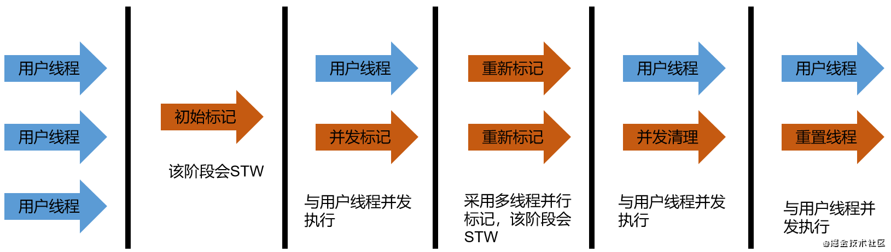
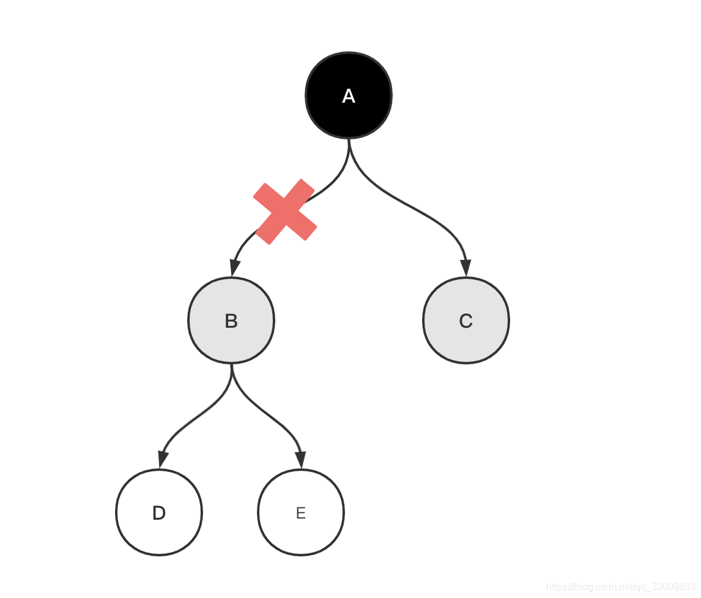
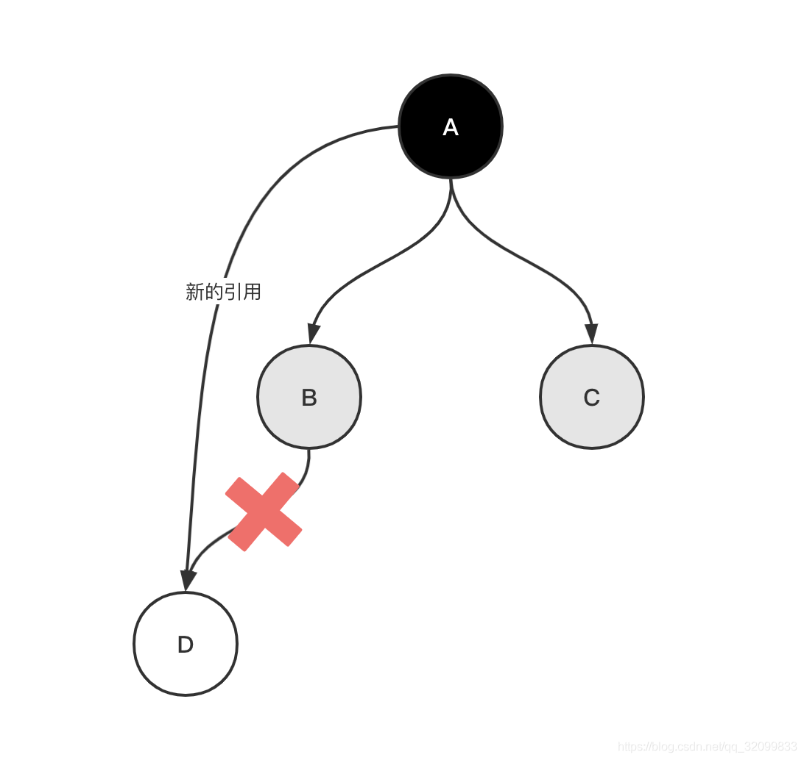

CMS全称为Concurrent Mark Sweep，作用于老年代，于JDK1.5时发布，从名字上看，采用了**标记清除算法和多线程并发收集**，其被认为是具有划时代意义的回收器，**第一次实现了让垃圾回收线程和用户线程同时工作**

**CMS在设计之初，关注的重点是尽可能的缩短垃圾收集时，用户线程的暂停时间**。可以用于重视服务响应速度，希望系统停顿时间最短的应用。


### GC 过程

尽管CMS采用的是并发式回收，但其**在初始标记和重新标记的两个阶段，任然会造成STW**，所以其只是尽可能的缩短暂停时间。最耗费时间的并发标记和并发清除阶段，都不需要暂停用户线程，所以整体的回收停顿时间还是比较短的。


- 初始标记(Initial Mark)

在这个阶段，程序中的所有用户线程都会暂停，**然后GC线程标记处GC Roots能直接关联到的对象**，一旦标记完成就会恢复之前被暂停的用户线程，**由于直接关联的对象比较少，所以速度很快**。


- 并发标记(Concurrent Mark)

**从GC Roots的直接关联对象开始，遍历整个对象树，这个过程耗时较长，但是不需要停顿用户线程。**


- 重新标记(Remark)

在并发标记阶段，用户线程仍在运行，**需要修正并发标记阶段，因用户线程运行而导致标记产生变动的那一部分对象记录(未被标记的浮动垃圾)**。这个过程耗时比初始标记长一些，但比并发标记短。


- 并发清除(Concurrent Sweep)

**清除标记阶段判断的已经死亡的对象，释放内存空间，由于不需要移动存活对象，所以该阶段也是与用户线程并发运行的。**


- 重置线程

将GC线程的状态重置


### 三色标记

CMS存在并发标记、并发清除的状态，在这个过程中，CMS会用三种颜色对对象进行标记，以判断哪些对象是存活的。

#### 颜色

三种颜色分别为黑色、灰色、白色

- 黑色：对象本身及其所有引用都被扫描过
- 灰色：对象本身被扫描过
- 白色：没有被GC扫描


#### 过程 

初始标记：在GC开始时，所有对象均为白色，初始标记会遍历GC Roots，所以将GC Roots直接关联的对象置为灰色。

并发标记：遍历灰色对象的所有引用，灰色对象变为黑色，将其引用对象置为灰色。

重新标记：遍历如果产生新的GC Root则将其置为黑色，并遍历其引用，将其引用对象置为灰色。将失效（漏标和错标）的灰色对象置为白色。

并发清除：JVM清除未被标记的白色对象。


由于存在并发过程，所以，对象的标记受用户行为的影响，可能会存在错标和漏标的情况。

#### 漏标

假设GC已经在遍历对象B了，而此时用户线程执行了`A.B=null`的操作，切断了A到B的引用。




本来执行了`A.B=null`之后，B、D、E都可以被回收了，但是由于B已经变为灰色，它仍会被当做存活对象，继续遍历下去。 最终的结果就是本轮GC不会回收B、D、E，留到下次GC时回收，也算是浮动垃圾的一部分。


CMS通过**写屏障**解决该问题，在A写B时，加入写屏障，记录B引用被置null的位置，在重新标记时，将B对象置为白色对象。


#### 错标

假设GC线程已经遍历到B了，此时用户线程执行了以下操作：

```
B.D=null;//B到D的引用被切断
A.xx=D;//A到D的引用被建立
```



B到D的引用被切断，且A到D的引用被建立。 此时GC线程继续工作，由于B不再引用D了，尽管A又引用了D，但是因为A已经标记为黑色，GC不会再遍历A了，所以D会被标记为白色，最后被当做垃圾回收。 可以看到错标的结果比漏表严重的多，浮动垃圾可以下次GC清理，而把不该回收的对象回收掉，将会造成程序运行错误。

以上，可以归纳错标发生的条件为：

- 灰色对象指向白色对象的引用断开：通过原始快照解决
- 黑色对象指向白色对象的引用建立：通过增量更新解决


#### 写屏障

当黑色指向白色的引用被建立时，通过写屏障来**记录引用关系**，等扫描结束后，再以引用关系里的黑色对象为根重新扫描一次即可。


#### 原始快照

当灰色对象指向白色对象的引用被断开时，就将这条引用关系记录下来。当扫描结束后，再以这些灰色对象为根，重新扫描一次。相当于**无论引用关系是否删除，都会按照刚开始扫描时那一瞬间的对象图快照来扫描**。


#### 增量更新

当黑色指向白色的引用被建立时，就将这个新的引用关系记录下来，等扫描结束后，再**以这些记录中的黑色对象为根，重新扫描一次。相当于黑色对象一旦建立了指向白色对象的引用，就会变为灰色对象。**


### 缺点

CMS优点很明显，并发收集，能与用户线程一起运行；拥有较短的停顿时间。但HotSpot的任何一个版本中，CMS都不是默认的垃圾回收器，缺点也同样明显。


#### 处理器敏感

并发标记，并发清理，在CPU核心数比较少时，会占用比较多的CPU资源

CMS默认开启的GC线程数是：(ParallelGCThreads +3)/4，当CPU核心数超过4个时，GC线程会占用不到25%的CPU资源，如果CPU数不足4个，GC线程对程序的影响就会非常大，导致程序的性能大幅降低。


#### 浮动垃圾

并发清理阶段，用户线程任然在制造垃圾，只能留到下一次GC时回收


#### 并发失败

由于CMS在回收的过程中，需要保证用户线程有足够的内存可用，所以CMS不能等到内存满了才进行垃圾收集，**而是内存使用率达到某一阈值，便进行垃圾回收**，以确保CMS在工作时，用户线程仍有足有的内存空间能够运行。**要是CMS运行期间预留的内存无法满足用户线程的需要，就会出现一次Concurrent Mode Failue，这是JVM会启动后备方案，启动Serial Old收集器重新进行老年代的垃圾收集，这样造成的停顿时间就更长了。**


#### 内存碎片

CMS垃圾收集器采用的是标记清除算法，在每次GC完成后，被清除的对象空间是不连续的，而产生一些内存碎片。因此，CMS在为新对象分配内存空间时，将无法使用指针碰撞技术(Bump The Pointer)，而只能选择空闲列表 (Free List)执行内存分配。那么CMS为什么不使用标记压缩算法呢？**在压缩阶段，需要移动存活的对象，会造成STW，而老年代存活的对象很多，这个过程会非常耗时**。


### 相关参数

- `-XX:+UseConcMarkSweepGC`，手动指定CMS进行垃圾收集任务，开启该参数后，会自动开启`-XX:UseParNewGC`，即新生代用ParNew，老年代用CMS。在JDK9使用该参数时，会受到一个警告，提示CMS未来会被废弃。在JDK14使用时，会以默认的GC方式启动JVM。

- `-XX:CMSInitiatingOccupancyFraction`，设置堆内存使用率的阈值，达到该阈值后进行垃圾回收。

  在JDK5以前的版本，默认为68(68%)，JDK6以后的版本为92

  如果内存增长缓慢，可以设置一个稍大的值，大的阈值可以降低CMS GC的发生频率。如果内存增长很快，则应该降低该阈值，否则可能会引起Full GC。

- `-XX:+UseCMSCompactAtFullCollection`，指定在执行完Full GC后对内存空间进行压缩整理，一次避免内存碎片的产生，不过由于内存压缩整理无法并发执行，在Full GC后还会造成一段暂停时间。

- `-XX:CMSFullGCsBeforeCompaction`，设置执行多少次Full GC后对内存空间进行压缩整理。

- `-XX:ParallelCmsThreads`，设置CMS的线程数量，默认是(ParallelGCThreads + 3)/4。ParallelGCThreads是年轻代并行收集器的线程数，当CPU资源比较紧张时，受CMS收集线程的影响，应用程序的性能在垃圾回收阶段会下降。


参考：

1、《CMS与三色标记算法》，https://juejin.cn/post/6924275547233058824#heading-3

2、《宋红康详解java虚拟机》，https://www.bilibili.com/video/BV1PJ411n7xZ