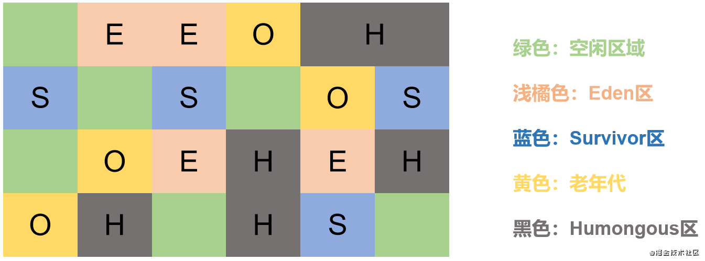
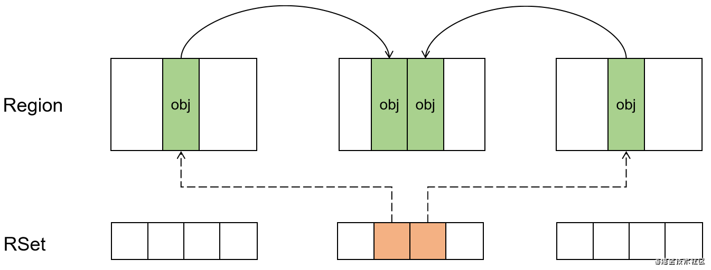
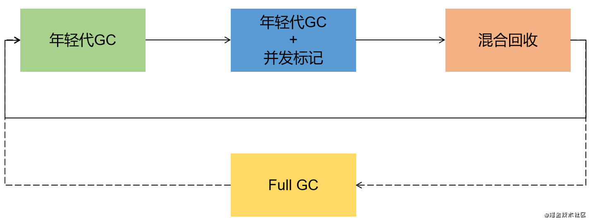

G1全称Garbage First(垃圾优先)，现在的硬件水平特别是CPU和内存发展迅速，如按摩店家的顶级CPU能达到64核心128线程的规格，内存条单根可达256GB，以往的GC在现在的硬件平台上表现不是很好，不能充分发挥硬件资源，由此，G1便应运而生(针对多CPU核心大内存的机器)。**官方给G1的设计目标是在延迟可控的情况下，获得尽可能高的吞吐量，需要担起“全功能收集器”的重任**。

G1是一款并行回收器，基于**分区算法**，把堆内存分割为很多独立的区域(Region)，使用不同的Region来表示Eden、Survivor0、Survivor1和老年代，因此，可以避免对整个堆区的垃圾收集。G1跟踪各个Region里面的垃圾堆积的价值大小(回收所获得的空间以及回收所需时间的经验值)，维护一个优先列表，根据允许收集的时间，优先回收价值最大的Region。这种方式优先清除高价值的垃圾，所以称为：垃圾优先。

G1早在JDK1.7时便已正式启用，移除了Experimental标识，是JDK9之后的默认垃圾回收器，取代了(ParNew + CMS)和(Parallel Scavenge + Parallel Old)的组合。因此，CMS在JDK9时便已被废弃。在JDK1.8时，需要使用`-XX:+UseG1GC`参数进行启动

### Region

开启G1垃圾收集器后，JVM会将Java堆划分为2048个大小相同的独立Region，每个Region大小根据堆空间大小而定，不过每个的范围在1MB~32MB之间。且为2^n，通过`-XX:G1HeapRegionSize`进行设置，所有Region大小相同，在JVM运行时不能改变。

G1仍然保有年轻代和老年代的相关概念，**G1也仍是分代算法的实现**，但整个堆空间被分隔为一个个Region后，新生代和老年代就不再是物理隔离的了，他们都是一部分Region的集合，通过Region的动态分配，实现逻辑上的连续。

一个Region有可能属于Eden、Survivor或者老年代的其中一种，如上图所示。此外G1垃圾收集器还增加了一种新的内存区域，叫做Humongous，即图中的H区，主要用于存储大对象，如大对象的内存占用超过1.5个Region，就放到H区中。

对于堆中的大对象，以往默认分配到老年代中，但如果大对象只是短期的大对象，就会造成老年代的频繁GC。所以G1才又划分了H区专门存放大对象，**如果一个H区放不下，G1会寻找连续的H区来存储**。为了能够找到连续的H区，必要时会启动Full GC，因此，H区也可以看做是老年代的一部分。

在堆内存被分隔成Region之后，原先归属于堆的TLAB（Thread Local）也被分配进了Region中。

### 记忆集和写屏障

一个Region不能可能是孤立的，里面的对象可能被其他Region的对象所引用，判断对象存活时，需要保证结果的准确性。在其他分代算法的收集器也存在该问题，不过G1更突出。如果进行年轻代GC的时候，需要扫描老年代，那么就会导致年轻代GC效率低下。

因此，JVM的分代收集器都是使用了**记忆集Remembered Set**来避免全局扫描。

对于G1而言，每个Region都拥有一个独立的记忆集。每次有关对象引用的写操作时，都会产生一个**写屏障Write Barrier**，暂时中断操作，然后检查将要写入的引用指向的对象是否在不同的Region，如果不同，则通过CardTable把相关的引用信息记录到指向对象所在Region的记忆集中。如此，在进行垃圾收集时，枚举Region的记忆集，就能够避免全局进行扫描。

不过该方式会需要对对象的引用信息进行存储，会额外消耗一些内存空间。

### 垃圾回收的主要环节

G1进行垃圾回收主要有三个环节，年轻代GC 、老年代并发标记、混合回收 （Mixed GC）。如果需要，单线程、独占式、高强度的Full GC仍然有可能执行 （Full GC作为一种GC失败后的保护机制）。

- 年轻代GC

当Eden区用尽时才开始进行Young GC(S区用尽不会发生GC)，暂停所有用户线程，创建回收的内存分段集合，启动多个GC线程并行收集，然后将Eden区移动存活对象至Survivor区或者老年代。

1、扫描根

根是指static变量指向的对象，正在执行的方法调用链上的局部变量等。根引用连同Rset记录的外部引用作为扫描存活对象的入口。

2、更新RSet

处理dirty card queue中的card，更新RSet，此阶段完成后，RSet能够准确的反映老年代对所在内存片段的对象引用情况。

对于应用程序的引用赋值语句`obj.ref =  new Object();`JVM会在之前和之后执行特殊的处理操作，在dirty card queue中入队一个保存了对象引用信息的card，G1在垃圾回收时，根据里面的card更新RSet，以保证RSet能够反映实时、准确的引用关系。

**RSet的处理需要线程同步，如果直接将赋值语句更新到RSet中，开销较大，比较耗性能**。

3、处理RSet

识别被老年代对象指向的Eden对象，这些被指向的Eden对象就是存活的对象。

4、复制对象

遍历整个对象树，Eden区存活的对象会被复制到Survivor区，如果达到阈值，则复制到老年代中，未达到阈值则阈值累加。如果Survivor不够，Eden区的对象直接晋升到老年代。

5、处理引用

处理Soft、Weak、Phantom、final、JNI Weak等引用关系，最终Eden区的数据为空，GC停止工作。

- 老年代并发标记

当堆内存使用率达到阈值（默认45%）时，开始老年代的并发标记。

1、初始标记

标记从根节点直接可达的对象，这个阶段是STW的，且会触发一次Young GC

2、根区域扫描

扫描Survivor区直接可达的老年代对象，并标记被引用的对象，这个过程必须在上一步的Young GC前完成

3、并发标记

在整个堆中进行并发标记(和应用程序并发进行)，此过程可能被Young GC中断，**若发现Region中的对象都是垃圾，那整个Region立即被回收**。同时，并发标记过程中，会计算每个区域对象存活的比例。

4、再次标记

由于在上一阶段，GC线程和用户线程并发运行，所以需要修正用户线程运行造成的变动。这一过程会造成STW，不过G1 采用比CMS更快的促使快照算法(Snapshot-At-The-Beginning)

5、独占清理

暂停用户线程，计算各个区域存活对象和GC回收的比例，并进行排序，识别可以混合回收的区域。这个阶段不会做垃圾清理。

6、并发清理

识别并清理完全空闲的区域。

- 混合回收

在老年代完成并发标记之后，马上开始混合回收。G1会将老年代存活的对象移动到空闲Region，这些Region则成为老年代的一部分。和年轻代不同，老年代不需要整个被回收，只需要回收一部分的老年代Region即可（全量回收STW时间较长）。

当越来越多的对象晋升到老年代，为了避免老年代内存的耗尽，也会触发Mixed GC。

并发标记结束后，老年代中全部为垃圾的Region被回收，部分为垃圾的Region内存分段被计算了出来，默认情况下，这些内存分段会分8次进行回收(可以通过`-XX:G1MixedGCCountTarget`设置)。

混合回收的回收集，包括八分之一的老年代内存分段，Eden区和Survivor的内存分段，混合回收也是采用的复制算法，只是多了老年代的内存分段。

由于老年代的内存分段分八次被回收，所以G1会优先回收垃圾多的内存分段，垃圾占比越高，越先被回收。可以通过`-XX:G1MixedGCLiveThresholdPercent`进行设置，默认为65%。

当然，混合回收并不一定要进行八次，该阈值可以通过`-XX:G1HeapWastePercent`进行设置，默认为10%，即允许堆内存有10%的内存被浪费，如果发现可以回收的垃圾占堆内存的比例低于10%，则不再进行混合回收，因为GC会花费很多时间，但回收的内存又很少，显然不划算。。

- Full GC

G1设计的初衷就是要避免Full GC的出现，但是如果上述的方式不能正常工作，G1会停止应用程序的执行，使用单线程的的内存回收算法进行垃圾收集，性能非常差，造成的STW时间会很长。

当堆内存太小，G1在复制存活对象的时候发现没有空的内存分段可用，则会回退到Full GC，这就得加内存解决了。

另外，当并发处理过程完成前，内存空间就已经耗尽，也会触发Full GC。

PS： Java10，将Full GC并行化，类似于Parallel GC

### 优缺点

优点：

- 并发，G1的垃圾回收线程可以和用户线程交替执行，部分工作可以同时执行
- 并行，在回收期间，有多个线程同时工作，充分利用多核心CPU资源，不过此时会造成STW
- 分代收集，G1属于典型的分代型垃圾收集器，仍然有新生代、老年代等概念，只是在内存上，不要求这些区域保持物理连续，也不再坚持固定大小和数量。和之前的垃圾回收器不同，**G1能同时兼顾新生代和老年代**。
- 空间整合，因为G1将内存划分了一个个Region，回收也是以Region为基本单位，**Region之间采用复制算法，整体上也可以看做标记压缩算法，所以能有效的避免内存碎片**。
- 可预测的停顿时间模型(Soft Real Time)，G1在追求低停顿时间的同时，还会建立可预测的停顿时间模型，让使用者明确指定一个时间长度为M毫秒的时间片段内，消耗在垃圾收集的时间不得超过N毫秒。这归功与G1每次只选取部分区域进行垃圾收集，缩小的回收的范围，能更好的控制停顿时间。而且G1根据允许收集的时间，优先回收价值最大的Region，提高了回收的效率。相较于CMS，在情况良好时效果差不多，而在最差情况则优越很多。

缺点：

- G1在垃圾收集时产生的内存占用(Footprint)和程序运行时的额外执行负载(Overload)逗比CMS要高
- CMS在小内存上，大概率会优于G1，G1在大内存时才能充分发挥其优势。平衡点在6-8G之间。

### 相关参数

- `-XX:+UseG1GC`，手动指定G1执行垃圾收集，JDK1.7、1.8需要使用，在JDK9之后默认开启。
- `-XX:G1HeapRegionSize`，设置每个Region的大小，值是2^n，范围是1MB~32MB之间，目标是根据最小的Java堆划分出去2048个区域，默认是堆内存的1/2000
- `-XX:MaxGcPauseMillis`，设置期望达到的最大GC停顿时间，JVM会尽力实现，但不保证达到，默认为200ms。
- `-XX:ParallelGcThreads`，设置STW工作线程数，最多为8。
- `-XX:ConcGCThreads`，设置并发标记的线程数，最好将其设置为ParallelGcThreads的四分之一左右。
- `-XX:IntiatingHeapOccupancyPercent`，设置触发并发GC周期的Java堆占用率阈值，超过此值就会触发GC，默认为45(45%的占用)。

G1的参数设置能够简化JVM的性能调优，开发人员只需**开启G1、设置堆的最大内存、设置最大停顿时间**即可。

### 调优建议

- 年轻代大小

避免使用`-Xmn`或`-XX:NewRatio`等参数设置年轻代的大小，固定年轻代的大小会覆盖暂停时间的目标

- 暂停时间目标不要太严苛

G1的吞吐量目标是10%的垃圾回收时间和90的应用程序时间，如果暂停时间太小，则会造成频繁的GC，减少系统的吞吐量。

