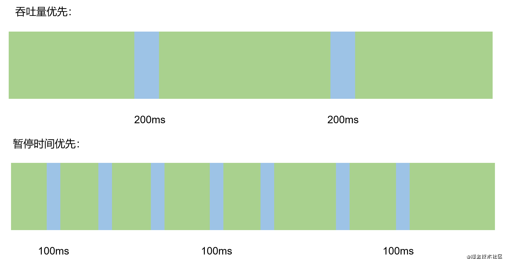

###  吞吐量

**运行用户代码时间占总运行时间(用户运行时间+内存回收时间)的比例**

比如，虚拟机运行了10分钟，其中垃圾回收花费了10秒，那吞吐量就是99.98%。

###  暂停时间

**执行垃圾收集时，用户线程被暂停的时间**

从用户的视角出发，GC的暂停时间尤为重要，甚至一个0.2s的GC，都会影响交互体验；对于一些顶级的服务来说，每次的响应时间甚至被限制在20ms以内，那么GC的暂停时间就会成为严重的瓶颈。

吞吐量和暂停时间的对比：

从图中可以得出结论，如果**以吞吐量优先，则必须降低内存回收的执行频率，单此的暂停时间边长**；**以暂停时间优先，那么就只能频繁的进行垃圾收集，导致吞吐量下降**。

所以一个较为普遍的标准是：**在最大吞吐量的情况下，尽可能的减少暂停时间**。

###  内存占用

**JVM堆区所占内存的大小**

###  垃圾收集开销

吞吐量的补数，垃圾收集所用时间与总运行时间的比例

###  收集频率

在一段时间内，垃圾收集发生的频率

###  速度

一个对象从诞生到被回收所经历的时间

在以上指标中，暂停时间、吞吐量和内存占用构成了一个“不可能三角”，即一款优秀的垃圾收集器，最对同时满足其中的两项。随着硬件技术的发展，服务器内存不断增大，内存占用的容忍度有所提高，因此在实际中，我们最为关注**吞吐量和暂停时间**

