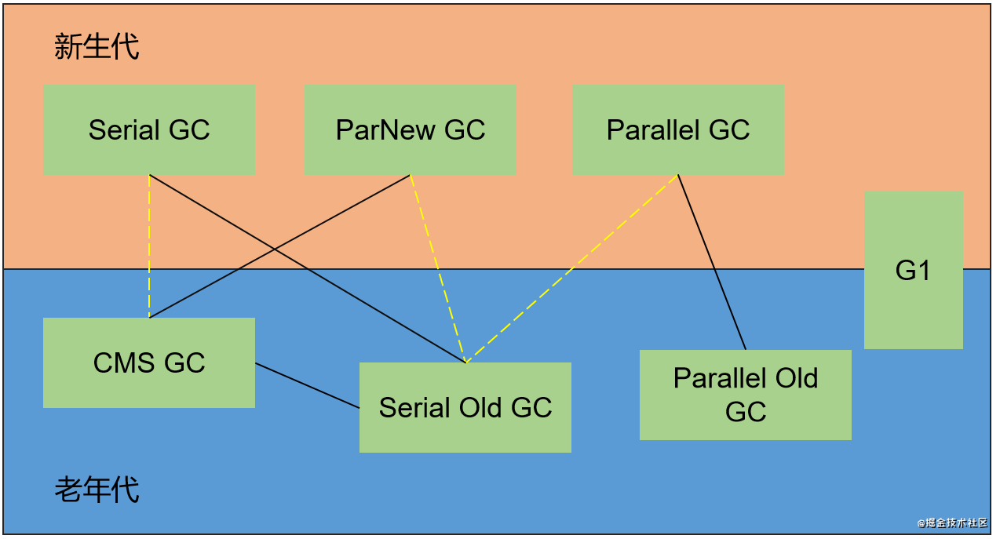

串行：Serial 、Serial Old

并行：ParNew、Parallel Scavenge、Parallel Old

并发：CMS、G1(兼具并行)

G1垃圾收集器作用于整个堆区。

图中黄色虚线中的Serial GC 和CMS GC、ParNew GC 和Serial Old GC 在Java8中已废弃，在Java9中已移除；Parallel GC 和Serial Old GC在Java14中弃用，估计在不久的将来也会被移除。

图中黑色实线关联CMS GC和Serial Old GC，表示Serial Old GC是CMS GC 的备选方案

### Serial + Serial Old 

CPU核心数比较小时，有比较优秀的性能和较低的CPU占用

### Parallel Scavenge + Parallel Old

JDK默认的GC组合。需要注意的是，Parallel Scavenge 不能与CMS一起使用。

### ParNew + CMS + Serial Old

CMS 不能搭配Parallel Scavenge，原因在于，**CMS和Parallel代码实现差异很大**，比如说，Parallel侧重于吞吐量的均衡，并有其均衡策略，而CMS侧重于较低的暂停时间。

例如：Parallel默认开启-XX:UseAdaptiveSizePolicy，而CMS默认关闭，并且，在使用CMS的情况下，显示开启该参数，也不会生效（在源代码层面，直接忽视掉）。

Serial Old作为CMS的后备GC，在Current Fail时使用。

### G1

自己和自己玩，但是可能会触发Current Fail，触发Full GC

