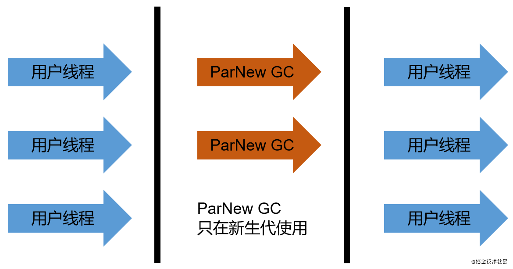

ParNew其实就是Serial的多线程版本，是一款并行回收器，Par是parallel、New是新生代，很明显，该回收器只能在新生代使用。

ParNew对比Serial，除了采用并行回收外，没有任何区别，也是采用的**复制算法**，同样会造成**STW**。ParNew不一定会比Serial更高效，如单核心的机器，效率就没那么高。

ParNew和Parallel Scavenge都是并行的垃圾收集器，不过底层的实现不一样，**ParNew能和CMS搭配使用**。

可以通过`-XX:+UseParNewGC`手动指定ParNew GC进行垃圾回收，不过仅仅表示在新生代使用，不影响老年代。由于是并行回收，可以使用`-XX：ParallelGCThreads`设置执行回收的线程数，不设置的话默认和CPU线程数相同。

