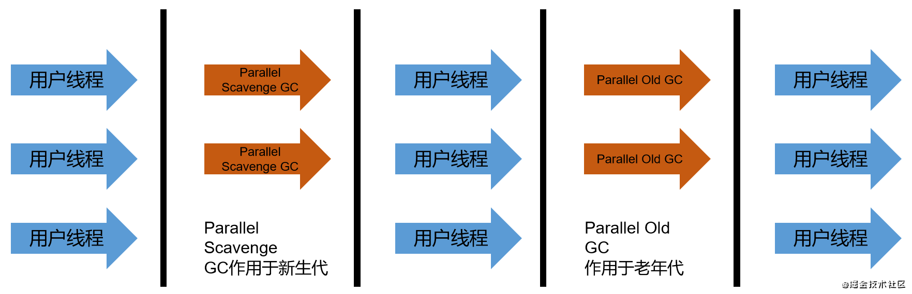
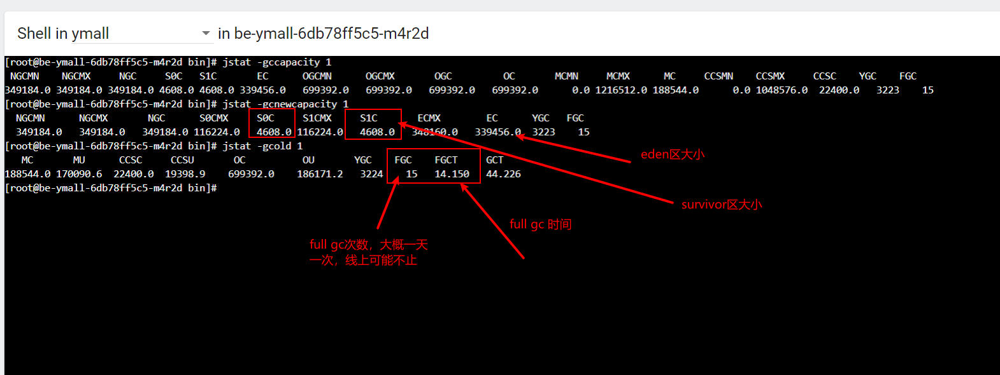

Parallel Scavenge 也是一款并行回收的收集器，采用**复制算法**，运行时会**STW**，**新生代为Parallel Scavenge，老年代为Parallel Old**。

**Parallel Old于JDK1.6出现，采用标记压缩算法，用以替代Serial Old**，两款Parallel是JDK1.8的默认组合，在Server模式有非常优秀的性能

Parallel和ParNew同样是并行收集器，那么在已经存在ParNew的情况下，Parallel会不会显得多余？其实并不会，他们底层实现的代码有很大的差别，而且**Parallel更专注于提高程序的吞吐量，能够设置自适应策略**。

高吞吐量的GC适用于不需要太多交互的任务，如批处理、订单处理、工资支付、科学计算等。

### 相关参数

- `-XX:+UseParallelGC`，手动指定年轻代使用Parallel Scavenge GC，老年代为`-XX:+ParallelOldGC`，两个参数开启一个，另一个也会被激活（互相激活）。
- `-XX:ParallelGCThreads`，设置年轻代Parallel的线程数，在默认情况下，CPU核心小于8，与核心数相同。大于8时，ParallelGCThreads = 3+(5 * cpu_threads /8)。
- `-XX:MaxGCPauseMillis`，设置垃圾收集器的最大停顿时间，单位为毫秒，**使用该参数需谨慎**。
- `-XX:GCTimeRatio`，设置垃圾收集时间占总时间的比例，用于衡量吞吐量的大小，取值为(0,100)，默认值为99，也几乎是垃圾回收的时间不超过1%。与-XX:MaxGCPauseMillis存在一定的矛盾，暂定时间越长，ratio就容易超过规定的比例。
- `-XX:+UseAdaptiveSizePolicy`，设置自适应调节策略。在这种模式下，Eden和Survivor的比例，晋升老年代的对象年龄会被自动调整，已达到在堆大小、吞吐量和停顿时间的平衡点。在手动调优的比较困难的情况下，可以使用该参数，仅需指定`-Xmx`、`GCTimeRatio`和`MaxGCPauseMillis`，让虚拟机自己完成调优工作。

### Full GC 并行化

老年代内存满时，JVM会触发一个单线程，STW的GC进行回收，为Full GC。

在使用Parallel Old GC的情况下，JVM会用Parallel Old GC的多线程并行回收，替代Full GC ，是为Full GC并行化。

### -XX:+UseAdaptiveSizePolicy存在的问题

以下为预生产环境，某个不愿意透露姓名应用的GC情况。

  

该应用的环境为jdk1.8，未指定GC，所以默认使用Parallel组合。

从图中可以看到，Full GC 触发了15次，而每次耗时1s左右。

由于Parallel默认开启-XX:UseAdaptiveSizePolicy，所以会自动调整Eden区和Survivor区的大小，在运行一段时间后，Eden区、Survivor1区和Survivor2区的比例为，**97 : 1.5 : 1.5**，而不是默认的8:1:1

太小的S区，容易导致Eden区存活的对象，绕过S区，直接晋升到老年代，从而造成老年代对象的堆积，进而导致Full GC。