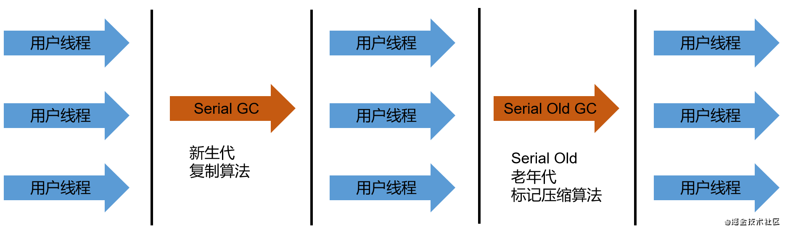

Serial 是最基本、历史最悠久的单线程(串行)垃圾收集器，JDK1.3以前新生代唯一的选择；

**在九十年代的硬件市场中，大部分CPU都是单核心，为了避免并发争抢导致性能下降，单线程垃圾收集器才是当时最佳的选择**。至今，在Client模式下的JDK，该收集器仍是新生代默认的版本。

Serial使用**复制算法**进行垃圾收集，在运行期间会**STW**，除了作用于新生代外，该收集器还有作用于老年代的Serial Old版本，使用标记压缩算法。

涉及到Eden、Survivor区的垃圾回收，均是采用复制算法。

**Serial Old可以与新生代的Serial、Parallel Scavenge配合使用，并作为CMS的后备垃圾收集器**。

优点：

	简单高效，对单个CPU的环境，Serial没有雨其他线程交互的高效，效率更高

	在客户端的Java应用，计算机的硬件水平不高，内存也不大（几十兆~一两百兆），即使是单线程进行垃圾回收也有很低的延时。

通过`-XX:UseSerialGC`指定年轻代和老年代都是用Serial回收器。 可以加上`-XX:+PrintCommandLineFlags`查看命令行相关的参数(包含垃圾回收器)，也可以输入`jinfo -flag UseSerialGC pid`查看参数是否使用，pid为Java进程ID；

