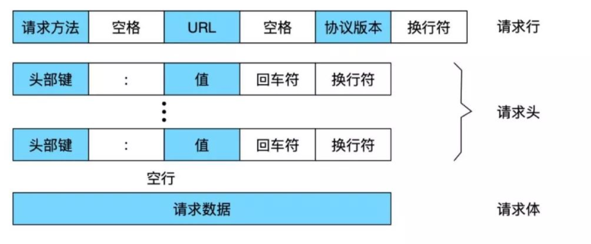
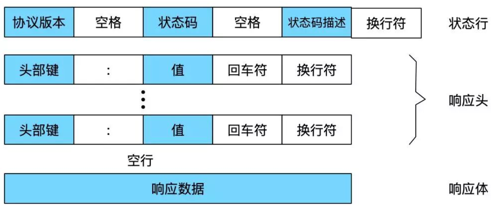
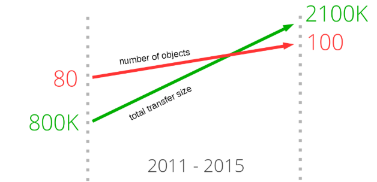
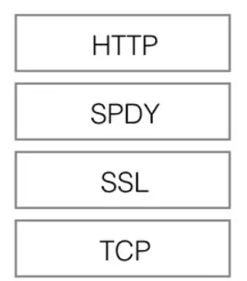
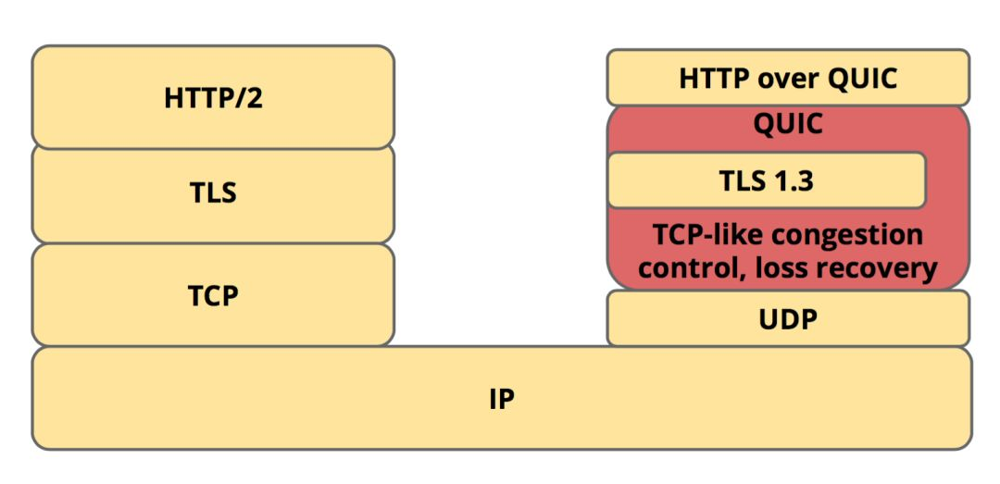

超文本传输协议

## 特点

- 无状态：协议对客户端没有状态存储，对事物处理没有“记忆”能力，比如访问一个网站需要反复进行登录操作。

- 无连接：**HTTP/1.1之前，由于无状态特点，每次请求需要通过TCP三次握手四次挥手，和服务器重新建立连接**。
- 基于请求和响应：基本的特性，由客户端发起请求，服务端响应
- 通信使用明文、请求和响应不会对通信方进行确认、无法保护数据的完整性

## 缺点

- 通信使用明文（不加密），内容可能会被窃听
- 不验证通信方的身份，因此有可能遭遇伪装
- 无法证明报文的完整性，所以有可能已遭篡改

## 请求

### 报文格式

示例

- 请求行：GET /login/username=aaa HTTP/1.1
- 请求头：accept:application/json
- 请求体：password=bbb

### 请求方法

| 方法名  | 描述                                                         |
| ------- | ------------------------------------------------------------ |
| GET     | 请求指定的资源，用于数据读取                                 |
| POST    | 向服务器提交数据处理请求，数据包含在请求体中                 |
| PUT     | 向指定资源位置上传最新内容，PUT应具有幂等性                  |
| PATCH   | 与PUT类似，但出现较晚。PATCH用于部分更新，PUT用于整体更新。当资源不存在时，PATCH会进行创建，而PUT只会对现有内容进行更新 |
| DELETE  | 删除请求，DELETE应具有幂等性                                 |
| OPTIONS | 允许客户端查看服务器的性能                                   |
| CONNECT | 预留给能够将连接改为管道方式的代理服务器                     |
| HEAD    | 类似于GET请求，但返回的响应中没有具体的内容，只用于获取响应头 |
| TRACE   | 回显服务器收到的请求，主要用于测试或诊断                     |

## 响应

### 报文格式

- 响应行：HTTP/1.1

- 响应头：Content-Type: application/json;charset=utf-8

- 响应体：{"state":"success"}

### 状态码

| 分类 | 描述                                     |
| ---- | ---------------------------------------- |
| 1**  | 服务器收到请求，需要请求者继续执行操作   |
| 2**  | 成功，接收成功并处理                     |
| 3**  | 重定向，将请求重定向到其他地址           |
| 4**  | 客户端错误，请求包含错误或者无法完成请求 |
| 5**  | 服务器错误，服务器在处理过程中发生了错误 |

## 版本差异

### HTTP/1.X

最早被公布是在 1996 年的 5 月，版本被命名为 HTTP/1.0，并记载于 RFC1945。虽说是初期标准，但该协议标准至今仍被广泛使用在服务器端。

它的主要缺点是，每一次建立 TCP 连接只能发送一个请求。送数据完毕，连接就关闭，如果还要请求其他资源，就必须再新建一个连接。如果多次请求，势必就会对服务器产生较大的资源性能损耗。

**1997 年 1 月公布的 HTTP/1.1 成为了目前主流的 HTTP 协议版本。这个版本最大的变化就是将持久化连接加入了 HTTP 标准，即 TCP 连接默认不关闭，可以被多个请求复用。**此外，HTTP/1.1 版还新增了许多方法，例如：PUT、PATCH、HEAD、OPTIONS、DELETE。

### HTTP/2

随着 Web 不断变化的需求，从当初网页内容以文本为主，到现在以富媒体（如图片、声音、视频）为主，加载网站首页需要下载的数据量在逐渐增加，并已经超过了 2100K，平均每个页面为了完成显示与渲染所需要下载的资源数也已经超过了 100 个。

HTTP/1.1 有两个主要的缺点：**安全不足和性能不高**，由于背负着 HTTP/1.x 庞大的历史包袱，所以协议的修改，兼容性是首要考虑的目标，否则就会破坏互联网上无数现有的资产。2010 年到 2015 年，谷歌通过实践一个实验性的 SPDY 协议，证明了一个在客户端和服务器端交换数据的另类方式。其收集了浏览器和服务器端的开发者的焦点问题，明确了响应数量的增加和解决复杂的数据传输。

SPDY 位于 HTTP 之下，TCP 和 SSL 之上，这样可以轻松兼容老版本的 HTTP 协议同时可以使用已有的 SSL 功能。SPDY 协议在 Chrome 浏览器上证明可行以后，HTTP/2.0 于 2015 年问世。

HTTP/2 相比 HTTP/1.1 的修改并不会破坏现有程序的工作，但是新的程序可以借由新特性得到更好的速度。HTTP/2 保留了 HTTP/1.1 的大部分语义，同时增加了以下特点：

- 二进制分帧层
- 多路复用
- 数据流优先级
- 服务端推送
- 头部压缩

### HTTP/3

随着时间的演进，越来越多的流量都往手机端移动，手机的网络环境会遇到的问题像是封包丢失机率较高、较长的 Round Trip Time (RTT)和连接迁移等问题，都让主要是为了有线网路设计的HTTP/TCP协议遇到贫颈。但是修改 TCP 协议是一件不可能完成的任务。因为 TCP 存在的时间实在太长，已经充斥在各种设备中，并且这个协议是由操作系统实现的，更新起来非常麻烦，不具备显示操作性。

2018 年，QUIC 演变成为 HTTP3。QUIC 协议是 Google 提出的一套开源协议，它基于 UDP 来实现，直接竞争对手是 TCP 协议。QUIC 协议的性能非常好，甚至在某些场景下可以实现 0-RTT 的加密通信。

相比 HTTP/2 而言，HTTP/3 有以下几点提升：

- HTTP/3 使用 stream 进一步扩展了 HTTP/2 的多路复用。在 HTTP/3 模式下，一般传输多少个文件就会产生对应数量的 stream。当这些文件中的其中一个发生丢包时，你只需要重传丢包文件的对应 stream 即可。

- HTTP/3 不再是基于 TCP 建立的，而是通过 UDP 建立，在用户空间保证传输的可靠性，相比 TCP，UDP 之上的 QUIC 协议提高了连接建立的速度，降低了延迟。

- 通过引入 Connection ID，使得 HTTP/3 支持连接迁移以及 NAT 的重绑定。

- HTTP/3 含有一个包括验证、加密、数据及负载的 built-in 的 TLS 安全机制。

- 拥塞控制。TCP 是在内核区实现的，而 HTTP/3 将拥塞控制移出了内核，通过用户空间来实现。这样做的好处就是不再需要等待内核更新可以实现很方便的进行快速迭代。

- 头部压缩。HTTP/2 使用的 HPACK，HTTP/3 更换成了兼容 HPACK 的 QPACK 压缩方案。QPACK 优化了对乱序发送的支持，也优化了压缩率。

