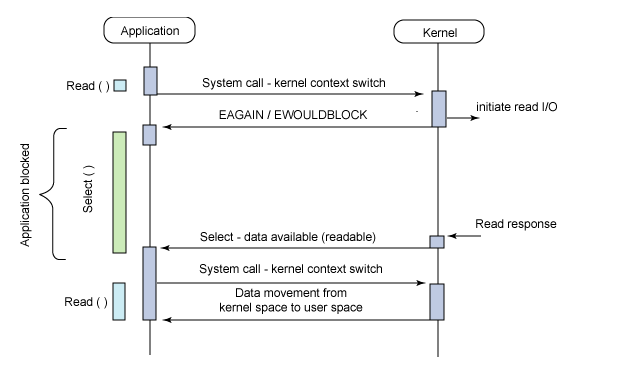

**select，poll，epoll都是IO多路复用的机制**。I/O多路复用就通过一种机制，可以监视多个描述符，一旦某个描述符就绪（一般是读就绪或者写就绪），能够通知程序进行相应的读写操作。**但select，poll，epoll本质上都是同步I/O，因为他们都需要在读写事件就绪后自己负责进行读写，也就是说这个读写过程是阻塞的，而异步I/O则无需自己负责进行读写，异步I/O的实现会负责把数据从内核拷贝到用户空间**。


## select



- 示例代码

```c_cpp
sockfd = socket(AF_INET, SOCK_STREAM, 0);
memset(&addr, 0, sizeof (addr));
addr.sin_family = AF_INET;
addr.sin_port = htons(2000);
addr.sin_addr.s_addr = INADDR_ANY;
bind(sockfd,(struct sockaddr*)&addr ,sizeof(addr));
listen (sockfd, 5); 
 
for (i=0;i<5;i++) {
  memset(&client, 0, sizeof (client));
  addrlen = sizeof(client);
  //fds 连接的文件描述符集合，万物皆文件
  fds[i] = accept(sockfd,(struct sockaddr*)&client, &addrlen);
  if(fds[i] > max)
  	max = fds[i];
}
  
while(1){
  //重置文件描述符
	FD_ZERO(&rset);
	for (i = 0; i< 5; i++ ) {
		FD_SET(fds[i],&rset);
	}
 
 	puts("round again");
 	//select函数，， 读文件描述符集合，写文件描述符集合，异常文件描述符集合，超时时间
 	//rset表示哪个连接被启用  
 	//该函数是一个阻塞函数，若没有数据，则一直阻塞，poll\epoll亦然
	select(max+1, &rset, NULL, NULL, NULL);
 
	for(i=0;i<5;i++) {
		if (FD_ISSET(fds[i], &rset)){
			memset(buffer,0,MAXBUF);
			//读出被置位 的数据
			read(fds[i], buffer, MAXBUF);
			//表示处理
			puts(buffer);
		}
	}	
}
```


- select内部的 执行过程

（1）使用copy_from_user从用户空间拷贝fd_set到内核空间

（2）注册回调函数__pollwait

（3）遍历所有fd，调用其对应的poll方法（对于socket，这个poll方法是sock_poll，sock_poll根据情况会调用到tcp_poll,udp_poll或者datagram_poll）

（4）以tcp_poll为例，其核心实现就是__pollwait，也就是上面注册的回调函数。

（5）__pollwait的主要工作就是把current（当前进程）挂到设备的等待队列中，不同的设备有不同的等待队列，对于tcp_poll来说，其等待队列是sk->sk_sleep（注意把进程挂到等待队列中并不代表进程已经睡眠了）。在设备收到一条消息（网络设备）或填写完文件数据（磁盘设备）后，会唤醒设备等待队列上睡眠的进程，这时current便被唤醒了。

（6）poll方法返回时会返回一个描述读写操作是否就绪的mask掩码，根据这个mask掩码给fd_set赋值。

（7）如果遍历完所有的fd，还没有返回一个可读写的mask掩码，则会调用schedule_timeout是调用select的进程（也就是current）进入睡眠。当设备驱动发生自身资源可读写后，会唤醒其等待队列上睡眠的进程。如果超过一定的超时时间（schedule_timeout指定），还是没人唤醒，则调用select的进程会重新被唤醒获得CPU，进而重新遍历fd，判断有没有就绪的fd。

（8）把fd_set从内核空间拷贝到用户空间。


- 缺点

（1）每次调用select，都需要把fd集合从用户态拷贝到内核态

（2）执行select前，不管fs集合有没有数据，都会重置rset

（3）select支持的文件描述符数量(rset)太小了，默认是1024

（4）执行完select后，不管fs集合中多少连接有数据，都会全量遍历


## poll

- 示例代码

```c_cpp
for (i=0;i<5;i++) {
  memset(&client, 0, sizeof (client));
  addrlen = sizeof(client);
  //将连接的文件描述符赋给pollfds ，数组实现
  pollfds[i].fd = accept(sockfd,(struct sockaddr*)&client, &addrlen);
  //读事件
  pollfds[i].events = POLLIN;
}
sleep(1);
while(1){
  puts("round again");
  //poll函数,文件描述符集合， 元素个数，超时时间 
  poll(pollfds, 5, 50000);
  
  for(i=0;i<5;i++) {
  	if (pollfds[i].revents & POLLIN){
  		pollfds[i].revents = 0;
  		memset(buffer,0,MAXBUF);
  		//读数据
  		read(pollfds[i].fd, buffer, MAXBUF);
  		//处理数据
  		puts(buffer);
  	}
  }
}
struct pollfd{
  //文件描述符
  int fd;
  //事件类型，如读、写 
  short event;
  //poll函数处理后置位 
  short revents;
}
```


- 执行过程

poll的实现和select非常相似，只是描述fd集合的方式不同，poll使用pollfd结构而不是select的fd_set结构，其他的都差不多。


- 改进

（1）使用pollfds，通过revents进行置位，没有了rset默认1024大小的限制

（2）直接对pollfds进行  操作，无需再进行全量遍历拷贝到rset中


- 缺点

（1）仍然需要在内核态和用户态之间拷贝fd

（2）fd集合仍然需要重置


## epoll

- 示例代码

```c_cpp
struct epoll_event events[5];
//创建数据集
//epoll函数
int epfd = epoll_create(10);
...
...
for (i=0;i<5;i++) {
  static struct epoll_event ev;
  memset(&client, 0, sizeof (client));
  addrlen = sizeof(client);
  ev.data.fd = accept(sockfd,(struct sockaddr*)&client, &addrlen);
  ev.events = EPOLLIN;
  //epoll函数，对epfd进行配置，操作，文件描述符，事件名称
  epoll_ctl(epfd, EPOLL_CTL_ADD, ev.data.fd, &ev); 
}

while(1){
	puts("round again");
	//返回有数据的数量，该函数会将有数据的排在集合的头部
  //epoll函数
	nfds = epoll_wait(epfd, events, 5, 10000);

  //仅对有数据的集合进行操作
  for(i=0;i<nfds;i++) {
  		memset(buffer,0,MAXBUF);
  		read(events[i].data.fd, buffer, MAXBUF);
  		puts(buffer);
  }
}
struct epoll_event{
  //文件描述符
  int fd;
  //事件类型，如读、写 
  short event;
}
```


- 执行过程

epoll提供了三个函数，epoll_create,epoll_ctl和epoll_wait，epoll_create是创建一个epoll句柄；epoll_ctl是注册要监听的事件类型；epoll_wait则是等待事件的产生。

在epoll_ctl函数中，每次注册新的事件到epoll句柄中时（在epoll_ctl中指定EPOLL_CTL_ADD），会把所有的fd拷贝进内核，而不是在epoll_wait的时候重复拷贝。epoll保证了每个fd在整个过程中只会拷贝一次。

在epoll_ctl时把current挂一遍并为每个fd指定一个回调函数，当设备就绪，唤醒等待队列上的等待者时，就会调用这个回调函数，而这个回调函数会把就绪的fd加入一个就绪链表）。epoll_wait的工作实际上就是在这个就绪链表中查看有没有就绪的fd


- 改进

（1）在epoll_wait函数中，内核态和用户态共用epfd，去掉了select\poll切换的开销

（2）仅对集合中有数据的部分进行遍历，去掉了全量遍历集合的开销


-  缺点

任然是阻塞式的IO函数