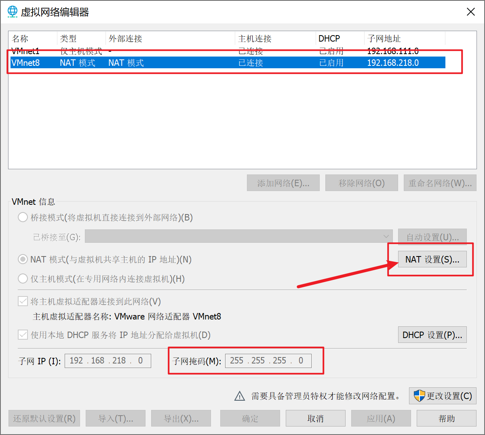
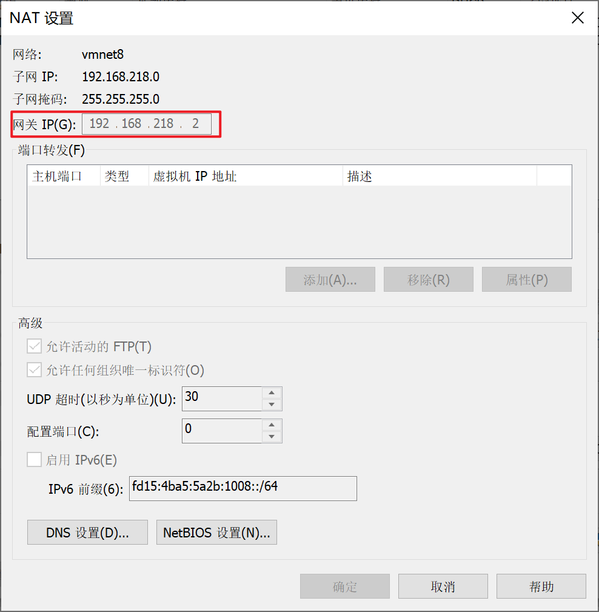
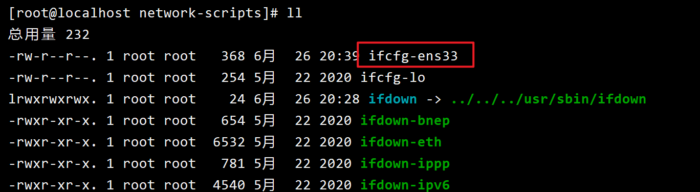
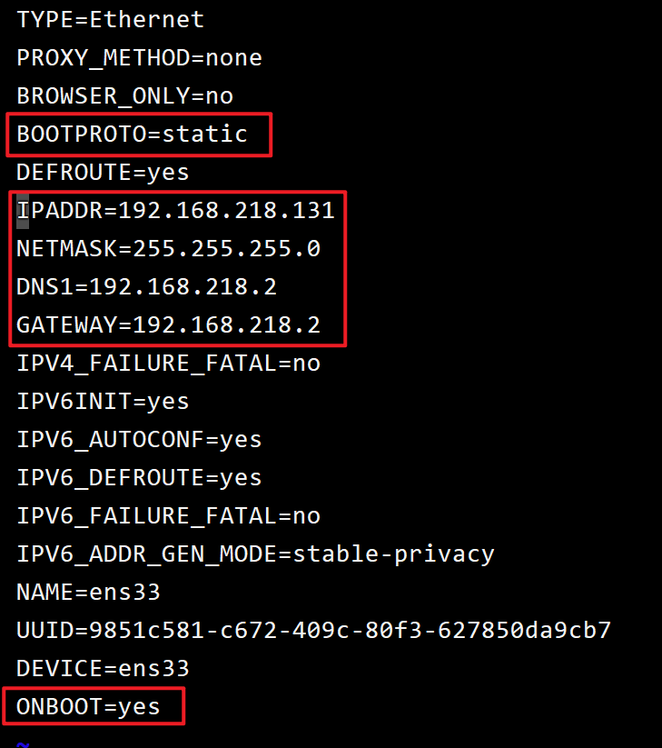

### 查看VMWare网络信息

在左上角的【编辑】中，选择【虚拟网络编辑器】




页面直接显示有子网掩码**NETMASK=255.255.255.0**，网关和DNS服务器，需要进入到【NAT设置】中进行查看。



如图，网关**GATEWAY=192.168.218.2**，DNS和网关一致也为**DNS1=192.169.218.2**


### 修改虚拟机IP

进入到网卡信息的目录

```
cd /etc/sysconfig/network-scripts/
```


查看对应的网卡，如ifcfg-ens33




编辑该文件的信息，修改为对应的值，其中IPADDR为ip4的地址，不冲突，在掩码对应的范围内即可

