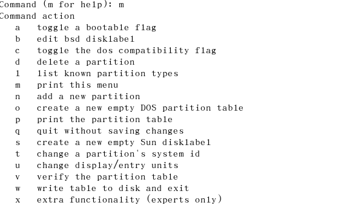

### 初始化

在VMWare新建完磁盘后，需要在系统中进行初始化和挂载。


查看系统分区

```
fdisk -l
```


初始化

```
fdisk  /dev/sdb
```


输入m，进入命令提示



输入n，进行初始化，后续有默认的设置，直接回车即可，最后输入w保存并退出


再次使用 “fdisk -l ”这个命令来查看会发现出现了/dev/sdb1（说明已经完成了分区工作）


格式化，输入mkfs -t ext3 /dev/sdb1


挂载，修改`/etc/fstab`

```
/dev/sdb1  /data  ext3 defaults  0  1
```