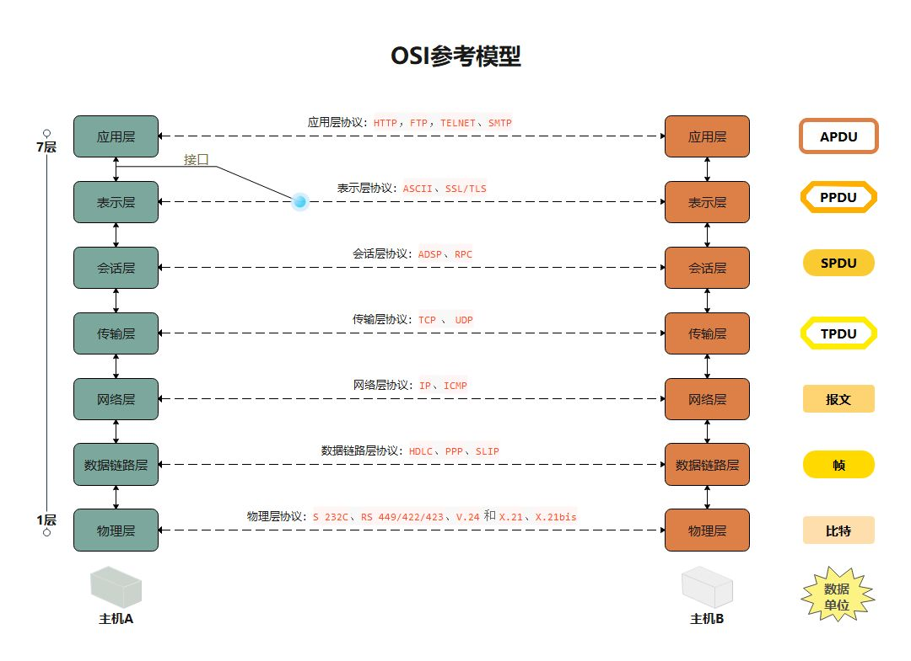
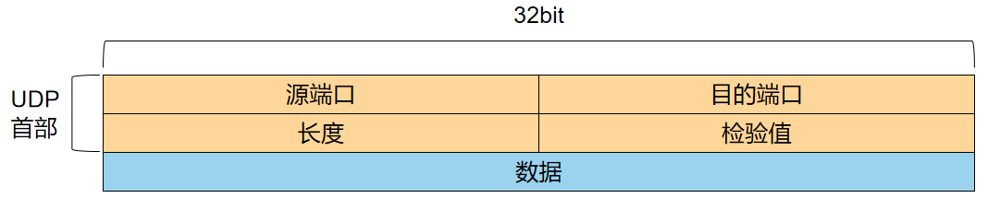
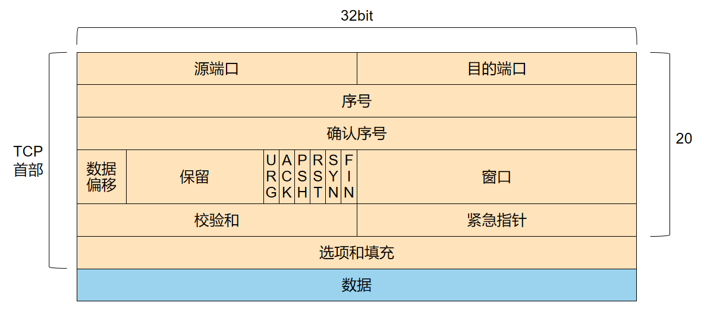
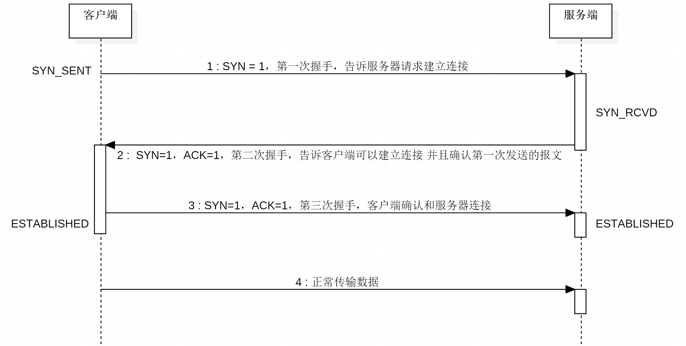
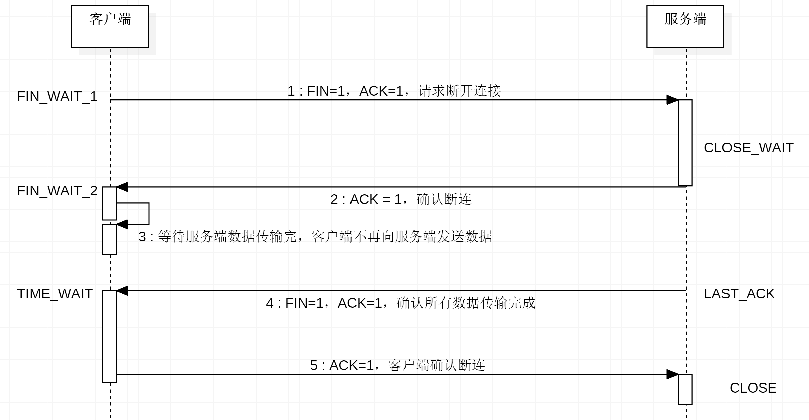

# 网络模型



对比


# TCP和UDP对比

UDP：面向无连接，存在丢包，数据包大小限制64k，不安全不可靠，效率高

TCP：面向连接，建立连接需要经过三次握手，断开连接需要经过四次挥手，连接稳定安全，效率低。HTTP协议底层采用TCP协议。


# UDP

##  报文格式



- 源端口：这个字段占据 UDP 报文头的前 16 位，通常包含发送数据报的应用程序所使用的 UDP 端口。接收端的应用程序利用这个字段的值作为发送响应的目的地址。这个字段是可选的，所以发送端的应用程序不一定会把自己的端口号写入该字段中。如果不写入端口号，则把这个字段设置为 0。这样，接收端的应用程序就不能发送响应了。
- 目的端口：接收端计算机上 UDP 软件使用的端口，占据 16 位。
- 长度：该字段占据 16 位，表示 UDP 数据报长度，包含 UDP 报文头和 UDP 数据长度。因为 UDP 报文头长度是 8 个字节，所以这个值最小为 8。
- 校验值：该字段占据 16 位，可以检验数据在传输过程中是否被损坏。


# TCP

## 报文格式



16位源端口号：16位的源端口中包含初始化通信的端口。源端口和源IP地址的作用是标识报文的返回地址。

16位目的端口号：16位的目的端口域定义传输的目的。这个端口指明报文接收计算机上的应用程序地址接口。

32位序号：32位的序列号由接收端计算机使用，重新分段的报文成最初形式。当SYN出现，序列码实际上是初始序列码（Initial Sequence Number，ISN），而第一个数据字节是ISN+1。这个序列号（序列码）可用来补偿传输中的不一致。

32位确认序号：32位的序列号由接收端计算机使用，重组分段的报文成最初形式。如果设置了ACK控制位，这个值表示一个准备接收的包的序列码。

4位首部长度（数据偏移）：4位包括TCP头大小，指示何处数据开始。

保留（6位）：6位值域，这些位必须是0。为了将来定义新的用途而保留。

标志：6位标志域。表示为：紧急标志、有意义的应答标志、推、重置连接标志、同步序列号标志、完成发送数据标志。按照顺序排列是：URG、ACK、PSH、RST、SYN、FIN。

16位窗口大小：**用来表示想收到的每个TCP数据段的大小**。TCP的流量控制由连接的每一端通过声明的窗口大小来提供。窗口大小为字节数，起始于确认序号字段指明的值，这个值是接收端正期望接收的字节。窗口大小是一个16字节字段，因而**窗口大小最大为65535字节**。

16位校验和：16位TCP头。**源机器基于数据内容计算一个数值，收信息机要与源机器数值 结果完全一样，从而证明数据的有效性**。检验和覆盖了整个的TCP报文段：这是一个强制性的字段，一定是**由发送端计算和存储，并由接收端进行验证的**。

16位紧急指针：**指向后面是优先数据的字节**，在URG标志设置了时才有效。如果URG标志没有被设置，紧急域作为填充。加快处理标示为紧急的数据段。

选项：长度不定，但长度必须为1个字节。如果没有选项就表示这个1字节的域等于0。

数据：该TCP协议包负载的数据。


## TCP控制位

- URG：紧急指针标志，为1时表示紧急指针有效，为0则忽略紧急指针。

- **ACK：确认序号标志**，为1时表示确认号有效，为0表示报文中不含确认信息，忽略确认号字段。

- PSH：push标志，为1表示是带有push标志的数据，指示接收方在接收到该报文段以后，应尽快将这个报文段交给应用程序，而不是在缓冲区排队。

- RST：重置连接标志，用于重置由于主机崩溃或其他原因而出现错误的连接。或者用于拒绝非法的报文段和拒绝连接请求。

- **SYN：同步序号**，用于建立连接过程，在连接请求中，SYN=1和ACK=0表示该数据段没有使用捎带的确认域，而连接应答捎带一个确认，即SYN=1和ACK=1。

- **FIN：finish标志**，用于释放连接，为1时表示发送方已经没有数据发送了，即关闭本方数据流。


## 三次握手



第一次握手：Client将标志位SYN置为1，随机产生一个值seq=J，并将该数据包发送给Server，Client进入**SYN_SENT**状态，等待Server确认。

第二次握手：Server收到数据包后由标志位SYN=1知道Client请求建立连接，Server将标志位SYN和ACK都置为1，ack=J+1，随机产生一个值seq=K，并将该数据包发送给Client以确认连接请求，Server进入**SYN_RCVD**状态（半连接）。

第三次握手：Client收到确认后，检查ack是否为J+1，ACK是否为1，如果正确则将标志位ACK置为1，ack=K+1，并将该数据包发送给Server，Server检查ack是否为K+1，ACK是否为1，如果正确则连接建立成功，Client和Server进入**ESTABLISHED**状态，完成三次握手，随后Client与Server之间可以开始传输数据了。


### 保活机制

建立连接后断连，TCP存在**保活机制**，由一个包活计时器实现，是服务器用来确认什么时候断开一些连接的一种机制。

保活可以设置在TCP的一端、两端、或者不设置。

在Keep alive time保活时间内处于非活动状态，那么开启保活的一端会向另一端发送探测报文，如果没有收到响应就继续发送，直到达到探测次数还未响应，就会被认为不可达，本次连接中断。

保活时间：默认7200秒（2小时）， 保活时间间隔：默认75秒，保活探测数：默认9次


### SYN攻击

Server发送SYN-ACK之后，收到Client的ACK之前的TCP连接称为**半连接（half-open connect）**，此时Server处于SYN_RCVD状态，当收到ACK后，Server转入ESTABLISHED状态。SYN攻击就是Client在短时间内伪造大量不存在的IP地址，并向Server不断地发送SYN包，Server回复确认包，并等待Client的确认，由于源地址是不存在的，因此，Server需要不断重发直至超时，这些伪造的SYN包将产时间占用未连接队列，导致正常的SYN请求因为队列满而被丢弃，从而引起网络堵塞甚至系统瘫痪。

可以通过该linux命令，查看已经完成第一次握手的情况

```
netstat -nap | grep SYN_RECV
```

防御措施：

- **缩短超时时间**，减少超时时间能使系统处理更多的SYN请求

- **增加最大半连接数**，通过增大未连接队列空间可以缓解这种压力，使正常的TCP连接顺利完成三次握手

- **SYN cookies技术**，通过加密技术来标识半连接状态。当服务器遭受SYN攻击使得backlog队列满时，服务器并不拒绝新的SYN请求，而是回复cookie（回复包的SYN序列号）给客户端， 如果收到客户端的ACK包，服务器将客户端的ACK序列号减去1得到cookie比较值，并将上述要素进行一次hash运算，看看是否等于此cookie。如果相等，直接完成三次握手（注意：此时并不用查看此连接是否属于backlog队列）。

- **SynAttackProtect机制**，通过关闭某些socket选项，增加额外的连接指示和减少超时时间，使系统能处理更多的SYN连接，以达到防范SYN攻击的目的。

  当SynAttackProtect值为1时，系统通过**减少重传次数和延迟未连接时路由缓冲项**（route cache entry）防范SYN攻击。

  当SynAttackProtect值为2时（Microsoft推荐使用此值），系统不仅使用backlog队列，还使用附加的半连接指示，以此来处理更多的SYN连接，使用此键值时，tcp/ip的TCPInitialRTT、window size和可滑动窗囗将被禁止。

- **SYN代理**，SYN代理并不转发SYN包，而是以服务器的名义主动回复SYN/ACK包给客户，如果收到客户的ACK包，表明这是正常的访问，此时防火墙向服务器发送ACK包并完成三次握手。SYN代理事实上**代替了服务器去处理SYN攻击**，此时要求过滤网关自身具有很强的防范SYN攻击能力。

- **SYN网关**，一种**将半连接队列的数量增长转移到容量更大的连接队列的数量增长上的方法**，SYN网关收到客户端的SYN包时，直接转发给服务器；SYN网关收到服务器的SYN/ACK包后，将该包转发给客户端，同时以客户端的名义给服务器发ACK确认包。此时服务器由半连接状态进入连接状态。当客户端确认包到达时，如果有数据则转发，否则丢弃。服务器除了维持半连接队列外，还要有一个连接队列，如果发生SYN攻击时，将使连接队列数目增加，但一般**服务器所能承受的连接数量比半连接数量大得多**，所以这种方法能有效地减轻对服务器的攻击。


### 为什么是三次握手？

客户端在第一次握手后，进入SYN_SENT状态，服务端在第二次握手后，进入SYN_RCVD状态，在第三次握手后，客户端和服务器进入ESTABLISHED状态，若缺少某个握手流程，状态则不完整，最终不能流转到ESTABLISHED的状态。而三次握手已经能够建立一个稳定明确的连接，不需要第四次握手。


## 四次挥手



由于TCP连接时全双工的，因此，每个方向都必须要单独进行关闭，这一原则是当一方完成数据发送任务后，发送一个FIN来终止这一方向的连接，收到一个FIN只是意味着这一方向上没有数据流动了，即不会再收到数据了，但是在这个TCP连接上仍然能够发送数据，直到这一方向也发送了FIN。首先进行关闭的一方将执行主动关闭，而另一方则执行被动关闭。

·

第一次挥手：Client发送一个FIN，用来关闭Client到Server的数据传送，Client进入**FIN_WAIT_1**状态。

第二次挥手：Server收到FIN后，发送一个ACK给Client，确认序号为收到序号+1（与SYN相同，一个FIN占用一个序号），Server进入**CLOSE_WAIT**状态，Client在接收到后进入**FIN_WAIT_2**，。

第三次挥手：Server发送一个FIN，用来关闭Server到Client的数据传送，Server进入**LAST_ACK**状态。

第四次挥手：Client收到FIN后，Client进入**TIME_WAIT**状态，接着发送一个ACK给Server，确认序号为收到序号+1，Server进入CLOSED状态，完成四次挥手。


### 为什么是四次挥手？

1、服务端在客户端请求断连之后，可能还有部分数据没有发送完，所以在第二次挥手之后，客户端不再向服务端发送数据，而服务端则把所有数据发完。再给客户端发送数据传输完成的挥手报文。

2、客户端可能没有接收到上一个报文，客户端会重新进行第一次挥手，服务端再次发送ACK报文给客户端，告知客户端不必再进行第一次挥手。


### 等待2MSL的意义？

MSL是*Maximum Segment Lifetime*英文的缩写，中文可以译为“报文最大生存时间”，他是任何报文在网络上存在的最长时间，超过这个时间报文将被丢弃。*2MSL*即两倍的*MSL*，***TCP*的*TIME_WAIT*状态也称为*2MSL*等待状态**。

1、保证客户端最后一个报文能够送达到服务端，ACK报文可能会丢失，因而使处在LAST-ACK状态的B收不到对已发送的FIN和ACK 报文段的确认。服务端会超时重传这个FIN和ACK报文段，而客户端就能在2MSL时间内收到这个重传的ACK+FIN报文段。接着客户端重传一次确认。

2、防止已失效的连接请求报文段出现在本连接中，A在发送完最有一个ACK报文段后，再经过2MSL，就可以使本连接持续的时间内所产生的所有报文段都从网络中消失。

