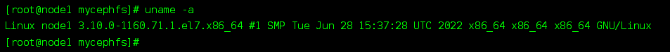
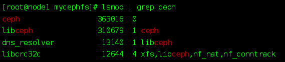

### fuse挂载

- 安装fuse

```sh
yum install -y ceph-fuse
```


- 创建目录并挂载

ceph默认会创建一个admin的超级管理员用户

```sh
# 创建目录
mkdir -p /mnt/mycephfs
# 挂载
ceph-fuse -n client.admin /mnt/mycephfs
```


### 内核挂载

对内核的稳定性要求比较高


- 查看内核版本

```sh
uname -a
```

内核版本尽量在3.10以上




- 查看是否加载ceph内核

```sh
lsmod | grep ceph
```


- 没有加载需进行加载

```sh
modprobe ceph
```

这时再看就有了



- 挂载

```sh
mount -t ceph :/ /mnt/mycephfs -o name=admin
```

