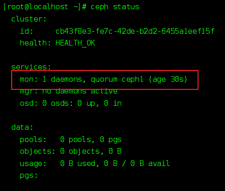
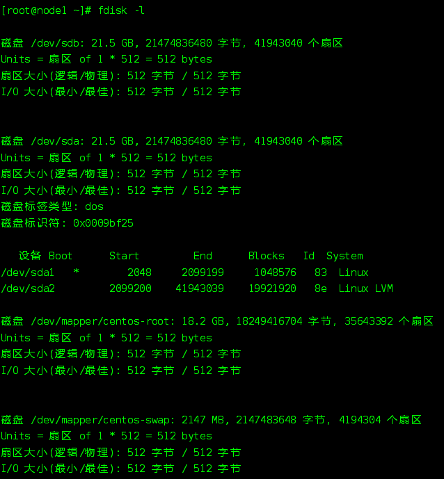
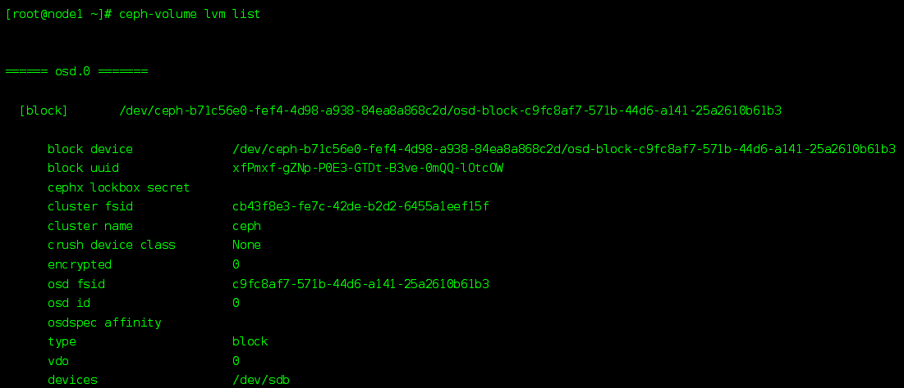
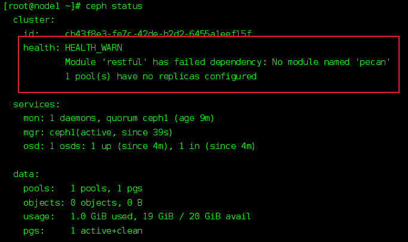
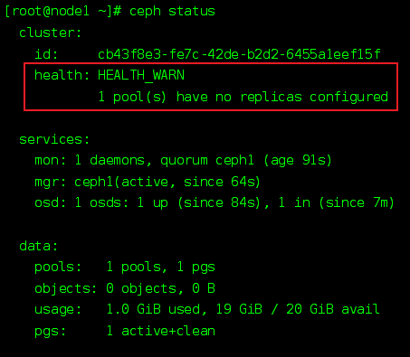

### 部署架构


### 服务器环境

#### centos常规

- 更新源和内核、禁用防火墙和selinux

```shell
#/bin/bash

# 先安装一个wget
yum install wget -y 

# 替换阿里源
wget -O /etc/yum.repos.d/CentOS-Base.repo https://mirrors.aliyun.com/repo/Centos-7.repo
wget -O /etc/yum.repos.d/epel.repo http://mirrors.aliyun.com/repo/epel-7.repo

# 清楚yum缓存
yum clear all
# 更新内核和lib
yum update -y 

# 更新常用软件
yum install git vim net-tools -y

# 关闭交换区
echo 0 | sudo tee /proc/sys/vm/swappiness
# overcommit
echo 1 | sudo tee /proc/sys/vm/overcommit_memory

# 关闭防火墙
systemctl stop firewall
# 禁止防火墙开机自启
systemctl disable firewall

# 关闭讨厌的提示音
sed -i 's/^#set bell-style none.*/set bell-style off/g' /etc/inputrc

# 关闭selinux
setenforce 0
# 永久关闭selinux
echo "
SELINUX=disabled 
SELINUXTYPE=targeted" > /etc/selinux/config

# 重启
shutdown -r now
```


- 固定IP，IP、DNS等只是示例

```shell
#/bin/bash

HOSTNAME="copy"
DNS1="192.168.19.2"
GATEWAY="192.168.19.2"
IPADDR="192.168.19.128"
NETMASK="255.255.255.0"

# 固定ip
echo "DNS1=\"${DNS1}\"" >> /etc/sysconfig/network-scripts/ifcfg-ens33
echo "GATEWAY=\"${GATEWAY}\"" >> /etc/sysconfig/network-scripts/ifcfg-ens33
echo "IPADDR=\"${IPADDR}\"" >> /etc/sysconfig/network-scripts/ifcfg-ens33
echo "NETMASK=\"${NETMASK}\"" >> /etc/sysconfig/network-scripts/ifcfg-ens33

# 设置hostname
hostnamectl set-hostname ${HOSTNAME}

systemctl restart network
```


- 把固定好的IP写入环境变量，后续引用也比较方便

```sh
echo "
export IP=192.168.19.128
">>/etc/profile
```


#### ceph配置

- 添加ceph源，以阿里云源为例

```sh
#/bin/bash
# 阿里云镜像地址
SOURCE="mirrors.aliyun.com"
# ceph版本
CEPH_VERSION="15.2.9"

echo "
[ceph]
name=ceph
baseurl=http://${SOURCE}/ceph/rpm-${CEPH_VERSION}/el7//x86_64/
gpgcheck=0
priority=1

[ceph-noarch]
name=cephnoarch
baseurl=http://${SOURCE}/ceph/rpm-${CEPH_VERSION}/el7//noarch/
gpgcheck=0
priority=1

[ceph-source]
name=Ceph source packages
baseurl=http://${SOURCE}/ceph/rpm-${CEPH_VERSION}/el7//SRPMS
gpgcheck=0
priority=1
" >> /etc/yum.repos.d/ceph.repo
```


- 服务器时钟

```sh
yum install -y ntp ntpdate
```


- 域名解析

```sh
#/bin/bash
echo "
${IP} node1
" >> /etc/hosts
```


- 安装ceph软件包及其依赖

```sh
yum install -y epel-release yum-plugin-priorities yum-utils
yum install -y ceph ceph-radosgw
```


- ceph基础配置

```sh
#/bin/bash
echo  "[global]
fsid = `uuidgen`
mon initial members = ceph1
mon host = ${IP}
public network = ${IP}/24
cluster network = ${IP}/24
auth cluster required = cephx
auth service required = cephx
auth client required = cephx
osd pool default size = 1
osd pool default min size = 1
osd crush chooseleaf type = 0 " > /etc/ceph/ceph.conf
```


- 看一下刚刚生成的uuid

```shell
cat /etc/ceph/ceph.conf | grep fsid |  awk '{print $3}'
```


#### mon安装

- 安装脚本

```sh
#/bin/bash
# 将ip地址换成自己的ip
IP = "${IP}"
# 将fsid换成/etc/ceph/ceph.conf中自己生成的
FSID = `cat /etc/ceph/ceph.conf | grep fsid |  awk '{print $3}'`

ceph-authtool --create-keyring /tmp/ceph.mon.keyring --gen-key -n mon. --cap mon 'allow *'
sudo ceph-authtool --create-keyring /etc/ceph/ceph.client.admin.keyring --gen-key -n client.admin --cap mon 'allow *' --cap osd 'allow *' --cap mds 'allow *' --cap mgr 'allow *'
sudo ceph-authtool --create-keyring /var/lib/ceph/bootstrap-osd/ceph.keyring --gen-key -n client.bootstrap-osd --cap mon 'profile bootstrap-osd' --cap mgr 'allow r'
sudo ceph-authtool /tmp/ceph.mon.keyring --import-keyring /etc/ceph/ceph.client.admin.keyring
sudo ceph-authtool /tmp/ceph.mon.keyring --import-keyring /var/lib/ceph/bootstrap-osd/ceph.keyring
sudo chown ceph:ceph /tmp/ceph.mon.keyring

monmaptool --create --add node1 ${IP} --fsid ${FSID} /tmp/monmap

sudo -u ceph mkdir /var/lib/ceph/mon/ceph-ceph1

sudo -u ceph ceph-mon --mkfs -i ceph1 --monmap /tmp/monmap --keyring /tmp/ceph.mon.keyring

systemctl start ceph-mon@ceph1
systemctl enable ceph-mon@ceph1
```


- 看下ceph的状态

```sh
ceph status
```




#### osd安装

先添加一块磁盘，然后用ceph管理磁盘即可

- 查看目前的磁盘

```sh
fdisk -l
```



- 对/dev/sdb磁盘进行挂载

```sh
# ceph管理，/dev/sdb为具体的磁盘
ceph-volume lvm create --data /dev/sdb
```


- 查看ceph查看磁盘情况

```sh
ceph-volume lvm list
```




#### mgr安装

```sh

mkdir /var/lib/ceph/mgr/ceph-ceph1

ceph auth get client.bootstrap-mgr -o /var/lib/ceph/bootstrap-mgr/ceph.keyring
ceph --cluster ceph --name client.bootstrap-mgr --keyring /var/lib/ceph/bootstrap-mgr/ceph.keyring auth get-or-create mgr.ceph1  mon "allow profile mgr" osd "allow *" mds "allow *" -o /var/lib/ceph/mgr/ceph-ceph1/keyring

touch /var/lib/ceph/mgr/ceph-ceph1/done
touch /var/lib/ceph/mgr/ceph-ceph1/systemd
chown ceph:ceph -R /var/lib/ceph/mgr/ceph-ceph1

systemctl start  ceph-mgr@ceph1
systemctl enable  ceph-mgr@ceph1
```


- 修复 monitors have not enabled msgr2

```sh
ceph mon enable-msgr2
```


#### 告警处理




安装一个werkzeug模块即可

```sh
pip3 install pecan werkzeug
```


消除完成后，还有这个告警



单机安装才会提示，设置不提示即可

```sh
ceph config set global mon_warn_on_pool_no_redundancy false
```

