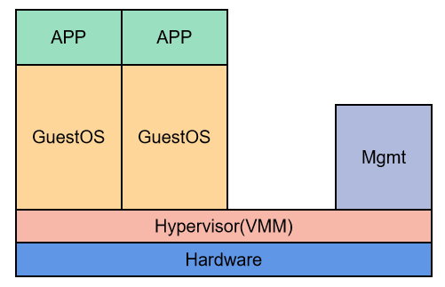
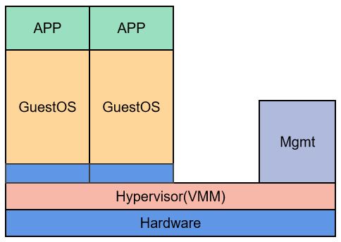

## 虚拟化分类

### 全虚拟化

最初使用的虚拟化技术就是全虚拟化，它在虚拟机和硬件之间加了一个软件层，Hypervisor，也叫做虚拟机监控器VMM

Hypervisor直接运行在硬件上，称为KVM，运行在OS上时，称为QEMU，或者WINE。

### 半虚拟化

在全虚拟化的基础上，对OS进行了修改，增加了一个专门的API。这个API可以将OS发出的指令进行优化，不需要Hypervisor耗费一定的资源进行翻译，因此Hypervisor的负担变小，提高了整体的性能。

## 虚拟化的架构

### 寄居架构

在操作系统之上安装虚拟化软件，依赖于原操作系统对设备的支持和资源的管理

优点是，部署简单，便于实现。缺点是，安装和运行的应用程序依赖于原有操作系统的支持；原有操作系统和虚拟机软件也需要占用一部分资源。

例如，GSX Server，VMware Workstation Pro

### 裸金属架构

在硬件上直接安装虚拟化软件，再在虚拟化软件中安装虚拟机系统和应用，依赖虚拟层内核和服务器控制台进行管理

优点是，不依赖于原有操作系统的支持，更加灵活

缺点是，基于硬件层面的开发难度巨大

例如，VMware ESXi

## VMware ESXi

ESXi 是部署在裸金属上的半虚拟化软件，单机的授权是免费的，但是一部分高级功能和集群管理的功能是收费的。

