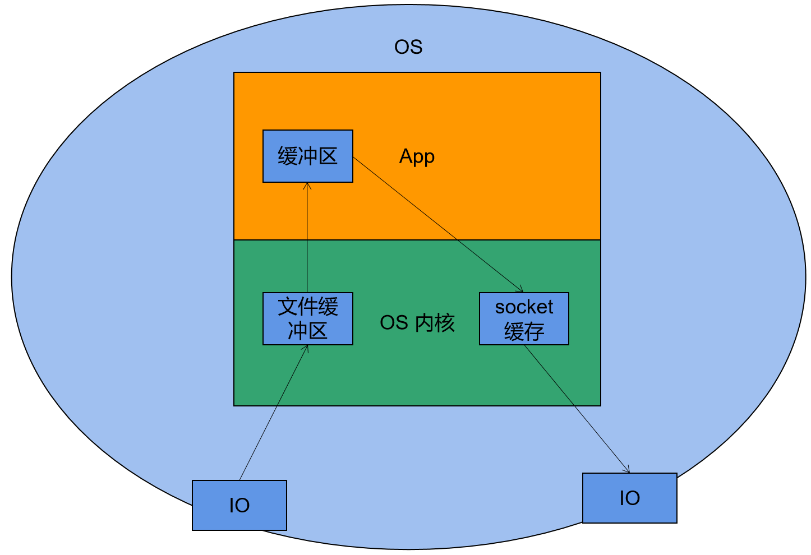
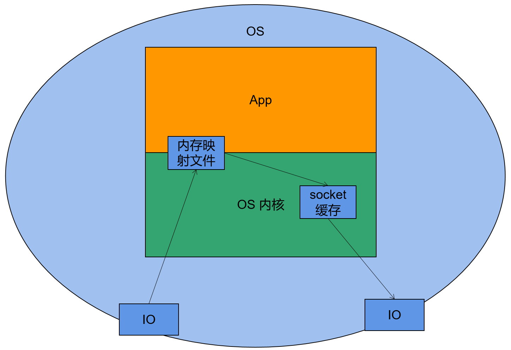
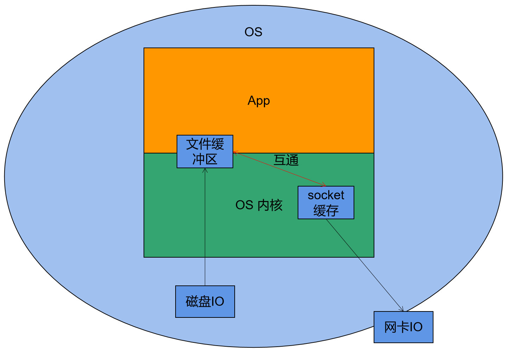
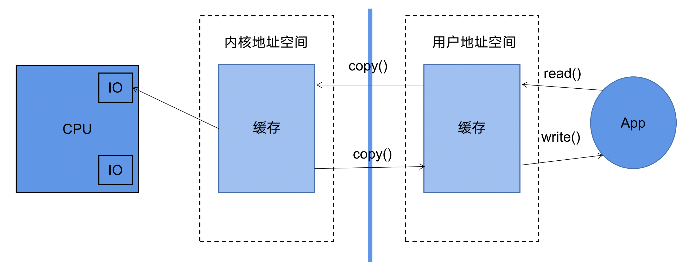
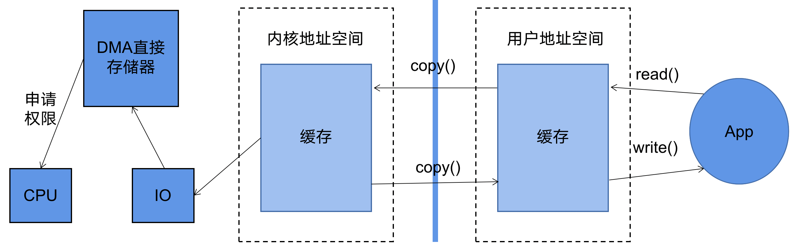
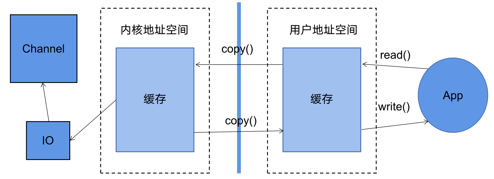

### 用户空间和内核空间

现在操作系统都是采用虚拟存储器，那么对32位操作系统而言，它的寻址空间（虚拟存储空间）为4G（2的32次方）。  操作系统的核心是内核，独立于普通的应用程序，可以访问受保护的内存空间，也有访问底层硬件设备的所有权限。为了保证用户进程不能直接操作内核（kernel），保证内核的安全，操作系统将虚拟空间划分为两部分，一部分为内核空间，一部分为用户空间。

针对linux操作系统而言，将最高的1G字节（从虚拟地址0xC0000000到0xFFFFFFFF），供内核使用，称为内核空间，而将较低的3G字节（从虚拟地址0x00000000到0xBFFFFFFF），供各个进程使用，称为用户空间。


## 普通文件拷贝

普通文件拷贝，有如下几个步骤



IO→文件缓冲区→应用缓冲区→socket缓存→IO，总共四次拷贝过程。文件缓冲区和socket缓冲区由内核控制。

造成速度较慢。


## 零拷贝

而零拷贝，则减去了其中可以优化的步骤，常用的有mmap和sendfile

### mmap




mmap，使用内存映射技术，将磁盘→文件缓冲区→应用缓冲区，优化为磁盘→内存映射文件→应用缓冲区，磁盘读取后写入到内存映射文件中，应用缓冲区从该文件中直接读取，省去了一次拷贝。总共只有三次拷贝。


### sendfile



sendfile，由于文件缓冲区和socket缓冲区都由内核控制，sendfile通过在这二者间传递文件描述符，将二者打通，形成

磁盘→【文件缓冲区←→socket缓冲区】→网卡

总共两次拷贝。需要注意的是，sendfile是一个从磁盘到网卡驱动的 IO 优化。反过来，网卡到磁盘，是没有这个 IO 优化的。


## Java中的零拷贝


### MappedByteBuffer

java nio提供的FileChannel提供了map()方法，该方法可以在一个打开的文件和MappedByteBuffer之间建立一个虚拟内存映射，MappedByteBuffer继承于ByteBuffer，类似于一个基于内存的缓冲区，只不过该对象的数据元素存储在磁盘的一个文件中

调用get()方法会从磁盘中获取数据，此数据反映该文件当前的内容，调用put()方法会更新磁盘上的文件，并且对文件做的修改对其他阅读者也是可见的；

```
FileChannel channel = new FileInputStream(file).getChannel();
MappedByteBuffer mappedByteBuffer = channel.map(FileChannel.MapMode.READ_ONLY, 0,len);
```


MappedByteBuffer的对象通过map()方式获取，该方法有三个参数，MapMode，Position和size：

MapMode：映射的模式，可选项包括：READ_ONLY，READ_WRITE，PRIVATE

Position：从哪个位置开始映射，字节数的位置

Size：从position开始向后多少个字节


MappedByteBuffer是一个抽象类，实际上通过内存映射的地址实例化出MappedByteBuffer，真正实例化出来的是DirectByteBuffer；


### transferTo & transferFrom 

FileChannel的transferTo() 和 transferFrom()是java的sendfile实现。 

transferTo是以源数据，拷贝到无数据的通道中

transferFrom是以空数据，从有数据的通道中读取数据

```
FileChannel in = FileChannel.open(Paths.get("/aaa.jpg"),StandardOpenOption.READ);
FileChannel out = FileChannel.open(Paths.get("/bbb.jpg"),StandardOpenOption.WRITE,StandardOpenOption.READ);

// 从源通道读取数据到输出通道
in.transferTo(0,in.size(),out);
// 或者输出通道从源通道读取数据
out.transferFrom(in,0,in.size);

in.close();
out.close();
```


- transferFrom

如果是源是 FileChannelImpl 类型， 就走 **mmap** ，循环映射 8MB 刷进磁盘。

如果源是 SocketChannelImpl 类型，就走**堆外内存**。简单来说，就是循环放进堆外内存，每次 8kb 刷进磁盘。注意：关于这个堆外内存，是用到了缓存池子的（堆外内存池化是常用优化手段），这个池子是个数组，长度是 16，使用 ThreadLocal 提升性能，每次获取，只要目标数组比池子中的 ByteBuffer 的 capacity 小即可使用，用完就还，如果满了，就调用 unsafe 释放。


- transfetTo

1. 如果 OS 支持 **send file**（windows 不支持），就执行 system call。
2. 如果 OS 不支持，就走 mmap。
3. 如果 mmap 失败，就走 堆外内存。


## 通道的发展

在早期的CPU中，IO的相关功能由CPU提供，如下图所示，但是后来就发现这样不太行。因为CPU的执行速度很快，而IO的速度比较慢，让CPU来管，容易拖慢CPU。




后来在硬件层面增加了DMA直接存储器，用以管理IO，直接存储器会跟CPU申请权限，在得到授权后建立DMA总线才能管理IO。CPU不直接管理IO，从而提高了CPU的利用率。传统的阻塞IO就是这种模式，如果应用程序频繁的IO，会导致不断的建立DMA总线，导致总线冲突，也会影响程序性能。




在后来，又将DMA直接存储器换成了通道（Channel），与DMA相比，**Channel是一个完全独立的处理器（附属与CPU，但相对独立），专门用于IO操作，拥有自己的一套指令集**。当进行IO请求时，通道直接处理，无需向CPU申请，所以处理IO速度更快

