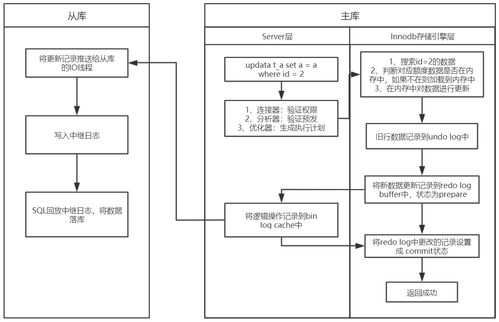
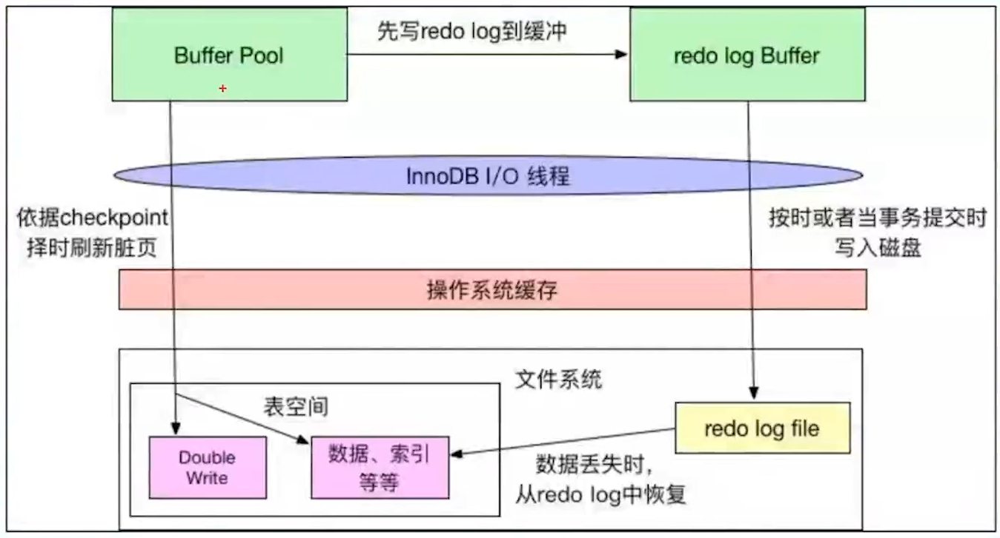
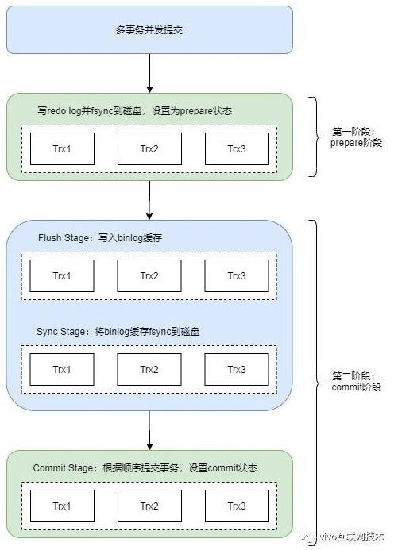
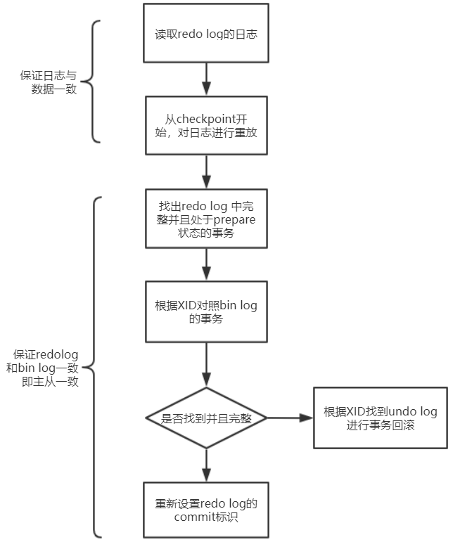

### 一条更新语句的执行过程





### WAL日志先行

为什么不直接更改磁盘中的数据，而要在内存中更改，然后还需要写日志，最后再落盘这么复杂？


MySQL更改数据的时候，之所以不直接写磁盘文件中的数据，最主要就是性能问题。因为直接写磁盘文件是随机写，开销大性能低，没办法满足MySQL的性能要求。所以才会设计成先在内存中对数据进行更改，再异步落盘。但是内存总是不可靠，万一断电重启，还没来得及落盘的内存数据就会丢失，所以还需要加上写日志这个步骤，万一断电重启，还能通过日志中的记录进行恢复。


写日志虽然也是写磁盘，但是它是顺序写，相比随机写开销更小，能提升语句执行的性能（针对顺序写为什么比随机写更快，可以比喻为你有一个本子，按照顺序一页一页写肯定比写一个字都要找到对应页写快得多）。


这个技术就是大多数存储系统基本都会用的WAL(Write Ahead Log)技术，也称为日志先行的技术，指的是对数据文件进行修改前，必须将修改先记录日志。保证了数据一致性和持久性，并且提升语句执行性能。


### 日志模块


#### redo log 

redo log是InnoDB存储引擎层的日志，又**被称为重写日志，用来记录事务操作的变化，记录的是数据修改之后的值，不管事务提交是否成功，都会被记录下来。**

作用：数据丢失时恢复

操作流程：buffer pool(内存) -> redo log buffer(内存) -> redo log file(硬盘)





redo log buffer 刷新到redo log file的策略，由**innodb_flush_log_at_trx_commit**控制
0：每隔固定时间，刷新到磁盘，性能最高
1：事务提交时刷新，默认
2：写入到操作系统缓存，由操作系统每隔固定时间刷新到磁盘


#### bin log 

bin log是mysql数据库service层的，是所有存储引擎共享的日志模块，它用于记录数据库执行的写入性操作，也就是在事务commit阶段进行记录，以二进制的形式保存于磁盘中。


bin log是逻辑日志，是sql的原始逻辑，并且由mysql数据库的service层执行，也就是说使用所有的存储引擎数据库都会记录bin log日志。

在实际场景中， bin log 的主要场景有两点，一点是主从复制，另一点是数据恢复

主从复制：在master端开启 bin log ，然后将 bin log 发送给各个slaver端，slaver端读取 bin log 日志，从而使得主从数据库中数据一致
数据恢复：通过 bin log 回滚到某个时间点的数据

如果只是单机的MySQl，因为redo log已经可以保证crash-safe的能力了，所以不要求回滚到某个时间点的话，可以关闭bin log。


bin log是以追加的方式进行写入的，可以通过 **max_binlog_size** 参数设置bin log文件大小，当文件大小达到某个值时，会生成新的文件来保存日志。

对于InnoDB引擎而言，在每次事务commit提交时才会记录bin log日志，此时记录仍然在内存中，那么什么时候存储到磁盘中呢？

mysql通过 **sync_binlog **参数控制bin log刷盘时机，取值范围：0～N：
0：不去强求，由系统自行判断何时写入磁盘；
1：每次事务commit的时候都要将bin log写入磁盘；
N：每N个事务commit，才会将bin log写入磁盘；

**sync_binlog **参数建议设置为1，这样每次事务commit时就会把bin log写入磁盘中，这样也可以保证mysql异常重启之后bin log日志不会丢失。


#### undo log

undo log 是回滚日志，主要两个作用，一个是回滚日志，另一个是多版本并发控制。是记录每条数据的所有版本，比如 update 语句，那么它首先会将该条记录的数据记录到undo log日志中，并且将最新版本的roll_pointer指针指向上一个版本，这样就可以形成当前记录的所有版本，这也是**MVCC**的实现机制。

实际上，在表中，每一行数据都有隐藏列，行Id、事务Id和回滚指针(指向上一条log )。


### 两阶段提交

redo log影响主库的数据，bin log影响从库的数据，所以redo log和bin log必须保持一致，才能保证主从数据一致。


- prepare阶段

将数据更新到undo log中后，再把数据写入到redo log buffer中，并异步落盘，此时状态为prepare。


- commit阶段

将redo log的数据更新到bin log cache中，并异步落盘，此时redo log的记录状态为commit。


为什么一定要用两阶段提交呢，如果不用两阶段提交会出现什么情况，比如先写redo log，再写binlog或者先写binlog，再写redo log不行吗？

以update T set c=c+1 where id=2这个例子，假设id=2这一条数据的c初始值为0。那么在redo log写完，binlog还没有写完的时候，MySQL进程异常重启。由于redo log已经写完了，系统重启后会通过redo log将数据恢复回来，所以恢复后这一行c的值是1。但是由于binlog没写完就crash了，这时候binlog里面就没有记录这个语句。因此，不管是现在的从库还是之后通过这份binlog还原临时库都没有这一次更新，c的值还是0，与原库的值不同。

如果先写binlog，再写redo log，中途系统crash了，也会导致主从不一致。


两阶段提交虽然能够保证单事务两个日志的内容一致，但在多事务的情况下，却不能保证两者的提交顺序一致，比如下面这个例子，假设现在有3个事务同时提交：

```
T1 (--prepare--binlog---------------------commit)
T2 (-----prepare-----binlog----commit)
T3 (--------prepare-------binlog------commit)
```


redo log prepare的顺序：T1 --》T2 --》T3
binlog的写入顺序：T1 --》 T2 --》T3
redo log commit的顺序：T2 --》 T3 --》T1

由于binlog写入的顺序和redo log提交结束的顺序不一致，导致binlog和redo log所记录的事务提交结束的顺序不一样，最终导致的结果就是主从数据不一致。


因此，在两阶段提交的流程基础上，还需要加一个锁来保证提交的原子性，从而保证多事务的情况下，两个日志的提交顺序一致。所以在早期的MySQL版本中，通过使用**prepare_commit_mutex**锁来保证事务提交的顺序，在一个事务获取到锁时才能进入prepare，一直到commit结束才能释放锁，下个事务才可以继续进行prepare操作。

通过加锁虽然完美地解决了顺序一致性的问题，但在并发量较大的时候，就会导致对锁的争用，性能不佳。除了锁的争用会影响到性能之外，还有一个对性能影响更大的点，就是每个事务提交都会进行两次fsync（写磁盘），一次是redo log落盘，另一次是binlog落盘。大家都知道，写磁盘是昂贵的操作，对于普通磁盘，每秒的QPS大概也就是几百。


### 组提交

在MySQL 5.6 就引入了binlog组提交，即BLGC（Binary Log Group Commit）。binlog组提交的基本思想是，引入队列机制保证InnoDB commit顺序与binlog落盘顺序一致，并将事务分组，组内的binlog刷盘动作交给一个事务进行，实现组提交目的。



- prepare阶段

持有prepare_commit_mutex，并且write/fsync redo log到磁盘，设置为prepared状态，完成后就释放prepare_commit_mutex，binlog不作任何操作。


- commit阶段，分成了三步，每一步都有一个专门的线程处理
  - Flush Stage（写入binlog缓存）
  
  	① 持有Lock_log mutex [leader持有，follower等待]
  
  	② 获取队列中的一组binlog(队列中的所有事务)
  
  	③ 写入binlog缓存
  
  
  - Sync Stage（将binlog落盘）
  
  	①释放Lock_log mutex，持有Lock_sync mutex[leader持有，follower等待]
  
  	②将一组binlog落盘（fsync动作，最耗时，假设sync_binlog为1）。
  
  
  - Commit Stage（InnoDB commit，清除undo信息）

		①释放Lock_sync mutex，持有Lock_commit mutex[leader持有，follower等待]

		② 遍历队列中的事务，逐一进行InnoDB commit

		③ 释放Lock_commit mutex


每个Stage都有自己的队列，队列中的第一个事务称为leader，其他事务称为follower，leader控制着follower的行为。每个队列各自有mutex保护，队列之间是顺序的。只有flush完成后，才能进入到sync阶段的队列中；sync完成后，才能进入到commit阶段的队列中。但是这三个阶段的作业是可以同时并发执行的，即当一组事务在进行commit阶段时，其他新事务可以进行flush阶段，实现了真正意义上的组提交，大幅度降低磁盘的IOPS消耗。

组提交虽然在每个队列中仍然保留了prepare_commit_mutex锁，但是锁的粒度变小了，变成了原来两阶段提交的1/4，所以锁的争用性也会大大降低；另外，组提交是批量刷盘，相比之前的单条记录都要刷盘，能大幅度降低磁盘的IO消耗。


### 数据恢复流程



简单说就是，奔溃重启后会检查redo log中是完整并且处于prepare状态的事务，然后根据XID（事务ID），从binlog中找到对应的事务，如果找不到，则回滚；找到并且事务完整则重新commit redo log，完成事务的提交。


### 应用场景

redo log ：master数据恢复

bin log：主从复制，主从数据恢复，数据备份，**数据摄取**

undo log：多版本并发控制
