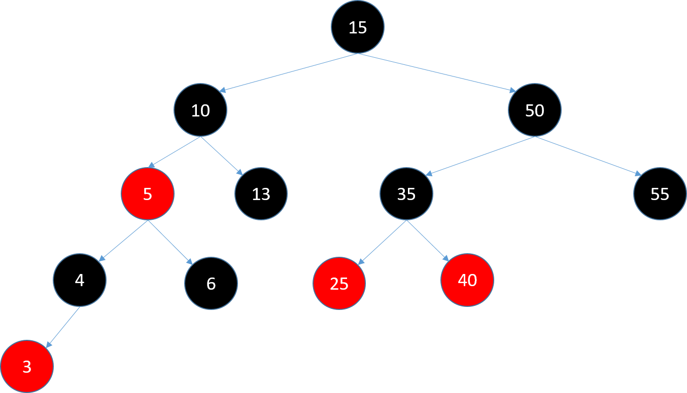
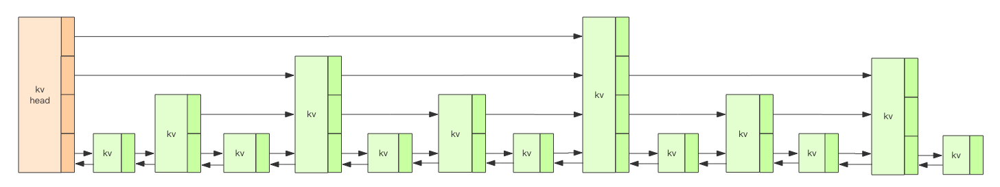
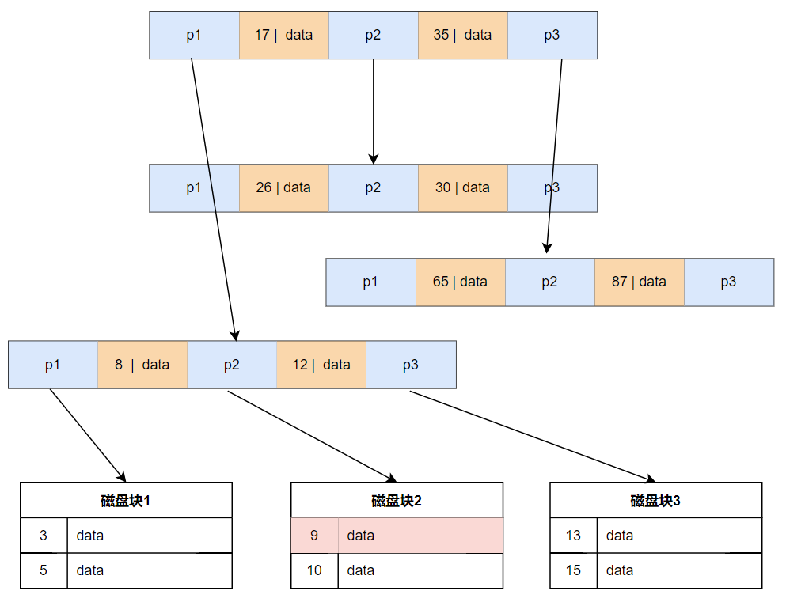
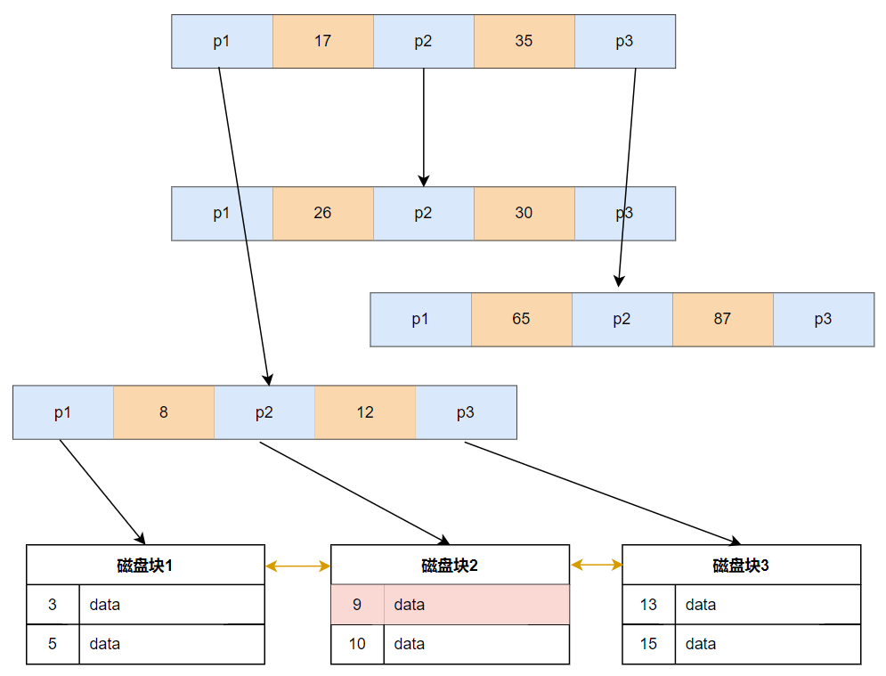
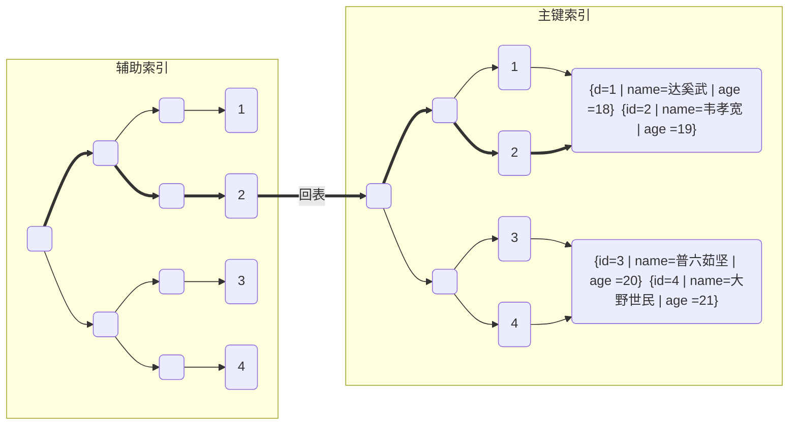
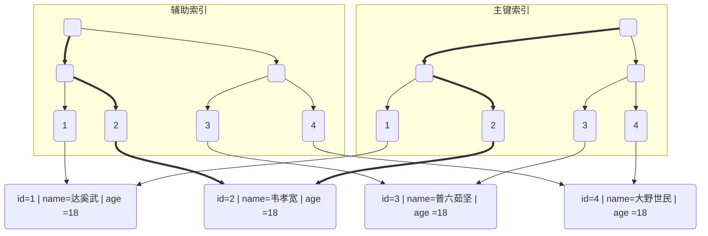
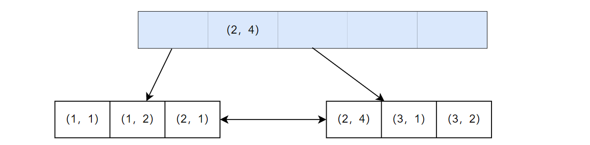

### 为什么是B+Tree？

在日常开发中，大家都知道MySQL和PGSQL使用的索引主要是B+Tree，但是为什么是B+Tree呢？出于什么样的考量选择了这种数据结构？

想要回答这个问题，我们需要清楚，有哪些适合做索引的数据结构，有哪些不适合做索引的数据结构。

索引需要能够能够快速定位到数据，而能够快速定位数据的数据结构有，数组、链表、平衡二叉树、跳表、B Tree、B+Tree、散列函数... ... 而不适合的数据结构，例如，BitMap、布隆过滤器等。

**数组**：由于数据库存储的数据可能非常大，相对应的索引规模也会很大，数组的长度相对固定，在内存中也不一定能够开辟对应的空间。所以数组仅能适用于小批量数据的索引。

**链表**：数据库存储的数据，大部分的相关操作都是读操作，而链表在数据查找方面劣势十分明显。一次读操作，可能会引起大范围的扫盘。

**平衡二叉树**：平衡二叉树能够存储的数据量非常大，30层的树高能够存储上亿的数据。数据查找的效率非常高。
  


**跳表**：与平衡二叉树类似，但实现更为简单。需要额外建立跳跃点，占用的空间会比平衡二叉树更多。




**Hash散列函数**：非常优秀的时间复杂度，但不支持范围查询。


### 索引结构的应用

| 索引结构 | 应用                     | 作用                                                         |
| -------- | ------------------------ | ------------------------------------------------------------ |
| Hash     | Redis，MySQL             | key-value                                                    |
| 双向链表 | Redis                    | List数据类型                                                 |
| 跳表     | Redis，Kafka             | Redis：ZSet<br />Kafka：保存各个日志分段，每个日志分段的 baseOffset 作为 key（稀疏索引） |
| B+Tree   | MySQL，PGSQL等磁盘数据库 | 主要的索引形式                                               |
|          |                          |                                                              |


### 存储介质的局限

假设磁盘存储的数据有100G，以目前最先进的PCIE 4.0协议的NVME固态硬盘进行存储，并且组建Raid阵列，顺序读写最快是14G/s左右，随机读写为80M/s左右。随机读写的瓶颈非常明显，而即使是顺序读写，全盘扫描一遍数据最快也要7s。

如果多个请求同时进行操作的话，速度会更加缓慢。所以在磁盘上读写数据，是一项非常消耗资源的操作，在考虑使用索引时，应该尽可能的减少磁盘操作，扫盘范围。


二叉树用来在存储大量数据时，树的高度必定会变得很高，每向下查一次，都相当于进行一次磁盘操作。而跳表虽然可以通过限制层级来减少高度，但是在大数据量的场景下，最底层链表的规模也会变得很大。


### B Tree的数据结构



- 查找过程

查找数据项 9

1、首先把根节点的磁盘块加载到内存，此时发生第一次 IO。在内存中用二分查找确定 9小于17，找到p1的磁盘块的指针向下查找

2、将指针指向的磁盘块加载到内存，发生第二次 IO，9 在 8 和 12 之间，找到p2指针向下查找

3、将指针指向的磁盘块加载到内存，发生第三次 IO，并在内存中做二分查找找到 9，结束查询


- 优点

1、一次IO将多个指针加载到内存中，比平衡二叉树IO更优秀

2、非叶子节点存在数据，若数据直接命中非叶子节点的数据，则直接返回


- 缺点

1、非叶子节点存指针、也存在数据，导致一次性加载到内存中的指针比较少

2、范围查询只能通过扫描非叶子节点进行

3、在叶子节点的中间新增或者删除数据，会导致节点重排序（**叶裂**）


### B+Tree的数据结构



- 优点

1、非叶子节点没有数据，**一次IO能够加载更多的指针，降低磁盘IO**

2、**磁盘块有序存储，双指针，范围查询更友好**


- 缺点

1、在叶子间增删节点容易出现叶裂。所以建议使用**递增主键**，使每次新增数据都在最右边叶子节点进行，并且使用**逻辑删除**。


### 聚簇索引和非聚簇索引

#### 聚簇索引

**聚簇索引**严格意义上来说，不是一种索引类型，而是一种数据存储分布的方式。特点是在主键索引树上，叶子节点既存储索引也存储数据。

目前仅有innodb存储引擎支持，而在Myisam中，则不支持聚簇分布。



通过辅助索引（二级索引）查找数据时，若查找的数据在辅助索引中，则直接返回，称之为**覆盖索引**，如索引字段`a`，`select  id , a  from t1`，id和a字段在辅助索引中能够找到；

若查找的数据不在辅助索引中，如查找`c`字段，则需要到聚簇索引树上进行查找，称之为**回表**。


#### 非聚簇索引




主键不一定是聚簇索引。**在Myisam中，主键索引的寻址方式与辅助索引没有区别，所以不存在回表，查找的速度可能优于聚簇索引**，也就是常说的Myisam中，部分场景的查询速度优于Innodb。


### 为什么索引会失效？

#### 单列索引失效

索引都是排过序的数据，查找的时候不能按照排序的方式进行，那么索引就失效了呗。

相关的例子如：

1、like以%开头

2、类型转换或者索引列进行了函数转换函数

3、如果mysql觉得全表扫描更快时（数据少，回表数据规模大）


虚假信息：

1、索引列有运算。不一定，若index_x = (1+1)，常量的计算SQL优化器会优化掉


#### 组合索引失效



这里主要探讨除了第一列之外的索引失效问题，第一列就失效的，参考单列索引失效的情况。

第二列的索引，只在第一列相等的情况下才有序排列。在第一列不相等的情况下，他第二列的也是无序的。也就是说，当第二列越过第一列的限制，进行查找，就很有可能会全表扫描，如：

```sql
select a,b from t_1 where a > 1 or b < 2
```


### 小题目

表有id、a、b、c四个字段，并且有索引`idx_a_b_c`，问：select * from c = 1，走不走索引？


如果再加一个字段d，问select * from c = 1走不走索引？


答案：走索引

解析：数据在二级索引上都有，直接在二级索引树上全表扫一遍。


答案：不走索引

解析：如果*的数据只有a、b、c、id，那么直接走二级索引返回，无需进行回表。新增一个字段d后，idx_a_b_c中没有d的数据，需要进行回表。万一需要回表1W次，将非常耗时，所以MySQL直接从主键索引树上进行查找。


索引”失效“：

1、直接失效，在explain中可以看到没有走索引

2、走索引，但仍然全表扫描
