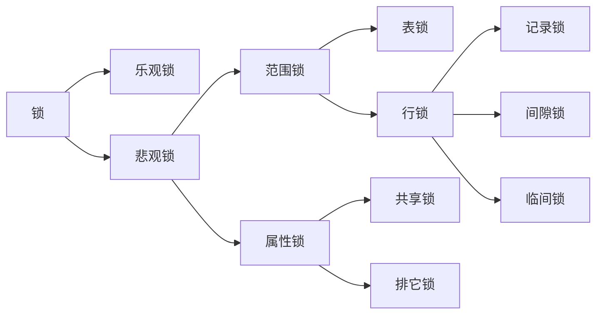

# 乐观锁

乐观锁严格来说，并不是一种锁。采用CAS，通过版本号等字段进行操作，每次对数据进行更新，则版本号则相应的进行更新。若版本号已被修改，则更新失败。

如：

```
-- 先查询对应的版本
select version from table_demo where id = 1 
-- 若查出来version = 2
update xxx set name = '',version = version + 1 from table_demo where id = 1 and version = 2
```

乐观锁的字段，应该采用唯一的递增值，其他业务字段，可能会导致ABA问题


# 悲观锁

对数据操作时，进行访问控制，确保只有一个请求对数据进行访问，如：

```
select * from table_demo where id = 1 for update
```


## 范围锁

### 表锁

表锁就是一锁锁一整张表，在表被锁定期间，其他事务不能对该表进行操作，必须等当前表的锁被释放后才能进行操作。

表锁响应的是非索引字段，即全表扫描，全表扫描时锁定整张表，sql语句可以通过执行计划看出扫描了多少条记录。

表锁的锁冲突几率特别高，表锁不会出现死锁的情况。


### 行锁

索引失效，会导致行锁升级为表锁。

SQL基于索引查询，如命中两条记录。此时行锁一锁就锁定两条记录，当其他事务访问数据库同一张表时，被锁定的记录不能被访问，其他的记录都可以访问到。

锁冲突概率低，并发性高，但是会有死锁的情况出现。


#### 记录锁

记录锁的出现条件必须是精准命中索引并且索引是唯一索引，如主键id


#### 间隙锁

无匹配记录，锁定查询区间内的记录。

**间隙锁又称之为区间锁**，每次锁定都是锁定一个区间。

间隙锁的触发条件必然是命中索引的，当我们查询数据用**范围查询**而不是**相等条件**查询时，查询条件命中索引，并且**没有查询到符合条件的记录**，此时就会将查询条件中的范围数据进行锁定

间隙锁只会出现在可重复读的事务隔离级别中，**MySQL5.7默认就是可重复读**


#### 临间锁

MySQL默认的行锁，区间有匹配记录，且后匹配值不存在，锁到下一个区间

间隙锁的触发条件是命中索引，范围查询没有匹配到相关记录。而临间锁恰好相反，临键锁的触发条件也是查询条件命中索引，不过，**临间锁有匹配到数据库记录**

临间锁锁定区间和查询范围后匹配值很重要，**如果后匹配值存在，则只锁定查询区间，否则锁定查询区间和后匹配值与它的下一个值的区间**

如数据库中有1、5、7，查（1，8]时，则锁定的范围为(1，+∞)

若查询(1，7]时，锁定的范围也为(1，7]


## 属性锁

### 共享锁

简称读锁，lock in share mode

当事务对数据加上读锁后，其他事务只能**对该数据加读锁，不能做任何修改操作**，也就是不能添加写锁。只有当数据上的**读锁被释放后，其他事务才能对其添加写锁**。

共享锁主要是为了支持并发的读取数据而出现的，读取数据时，不允许其他事务对当前数据进行修改操作，从而避免”不可重读”的问题的出现。

```
select ... lock in share mode
```


### 排他锁

简称写锁

当事务对数据**加上写锁后，其他事务既不能对该数据添加读写**，也不能对该数据添加写锁，写锁与其他锁都是互斥的。只有当前数据写锁被释放后，其他事务才能对其添加写锁或者是读锁。

写锁主要是为了解决在修改数据时，不允许其他事务对当前数据进行修改和读取操作，从而可以有效避免”脏读”问题的产生。


## 状态锁


# 死锁


## 原因

session之间加锁冲突


## 案例1

两个session分别通过一个sql持有一把锁，然后互相访问对方加锁的数据产生死锁

| session 1                                     | session 2                        |
| --------------------------------------------- | -------------------------------- |
| begin transaction                             | begin transaction                |
| select * from t1 where **id = 1** for update; | delete from t1 where **id = 5**; |
| update t1 set name = 'aaa' where **id = 5**;  | delete from t1 where **id = 1**; |
| commit                                        | commit                           |


## 案例2

两个单条的sql语句涉及到的加锁数据相同，但是加锁顺序不同，导致了死锁


数据

| id   | name    | time    |
| ---- | ------- | ------- |
| 1    | **aaa** | **100** |
| 4    | bbb     | 20      |
| 6    | **aaa** | **10**  |


死锁过程

| session 1                                      | session 2                                  |
| ---------------------------------------------- | ------------------------------------------ |
| begin transaction                              | begin transaction                          |
| update t2 set name = 'ccc' where name = 'aaa'; | select * from t2 where time > 5 for update |
| commit                                         | commit                                     |

session对行加锁顺序不同，s1可能完成了对id=1的加锁，s2可能完成了对id=6的加锁，两个session继续加锁时就失败了。