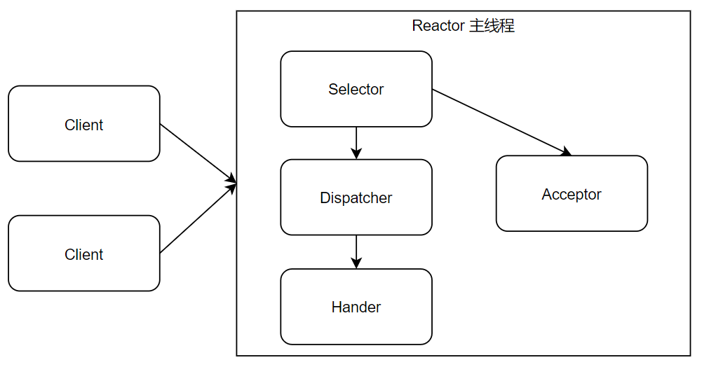
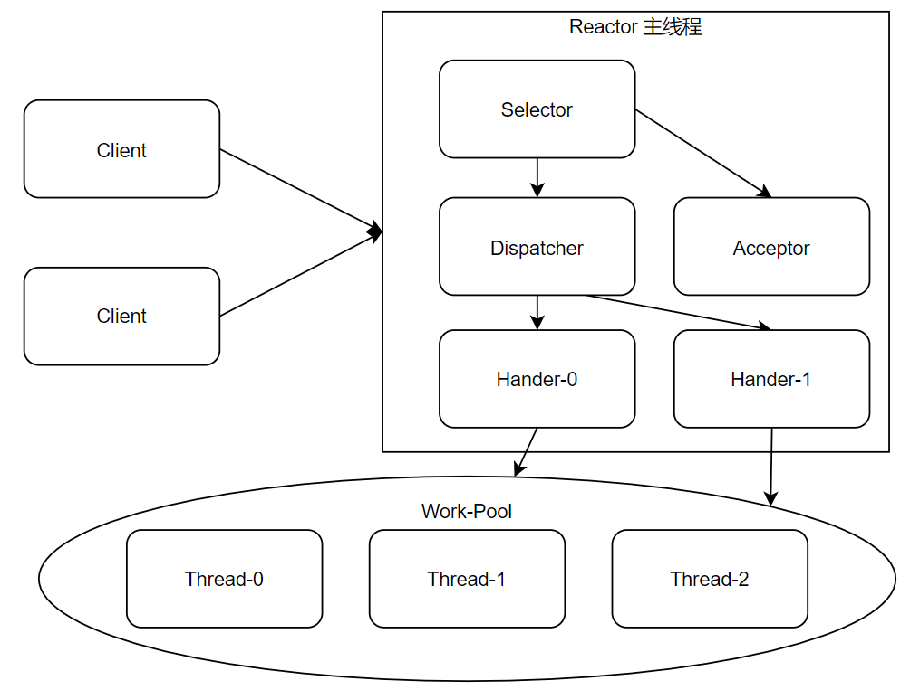
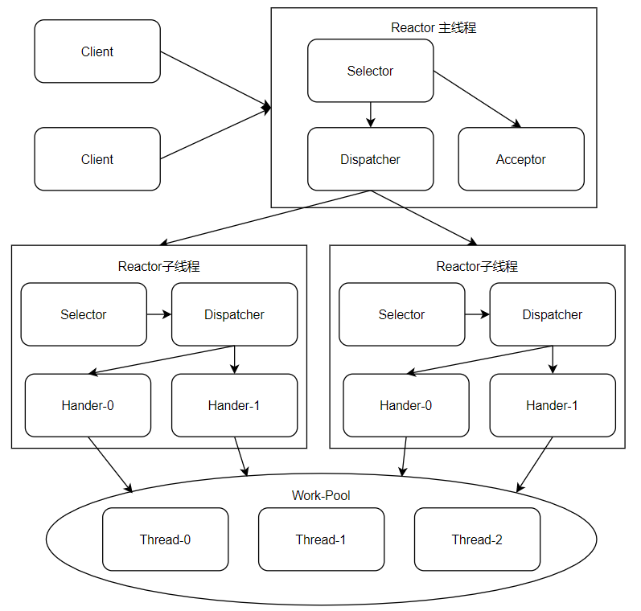

Reactor响应器，根据**响应器的数量**和**工作线程数量**的不同，常见有3种实现

Reactor：负责响应IO事件，当检测到一个新的事件，将其发送给相应的Handler去处理；新的事件包含连接建立就绪、读就绪、写就绪等。

- Selector，监控客户端请求事件，收到事件后通过Acceptor进行连接的建立，或者通过Dispatcher 进行分发
- Acceptor，如果客户端是建立连接的请求，则由 Acceptor 通过 Accept 处理连接请求，然后创建一个 Handler 对象处理连接完成后的后续业务处理。
- Dispatcher，将客户端的请求分发给Hander
- Hander，处理客户端具体的业务请求

### 单Reactor 单线程

优点：模型简单，没有多线程、线程调度、竞争等问题。

缺点：

- 只有一个线程，无法发挥多核CPU的性能。

- Hander在处理业务时，程序将无法处理客户端的连接事件，很容易形成性能瓶颈。
- Reactor和Hander在运行时，如果发生异常、进入死循环等，很容易造成整个服务不可用。

适用场景：客户端数量有限，业务处理非常迅速，如Redis业务处理的时间复杂度为O(1)的情况。

### 单Reactor 多线程

与单线程Reactor模式相比，通过创建多个Handler进行对事件进行响应，通过业务线程池，进行具体的业务处理。

优点：可以较为充分的利用多核CPU，工作线程不会形成瓶颈。

缺点：单Reactor在客户端较多时，容易形成性能瓶颈。

适用场景：客户端数量不是很多，业务处理时间较长的应用。

### 主从Reactor 多线程

在业务通过线程池进行处理后，在业务处理方面，就不大可能形成瓶颈，大不了线程池调大一点。

而对网络IO的响应，则仍然可能存在瓶颈，尤其是并发比较高的时候。

所以，主从Reactor模式，对比【单Reactor 多线程】模式，主要的区别是，主Reactor线程只负责客户端连接的建立，这一步很少会出现瓶颈，而将客户端的其他事件，则交由多个从Reactor线程进行处理。