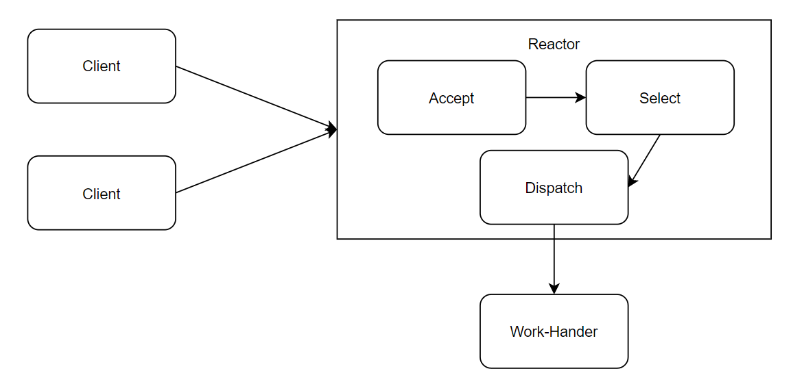
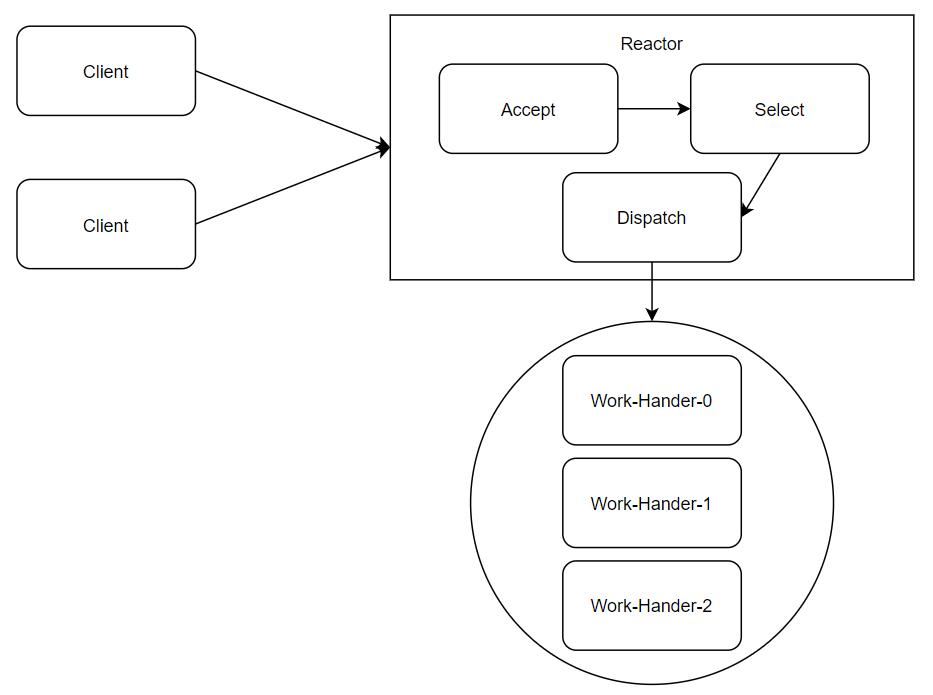
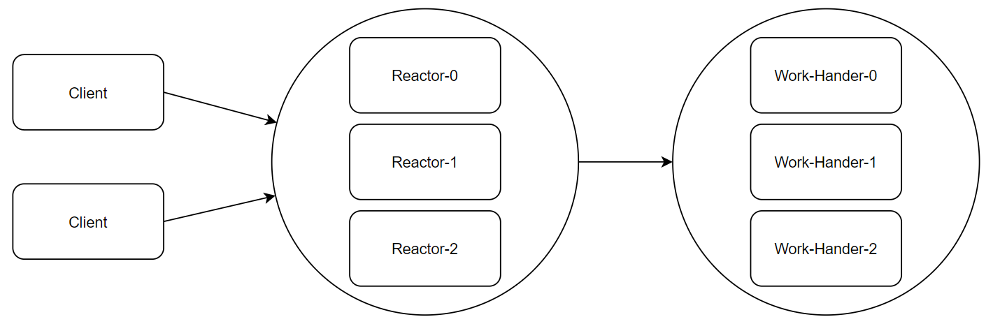

Reactor响应器，根据**响应器的数量**和**工作线程数量**的不同，常见有3种实现

Reactor：在一个单独的线程运行，负责监听和分发事件，分发给IO工作线程进行处理。

Hander：具体处理IO事件的线程。

### 单Reactor 单线程

优点：模型简单，没有多线程、线程调度、竞争等问题。

缺点：

- 只有一个线程，无法发挥多核CPU的性能。

- Hander在处理业务时，程序将无法处理客户端的连接事件，很容易形成性能瓶颈。
- Reactor和Hander在运行时，如果发生异常、进入死循环等，很容易造成整个服务不可用。

适用场景：客户端数量有限，业务处理非常迅速，如Redis业务处理的时间复杂度为O(1)的情况。

### 单Reactor 多线程

优点：可以较为充分的利用多核CPU，工作线程不会形成瓶颈。

缺点：单Reactor在客户端较多时，容易形成性能瓶颈。

适用场景：客户端数量不是很多，业务处理时间较长的应用。

### 主从Reactor 多线程

