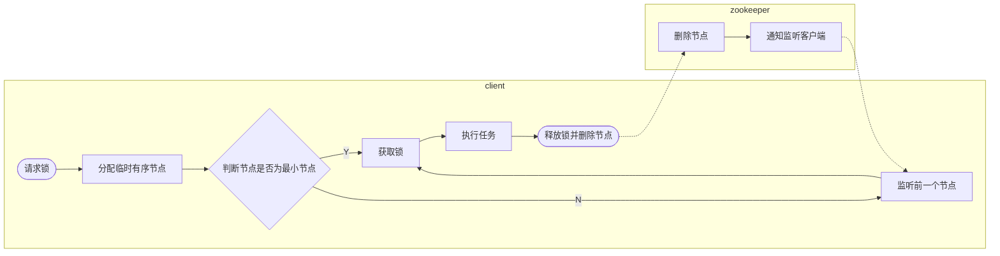
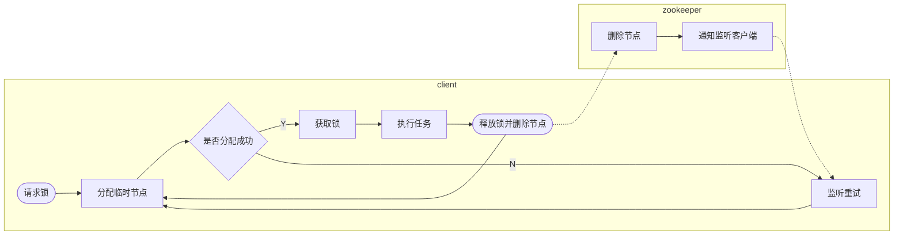

- 有序节点，公平锁

```mermaid
graph LR
subgraph client
start([请求锁])-->分配临时有序节点
分配临时有序节点-->if{判断节点是否为最小节点}
if--Y-->获取锁
获取锁-->执行任务
执行任务-->stop([释放锁并删除节点])
if--N-->监听前一个节点
监听前一个节点-->获取锁

end

subgraph zookeeper
stop-.->删除节点
删除节点-->通知监听客户端
通知监听客户端-.->监听前一个节点
end

```

- 临时节点，非公平锁

```mermaid
graph LR
subgraph client
start([请求锁])-->分配临时节点
分配临时节点-->if{是否分配成功}
if--Y-->获取锁
获取锁-->执行任务
执行任务-->stop([释放锁并删除节点])
if--N-->监听重试
监听重试-->分配临时节点
stop-->分配临时节点
end
subgraph zookeeper
stop-.->删除节点
删除节点-->通知监听客户端
通知监听客户端-.->监听重试
end
```

