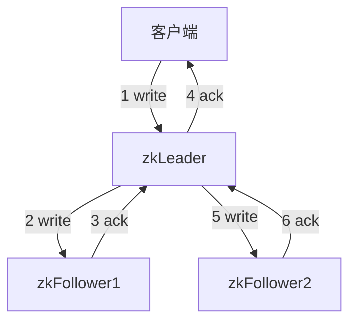
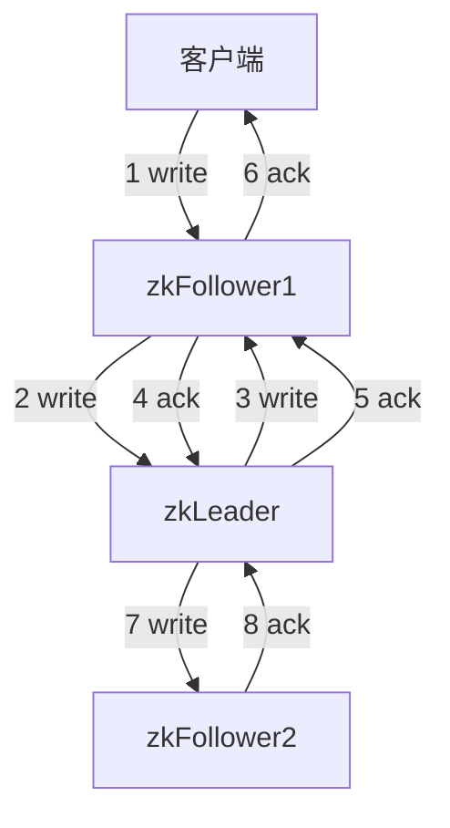

客户端直接连接zk-leader

```mermaid
graph
	c[客户端]
	zkf1[zkFollower1]
   zkf2[zkFollower2]
   zkl[zkLeader]
   
   c--1 write-->zkl
   zkl--2 write-->zkf1
   zkf1--3 ack -->zkl
   zkl--4 ack-->c
   zkl--5 write -->zkf2
   zkf2--6 ack--> zkl
```

客户端直接连接zk-follower

```mermaid
graph 
    c[客户端]
    zkf1[zkFollower1]
    zkf2[zkFollower2]
    zkl[zkLeader]
   
   c--1 write-->zkf1
   zkf1--2 write-->zkl
   zkl--3 write-->zkf1
   zkf1--4 ack -->zkl
   zkl--5 ack -->zkf1
   zkf1--6 ack -->c
   zkl-- 7 write-->zkf2
   zkf2--8 ack -->zkl
```

与其他节点同步，仍由leader节点进行