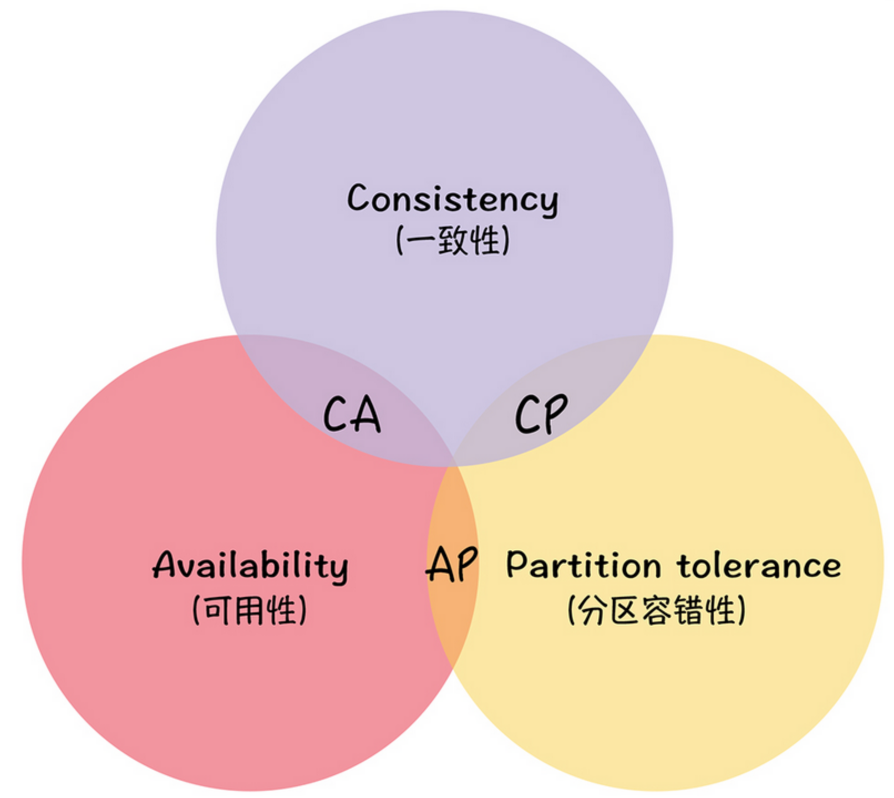
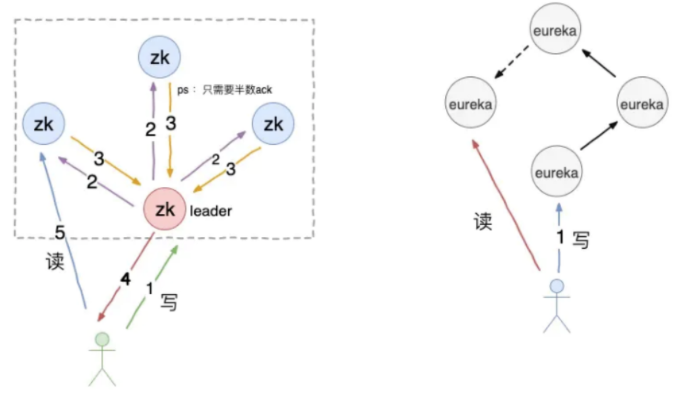
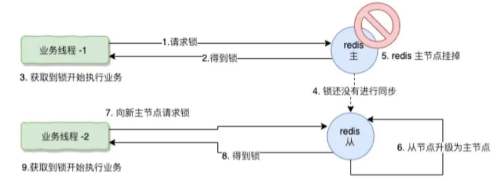
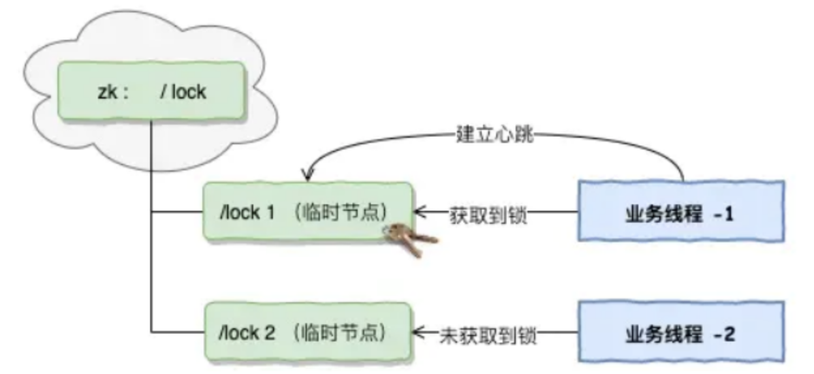
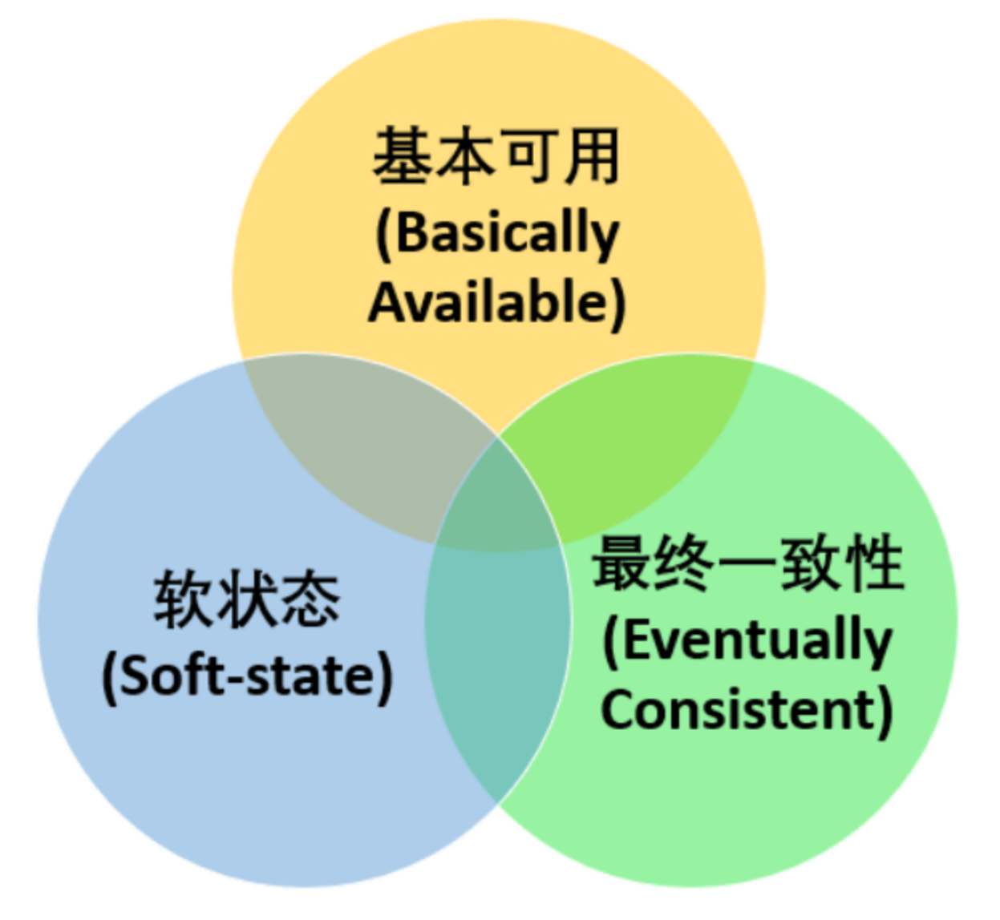

在一个分布式系统中，当涉及到读写操作时，只能保证**一致性（Consistence）、可用性(Availability）、分区容错性（Partition Tolerance）**三者中的两个，另外一个必须被牺牲。缩放复制

一致性：写操作之后进行读操作无论在哪个节点都需要能返回写操作的值。 

可用性：非故障的节点在合理的时间内响应。

 分区容错性：当网络出现分区后，系统依然能够继续履行职责。

分布式系统理论上不可能选择 CA，只能选择 CP 或者 AP，因为在分布式的环境下，网络无法做到 100% 可靠，有可能部分节点出现故障，因此 P 是一个必须选项。

**如果选择了 CA，若发生了分区现象，为了保证 C，系统需要禁止写入，此时就与 A 发生了冲突。**

**如果选择了 CA，若发生了分区现象，为了保证 A，则会出现正常的分区可以写入数据，有故障的分区无法写入数据，此时就与 C 冲突了。**

### AP & CP选型

#### 注册中心

注册中心解决两个问题：服务注册、服务发现

服务注册：实例将自身服务信息注册到注册中心，这部分信息包括服务的主机 IP 和服务的 Port，以及暴露服务自身状态和访问协议信息等。 服务发现：实例请求注册中心所依赖的服务信息，服务实例通过注册中心，获取到注册到其中的服务实例的信息，通过这些信息去请求它们提供的服务。

- Zookeeper CP 

Zookeeper 保证 CP，即任何时刻对 Zookeeper 的访问请求能得到一致性的数据结果，同时系统对网络分割具备容错性，但是它不能保证每次服务的可用性从实际情况来分析，在使用 Zookeeper 获取服务列表时，如果 Zookeeper 正在选举或者 Zookeeper 集群中半数以上的机器不可用，那么将无法获取数据。所以说，Zookeeper 不能保证服务可用

- Eureka AP

Eureka 保证 AP，Eureka 在设计时优先保证可用性，每一个节点都是平等的，一部分节点挂掉不会影响到正常节点的工作，不会出现类似 ZK 的选举 Leader 的过程，客户端发现向某个节点注册或连接失败，会自动切换到其他的节点，只要有一台 Eureka 存在，就可以保证整个服务处在可用状态，只不过有可能这个服务上的信息并不是最新的信息。

- Eureka和Zookeeper对比

Eureka 的创建初心就是为一个注册中心，但是 zk 更多是作为分布式协调服务的存在，只不过因为它的特性被 Dubbo 赋予了注册中心，它的职责更多是保证数据（配置数据，状态数据）在管辖下的所有服务之间保持一致，所有这个就不难理解为何 zk 被设计成 CP 而不是 AP，zk 最核心的算法 ZAB，就是为了解决分布式系统下数据在多个服务之间一致同步的问题。

更深层的原因，Zookeeper 是按照 CP 原则构建，也就是说它必须保持每一个节点的数据都保持一致，如果 Zookeeper 下节点断开或者集群中出现网络分割（例如交换机的子网间不能互访），那么 zk 会将它们从自己的管理范围中剔除，外界不能访问这些节点，即使这些节点是健康的可以提供正常的服务，所以导致这些节点请求都会丢失。

而 Eureka 则完全没有这方面的顾虑，它的节点都是相对独立，不需要考虑数据一致性的问题，这个应该是 Eureka 的诞生就是为了注册中心而设计，相对 zk 来说剔除了 leader 节点选取和事务日志极致，这样更有利于维护和保证 Eureka 在运行的健壮性。

数据不一致性在注册服务中会给 Eureka 带来什么问题，无非就是某一个节点被注册的服务多，某个节点注册的服务少，在某一个瞬间可能导致某些 ip 节点被调用数少，某些 ip 节点调用数少的问题。也有可能存在一些本应该被删除而没被删除的脏数据。

对于服务注册来说，针对同一个服务，即使注册中心的不同节点保存的服务注册信息不相同，也并不会造成灾难性的后果，对于服务消费者来说，能消费才是最重要的，就算拿到的数据不是最新的数据，消费者本身也可以进行尝试失败重试。总比为了追求数据的一致性而获取不到实例信息整个服务不可用要好。

所以，对于服务注册来说，可用性比数据一致性更加的重要，选择 AP。

#### 分布式锁

- 数据库实现

利用表的 UNIQUE KEY 作为唯一主键，当进行上锁时进行 insert 动作，数据库成功录入则以为上锁成功，当数据库报出 Duplicate entry 则表示无法获取该锁。

不过这种方式对于单主却无法自动切换主从的 MySQL 来说，基本就无法实现 P 分区容错性。可以说这种方式强依赖于数据库的可用性，数据库写操作是一个单点，一旦数据库挂掉，就导致锁的不可用。这种方式基本不在 CAP 的一个讨论范围。

- Redis实现

就是通过 setnx 获取锁，用 expire 给锁加个过期时间，防止锁忘记释放

为了解决数据库锁的无主从切换的问题，可以选择 redis 集群，或者是 sentinel 哨兵模式，实现主从故障转移，当 master 节点出现故障，哨兵会从 slave 中选取节点，重新变成新的 master 节点

哨兵模式故障转移是由 sentinel 集群进行监控判断，当 masert 出现异常即复制中止，重新推选新 slave 成为 master，sentinel 在重新进行选举并不在意主从数据是否复制完毕具备一致性。

所以 redis 的复制模式是属于 AP 的模式。保证可用性，在主从复制中“主”有数据，但是可能“从”还没有数据，这个时候，一旦主挂掉或者网络抖动等各种原因，可能会切换到“从”节点，这个时候可能会导致两个业务线程同时获取得两把锁缩放复制

上述的问题其实并不是 redis 的缺陷，只是 redis 采用了 AP 模型，它本身无法确保我们对一致性的要求。redis 官方推荐 redlock 算法来保证，问题是 redlock 至少需要三个 redis 主从实例来实现，维护成本比较高，相当于 redlock 使用三个 redis 集群实现了自己的另一套一致性算法，比较繁琐。

**需要注意，redlock 算法也并不一定可靠，它由于依赖系统时钟导致破坏了锁服务本身的安全性。**

所以，如果需要使用redis的分布式锁功能，先要自己确认我们的场景是适合 AP 还是 CP ， 如果在社交发帖等场景下，我们并没有非常强的事务一致性问题，redis 提供给我们高性能的 AP 模型是非常适合的，但如果是交易类型，对数据一致性非常敏感的场景，我们可能要寻在一种更加适合的 CP 模型。

- Zookeeper实现

首先 zk 的模式是 CP 模型，也就是说，当 zk 锁提供给我们进行访问的时候，在 zk 集群中能确保这把锁在 zk 的每一个节点都存在（这个实际上是 zk 的 leader 通过二阶段提交写请求来保证的，这个也是 zk 的集群规模大了的一个瓶颈点）。

zk可以使用有序节点和临时节点两种方式实现分布式锁，当节点发生变化时，zk会通知客户端。

有序节点：当在一个父目录下创建有序节点，节点会按照严格的先后顺序创建出子节点 lock1、lock2、lock3 以此类推，有序节点能严格保证各个自节点按照排序命名生成。

 临时节点：客户端建立了一个临时节点，在客户端的会话结束或会话超时，zookepper 会自动删除该节点。

zk 官方提供的客户端并不支持分布式锁，我们需要用代码去利用 zk 的特性进行实现。	

- 对比

例如 redis 的 AP 模型会限制很多使用场景，但它却拥有了几者中最高的性能，zookeeper 的分布式锁要比 redis 可靠很多，但他繁琐的实现机制导致了它的性能不如 redis，而且 zk 会随着集群的扩大而性能更加下降。 根据业务的不同，确认需要的分布式锁，一般应该选择CP（但项目依赖redis比较多，所以AP也很常见）。

### BASE

BASE 理论是对 CAP 的延伸和补充，是对 CAP 中的 AP 方案的一个补充，即在选择 AP 方案的情况下，如何更好的最终达到 C。

BASE 是**基本可用（Basically Available），柔性状态（Soft-state），最终一致性（Eventually Consistent）**三个短语的缩写，核心的思想是即使无法做到强一致性，但应用可以采用适合的方式达到最终一致性。

BASE 理论延伸的地方就是：**在选择 AP 方案的基础上，只是在系统发生分区的时候放弃一致性，而不是永远放弃一致性。在分区故障恢复后，系统应该达到最终一致性。**