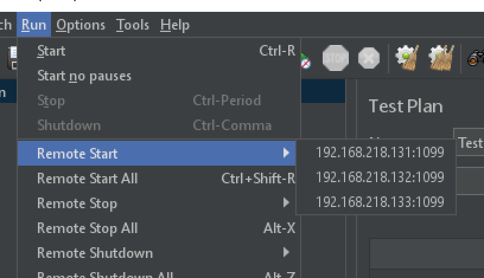

### 创建压测集群

关闭防火墙

```
systemctl stop firewalld.service
systemctl disable firewalld.service
```


下载jmeter，解压缩

```
# 下载
wget https://mirrors.tuna.tsinghua.edu.cn/apache//jmeter/binaries/apache-jmeter-5.4.1.zip
# 解压
unzip apache-jmeter-5.4.1.zip
# 进入bin目录
cd ./apache-jmeter-5.4.1/bin
```


修改配置文件jmeter.properties，关闭ssl认证

```
# 打开下列配置，并修改为true
server.rmi.ssl.disable=true
```


服务端启动

```
# 授权 
chmod 777 jmeter jmeter-server
# 启动
./jmeter-server.sh -Djava.rmi.server.hostname=本机ip
```


期待出现

```
Created remote object: UnicastServerRef2 [liveRef: [endpoint:[192.168.218.132:43617](local),objID:[7a2d79e5:17a6f2d352e:-7fff, -8079254681895374274]]]
```


### 客户端启动

下载jmeter后，修改配置文件jmeter.properties

```
# 打开下列配置，并修改为true
server.rmi.ssl.disable=true
# 输入集群中机器的ip和端口，以下仅为示例
remote_hosts=192.168.218.131:1099,192.168.218.132:1099,192.168.218.133:1099
```


jmeter正常启动，会在run中出现压测机器的地址

