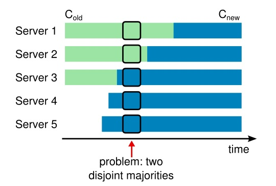
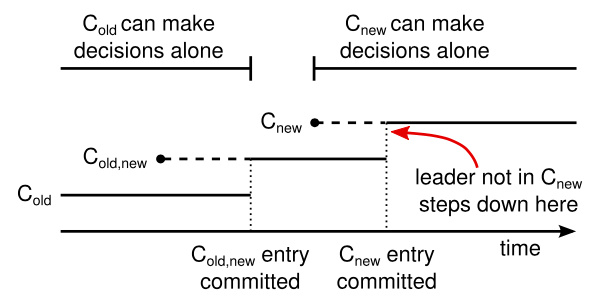

Raft 算法是斯坦福大学 2017 年提出，论文名称《In Search of an Understandable Consensus  Algorithm》，望文生义，该算法的目的是易于理解。Raft 这一名字来源于"Reliable, Replicated,  Redundant, And Fault-Tolerant"（“可靠、可复制、可冗余、可容错”）的首字母缩写。

Raft 使用了分治思想把算法流程分为三个子问题：选举（Leader election）、日志复制（Log replication）、安全性（Safety）三个子问题。

- **Leader 选举**：当前 leader 宕机或集群初始化的情况下，新 leader 被选举出来。
- **日志复制**：leader 必须能够从客户端接收请求，然后将它们复制给其他机器，强制它们与自己的数据一致。
- **安全性**：如何保证上述选举和日志复制的安全，使系统满足最终一致性。

### 一、相关概念

在 Raft 中，节点被分为 Leader Follower Cabdidate 三种角色：

- **Leader**：处理与客户端的交互和与 follower 的日志复制等，一般只有一个 Leader；
- **Follower**：被动学习 Leader 的日志同步，同时也会在 leader 超时后转变为 Candidate 参与竞选；
- **Candidate**：在竞选期间参与竞选；

- **Term**：是有连续单调递增的编号，每个 term 开始于选举阶段，一般由选举阶段和领导阶段组成。

- **随机超时时间**：Follower 节点每次收到 Leader 的心跳请求后，会设置一个随机的，区间位于[150ms, 300ms)的超时时间。如果超过超时时间，还没有收到 Leader 的下一条请求，则认为 Leader 过期/故障了。

- **心跳续命**：Leader 在当选期间，会以一定时间间隔向其他节点发送心跳请求，以维护自己的 Leader 地位。

### 二、领导选举

当某个 follower 节点在超时时间内未收到 Leader 的请求，它则认为当前 Leader 宕机或者当前无 Leader，将发起选举， 既从一个 Follower 变成 Candidate。

这个转变过程中会发生四件事：

- 增加本地节点的 Current Term 值；
- 将状态切换为 Candidate；
- 该节点投自己一票；
- 批量向其他节点发送拉票请求（RequestVote RPC）。

在这个过程中，其他 Follower 节点收到拉票请求后，需要判断请求的合法性，然后为第一个到达的合法拉票请求进行投票。投票过程对于 Follower 的约束有三点：

- 在一个任期 Term 中只能投一张票；
- 候选人的 Term 值大于 Current Term，且候选人已执行的 Log 序号不低于本地 Log（Log 及已执行的概念见《日志复制》小节），则拉票请求是合法的；
- 只选择首先到达的合法拉票请求；

如果一个 Candidate 收到了超过半数的投票，则该节点晋升为 Leader，会立刻给所有节点发消息，广而告之，避免其余节点触发新的选举；开始进行日志同步、处理客户端请求等。

如果一次选举中，Candidate 在选举超时时间内没有收到超过半数的投票，也没有收到其他 Leader 的请求，则认为当前 Term 选举失败，进入下一个选举周期。

### 三、日志复制

在了解日志同步前，需要了解“复制状态机”这个概念。

**复制状态机（Replicated state machines）**是指：不同节点从相同的初始状态出发，执行相同顺序的输入指令集后，会得到相同的结束状态。

> If two identical, deterministic processes begin in the same state and  get the same inputs in the same order, they will produce the same output and end in the same state.

分布式一致性算法的实现是基于复制状态机的。

在 Raft 算法中，节点初始化后具有相同初始状态。为了提供相同的输入指令集这个条件，raft 将一个客户端请求（command）封装到一个 log entry 中。Leader 负责将这些 log entries 复制到所有的 Follower 节点，然后节点按照相同的顺序应用 commands，达到最终的一致状态。

当 Leader 收到客户端的写请求，到将执行结果返回给客户端的这个过程，从 Leader 视角来看经历了以下步骤：

- 本地追加日志信息；
- 并行发出 AppendEntries RPC 请求；
- 等待大多数 Follower 的回应。收到查过半数节点的成功提交回应，代表该日志被复制到了大多数节点中(committed)；
- 在状态机上执行 entry command。既将该日志应用到状态机，真正影响到节点状态(applied)；
- 回应 Client 执行结果；
- 确认 Follower 也执行了这条 command；如果 Follower 崩溃、运行缓慢或者网络丢包，Leader 将无限期地重试 AppendEntries RPC，直到所有 Followers 应用了所有日志条目。

logs 由顺序排列的 log entry 组成 ，每个 log entry 包含 command 和产生该 log entry 时的 leader term。从上图可以看到，五个节点的日志并不完全一致，raft 算法为了保证高可用，并不是强一致性，而是最终一致性，leader 会不断尝试给 follower 发 log entries，直到所有节点的 log entries 都相同。

在前面的流程中，leader 只需要日志被复制到大多数节点即可向客户端返回，而一旦向客户端返回成功消息，那么系统就必须保证 log 在任何异常的情况下都不会发生回滚。

这里推荐两个 Raft 算法动画演示，通过动画能够对 Raft 算法的选举和日志复制过程有直观清晰的认知。

- raft step by step 入门演示： *http://thesecretlivesofdata.com/raft/*
- raft 官方演示： *https://raft.github.io/*

### 四、安全性

#### 1、选举安全性

即任一任期内最多一个 leader 被选出。在一个集群中任何时刻只能有一个 leader。系统中同时有多余一个 leader，被称之为脑裂（brain split），这是非常严重的问题，会导致数据的覆盖丢失。

在 raft 中，通过两点保证了这个属性：

- 一个节点某一任期内最多只能投一票；而节点 B 的 term 必须比 A 的新，A 才能给 B 投票。
- 只有获得多数投票的节点才会成为 leader。

#### 2、日志 append only

首先，leader 在某一 term 的任一位置只会创建一个 log entry，且 log entry 是 append-only。

其次，一致性检查。leader 在 AppendEntries 请求中会包含最新 log entry 的前一个 log 的 term 和 index，如果 follower 在对应的 term index 找不到日志，那么就会告知 leader 日志不一致， 然后开始同步自己的日志。同步时，找到日志分叉点，然后将 leader 后续的日志复制到本地。

#### 3、日志匹配特性

如果两个节点上的某个 log entry 的 log index 相同且 term 相同，那么在该 index 之前的所有 log entry 应该都是相同的。

Raft 的日志机制提供两个保证，统称为 Log Matching Property：

- 不同机器的日志中如果有两个 entry 有相同的偏移和 term 号，那么它们存储相同的指令。
- 如果不同机器上的日志中有两个相同偏移和 term 号的日志，那么日志中这个 entry 之前的所有 entry 保持一致。

#### 4、Leader 完备性

被选举人必须比自己知道的更多（比较 term 、log index）。

如果一个 log entry 在某个任期被提交（committed），那么这条日志一定会出现在所有更高 term 的 leader 的日志里面 。选举人必须比自己知道的更多（比较 term，log index）如果日志中含有不同的任期，则选最新的任期的节点；如果最新任期一致，则选最长的日志的那个节点。

选举安全性中包含了 Leader 完备性

#### 5、状态机安全性

状态机安全性由日志的一致来保证。在算法中，一个日志被复制到多数节点才算 committed， 如果一个 log entry 在某个任期被提交（committed），那么这条日志一定会出现在所有更高 term 的 leader 的日志里面。

### 五、日志压缩

Raft 的日志在正常操作中不断的增长，但是在实际的系统中，日志不能无限制的增长。随着日志不断增长，他会占用越来越多的空间，花费越来越多的时间来重置。如果没有一定的机制去清除日志里积累的陈旧的信息，那么会带来可用性问题。

快照是最简单的压缩方法。在快照系统中，整个系统的状态都以快照的形式写入到稳定的持久化存储中，然后到那个时间点之前的日志全部丢弃。快照技术被使用在 Chubby 和 ZooKeeper 中，接下来的章节会介绍 Raft 中的快照技术。

增量压缩的方法，例如日志清理或者日志结构合并树，都是可行的。这些方法每次只对一小部分数据进行操作，这样就分散了压缩的负载压力。首先，他们先选择一个已经积累的大量已经被删除或者被覆盖对象的区域，然后重写那个区域还活跃的对象，之后释放那个区域。和简单操作整个数据集合的快照相比，需要增加复杂的机制来实现。状态机可以实现 LSM tree 使用和快照相同的接口，但是日志清除方法就需要修改 Raft 了。

> 图 12：一个服务器用新的快照替换了从 1 到 5 的条目，快照值存储了当前的状态。快照中包含了最后的索引位置和任期号。

图 12 展示了 Raft 中快照的基础思想。每个服务器独立的创建快照，只包括已经被提交的日志。主要的工作包括将状态机的状态写入到快照中。Raft 也包含一些少量的元数据到快照中：**最后被包含索引**指的是被快照取代的最后的条目在日志中的索引值（状态机最后应用的日志），**最后被包含的任期**指的是该条目的任期号。保留这些数据是为了支持快照后紧接着的第一个条目的附加日志请求时的一致性检查，因为这个条目需要前一日志条目的索引值和任期号。为了支持集群成员更新（第 6 节），快照中也将最后的一次配置作为最后一个条目存下来。一旦服务器完成一次快照，他就可以删除最后索引位置之前的所有日志和快照了。

尽管通常服务器都是独立的创建快照，但是领导人必须偶尔的发送快照给一些落后的跟随者。这通常发生在当领导人已经丢弃了下一条需要发送给跟随者的日志条目的时候。幸运的是这种情况不是常规操作：一个与领导人保持同步的跟随者通常都会有这个条目。然而一个运行非常缓慢的跟随者或者新加入集群的服务器（第 6 节）将不会有这个条目。这时让这个跟随者更新到最新的状态的方式就是通过网络把快照发送给他们。

**安装快照 RPC**：

由领导人调用以将快照的分块发送给跟随者。领导人总是按顺序发送分块。

| 参数              | 解释                                |
| ----------------- | ----------------------------------- |
| term              | 领导人的任期号                      |
| leaderId          | 领导人的 ID，以便于跟随者重定向请求 |
| lastIncludedIndex | 快照中包含的最后日志条目的索引值    |
| lastIncludedTerm  | 快照中包含的最后日志条目的任期号    |
| offset            | 分块在快照中的字节偏移量            |
| data[]            | 从偏移量开始的快照分块的原始字节    |
| done              | 如果这是最后一个分块则为 true       |

| 结果 | 解释                                          |
| ---- | --------------------------------------------- |
| term | 当前任期号（currentTerm），便于领导人更新自己 |

**接收者实现**：

1. 如果`term < currentTerm`就立即回复
2. 如果是第一个分块（offset 为 0）就创建一个新的快照
3. 在指定偏移量写入数据
4. 如果 done 是 false，则继续等待更多的数据
5. 保存快照文件，丢弃具有较小索引的任何现有或部分快照
6. 如果现存的日志条目与快照中最后包含的日志条目具有相同的索引值和任期号，则保留其后的日志条目并进行回复
7. 丢弃整个日志
8. 使用快照重置状态机（并加载快照的集群配置

### 六、成员变更

到目前为止，我们都假设集群的配置（加入到一致性算法的服务器集合）是固定不变的。但是在实践中，偶尔是会改变集群的配置的，例如替换那些宕机的机器或者改变复制级别。尽管可以通过暂停整个集群，更新所有配置，然后重启整个集群的方式来实现，但是在更改的时候集群会不可用。另外，如果存在手工操作步骤，那么就会有操作失误的风险。为了避免这样的问题，我们决定自动化配置改变并且将其纳入到 Raft 一致性算法中来。

为了让配置修改机制能够安全，那么在转换的过程中不能够存在任何时间点使得两个领导人在同一个任期里同时被选举成功。不幸的是，任何服务器直接从旧的配置直接转换到新的配置的方案都是不安全的。一次性原子地转换所有服务器是不可能的，所以在转换期间整个集群存在划分成两个独立的大多数群体的可能性

> 图 10：直接从一种配置转到新的配置是十分不安全的，因为各个机器可能在任何的时候进行转换。在这个例子中，集群配额从 3 台机器变成了 5 台。不幸的是，存在这样的一个时间点，两个不同的领导人在同一个任期里都可以被选举成功。一个是通过旧的配置，一个通过新的配置。

为了保证安全性，配置更改必须使用两阶段方法。目前有很多种两阶段的实现。例如，有些系统在第一阶段停掉旧的配置所以集群就不能处理客户端请求；然后在第二阶段在启用新的配置。在 Raft 中，集群先切换到一个过渡的配置，我们称之为共同一致（*joint consensus*)；一旦共同一致已经被提交了，那么系统就切换到新的配置上。共同一致是老配置和新配置的结合：

- 日志条目被复制给集群中新、老配置的所有服务器。
- 新、旧配置的服务器都可以成为领导人。
- 达成一致（针对选举和提交）需要分别在两种配置上获得大多数的支持。

共同一致允许独立的服务器在不影响安全性的前提下，在不同的时间进行配置转换过程。此外，共同一致可以让集群在配置转换的过程中依然响应客户端的请求。

集群配置在复制日志中以特殊的日志条目来存储和通信；图 11 展示了配置转换的过程。当一个领导人接收到一个改变配置从  C-old 到 C-new 的请求，他会为了共同一致存储配置（图中的  C-old,new），以前面描述的日志条目和副本的形式。一旦一个服务器将新的配置日志条目增加到它的日志中，他就会用这个配置来做出未来所有的决定（服务器总是使用最新的配置，无论他是否已经被提交）。这意味着领导人要使用  C-old,new 的规则来决定日志条目 C-old,new 什么时候需要被提交。如果领导人崩溃了，被选出来的新领导人可能是使用 C-old 配置也可能是 C-old,new 配置，这取决于赢得选举的候选人是否已经接收到了 C-old,new 配置。在任何情况下， C-new  配置在这一时期都不会单方面的做出决定。

一旦 C-old,new 被提交，那么无论是 C-old 还是  C-new，如果不经过另一个配置的允许都不能单独做出决定，并且领导人完全特性保证了只有拥有 C-old,new  日志条目的服务器才有可能被选举为领导人。这个时候，领导人创建一条关于 C-new  配置的日志条目并复制给集群就是安全的了。再者，每个服务器在见到新的配置的时候就会立即生效。当新的配置在 C-new  的规则下被提交，旧的配置就变得无关紧要，同时不使用新的配置的服务器就可以被关闭了。如图 11，C-old 和 C-new  没有任何机会同时做出单方面的决定；这保证了安全性。

> 图  11：一个配置切换的时间线。虚线表示已经被创建但是还没有被提交的配置日志条目，实线表示最后被提交的配置日志条目。领导人首先创建了  C-old,new 的配置条目在自己的日志中，并提交到 C-old,new 中（C-old 的大多数和  C-new 的大多数）。然后他创建  C-new 条目并提交到 C-new 中的大多数。这样就不存在  C-new 和 C-old 可以同时做出决定的时间点。

在关于重新配置还有三个问题需要提出。第一个问题是，新的服务器可能初始化没有存储任何的日志条目。当这些服务器以这种状态加入到集群中，那么他们需要一段时间来更新追赶，这时还不能提交新的日志条目。为了避免这种可用性的间隔时间，Raft  在配置更新之前使用了一种额外的阶段，在这个阶段，新的服务器以没有投票权身份加入到集群中来（领导人复制日志给他们，但是不考虑他们是大多数）。一旦新的服务器追赶上了集群中的其他机器，重新配置可以像上面描述的一样处理。

第二个问题是，集群的领导人可能不是新配置的一员。在这种情况下，领导人就会在提交了 C-new  日志之后退位（回到跟随者状态）。这意味着有这样的一段时间，领导人管理着集群，但是不包括他自己；他复制日志但是不把他自己算作是大多数之一。当  C-new 被提交时，会发生领导人过渡，因为这时是最早新的配置可以独立工作的时间点（将总是能够在 C-new  配置下选出新的领导人）。在此之前，可能只能从 C-old 中选出领导人。

第三个问题是，移除不在 C-new  中的服务器可能会扰乱集群。这些服务器将不会再接收到心跳，所以当选举超时，他们就会进行新的选举过程。他们会发送拥有新的任期号的请求投票  RPCs，这样会导致当前的领导人回退成跟随者状态。新的领导人最终会被选出来，但是被移除的服务器将会再次超时，然后这个过程会再次重复，导致整体可用性大幅降低。

为了避免这个问题，当服务器确认当前领导人存在时，服务器会忽略请求投票  RPCs。特别的，当服务器在当前最小选举超时时间内收到一个请求投票  RPC，他不会更新当前的任期号或者投出选票。这不会影响正常的选举，每个服务器在开始一次选举之前，至少等待一个最小选举超时时间。然而，这有利于避免被移除的服务器扰乱：如果领导人能够发送心跳给集群，那么他就不会被更大的任期号废黜。

### 七、客户端交互

这一节将介绍客户端是如何和 Raft 进行交互的，包括客户端如何发现领导人和 Raft 是如何支持线性化语义的。这些问题对于所有基于一致性的系统都存在，并且 Raft 的解决方案和其他的也差不多。

Raft  中的客户端发送所有请求给领导人。当客户端启动的时候，他会随机挑选一个服务器进行通信。如果客户端第一次挑选的服务器不是领导人，那么那个服务器会拒绝客户端的请求并且提供他最近接收到的领导人的信息（附加条目请求包含了领导人的网络地址）。如果领导人已经崩溃了，那么客户端的请求就会超时；客户端之后会再次重试随机挑选服务器的过程。

我们 Raft  的目标是要实现线性化语义（每一次操作立即执行，只执行一次，在他调用和收到回复之间）。但是，如上述，Raft  是可能执行同一条命令多次的：例如，如果领导人在提交了这条日志之后，但是在响应客户端之前崩溃了，那么客户端会和新的领导人重试这条指令，导致这条命令就被再次执行了。解决方案就是客户端对于每一条指令都赋予一个唯一的序列号。然后，状态机跟踪每条指令最新的序列号和相应的响应。如果接收到一条指令，它的序列号已经被执行了，那么就立即返回结果，而不重新执行指令。

只读的操作可以直接处理而不需要记录日志。但是，在不增加任何限制的情况下，这么做可能会冒着返回脏数据的风险，因为响应客户端请求的领导人可能在他不知道的时候已经被新的领导人取代了。线性化的读操作必须不能返回脏数据，Raft  需要使用两个额外的措施在不使用日志的情况下保证这一点。首先，领导人必须有关于被提交日志的最新信息。领导人完全特性保证了领导人一定拥有所有已经被提交的日志条目，但是在他任期开始的时候，他可能不知道哪些是已经被提交的。为了知道这些信息，他需要在他的任期里提交一条日志条目。Raft  中通过领导人在任期开始的时候提交一个空白的没有任何操作的日志条目到日志中去来实现。第二，领导人在处理只读的请求之前必须检查自己是否已经被废黜了（他自己的信息已经变脏了如果一个更新的领导人被选举出来）。Raft  中通过让领导人在响应只读请求之前，先和集群中的大多数节点交换一次心跳信息来处理这个问题。可选的，领导人可以依赖心跳机制来实现一种租约的机制，但是这种方法依赖时间来保证安全性（假设时间误差是有界的）。

### 八、Paxos算法对比

### 九、参考资料

paxos算法介绍：https://my.oschina.net/u/150175/blog/2992187（看不懂也不要怀疑自己）

raft算法论文翻译：https://github.com/maemual/raft-zh_cn/blob/master/raft-zh_cn.md#2-%E5%A4%8D%E5%88%B6%E7%8A%B6%E6%80%81%E6%9C%BA

paxos算法和raft算法对比：https://www.infoq.cn/article/us5GJQQZ8bMbEHa25Io0 ，https://zhuanlan.zhihu.com/p/88290363

阿里开源raft框架，sofa-jraft：https://www.sofastack.tech/projects/sofa-jraft/overview/