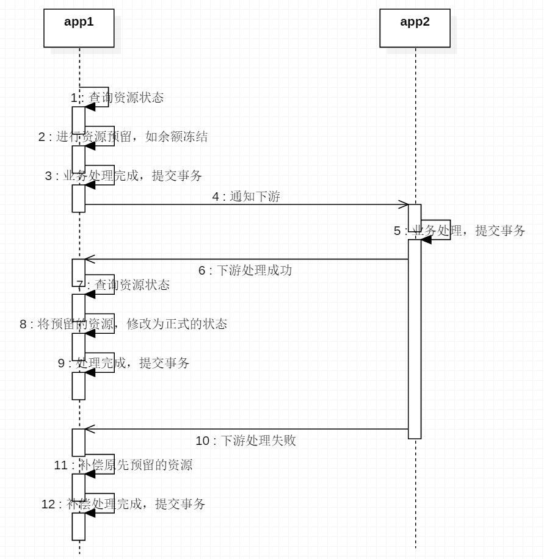
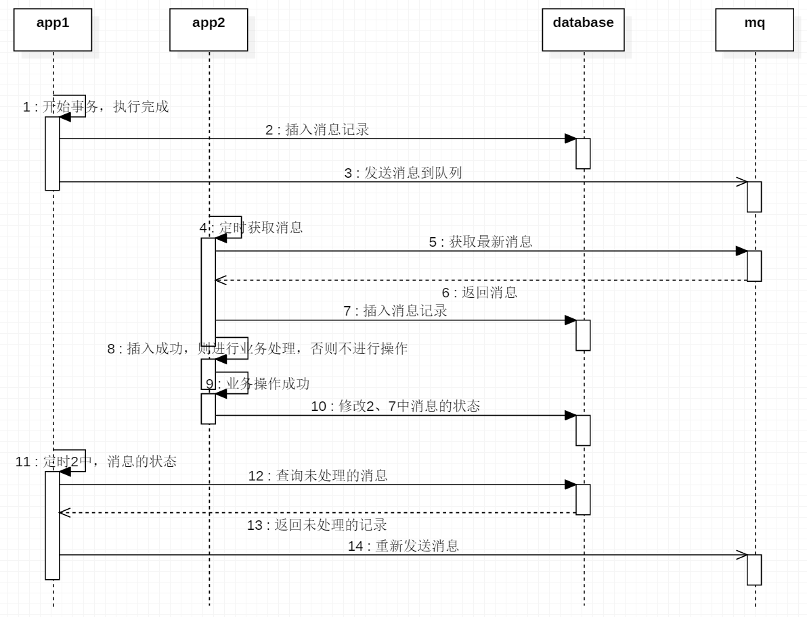

在分布式系统中，因为CAP的存在，事务的执行变得比单体系统更加困难。

要实现分布式事务，无外乎几种解决方案，但基本上都遵循 BASE 理论，是最终一致性模型。

现在一般都用 Seata 的 AT 模式，当然 Seata 还支持 XA，TCC，Sage 模式，另外也可以用 MQ 事务。

### 两阶段提交

两阶段提交又叫2PC，是将整个事务流程分为两个阶段，准备阶段（Prepare phase）和提交阶段（Commit phase），2是指两个阶段，P是指准备阶段，C是指提交阶段。

准备阶段，各个本地事务完成本地事务的准备工作

执行阶段，各个本地事务根据上一阶段的执行结果，进行提交或回滚。

#### XA方案

2PC的传统方案，是在数据库层面实现的，如Oracle、MySQL都支持2PC协议，为了统一标准较少行业内不必要的对接成本，需要制定标准化的处理模型及接口标准，国际开放标准组织Open Group定义了分布式事务处理模型，DTP（Distributed Transaction Processing Reference Model）

DTP模型定义了如下角色： 

AP：应用程序

TM：事务管理器，负责协调和管理事务，控制事务的生命周期，协调各个RM。

RM：资源管理器，可以理解为事务的参与者，一般是数据库，控制分支事务。

两阶段提交，一个分布式事务，可以被拆分成多个本地事务，运行在不同的AP和RM上，每个本地事务的ACID很好实现，但是全局事务必须保证每一个本地事务都能同事成功，若有一个本地事务失败，则所有的事务都必须回滚。

但本地事务在处理的过程中，并不知道其它事务的运行状态，因此就需要CRM来通知各个本地事务，同步事务的执行状态。

因此，本地事务的通信，必须要统一标准，否则不同数据库间就无法通信。

DTP在TM和RM之间的接口规范，叫做XA，可以理解为数据库提供的2PC接口协议，基于数据库的XA协议来实现2PC，称为XA方案。

TM向AP提供接口，AP通过TM提交及回滚事务。TM通过XA接口，来通知RM数据库事务的开始、提交、回滚等。

- 优点

方案成熟，能够保证强一致。

- 缺点

数据库需要支持XA协议

应用在本地事务执行完成后，由于还没有进行提交，所以数据库锁定的资源还没有进行释放，必须等其他应用执行完，并一起进行提交，才会释放掉资源，过程耗时较长。

#### Seata方案

### TCC

**T：Try，资源的检测和预留**

C：Comfirm，业务操作提交，要求Try成功，则Comfirm也一定要成功

C：Cancel，预留资源释放

该方案也有两个阶段

阶段一：资源准备（Try），检测业务所需要的资源，进行预留。如将余额进行冻结（增加一些中间状态）。

阶段二：执行阶段（Comfirm\Cancel），根据业务执行结果，如成功则Comfirm，反之则Cancel

与XA不同的是，TCC的各个阶段是独立的，执行完就提交，互不影响，而XA则是一个整体。

1~3为try，7~9为comfirm，11~12为cancel

- 优点

每个阶段执行完直接提交，不需要等待其他事务，效率较高。如其他业务执行失败，不是进行回滚，而是进行补偿（如余额解冻），避免了数据的长期锁定导致的阻塞等待。

- 缺点

需要手动进行写代码进行回滚或资源补偿，代码量较大。

需要业务方增加一些中间状态，适应资源预留和补偿的要求。

业务流程增加，开发成本较高，如原本只需要进行一个update，而TCC需要将update拆分成对应三个过程。

### 可靠消息服务

事务发起者A执行本地事务

事务发起者A通过MQ，将需要执行的事务信息发送给事务参与者B

事务参与者B接受消息，执行本地事务

- 优点

开发成本较低，只需要考虑最终一致性

- 缺点

无法回滚

强依赖与MQ的高可用

完整流程的执行时间不确定

- 使用场景

一个主业务，多个从业务

#### 本地消息表

事务发起者将消息的信息写入到数据库中，标识已发送。事务参与者修改数据库中对应的消息记录，标识为已完成。

#### RocketMQ事务

### 最大努力通知

