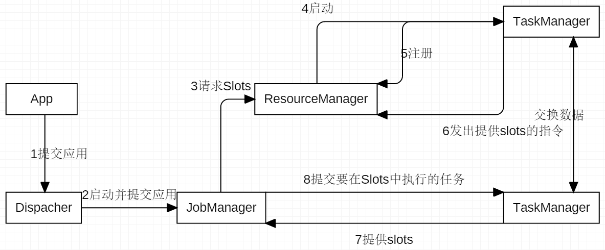

# 简介

Apache Flink是一个**框架**和**分布式**处理引擎，用于对**无界和有界数据流**进行**状态**计算

> Apache Flink is a framework and distributed processing engine for stateful computations over *unbounded and bounded* data streams. 

传统的数据架构是基于有限数据集，收集完了再处理，例如18小时收集完数据，6小时进行计算。流数据更真实地反映了我们的生活方式，数据的产生是连续的。在实际的项目需求中，**低延迟、高吞吐、结果的准确性和良好的容错性**，是核心诉求，flink则具备这样的特点。

结果的准确性和良好的容错性：为了实现高吞吐，势必进行集群，而在分布式处理的过程中，可能会发生数据的乱序，导致最终结果出现偏差。集群中，某个节点宕机后，可能会造成重算或者计算出错。

## 流处理的发展和演变

- 事件处理

将数据放到数据库中，各个系统自己去查询对应的数据。**延迟低，但统计分析的能力较弱，无法应付海量数据**。

- 分析处理

将数据进行分析，根据不同维度进行存储，然后通过一些sql查询。**吞吐量高，但实时性较差**。

- 有状态的流式处理

将数据暂存到本地的内存中，不通过SQL进行关联查询，速度更快。为了避免宕机而导致的数据丢失，会将已到安全点的数据进行存储。无法保证无序数据计算的结果的准确性。

- lambda架构

以Batch Layer进行批处理计算，保证结果的准确性。以Speed Layer进行实时计算，保证低延时。在批处理还未完成前，以实时计算的结果为准，在批处理完成后，以批处理结果为准。在批处理完成前，结果存在偏差。两套系统的维护过于复杂。

## 流数据的应用场景

- 电商和市场营销

数据报表、广告投放、业务流程需要

- 物联网

传感器实时数据采集处理

- 电信

基站流量调配

- 银行和金融业

实时结算和通知推送，异常行为检测

### 时间语义

- 事件时间，用户定义，含有业务意义的时间

- 摄入时间，进入flink后的时间

- 处理时间，执行计算时，当前的系统时间

### 窗口

- 滚动窗口

- 滑动窗口

- 会话窗口

必须基于事件时间

### 水位线watermark

### 算子状态

状态可以被理解为一个本地变量，可以被任务访问，用以实现业务逻辑。flink会对状态进行管理，包括一致性、故障处理以及存储和访问。

算子状态（或非键控状态）是绑定到一个并行算子实例的状态。 所有的由同一个并行任务处理的数据，都可以访问到相同的算子状态。其子任务，也能访问到算子状态。

- 列表状态List State，将状态表示为一组数据的List
- 联合列表状态Union List State，也将状态表示为数据的列表，它列表状态的区别在于，在发生故障时，
- 广播状态Broadcast State，如果一个算子有多项任务，而它的每项状态任务又相同，那么这种特殊情况最适合应用广播状态。如配置信息。

### 键控状态

监控状态，需要先进行keyBy操作，根据输入流中定义的键来维护和访问

键控状态支持的数据结构，单个值Value State，列表List State，映射Map State，聚合Reducing State & Aggregation  State

# 重要组件

Flink中的重要组件，包含作业管理器JobManager、任务管理器TaskManager、资源管理器ResourceManager、分发器Dispacher

## JobManager

- 控制一个应用程序执行的主进程，每个应用程序都会被一个不同的JobManager所控制执行
- JM会先接收到要执行的应用程序，这个程序包括：作业图JobGraph、逻辑数据流图LogicalDataflowGraph 、打包了所有类库和其他资源的Jar包
- JM会把JobGraph转换成一个物理层面的数据流图，这个图也叫作执行图，包含了所有可以并发执行的任务。
- JM会向ResourceManager请求执行任务必要的资源，也就是TaskManager上的槽Slot，一旦它获取到了足够的资源，就会将执行图分发到真正运行他们的TaskManager上。而在运行过程中，JM会负责所有需要中央协调的操作，比如说检查点Checkpoint等协调。

## TaskManager

- Flink通常会有多个TaskManager运行，每个TaskManager都包含了一定数量的Slot，其数量限制了TM能够执行的任务数量。Slot是Flink处理数据的单元。
- 启动之后，TM会向ResourceManager注册它的Slot，收到RM的指令后，TM会将将一个或者多个Slot提供给JM调用。JM就可以向Slot分配任务执行了。
- 在执行过程中，一个TM可以与其他TM交换数据

### 算子

- 算子状态

### 并行度

#### 状态后端

## ResourceManager

- 主要负责管理TM的Slot
- 不同环境有不同的RM，如YARN、Mesos、K8S，以及standalone部署
- 当JM申请Slot时，RM会将有空闲的Slot的TM分配给JM。如果RM没有足够的资源来满足JM的要求，它还可以想资源提供平台发起会话，以提供启动TM进程的容器。

## Dispacher

- 为应用提交提供REST接口，和操作的UI
- 当应用被提交时，分发器会启动并将应用移交给JM
- 该模块不是必须的，取决于应用提交的方式

## 概念理解

### 分层API

- Flink API 最底层的抽象为**有状态实时流处理**。其抽象实现是 Process Function，并且 **Process Function** 被 Flink 框架集成到了 DataStream API 中来为我们使用。它允许用户在应用程序中自由地处理来自单流或多流的事件（数据），并提供具有全局一致性和容错保障的*状态*。此外，用户可以在此层抽象中注册事件时间（event time）和处理时间（processing time）回调方法，从而允许程序可以实现复杂计算。

- Flink API 第二层抽象是 **Core APIs**。实际上，许多应用程序不需要使用到上述最底层抽象的 API，而是可以使用 **Core APIs** 进行编程：其中包含 **DataStream API（应用于有界/无界数据流场景）**和 **DataSet API（应用于有界数据集场景）**两部分。Core APIs 提供的流式 API（Fluent  API）为数据处理提供了通用的模块组件，例如各种形式的用户自定义转换（transformations）、联接（joins）、聚合（aggregations）、窗口（windows）和状态（state）操作等。此层 API 中处理的数据类型在每种编程语言中都有其对应的类。

  *Process Function* 这类底层抽象和 *DataStream API* 的相互集成使得用户可以选择使用更底层的抽象 API 来实现自己的需求。*DataSet API* 还额外提供了一些原语，比如循环/迭代（loop/iteration）操作。

- Flink API 第三层抽象是 **Table API**。**Table API** 是以表（Table）为中心的声明式编程（DSL）API，例如在流式数据场景下，它可以表示一张正在动态改变的表。Table API 遵循（扩展）关系模型：即表拥有 schema（类似于关系型数据库中的 schema），并且 Table API  也提供了类似于关系模型中的操作，比如 select、project、join、group-by 和 aggregate 等。Table API  程序是以声明的方式定义*应执行的逻辑操作*，而不是确切地指定程序*应该执行的代码*。尽管 Table API 使用起来很简洁并且可以由各种类型的用户自定义函数扩展功能，但还是比 Core API 的表达能力差。此外，Table API 程序在执行之前还会使用优化器中的优化规则对用户编写的表达式进行优化。

  Table和 *DataStream*/*DataSet* 可以进行无缝切换，Flink 允许用户在编写应用程序时将 *Table API* 与 *DataStream*/*DataSet* API 混合使用。

- Flink API 最顶层抽象是 **SQL**。这层抽象在语义和程序表达式上都类似于 *Table API*，但是其程序实现都是 SQL 查询表达式。SQL 抽象与 Table API 抽象之间的关联是非常紧密的，并且 SQL 查询语句可以在 *Table API* 中定义的表上执行。

### 无界流

### 有界流

数据流中的许多操作一次只查看一个单独的事件（例如事件解析器），但有些操作会记住多个事件的信息（例如窗口操作符）。这些操作称为有状态的。

有界流实例：

- 当应用程序搜索某些事件模式时，需要搜索截止到当前时间的事件（数据）。 
- 聚合每分钟/小时/天的分段数据。 
- 数据存在多个版本时，保存数据的当前版本。
- 统计过去一段时间内的某些数据。

flink需要识别流的边界，通过**检查点**和**保存点**实现。

### 任务状态流转

