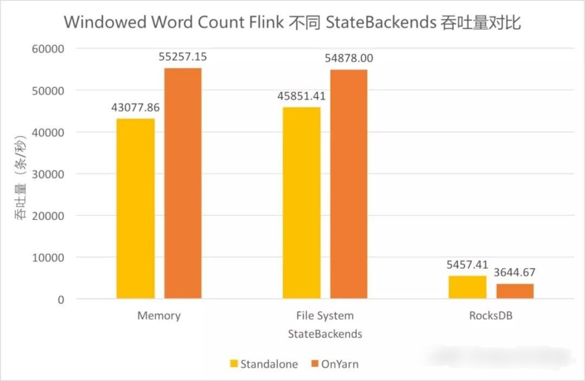

在有状态的流处理(stateful-steam-processing)中，为了发生故障时能够完全恢复故障前的数据,  开发者通常会在使用Flink时设置checkpoint。在使用checkpoint时候，通常要涉及到状态后端的选择以决定持久化的状态的存储方式与位置。 

Flink 当前提供了以下3种开箱即用的状态后端：

- MemoryStateBackend
- FsStateBackend
- RocksDBStateBackend

在缺省情况下，Flink默认使用 `MemoryStateBackend。` 

### 吞吐量对比

- 使用 FileSystem（FsStateBackend） 和 Memory （MemoryStateBackend）的吞吐差异不大（都是使用TaskManager堆内存管理处理中的数据），使用 RocksDB 的吞吐差距明显。
- Standalone 和 on Yarn 的总体差异不大，使用 FileSystem 和 Memory 时 on Yarn 模式下吞吐稍高，而使用 RocksDB 时 on Yarn 模式下的吞吐低些。

### 延迟对比

- 使用 FileSystem 和 Memory 时延迟基本一致且较低。
- 使用 RocksDB 时延迟稍高，且由于吞吐较低，在达到吞吐瓶颈附近延迟陡增。其中 on Yarn 模式下吞吐更低，延迟变化更加明显。

### 状态后端选择

Rocksdb是一个内嵌的kv数据库，本身就需要多的资源（数据存储需要序列化，数据读取需要反序列化）进行处理，会挤占TM的资源，而文件系统如HDFS等，其本身需要独立部署，不会占用TM的资源，所以有较高的吞吐量。

| 状态后端            | 位置          | checkpoint | 吞吐 | 推荐使用场景                                                 |
| ------------------- | ------------- | ---------- | ---- | ------------------------------------------------------------ |
| MemoryStateBackend  | TM Memory     | JM Memory  | 高   | 开发与调试、对数据丢失或重复不敏感                           |
| FsStateBackend      | **TM Memory** | FS/HDFS    | 高   | 普通状态、大窗口、KV 结构、**需要大的堆内存**                |
| RocksDBStateBackend | RocksDB on TM | FS/HDFS    | 低   | 超大状态、超长窗口、大型 KV 结构 **仅受磁盘大小限制、速度比基于堆的后端慢10倍** |

