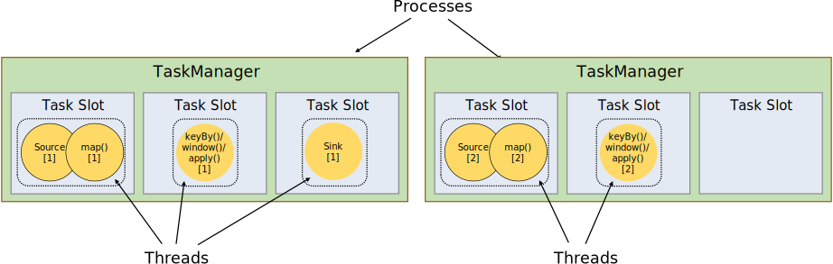
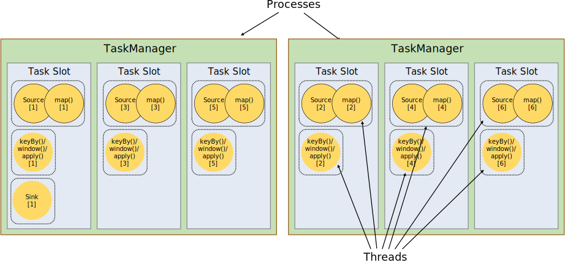
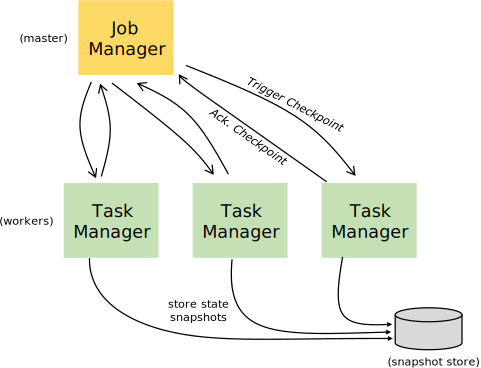

## 流程


### StreamGraph

client生成


### 作业图JobGraph

client生成，主要是算子链的合成


### 逻辑执行图

job-manager生成


### 物理执行图

task-manager上运行


## 算子

flink的程序有三部分组成：source()，Transformation，Sink，source负责读取数据源，Transformation利用各种算子进行处理，Slink负责输出。


算子相当于流中的处理方法，如map()，将一个或多个 DataStream 转换成新的 DataStream。

常见的操作有：

- map()：将一个元素转化一个元素，如String转Integer
- flatMap()：将一个元素转化零个、一个或多个元素
- filter()：过滤元素
- **keyBy()**：将DataStream转化为KeyedStream，在逻辑上将流划分为不相交的分区，所有具有相同键的记录都分配到同一个分区。在内部，keyBy() 是通过哈希分区实现的。


- reduce()：将KeyedStream转化为DataStream，将数据流进行合并，产生新值
- **window()**：将KeyedStream转化为WindowedStreaem，对无界流进行分组，例如，在过去 5 秒内到达的数据，对每个键中的数据进行分组。


### 算子合并（算子链）

Flink 默认会将能链接的算子尽可能地进行链接(例如， 两个 map 转换操作)，合并成一个子任务subtask，直接在数据产生的slot进行处理，减少了与其他slot数据通信和传输的开销。该操作在StreamGraph转换为JobGraph时进行。

只有满足以下条件的算子，才能进行合并：

- 并行度相同
- 算子的数据传输为one-to-one，即输入单个数据，生成单个数据，如map，filter，flatMap
- 同一个slot共享组


如果当前算子的分区发生改变，如keyBy会根据hashCode，而broadcast和rebalance会轮训重新分区，就不能够与前一个任务进行合并。


### 断链

- 显式断链

在执行时，设置断链，如：

```
stream.map(...).disableChaining();
```


- 设置slot共享组

给算子设置不同的slot共享组后，task-manager在执行时会将算子分到不同的slot上执行，那么自然就不会合并成算子链了。


## Slots

TaskManager本质上是一个JVM的进程，可以在单独的线程中执行具体的任务，为了控制TM中最多可以接收执行多少个任务，就又了Slot，在TM启动时，可以通过`taskmanager.numberOfTaskSlots`参数进行设置，默认为1。


### 分配

Slot分配时，依据任务的并行度进行设置，如下图中，全局并行度为2，sink并行度为1，任务链为source()->map()->keyBy()->window()->apply()->sink

source()->map()，进行合并，全局并行度为2的情况下，可以并行执行

keyBy()->window-()->apply()，进行合并，可以并行执行

sink()数据输出，并行度为1


总共需要5个slot进行执行，如下图：





### Slot共享

在实际的执行过程中，单个任务可能会进行一些IO的操作，导致slot闲置，如非密集 的source()/map()将和密集型 window() 一样多的slot。所以在默认情况下，slot可以执行多个任务。**一个 slot 可以持有整个作业管道。**

如果将slot的数量和并行度设置一致，那么flink在调度的过程中，直接将作业铺开，无需计算程序工包含多少个任务。





### Slot组

TaskManager的Slot能够执行多个任务，因为在执行时，默认的共享组为`default`，可以通过`slotSharingGroup`方法设置，参数为一个自定义字符串。

```java
stream.slotSharingGroup("goodboy-lwx");
```

相同的共享组，TM会将他们归属到同一个共享组中。而如果不同的共享组，则flink会将他们区分开，如果slot不足，则无法运行。如在并行度为2时，设置不同的共享组，则拓扑图为：

```
stream.slotSharingGroup("source-map")
	.map()
	.slotSharingGroup("keyby-window-apply")
	.keyby()
	.window()
	.apply()
	.slotSharingGroup("sink")
```


## 并行度

在流处理的场景中，有些任务可以并行计算，有些任务则需要进行归并。如对数据进行一个转换，将原始的数据，转化成系统内部的模型，类似于这种场景，没有与其他任务进行关联，是可以进行并行计算的。


- 任务在计算时，也可以对并行度进行修改

优先级最高，根据实际的计算需求进行并行度的设置，但是在一个完整的流程中，各个任务的并行度

```
AggregateOperator<Tuple2<String, Integer>> sum = dataSource.flatMap(new FlatMapper())
        .setParallelism(2)
        .groupBy(0)
        .sum(1);
```


- 程序在运行时，可以通过环境上下文设置并行度

```
ExecutionEnvironment env = ExecutionEnvironment.getExecutionEnvironment();
env.setParallelism(2);
```


- 在启动jar包时，可以指定并行度


- taskmanager在启动时，可以指定一个默认并行度，若都没有设置，则等于CPU核心数

```
parallelism.default: 1
```


## 状态

### 算子状态

算子状态（或非键控状态）是绑定到一个并行操作符实例的状态。相当于成员变量。

Kafka Connector 是在 Flink 中使用 算子状态的一个很好的示例。 Kafka 消费者的每个并行实例都维护一个主题分区和偏移量的映射作为其算子状态。  

当并行度发生变化时，算子状态接口支持在并行算子实例之间重新分配状态。

可以通过实现 `CheckpointedFunction` 接口来使用 算子状态。该接口提供了两个方法

```java
//进入检查点时使用
void snapshotState(FunctionSnapshotContext context) throws Exception;
//初始化和灾难恢复
void initializeState(FunctionInitializationContext context) throws Exception;
```


### 广播状态

广播状态是一种特殊类型的算子状态。引入它是为了支持需要将一个流的记录广播到所有下游任务的用例，这些记录用于在所有子任务之间维护相同的状态。然后可以在处理第二个流的记录时访问此状态。
广播状态与其他算子状态的不同之处在于：它有一个地图格式，它仅适用于具有广播流和非广播流作为输入的特定算子，以及这样的算子可以有多个不同名称的广播状态。


### 键控状态

如果需要使用键控状态，那么必须先有“键”，也就是需要先进行keyBy等操作，将普通的Stream转化为KeyedStream。


## Window

无界流


### 滚动窗口


### 滑动窗口


### 会话窗口


### 全局窗口


### 水位线


## 数据安全

### 检查点

Flink 中的每个方法或算子都能够是**有状态的**。状态化的方法在处理单个元素/事件的时候存储数据，让状态成为使各个类型的算子更加精细的重要部分。为了让状态容错，Flink 需要为状态添加 **checkpoint（检查点）**。Checkpoint 使得 Flink 能够恢复状态和在流中的位置，从而向应用提供和无故障执行时一样的语义。


Flink 的 checkpoint 机制会和持久化存储进行交互，读写流与状态。一般需要：

- 一个能够回放一段时间内数据的持久化数据源，例如持久化消息队列（例如 Kafka）或文件系统（例如 HDFS等）。
- 存放状态的持久化存储，通常为分布式文件系统（比如 HDFS、 S3、 GFS、 NFS、 Ceph 等）。


默认情况下 checkpoint 是禁用的。通过调用 `StreamExecutionEnvironment` 的 `enableCheckpointing(n)` 来启用 checkpoint，里面的 *n* 是进行 checkpoint 的间隔，单位毫秒。


Checkpoint 其他的属性包括：

- *精确一次（exactly-once）对比至少一次（at-least-once）*：可以选择向 `enableCheckpointing(long interval, CheckpointingMode mode)` 方法中传入一个模式来选择使用两种保证等级中的哪一种。 对于大多数应用来说，精确一次是较好的选择。至少一次可能与某些延迟超低（始终只有几毫秒）的应用的关联较大。

- checkpoints 之间的最小时间：该属性定义在 checkpoint 之间需要多久的时间，以确保流应用在 checkpoint 之间有足够的进展。如果值设置为了 *5000*， 无论 checkpoint 持续时间与间隔是多久，在前一个 checkpoint 完成时的至少五秒后会才开始下一个 checkpoint。

  往往使用“checkpoints 之间的最小时间”来配置应用会比 checkpoint 间隔容易很多，因为“checkpoints 之间的最小时间”在 checkpoint 的执行时间超过平均值时不会受到影响（例如如果目标的存储系统忽然变得很慢）。

  注意这个值也意味着并发 checkpoint 的数目是*一*。

- 并发 checkpoint 的数目: 默认情况下，在上一个 checkpoint 未完成（失败或者成功）的情况下，系统不会触发另一个 checkpoint。这确保了拓扑不会在 checkpoint 上花费太多时间，从而影响正常的处理流程。 不过允许多个 checkpoint 并行进行是可行的，对于有确定的处理延迟（例如某方法所调用比较耗时的外部服务），但是仍然想进行频繁的 checkpoint 去最小化故障后重跑的 pipelines 来说，是有意义的。

  该选项不能和 “checkpoints 间的最小时间"同时使用。


### 安全点

**Savepoint 是依据 checkpointing 机制所创建的流作业执行状态的一致镜像**。 可以使用 Savepoint 进行 Flink 作业的停止与重启、fork 或者更新。 Savepoint 由两部分组成：稳定存储（列入  HDFS，S3，…) 上包含二进制文件的目录（通常很大），和元数据文件（相对较小）。 稳定存储上的文件表示作业执行状态的数据镜像。  Savepoint 的元数据文件以（相对路径）的形式包含（主要）指向作为 Savepoint 一部分的稳定存储上的所有文件的指针。


**Savepoint 与 Checkpoint 的不同之处类似于传统数据库中的备份与恢复日志之间的差异。** 

Checkpoint  的主要目的是为意外失败的作业提供恢复机制。 Checkpoint 的生命周期由 Flink 管理，即 Flink 创建，管理和删除  Checkpoint - 无需用户交互。 作为一种恢复和定期触发的方法，Checkpoint 实现有两个设计目标：一是轻量级创建、二是尽可能快地恢复。 可能会利用某些特定的属性来达到这个，例如， 工作代码在执行尝试之间不会改变。 在用户终止作业后，通常会删除  Checkpoint（除非明确配置为保留的 Checkpoint）。


与此相反、Savepoint 由用户创建，拥有和删除。 他们的用例是计划的，手动备份和恢复。 例如，升级 Flink  版本，调整用户逻辑，改变并行度，以及进行红蓝部署等。 当然，Savepoint 必须在作业停止后继续存在。 从概念上讲，Savepoint  的生成，恢复成本可能更高一些，Savepoint 更多地关注可移植性和对前面提到的作业更改的支持。


### 状态后端



状态的存储、访问以及维护，有一个可插入的组件决定，这个组件为状态后端（state backend）。状态后端将本地的状态管理，以及检查点状态写入远程存储，如hdfs。

- MemoryStateBackend，快速、低延迟，但不稳定，默认

内存级的状态后端，会将键控状态作为内存中的对象进行管理，将它们存储在TaskManager的内存中。而将checkpoint的存储在JobManager的内存。


- FsStateBackend，速度较慢，但存储稳定

将checkpoint存储到远程的持久化文件系统中，而对于本地状态，跟MemoryStateBackend一样，也会存到TM的内存中。


- RocksDBStateBackend，速度较慢，本地存储稍快于文件系统

将所有状态序列化后，存入到本地的RocksDB中


- flink-conf中配置

```
# The backend that will be used to store operator state checkpoints if
# checkpointing is enabled.
#
# Supported backends are 'jobmanager', 'filesystem', 'rocksdb', or the
# <class-name-of-factory>.
#
state.backend: filesystem

# Directory for checkpoints filesystem, when using any of the default bundled
# state backends.
#
state.checkpoints.dir: hdfs://namenode-host:port/flink-checkpoints

# Default target directory for savepoints, optional.
#
state.savepoints.dir: hdfs://namenode-host:port/flink-savepoints
```


