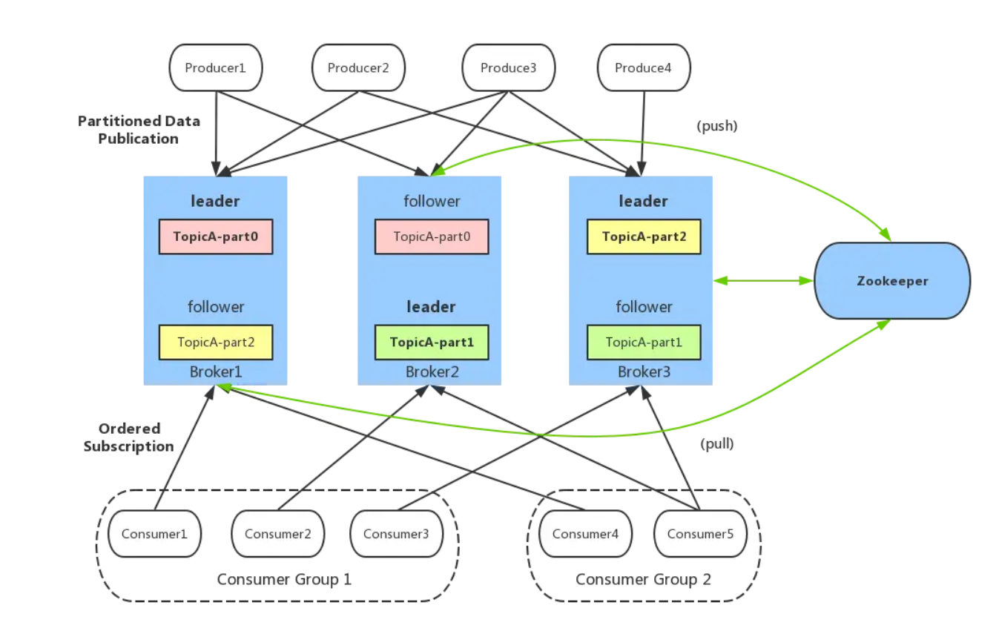
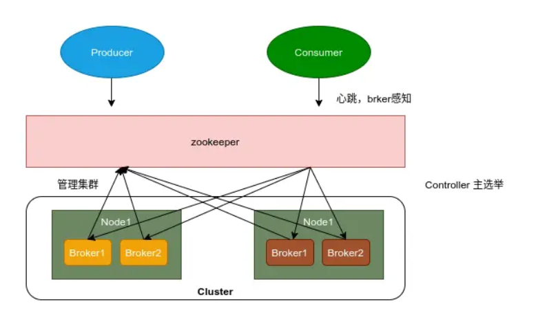
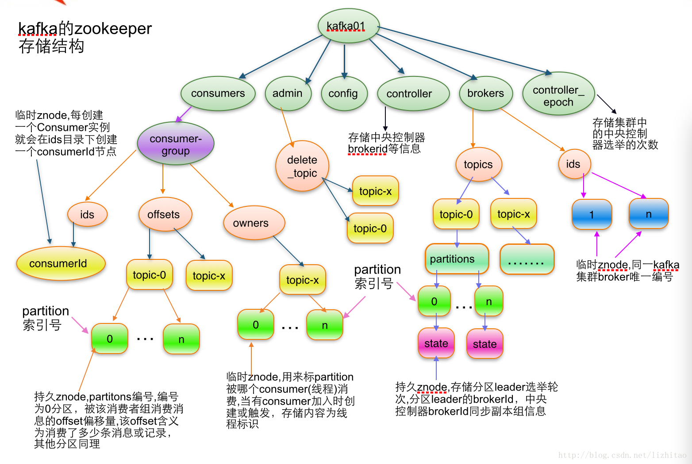
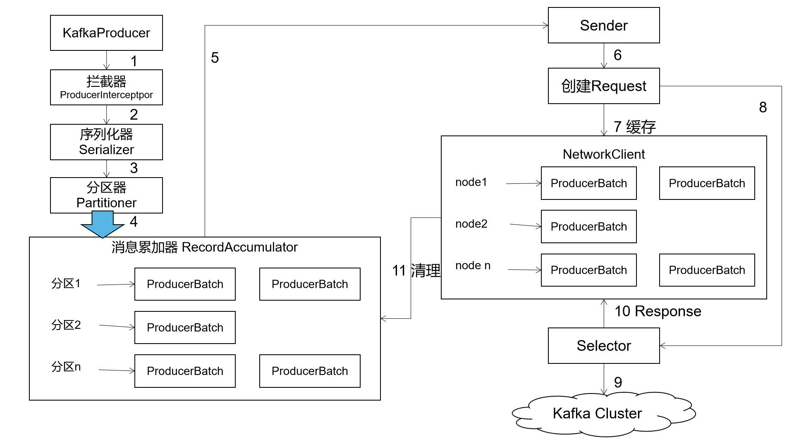
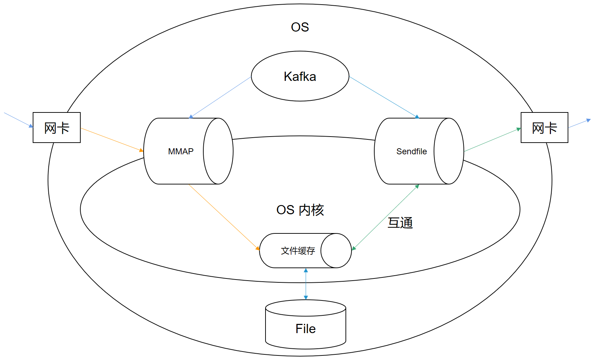
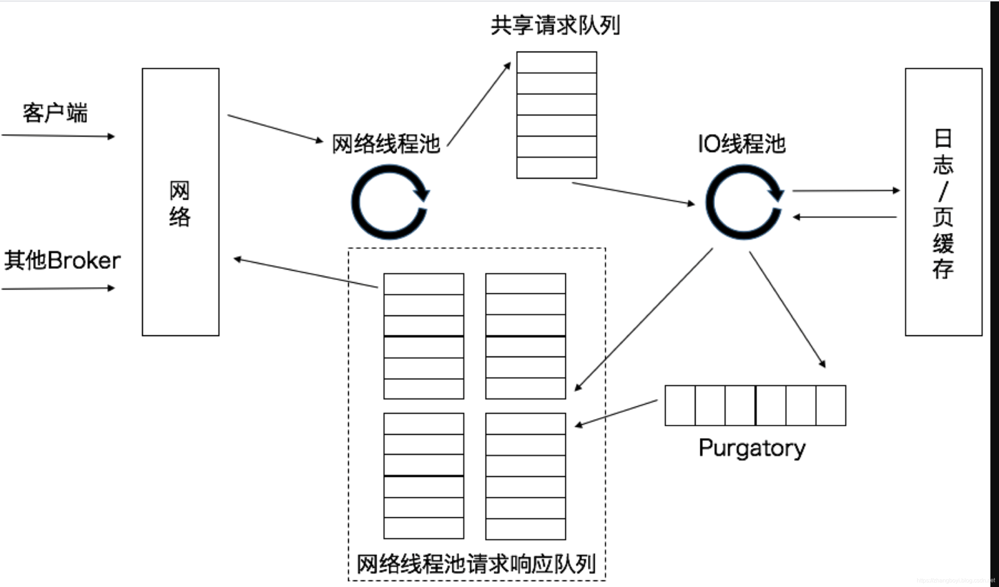
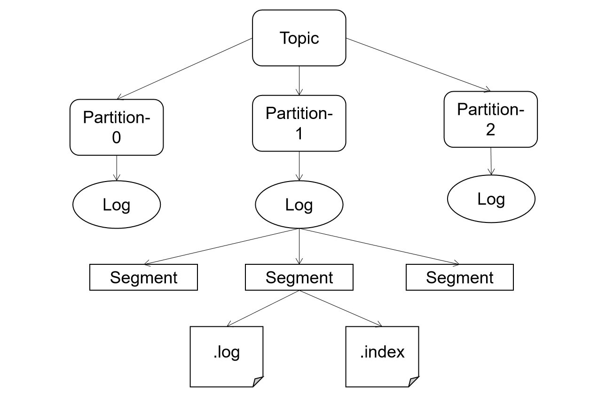
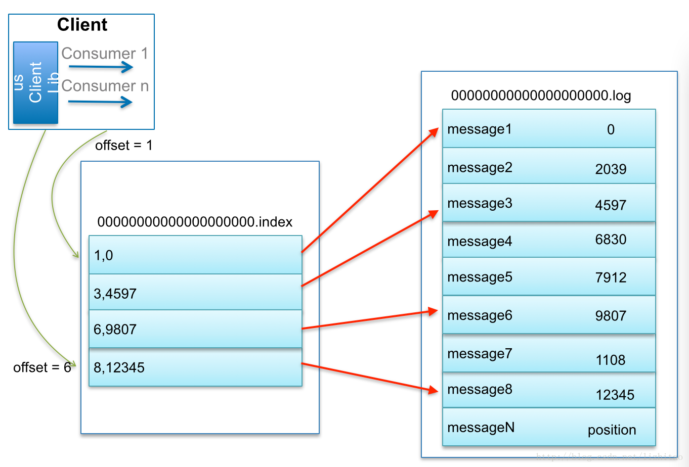
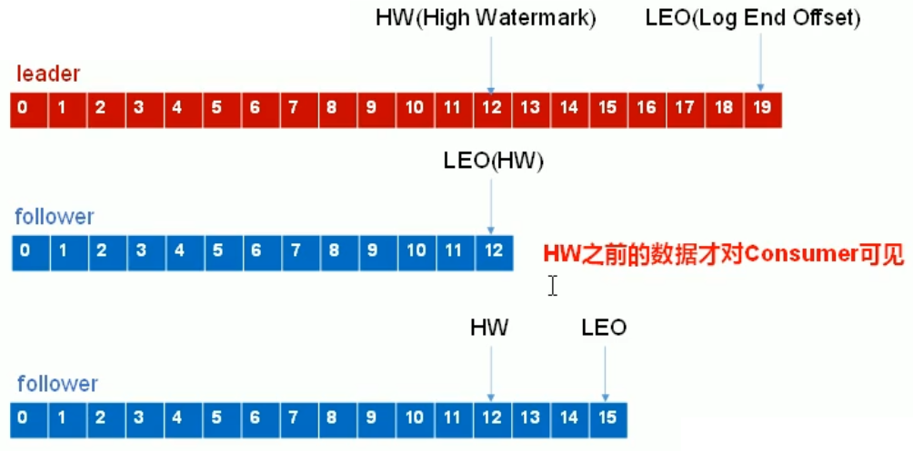

## 消息中间件

### 什么是消息中间件？


分布式消息是一种通信机制，和 RPC、HTTP、RMI  等不一样，消息中间件采用分布式中间代理的方式进行通信。如图所示，采用了消息中间件之后，上游业务系统发送消息，先存储在消息中间件，然后由消息中间件将消息分发到对应的业务模块应用（生产者 - 消费者模式）。


### 消息中间件的作用？

消息中间件常用于服务解耦、削峰和分布式事务。

- 服务解耦、异步通信：
- 削峰：
- 分布式事务：kafka不支持


## 概念和架构



- Producer：生产者，也就是发送消息的一方。生产者负责创建消息，然后将其发送到 Kafka
- Consumer：消费者，也就是接受消息的一方。消费者连接到 Kafka 上并接收消息，进而进行相应的业务逻辑处理
- Consumer Group：一个消费者组可以包含一个或多个消费者。使用多分区 +  多消费者方式可以极大提高数据下游的处理速度，同一消费组中的消费者不会重复消费消息，同样的，不同消费组中的消费者消息消息时互不影响。Kafka  就是通过消费组的方式来实现消息 P2P 模式和广播模式
- Broker：服务代理节点。Broker 是 Kafka 的服务节点，即 Kafka 的服务器
- Topic：Kafka 中的消息以 Topic 为单位进行划分，生产者将消息发送到特定的 Topic，而消费者负责订阅 Topic 的消息并进行消费
- Partition：Topic  是一个逻辑的概念，它可以细分为多个分区，以打散到不同的broker上。**同一个主题下不同分区包含的消息是不同的，分区在存储层面可以看作一个可追加的日志（Log）文件，消息在被追加到分区日志文件的时候都会分配一个特定的偏移量（offset）**
- Offset：offset 是消息在分区中的唯一标识，Kafka 通过它来保证消息在分区内的顺序性，不过 offset 并不跨越分区，也就是说，Kafka 保证的是分区有序性而不是主题有序性。消费者组中的每个消费者，都会实时记录自己消费到了那个offset，以便出错恢复时，能从上次的位置继续消费。 
- Replication：副本，是 Kafka 保证数据高可用的方式，Kafka 同一 Partition 的数据可以在多 Broker  上存在多个副本，通常只有主副本对外提供读写服务，当主副本所在 broker 崩溃或发生网络一场，Kafka 会在 Controller  的管理下会重新选择新的 Leader 副本对外提供读写服务
- Record： 实际写入 Kafka 中并可以被读取的消息记录。每个 record 包含了 key、value 和 timestamp


### JMS协议

JMS是Java提供的一套技术规范和关于消息中间件的协议。


- 发布/订阅模式：数据生产后，推送给所有订阅者

发布订阅模型则是一个基于推送的消息传送模型。发布订阅模型可以有多种不同的订阅者，临时订阅者只在主动监听主题时才接收消息，而持久订阅者则监听主题的所有消息，即使当前订阅者不可用，处于离线状态。但是这种方式，会对服务端造成比较大的压力，另外，也很难根据消费者的实际性能确定推送的速率。


- 点对点模式：消费者主动拉取数据，消息收到后消息清除

点对点模型通常是一个基于拉取或者轮询的消息传送模型，这种模型从队列中请求信息，而不是将消息推送到客户端。这个模型的特点是发送到队列的消息被一个且只有一个接收者接收处理，即使有多个消息监听者也是如此。但是若服务端没有数据，消费者也会维持轮训状态，造成一定程度的性能浪费。


### zookeeper作用

在新版本的kafka架构中，已经将zk移除，但大部分的部署版本，还是zk-kafka的版本。



- Broker 注册选举：Broker 是分布式部署并且之间相互独立，Zookeeper 用来管理注册到集群的所有 Broker 节点。先注册到zk的broker节点成为leader，leader挂掉之后，抢先注册的follower成为leader。
- Topic 注册： 在 Kafka 中，同一个 Topic 的消息会被分成多个分区并将其分布在多个 Broker 上，这些分区信息及与 Broker 的对应关系也都是由 Zookeeper 在维护
- 生产者负载均衡：由于同一个 Topic 消息会被分区并将其分布在多个 Broker 上，因此，生产者需要将消息合理地发送到这些分布式的 Broker 上
- 消费者负载均衡：与生产者类似，Kafka 中的消费者同样需要进行负载均衡来实现多个消费者合理地从对应的 Broker  服务器上接收消息，每个消费者分组包含若干消费者，每条消息都只会发送给分组中的一个消费者，不同的消费者分组消费自己特定的 Topic  下面的消息，互不干扰


### zk数据存储




## 核心原理

### 生产者

#### 分区策略

kafka只有leader节点才能进行读写，若以topic进行读写，归属于topic的所有请求都打到同一个节点上，颗粒度比较大，不方便进行扩展，吞吐量较低。所以，kafka在topic之下，还继续划分了partition，一个topic由多个partition组成，因此，集群就可以适应任意规模的数据请求。


生产者在生产消息时，可以指定具体的partition。若没有指定，sdk的分区器会对key的哈希值与partition的数量进行取余，得到partition的值。就没有指定partition，又没有key，那么第一次调用时，会生成一个随机整数（自增，重启会丢失），将这个值与topic可用的partition进行取余（round-robin算法）。


#### 流程



####  参数

Kafka Producer需要以下必填参数：

- bootstrap.server：指定Kafka Broker的地址，`host：port` 格式


其他参数：

- timeout：异步发送的最长等待时间
- key.serializer：Key序列化器
- value.serializer：value序列化器
- batch.num.messages：默认值：200，每次批量消息的数量，只对 asyc 起作用
- **request.required.acks：默认值：0，0 表示 producer 无须等待 leader 的确认，1 代表需要 leader 确认写入它的本地 log 并立即确认，-1  代表所有的备份都完成后确认**。 **只对 async 模式起作用**，这个参数的调整是数据不丢失和发送效率的  tradeoff，如果对数据丢失不敏感而在乎效率的场景可以考虑设置为 0，这样可以大大提高 producer 发送数据的效率。
- **request.timeout.ms：默认值：10000，确认超时时间。**
- partitioner.class：默认值：kafka.producer.DefaultPartitioner，必须实现 kafka.producer.Partitioner，根据 Key 提供一个分区策略。有时候我们需要相同类型的消息必须顺序处理，这样我们就必须自定义分配策略，从而将相同类型的数据分配到同一个分区中
- **producer.type：默认值：sync，指定消息发送是同步还是异步**。异步 async 成批发送用 kafka.producer.AyncProducer， 同步 sync 用 kafka.producer.SyncProducer。同步和异步发送也会影响消息生产的效率。
- compression.topic：默认值：none，消息压缩，默认不压缩。其余压缩方式还有，"gzip"、"snappy"和"lz4"。对消息的压缩可以极大地减少网络传输量、降低网络 IO，从而提高整体性能。
- compressed.topics：默认值：null，在设置了压缩的情况下，可以指定特定的 topic 压缩，未指定则全部压缩
- message.send.max.retries：默认值：3，消息发送最大尝试次数
- retry.backoff.ms：默认值：300，每次尝试增加的额外的间隔时间
- topic.metadata.refresh.interval.ms：默认值：600000，定期的获取元数据的时间。当分区丢失，**leader 不可用时 producer 也会主动获取元数据**，如果为 0，则每次发送完消息就获取元数据，不推荐。如果为负值，则只有在失败的情况下获取元数据
- queue.buffering.max.ms：默认值：5000，在 producer queue 的缓存的数据最大时间，仅仅 for asyc
- queue.buffering.max.message：默认值：10000，producer 缓存的消息的最大数量，仅仅 for asyc
- queue.enqueue.timeout.ms：默认值：-1，0 当 queue 满时丢掉，负值是 queue 满时 block，正值是 queue 满时 block 相应的时间，仅仅 for asyc


### 消费者

#### 分配策略

生产者生产的消息发送到多个partition，而消费者也有consumer group的概念，每个消费者只能消费所分配到的分区的消息，每一个分区只能被一个消费组中的一个消费者所消费，所以存在分区的分配策略问题。但是同一个**消费组中消费者的数量如果超过了分区的数量，将会出现有些消费者分配不到消费的分区**


##### Range 范围分配

默认方式。对同一个 topic 中的partition进行排序，对消费者按照字母顺序进行排序。如有 10 个分区，3 个消费者，排序后的分区将会是0、1、2、3、4、5、6、7、8、9；消费者排序完之后将会是c1、c2、c3。通过 partitions数/consumer数 来决定每个消费者应该消费几个分区。如果除不尽，那么前面几个消费者将会多消费 1 个分区。


10/3 = 3 余 1 ，那么 消费者 c1 便会多消费 1 个分区，最终分区分配结果如下：

| 消费者 | 分区       |
| ------ | ---------- |
| c1     | 0、1、2、3 |
| c2     | 4、5、6    |
| c3     | 7、8、9    |

若有11个分区的话，c1 将消费0、1、2、3 分区，c2 将消费4、5、6、7分区  c3 将消费 8、9、10 分区


若只有 1 个 topic ，消费者c1多消费1个分区影响不是很大。但如果有 N 多个 topic，那么针对每个 topic，消费者c1都将多消费 1 个分区，topic越多，c1消费的分区会比其他消费者明显多消费 N 个分区。


##### RoundRobin轮询分配

把消费者组订阅的topic中的 partition，和组中的消费者都列出来，然后按照字典顺序进行排序，通过轮询算法来将 partition 给到各个消费者。


 轮询分区分为如下两种情况：

①同一消费者组内，所有的消费者订阅的消息都是相同的  

②同一消费者组内，存在订阅消息不同的消费者（分区数量不足，无法铺满消费者）


如果同一消费组内，所有的消费者订阅的消息都是相同的，那么 RoundRobin 策略的分区分配会是均匀的

如，消费者组中，有 3 个消费者c0、c1和c2，都订阅了 2 个主题 t0 和 t1，并且每个主题都有 3 个分区(p0、p1、p2)，那么所订阅的所以分区可以标识为t0-p0、t0-p1、t0-p2、t1-p0、t1-p1、t1-p2。最终分区分配结果如下：

| 消费者 | 分区         |
| ------ | ------------ |
| c0     | t0-p0、t1-p0 |
| c2     | t0-p1、t1-p1 |
| c3     | t0-p2、t1-p2 |


**由于RoundRobin将同一个消费者组订阅的分区认为是一个整体，所以，如有c1，c2消费者，t1(p0、p1、p2)，t2(p0、p1、p2)主题，无法做到c1单独订阅t1，c2单独订阅t2。**


##### Sticky分配


##### 分区重置

当出现以下几种情况时，Kafka 会进行一次分区分配操作，**即 Kafka 消费者端的 Rebalance 操作**

① 同一个 consumer 消费者组 group.id 中，新增了消费者进来，会执行 Rebalance 操作

② 消费者离开当期所属的 consumer group组。比如 **主动停机** 或者 **宕机**

③ 分区数量发生变化时(即 topic 的分区数量发生变化时)

④ 消费者主动取消订阅


#### offset维护

offset的数据，存储在zk的`/consumers/consumer-group/offsets/topic/partition/`目录下，kafka默认1秒钟更新一次offset数据。在0.9以后的版本，offset的数据默认由kafka自行维护，topic为`__consumer_offsets`。


#### 参数

必填：

- bootstrap.servers： Kafka Broker的地址
- group.id： 消费者隶属的消费组


其它参数：

- key.deserializer： 与生产者的`key.serializer`对应，key 的反序列化方式
- value.deserializer： 与生产者的`value.serializer`对应，value 的反序列化方式
- session.timeout.ms： coordinator 检测失败的时间。默认 10s 该参数是 Consumer Group 主动检测 （组内成员 comsummer) 崩溃的时间间隔，类似于心跳过期时间
- auto.offset.reset： 该属性指定了消费者在读取一个没有偏移量后者偏移量无效（消费者长时间失效当前的偏移量已经过时并且被删除了）的分区的情况下，应该作何处理，默认值是 latest，也就是从最新记录读取数据（消费者启动之后生成的记录），另一个值是  earliest，意思是在偏移量无效的情况下，消费者从起始位置开始读取数据
- enable.auto.commit： 是否自动提交位移，如果为`false`，则需要在程序中手动提交位移。对于精确到一次的语义，最好手动提交位移
- fetch.max.bytes： 单次拉取数据的最大字节数量
- max.poll.records： 单次 poll 调用返回的最大消息数，如果处理逻辑很轻量，可以适当提高该值。 但是`max.poll.records`条数据需要在在 session.timeout.ms 这个时间内处理完 。默认值为 500
- **timeout.ms： 一次请求响应的最长等待时间。如果kafka没有消息可供消费，那么会进行阻塞，以减少自旋**


### 事务

在0.11时，引入了对事务的支持，可以保证在exactly once语义的基础上，生产和消费可以跨分区和会话，要么全部成功，要么全部失败。

#### 生产者事务

为了实现跨分区跨会话的事务，需要引入一个全局唯一的transactionId，并将生产者获得的pid和transactionId进行绑定。即使生产者重启后，也可以通过正在进行的transactionId获得pid。

为了管理事务，kafka引入了新的组件，Transaction Coordinator，生产者通过和TC交互，获得transactionId对应的任务状态，TC还负责将事务写入kafka内部的一个topic，即使整个服务重启，由于事务状态还是得到保存，进行中的事务状态还可以得到恢复，从而继续进行。


#### 消费者事务

消费者可以通过offset，访问任意的数据，而且，log数据存在被删除的可能，所以，kafka不支持消费者事务。


### 性能优化

#### 顺序写

broker写数据时，log的过程是追加到文件末端，为顺序写。一般M.2SSD的固态硬盘，随机写入的速度为30~80M/s，而顺序写入最高可达3000~5000M/s。


#### 零拷贝




#### 数据压缩

每秒发送100W条100字节的数据，需要占用的网络带宽为95M/S，基本上把千兆的网卡给跑满了。为了能接收更多的数据，同时节省网络带宽，提高传输的数据，kafka默认开启数据压缩的功能，如将100字节的数据，压缩到50字节，就能够多传输一半的数据。

数据的压缩在生产者端进行，数据的解压缩在消费者端进行，kafka不对数据进行压缩和解压缩操作，需要占用一部分生产者和消费者的性能。


#### 分区


#### Reactor 网络架构




#### 批处理

发送每条消息，都建立一个tcp连接，那么，发送上百万的消息，建立上百万个连接，显然超出了服务器的上限，而且建立连接的开销也异常巨大。

对数据传输进行批处理，共用同一个连接， 是在海量数据时常用的方案。kafka的异步消息，默认每秒发送一次数据。

但是对于发送消息的生产者来说，也存在一定的压力，如发送100W条100字节的数据，需要积压95M左右的内存空间。


#### 页面缓存技术

**该技术由操作系统提供，在kafka不需要做任何处理**。操作系统在读取文件时，需要将文件读取到内存中，当操作处理完，操作系统并不会马上将内存中的数据进行清除，在下一次对该文件操作时，若数据仍在内存中，则直接读取内存中的数据。

在部分的参考资料中，有提过该技术，但实际上不是kafka的优化，而是操作系统的优化，任何一个程序都有相同的功能。


### 数据存储



为了防止log文件过大，而导致数据定位效率低下，kafka采取了分片+索引的机制。一个topic分为多个Partition，partition的日志文件，对应多个Segment，Segment分为.log文件和.index文件，单个log文件大小上限默认为1G（为了方便数据恢复时，一次性加载进内存）。这些文件位于一个文件夹下，文件夹命名为，topic名称+分区序号。**而log和index文件，以当前segment的第一条消息的offset命名**。




如：要查找绝对offset为7的Message：

1、首先是用二分查找确定它是在哪个LogSegment中，自然是在第一个Segment中

2、开这个Segment的index文件，也是用二分查找找到offset小于或者等于指定offset的索引条目中最大的那个offset。自然offset为6的那个索引是我们要找的，通过索引文件我们知道offset为6的Message在数据文件中的位置为9807

3、打开数据文件，从位置为9807的那个地方开始顺序扫描直到找到offset为7的那条Message


其他文件信息：

- recovery-point-offset-checkpoint：表示已经刷写到磁盘的offset信息，对应LEO信息。kafka中会有一个定时任务负责将所有分区的LEO刷写到恢复点文件recovery-point-offset-checkpoint中，定时周期由broker端参数**log.flush.offset.checkpoint.interval.ms配置，默认值60000，即60s**。Kafka在启动时会检查文件的完整性，如果没有.kafka_cleanshutdown这个文件，就会进入一个recover逻辑，recover就是从此文件中的offset开始。
- replication-offset-checkpoint：用来存储每个replica的HW，表示已经被commited的offset信息。失败的follower开始恢复时，会首先将自己的日志截断到上次的checkpointed时刻的HW，然后向leader拉取消息。kafka有一个定时任务负责将所有分区的HW刷写到复制点文件replication-offset-checkpoint中，定时周期由broker端参数**replica.high.watermark.checkpoint.interval.ms配置，默认值5000，即5s**。
- log-start-offset-checkpoint：对应logStartOffset，用来标识日志的起始偏移量。kafka中有一个定时任务负责将所有分区的logStartOffset刷写到起始点文件log-start-offset-checkpoint中，定时周期有broker端参数、**log.flush.start.offset.checkpoint.interval.ms配置，默认值60000，即60s**。


### 数据安全

#### 同步副本集ISR

leader在收到消息后，follower会进行同步数据，但有些follower可能因为一些网络原因或者故障，导致不能与leader进行同步，那leader就要一直等下去，才能向生产者发送ack。

针对这个问题，leader节点维护了一个动态的**in-sync replica set（ISR）**，为保持同步的副本集，记录follow同步offeset的位置。当ISR中的follower完成数据同步之后，leader就会给follower发送ack，如果follower长时间未向leader同步数据，则该follower将会被踢出ISR，该事件阈值由`replica.lag.time.max.ms`设定。leader发生故障之后，就会从ISR中选举新的leader。


#### ACK应答

对于某些不大重要的数据，对数据的可靠性要求不是很高，能够容忍数据的少量丢失，所以没必要等到ISR中的follower全部接受成功。

Kafka提供了三种可靠级别，可以根据可靠性和延迟的要求进行设置，相关参数为`request.required.acks`。

- 0：producer不等待leader的ack，延迟最短，但leader一接收消息，还未落盘就返回，则leader故障时可能会丢数据。
- 1：默认值，producer等待leader的ack，leader落盘成功后返回ack，如果在follower同步数据前，leader发生故障，则可能丢数据。
- -1，all：等待leader的ack，leader落盘，并和follower同步完所有数据，再返回ack。但是如果在所有follower同步完数据后，返回ack前，leader发生故障，则造成**数据重复**。


#### Exactly Once

acks=-1，可以保证生产者和消费者之间数据不丢失，但生产者可能会发送多次请求，即**At Least Once**。acks=0，则可能发生数据丢失，但生产者只发送一次请求，即**At Most Once**。

对于一些非常重要的信息，如交易数据，消费者要求数据既不丢失、也不重复，即Exactly Once语义。0.11后的Kafka，引入了幂等性，生产者无论向leader发送多少重复数据，leader都只会持久化一条数据。幂等性结合At Least Once，就构成了Exactly Once。

```
At Least Once + 幂等性 = Exactly Once
```

要启用幂等，需要在生产者的参数中，设置`enable.idompotence=true`。在客户端的SDK开启幂等性时，生产者初始化时会被分配一个PID，发往同一分区的消息会带上Sequence Number，而broker会对<PID,Partition,SequenceNumber>进行缓存，当具有相同主键的消息提交时，broker只会持久化一条。

但PID重启后会重新分配，不同分区的主键组成也不同，所以幂等性无法保证跨分区会话的Exactly Once。


#### 水位线和故障处理

- HW：High Watermark，副本中最小的LEO，消费者能见到的最大offset，ISR队列中的最小值
- LEO：Log End Offset，每个副本的最后一个offset




follower故障：

leader将follower提出ISR，该follower恢复后，会先从磁盘读取HW，将log文件高于HW的部分截取调，从HW的位置向leader进行同步，直到follower的LEO大于该分区的HW，就可以重新加入ISR了。


leader故障：

leader故障后，会从ISR中选出一个新的leader，为了保证多个副本之间的数据一致性，其余的follower会先将各自log中，高于HW的数据截掉，然后再从新的leader中同步数据。**该方式保证的是副本间数据一致性的问题，而不是数据丢失或者重复的问题。**


新broker加入：

当新的broker加入时，会作为follower，自动向集群中的leader节点拉取数据，直到HW满足时，才会加入到ISR中。而原先follower会删除已同步的数据，直到与配置的副本数相同。

> Kafka will add the new server as a follower of the partition it is  migrating and allow it to fully replicate the existing data in that  partition. When the new server has fully replicated the contents of this partition  and joined the in-sync replica one of the existing replicas will delete  their partition's data.  


## 常见问题

### 消息堆积

- 增加消费者的消费速度

1、确保有足够的分区，通过`kafka-topic.sh`对分区进行扩容，如

```
./kafka-topics.sh --zookeeper 127.0.0.1:2181 -alter --partitions 4 --topic test1
```

2、增加消费者

水平扩容消费者，kafka检测到消费者发生变化时，会进行rebalance，但是前提，需要提前有足够的分区


### 消息丢失

生产者在生产消息时，开启acks=-1，保证消息从leader节点同步到其他follower。

kafka的broker节点之间，维护ISR，保证数据在副本间进行本分，若leader和所有副本都宕机，则相应的数据会暂时无法读取，直到集群恢复正产后才能读取，但是不会丢失。


### 消息重复

生产者开启acks=-1后，有可能造成数据重复，若存在该问题，需要升级kafka对应的版本，以支持幂等性，并且在生产者端开启`enable.idompotence=true`参数。

消费者在消费消息时，手动提交offset。


### 消费顺序

因为数据的组织问题，kafka只能保证分区内数据的消费顺序，不能保证topic的消费顺序


### broker宕机

参考水位线和故障处理


### 消费者宕机

由于一个partition只有一个消费者进行消费，所以，当消费者宕机时，partition需要重新分配。

消费者的信息存储在zk中，当检测到消费者宕机后，kafka会进行分区的rebalance。


## MQ对比

|                | RabibitMQ                                       | ActiveMQ                          | RocketMQ                            | Kafka        |
| -------------- | ----------------------------------------------- | --------------------------------- | ----------------------------------- | ------------ |
| 所属社区\公司  | Mozilla Public License                          | Apache                            | Ali\Apache                          | Apache       |
| 成熟度         | 成熟                                            | 成熟                              | 比较成熟                            | 成熟         |
| 授权方式       | 开源                                            | 开源                              | 开源                                | 开源         |
| 开发语言       | Erlang                                          | Java                              | Java                                | Scala & Java |
| 客户端支持语言 | 几乎支持所有常用语言                            | Java\C\C++等                      | Java、C++（不成熟）                 | Java\C\C++等 |
| 协议支持       | 多协议支持AMQP、XMPP、SMTP、STOMP               | OpenWire、STOMP、REST、XMPP、AMQP | 自研协议                            | 自研协议     |
| 消息批量操作   | 不支持                                          | 支持                              | 支持                                | 支持         |
| 消息推拉模式？ | 多协议，pull\push均支持                         | 多协议，pull\push均支持           | 多协议，pull\push均支持             | pull         |
| HA             | master\slave模式，master提供服务，slave仅做备份 | 基于zk-leveldb的master-slave      | 支持多master，多slave模式，异步复制 | raft协议     |
| 数据可靠性     |                                                 |                                   |                                     |              |
| 单机吞吐量     | 其次（万级）                                    | 最差（万级）                      | 最高（十万）                        | 次之（十万） |
| 消息延迟       | 微秒级                                          |                                   | 稍快于kafka                         | 毫秒级       |
| 持久化能力     |                                                 |                                   |                                     |              |
| 是否有序       |                                                 |                                   |                                     |              |
| 事务           |                                                 |                                   |                                     |              |
| 集群           |                                                 |                                   |                                     |              |
| 负载           |                                                 |                                   |                                     |              |
| 管理界面       |                                                 |                                   |                                     |              |
|                |                                                 |                                   |                                     |              |


消息队列协议


## 命令行工具

Kafka 的命令行工具在 Kafka 包的`/bin`目录下，主要包括服务和集群管理脚本，配置脚本，信息查看脚本，Topic 脚本，客户端脚本等

- kafka-configs.sh： 配置管理脚本
- **kafka-console-consumer.sh： kafka 消费者控制台**
- **kafka-console-producer.sh： kafka 生产者控制台**
- **kafka-consumer-groups.sh： kafka 消费者组相关信息**
- kafka-delete-records.sh： 删除低水位的日志文件
- kafka-log-dirs.sh：kafka 消息日志目录信息
- kafka-mirror-maker.sh： 不同数据中心 kafka 集群复制工具
- kafka-preferred-replica-election.sh： 触发 preferred replica 选举
- kafka-producer-perf-test.sh：kafka 生产者性能测试脚本
- kafka-reassign-partitions.sh： 分区重分配脚本
- kafka-replica-verification.sh： 复制进度验证脚本
- **kafka-server-start.sh： 启动 kafka 服务**
- **kafka-server-stop.sh： 停止 kafka 服务**
- **kafka-topics.sh：topic 管理脚本**
- kafka-verifiable-consumer.sh： 可检验的 kafka 消费者
- kafka-verifiable-producer.sh： 可检验的 kafka 生产者
- zookeeper-server-start.sh： 启动 zk 服务
- zookeeper-server-stop.sh： 停止 zk 服务
- zookeeper-shell.sh：zk 客户端

