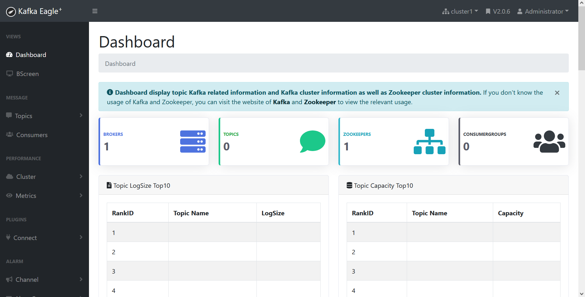
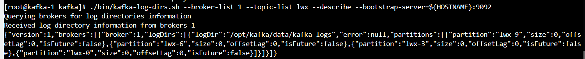

## kafka监控调优

### 监控方向

- 消息堆积

消息堆积，一般是消费者的问题，消费者的速度太慢，跟不上生产者的生产速度，造成的堆积。但是也有可能是生产者生产了很多消费者不消费的消息，导致的堆积。那么就得具体问题具体分析。

kafka作为消息队列，本来就有`削峰`的功能，那么就大概率存在消息堆积的情况。关键在于，在消息产生的低潮期，生产者能不能把堆积的消息处理完，如果处理不完，就应该考虑优化消费者的性能，或者增加消费者的数量。


- 内存占用

由于生产者存在异步发送消息的机制，所以在不断生产消息，并且还未发送的过程中，消息是存在堆积的。堆积就会比较耗内存。

Kafka虽然是由Scala语言编写，但是Scala也是一门JVM语言，仍然需要JVM才能运行，所以，需要预先划分相应的堆内存和直接内存给Kafka使用，在Kafka启动时，就已经存在明显的内存占用了。且由于在主要的环境使用了mmap和sendfile技术，其所需要的直接内存也是比较多的。

消费者依据偏移量从broker中拉取数据，一次拉回的数据，不一定能够快速处理完，该过程也存在消息堆积。但影响不会很大，毕竟拉取消息的速度，完全由消费者的性能决定。


在内存占用的环境，我们会更关心kafka的内存占用，其次是生产者。


- 磁盘占用

kafka在接收生产者的消息时，会将消息持久化到本地的磁盘中，但是我们知道，磁盘虽然是一种很廉价的资源，但还是有大小限制的。如运维的同事，给kafka开的磁盘大小，最大为了50G。


如果kafka磁盘满了，那么broker就会挂掉

>shutdown broker because all log dirs in have failed


- topic数量

kafka依赖于zookeeper，利用了其监听机制，在topic变动时，会进行回调。而zookeeper只有leader处理回调，所以，存在单机瓶颈。当topic数量达到上百个时，kafka集群的性能会下降。所以，保持topic的数量不要超过kafka的瓶颈，能有效的提高kafka集群的性能。


### 调优方向

kafka的调优，我们通常关心以下指标

- 吞吐量

- 消息延时

生产者将消息发送到kafka中，kafka进行存储，生产者再从kafka中拉取消息进行处理，在整个环节中，存在多次IO，所以生产者再获取消息时，是存在延时的。而狭义上的消息延时，是指kafka集群对消息的处理时间。

- 可靠性

- 可用性


### kafka监控

调优的第一步，往往是监控，确定在哪些地方出现了问题，然后再针对性的进行优化。

常用的kafka监控工具，有以下几种：

- kafka自带的命令行工具

最官方的工具，和版本一起打包，基本上不会有bug ，功能覆盖全面，控制台提示非常友好。不过命令行对于非开发和运维人员来说，也是有比较大的上手难度的。


- kafka manager

最受欢迎的kafka监控工具，目前线上也是用的这个。它最早由雅虎开源，功能非常齐全，展示的数据非常丰富。另外，用户能够在界面上执行一些简单的集群管理操作。并且，该项目目前还在不断维护中，因此使用Kafka manager来监控Kafka是一个不错的选择。


- kafka monitor

严格来说，它不是监控工具，它是专门做Kafka集群系统性测试用的。待监控的指标可以由用户自己设定，主要是做一些端到端的测试。比如说你搭了一套Kafka集群，想测试端到端的性能怎样：从发消息到消费者读取消息这一整体流程的性能。


- kafka eagle




国人自己开发的？界面很干净漂亮，有很好的数据展现，看着就很高大上。而且还有很多特色功能，如支持sql，zk客户端？？？听着就很牛逼是吧嘿嘿嘿。我们可以在开发环境上试用，后续推荐给运维部署。


### 命令行工具

- kafka-configs.sh： 配置管理脚本
- **kafka-console-consumer.sh： kafka 消费者控制台**
- **kafka-console-producer.sh： kafka 生产者控制台**
- **kafka-consumer-groups.sh： kafka 消费者组相关信息**
- kafka-delete-records.sh： 删除低水位的日志文件
- kafka-log-dirs.sh：kafka 消息日志目录信息
- kafka-mirror-maker.sh： 不同数据中心 kafka 集群复制工具
- kafka-preferred-replica-election.sh： 触发 preferred replica 选举
- kafka-producer-perf-test.sh：kafka 生产者性能测试脚本
- kafka-reassign-partitions.sh： 分区重分配脚本
- kafka-replica-verification.sh： 复制进度验证脚本
- **kafka-server-start.sh： 启动 kafka 服务**
- **kafka-server-stop.sh： 停止 kafka 服务**
- **kafka-topics.sh：topic 管理脚本**
- kafka-verifiable-consumer.sh： 可检验的 kafka 消费者
- kafka-verifiable-producer.sh： 可检验的 kafka 生产者
- zookeeper-server-start.sh： 启动 zk 服务
- zookeeper-server-stop.sh： 停止 zk 服务
- zookeeper-shell.sh：zk 客户端


每个kafka版本，所带的客户端工具和提示等，存在略微不同，以下延时的版本是基于kafka2.8的版本。


从k8s进入到kafka中，kafka一般和zookeeper组成集群。进入任意一台kafka节点的控制台中，即可连接到kafka集群中。

运维的kafka安装目录，在`/opt`目录下，业务应用或者组件均是，这种良好的约定，是有组织力的体现。

输入简单的linux命令，查看kafka的目录信息：


上述的脚本工具，均在`bin`目录中，很多开源的组件，解压有都是有一个`bin`目录，也是一种规范。

查看脚本工具：


试着连接上集群：

```
./bin/kafka-topics.sh --bootstrap-server localhost:9092 --list
```


可是结果显示，连接不上啊！！！？？？

这是为什么呢？

上述命令，在单机版压缩包版，启动的时候，基本是没问题的。但是在k8s环境，运维为了能将kafka暴露给业务应用，所以会修改一下几项配置，进入server.properties进行查看。kafka配置的主文件，默认是`./config/server.properties`


上述红圈中的配置，是kafka监听的broker的自己节点信息，如果不填的话，默认是localhost=127.0.0.1，如果想要给外部的应用使用，就得填**网卡中的ip地址**。查看网卡信息，*netstat居然也能查看网卡信息*//捂嘴笑


可以看到，网卡中的地址和配置中的地址一致。如果需要命令行工具的话，那么`--bootstrap-server`的地址，必须是同一个。

会不会有点太麻烦了啊？每次进到控制台，都要看一遍网卡或者配置中的信息。。哎呀，大兄，何见事之晚乎？

运维的同事，在启动pod的时候，也是需要将这个值塞到配置文件里面，他们一般是通过注入环境变量是实现的，所以，大胆猜想，在环境变量中应该有kafka对用的地址信息。那就试一试呗。。


果然，试试就逝世，虽然没有对应的IP地址，但是有一个域名啊，HOSTNAME。不知道他在本地的`hosts`文件中，是否有填对应的IP，再逝世。。


这次有对应的IP了，也就是说，以后进入到控制台中，不需要先去看配置文件或者网卡，直接输入`--bootstrap-server=${HOSTNAME}:9092`即可，如：

```
./bin/kafka-topics.sh --bootstrap-server ${HOSTNAME}:9092 --list
```

期待结果：


PS：如一个常见的地址，http://10.5.11.28:8080/lwx/is/a/good/boy，一整段叫URL，`/lwx/is/a/good/boy`叫做URI，而HOST一般可以指`10.5.11.28`，或者`10.5.11.28:8080`，但是不应该加上前面的`http://`，因为不确定10.5.11.28:8080是不是以http协议提供的服务，如果是mysql，那mysql是用http协议提供服务的嘛？


#### 消费者

想要查看消费者的信息，需要先找到对应的消费者组，可以通过`kafka-consumer-groups.sh`查看消费者组信息

```
./bin/kafka-consumer-groups.sh --bootstrap-server=${HOSTNAME}:9092 --list
```

--list：实际上就是简要的列表

> List all consumer groups.

期待结果：


找一个消费者组，查看具体消费者组详情，经我掐指一算，就是`ydata-flink-dev-8`你了。

```
./bin/kafka-consumer-groups.sh --bootstrap-server=${HOSTNAME}:9092 --group ydata-flink-dev-8 --describe
```

如果想查看详情的话，那么就得加上`--describe`这个参数了，字面意思就是`详细描述`的意思

期待结果：


表头说明：

GROUP：消费者组，因为我们手动指定了`--group ydata-flink-dev-8`，所以显示的都是同一个，如果不指定`--all-groups`，会全部显示。

TOPIC：消费的主题

PATITION：对应的分区

CURRENT-OFFSET：当前的消费偏移量

LOG-END-OFFSET：当前服务器的消息偏移量

LAG：未消费的消息数，有时候可能为负值，含义为消费者消费速度太快，kafka先减了再显示，对功能无影响。

CONSUMER-ID：

HOST：

CLIENT-ID：


从图中可以明显看到，LAG代表的未消费的消息，每个已经有几百万的堆积，全部加起来，就是几千万了。当为崇冈峻阜，何能为培塿乎！今天要是不堆积一亿条数据，就是看不起我kafka！//抱住狗头


消费者的客户端工具叫做`kafka-consumer-groups.sh`，那么生产者的，自然叫做`kafka-producer-groups.sh`。。哎哎实际上，然鹅，并没有，kafka没有提供查看生产者消费信息的工具。个人感觉，通过主体和消费者的监控工具，就已经能够看到相关的数据了，没有必要提供专门的生产者工具。

而且，生产者（如果是Java客户端），其CPU、内存占用率， 消息的堆积情况，JVM垃圾回收吞吐量等，在kafka的终端上也看不到，不可能看到。

不过，kafka有提供了一个`./bin/kafka-producer-perf-test.sh`，是一个测试kafka集群吞吐量的工具，用于生产者端，于消费者还有一个`kafka-consumer-perf-test.sh`。


#### 主题分区

在消费者工具中，可以看到Topic和对应的Partition的信息，但是太过简单，只有名字，如果想要查看详细数据的话，那么需要通过`kafka-topic.sh`进行查看。如：

```
./bin/kafka-topics.sh --bootstrap-server=${HOSTNAME}:9092 --list
```

 期待结果：


__consumer_offsets是kafka自带的消费者分区，用以维护每个消费者offset信息。早期的版本中，该数据存储在zookeeper中。kafka将数据存储在自己的broker中，需要一定的一致性算法，这也是为去除zookeeper依赖进行的一个准备吧。

又是会天大雨，道不通，度已失期，失期，掐指一算，选一个最靓的topic，看一下里面的信息，如：

```
./bin/kafka-topics.sh --bootstrap-server=${HOSTNAME}:9092 --topic lwx --describe
```

期待结果：


字段说明：

TopicId：topic在kafka内部对应的唯一值

PartitionCount：分区的数量，可以调整，可以在kafka的server.properties文件中指定

ReplicationFactor：副本数，一份数据要存多少个副本的意思，1就是只有自己存着。

Configs：其他的配置，kafka懒得说明了。。segment.bytes，将图片中对应的值除以3个1024，得到1G，是为kafka对应的log文件的大小，如果文件大于该值，kafka将会新建一个文件用以存储数据。为什么要这么干呢？有些系统，其硬盘格式，不支持大文件的存储。另外，在broker启动时，如果有较大的堆空间的话，那么也可以一次将整个文件加载进来，减少索引计算的开销。retention.bytes，将其再除以3个1024，得到400G，为kafka单个broker能使用的最大磁盘空间，如果大于该值，kafka将会按时间，删除较早log文件。

在上图，一列一列的数据中，找第一条进行解读：


在topic=lwx，partition=0的分区中，leader节点是brokerId=1的节点，它的副本是brokerId=1，ISR（同步副本集）也在brokerId=1的节点中。

如果ReplicationFactor=2，那么Replicas，将会有两个值，如`Replicas: 0 2`，Isr由Leader节点维护，仍为Leader的值。


#### 日志信息

在排查一些丢数据的问题时，我们还比较关注，broker数据存储的大小，消费者消费的偏移量等，通过topic工具就没有办法查看broker的存储细节了。需要使用kafka提供的日志工具，`kafka-log-dirs.sh`。在数据存储目录下，kafka还提供了解析稀疏索引的工具，但一般用的比较少，属于开发细节了。

查看topic的落库情况：

```
./bin/kafka-log-dirs.sh --broker-list 1 --topic-list lwx --describe --bootstrap-server=${HOSTNAME}:9092
```


期待结果：




内容较为简单，包含了分区日志的大小和消费的偏移量。实际上就是ISR的信息和消费者组工具看到的差不多。

```
{
    "version": 1,
    "brokers": [
        {
            "broker": 1,
            "logDirs": [
                {
                    "logDir": "/opt/kafka/data/kafka_logs",
                    "error": null,
                    "partitions": [
                        {
                            "partition": "lwx-9",
                            "size": 0,
                            "offsetLag": 0,
                            "isFuture": false
                        },
                        {
                            "partition": "lwx-6",
                            "size": 0,
                            "offsetLag": 0,
                            "isFuture": false
                        },
                        {
                            "partition": "lwx-3",
                            "size": 0,
                            "offsetLag": 0,
                            "isFuture": false
                        },
                        {
                            "partition": "lwx-0",
                            "size": 0,
                            "offsetLag": 0,
                            "isFuture": false
                        }
                    ]
                }
            ]
        }
    ]
}
```


### 调优建议

java版的sdk，生产者的配置类为`ProducerConfig`，消费者为`ConsumerConfig`，公共属性为`CommonClientConfigs`

#### 吞吐量

- broker

| 参数           | 默认值 | 说明                                                         |
| -------------- | ------ | ------------------------------------------------------------ |
| num.partitions | 1      | 分区是并行处理的最小单元。消息的并行发送和接收都是基于分区。topic的分区越多，并行处理的能力就越强，吞吐量就越大 |


- 生产者

| 参数                 | 默认值           | 建议值        | 说明                                                         |
| -------------------- | ---------------- | ------------- | ------------------------------------------------------------ |
| **batch.size**       | 16384            | 100000-200000 | 基于数据大小发送。每次批量提交的最大字节数，一旦待批量发送的消息的大小超过这个字节数，这些消息将批量发送出去。 |
| **linger.ms**        | 0                | 10-100        | 基于延迟时间发送。每次批量发送的时间，超过这个时间就会发送。 |
| **compression.type** | 无               | lz4           | 将待发送的多个消息压缩成一个消息，因此和batch.size一起使用。batch.size越大，压缩率越高，吞吐量越大。支持3中压缩类型，lz4，snappy，gzip，lz4吞吐量最高。 |
| **acks**             | 1                | 0             | acks=1，leader收到消息，落库完返回<br />acks=0，leader收到消息就返回<br />acks=-1\all，等到所有broker的副本全部落库 |
| buffer.memory        | 33554432（32MB） |               | 发送消息的缓存区内存大小                                     |
| max.block.ms         | 60000(60s)       |               | 当buffer.memory达到上限，再次发送消息会被阻塞，当阻塞时间超过该值，生产者将会抛出异常 |
| max.request.size     | 1048576（1M）    |               | 每条消息的最大字节数                                         |
| request.timeout.ms   | 30000（30s）     |               | 客户端等待请求的最大响应时间，如果设置了重试次数，超过这个时间就会重试，否则将抛异常。 |


- 消费者

| 参数              | 默认值 | 建议值 | 说明                                                         |
| ----------------- | ------ | ------ | ------------------------------------------------------------ |
| fetch.min.bytes   | 1      | 100000 | 从broker请求返回的最小数据量。默认值1表示，只要有消息，consumer就会拉取消息否者等待到超时。该值越大，从broker获取消息的次数就越少，会减轻broker的压力，但会产生延迟。 |
| fetch.max.wait.ms | 500    |        | 如果没有足够的数据立即满足fetch.min.bytes的要求，则broker在返回数据前，阻塞的最长时间。 |


#### 消息延迟

- broker

| 参数                                                         | 默认值 | 建议值 | 说明                                                         |
| ------------------------------------------------------------ | ------ | ------ | ------------------------------------------------------------ |
| num.partitions                                               | 1      |        | topic的分区数，如果分区数较少，那么单个分区压力就比较大，延时会变高。 |
| offsets.topic.replication.factor<br/>transaction.state.log.replication.factor<br/>transaction.state.log.min.isr | 1      | 1      | 消费者、偏移量、事务、消息状态数据的副本数                   |


- 生产者

| 参数             | 默认值 | 建议值 | 说明                      |
| ---------------- | ------ | ------ | ------------------------- |
| linger.ms        | 0      | 0      | 即时发送                  |
| compression.type | 无     | 无     | 压缩需要CPU处理，增加耗时 |
| acks             | 1      | 0      | 生产者无需等待broker确认  |


- 消费者

| 参数            | 默认值 | 建议值 | 说明                         |
| --------------- | ------ | ------ | ---------------------------- |
| fetch.min.bytes | 1      | 1      | broker有消息就返回，无需等待 |


#### 可靠性

可靠性就是要降低丢失消息的概率。最常见的做法就是通过消息复制实现高可靠。

- broker

| 参数                                                         | 默认值 | 建议值 | 说明         |
| ------------------------------------------------------------ | ------ | ------ | ------------ |
| offsets.topic.replication.factor<br/>transaction.state.log.replication.factor<br/>transaction.state.log.min.isr | 1      | 3      | 数据的副本数 |
| log.flush.interval.ms=1000                                   | 1000   | 1      | 同步刷新磁盘 |


- 生产者

| 参数                                  | 默认值 | 建议值 | 说明                                                         |
| ------------------------------------- | ------ | ------ | ------------------------------------------------------------ |
| acks                                  | 1      | -1     | 等到所有broker的副本全部落库                                 |
| retries                               | 0      | 3      | 重试次数                                                     |
| max.in.flight.requests.per.connection | 5      | 1      | 发送消息的最大未确认请求数，保证消息的有序性，发送失败的消息可能会乱序， |


- 消费者

| 参数                    | 默认值 | 建议值   | 说明                                            |
| ----------------------- | ------ | -------- | ----------------------------------------------- |
| enable.auto.commit      | true   | false    | true，则使用者的偏移量将在后台定期提交。false， |
| auto.commit.interval.ms | 5000   | 越小越好 | 自动提交偏移量的间隔                            |


#### 可用性

指kafka能提供服务的时间，提高可用性，就需要在kafka出现故障时，能够尽快地恢复。

- broker

部分文章中，有选举的参数，但在kafka2.8的版本中未见。

| 参数                              | 默认值 | 建议值 | 说明                                                     |
| --------------------------------- | ------ | ------ | -------------------------------------------------------- |
| num.recovery.threads.per.data.dir | 1      |        | 启动时用于日志恢复和关闭时用于刷新的每个数据目录的线程数 |


- 消费者

| 参数               | 默认值 | 建议值 | 说明                                                         |
| ------------------ | ------ | ------ | ------------------------------------------------------------ |
| session.timeout.ms | 10000  |        | broker用于检测客户端故障的超时。如果超时broker将会进行rebalance。 |


### Listener

严格意义上，并不是消费者的配置，而是spring-kafka的配置。

- spring.kafka.listener.concurrency 

1. 当concurrency < partition 的数量，会出现消费不均的情况，一个消费者的线程可能消费多个partition 的数据

2. 当concurrency = partition 的数量，最佳状态，一个消费者的线程消费一个 partition 的数据

3. 当concurrency > partition 的数量，会出现有的消费者的线程没有可消费的partition， 造成资源的浪费

如果没有该参数的话，也应该要考虑使用reactor模型进行优化