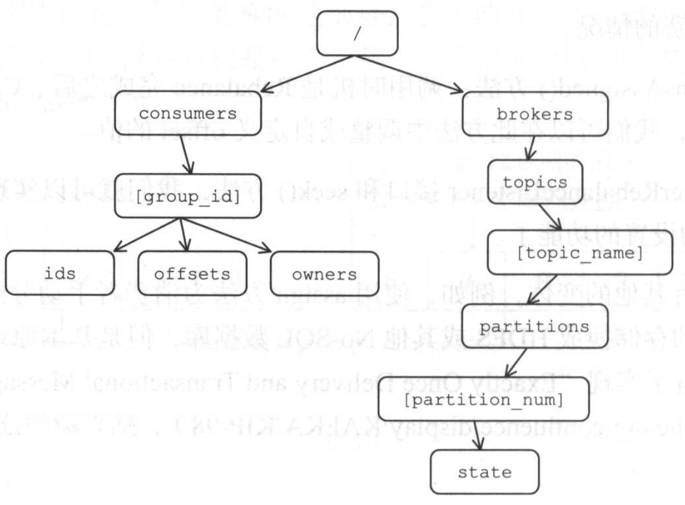
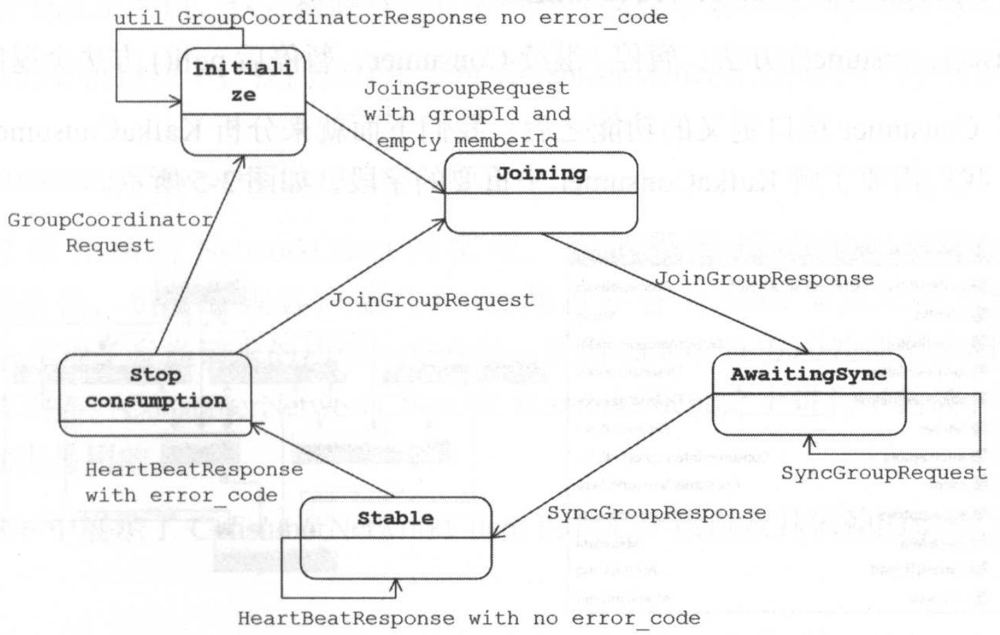

### Rebalance

#### 方案一

Kafka 最开始的解决方案是通过 ZooKeeper 的 Watcher 实现的。每个 Consumer Group在 ZooKeeper下都维护了一个“/consumers/[group_id]/ids”路径，在此路径下使用临时节点记录属于此Consumer Group 的消费者的 Id，由 Consumer 启动时创建。还有两个与 ids节点同级的节点，它们分别是：owners 节点，记录了分区与消费者的对应关系；offsets 节点，记录了此 Consumer Group 在某个分区上的消费位置。

每个Broker、Topic以及分区在ZooKeeper中也都对应一个路径，如下所示。

- /brokers/ids/broker_id:记录了host、port以及分配在此Broker上的Topic的分区列表。
- /brokers/topics/[topic_name]：记录了每个Partition的Leader、ISR等信息。
- /brokers/topics/[topic_name]/partitions/[partition_num]/state：记录了当前 Leader、选
  举epoch等信息。

每个Consumer都分别在“/consumers/[group_id]/ids”和“/brokers/ids”路径上注册一个Watcher。当“/consumers/[group_id]/ids”路径的子节点发生变化时，表示Consumer Group 中的消费者出现了变化；当“/brokers/ids”路径的子节点发生变化时，表示 Broker出现了增减。这样，通过 Watcher，每个消费者就可以监控Consumer Group和Kafka集群的状态了。这个方案看上去不错,但是严重依赖于ZooKeeper集群,有两个比较严重的问题:

- 羊群效应（Herd Effect）：先解释一下什么是“羊群效应“一个被 Watch的ZooKeeper 节点变化，导致大量的 Watcher 通知需要被发送给客户端，这将导致在通知期间其他操作延迟。一般出现这种情况的主要原因就是没有找到客户端真正的关注点，也算是滥用Watcher的一种场景。继续前面的分析，任何Broker或Consumer加人或退出，都会向其余所有的Consumer发送Watcher通知触发Rebalance，就出现了“羊群效应”

- 脑裂（Split Brain）：每个Consumer都是通过ZooKeeper中保存的这些元数据判断ConsumerGroup状态、Broker的状态以及Rebalance结果的，由于ZooKeeper只保证“最终一致性”，不保证“Simultaneously Consistent Cross-Client Views’不同Consumer在同一时刻可能连接到ZooKeeper集群中不同的服务器，看到的元数据就可能不一样，这就会造成不正确的Rebalance尝试。 

#### 方案二

由于上述两个原因，Kafka的后续版本对Rebalance操作进行了改进，也对消费者进行了重新设计。其核心设计思想是：将全部的Consumer Group分成多个子集，每个Consumer Group子集在服务端对应一个GroupCoordinator对其进行管理，GroupCoordinator 是 KafkaServer 中用于管理 Consumer Group 的组件。消费者不再依赖ZooKeeper，而只有GroupCoordinator在ZooKeeper上添加Watcher。消费者在加入或退出Consumer Group时会修改ZooKeeper中保存的元数据，这点与上文描述的方案一类似，此时会触发 GroupCoordinator 设置的 Watcher，通知GroupCoordinator 开始 Rebalance 操作。下面简述这个过程：

1、 当前消费者准备加人某Consumer Group或是GroupCoordinator发生故障转移时，消费者并不知道GroupCoordinator的网络位置，消费者会向Kafka集群中的任一Broker发送ConsumerMetadataRequest，此请求中包含了其Consumer Group的 GroupId，收到请
求的 Broker 会返回 ConsumerMetadataResponse作为响应，其中包含了管理此ConsumerGroup 的 GroupCoordinator 的相关信息。

2、消费者根据ConsumerMetadataResponse中的GroupCoordinator信息，连接到GroupCoordinator 并周期性地发送 HeartbeatRequest, HeartbeatRequest 的具体格式在后面会详细介绍。发送 HeartbeatRequest的主要作用是为了告诉GroupCoordinator此消费者正常在线，GroupCoordinator 会认为长时间未发送 HeartbeatRequest的消费者已经下线，触发新一轮的 Rebalance 操作。

3、如果HeartbeatResponse中带有IllegalGeneration异常，说明GroupCoordinator发起了Rebalance操作，此时消费者发送JoinGroupRequest（具体格式在后面介绍）给GroupCoordinator，JoinGroupRequest的主要目的是为了通知GroupCoordinator,
当前消费者要加入指定的Consumer Group。之后，GroupCoordinator会根据收到的JoinGroupRequest和ZooKeeper中的元数据完成对此ConsumerGroup的分区分配。

4、GroupCoordinator会在分配完成后，将分配结果写人 ZooKeeper保存，并通过JoinGroupResponse 返回给消费者。消费者就可以根据JoinGroupResponse中分配的分区开始消费数据。

5、消费者成功成为 Consumer Group的成员后，会周期性发送HeartbeatRequest。如果HeartbeatResponse 包含 IllegalGeneration异常，则执行步骤3。如果找不到对应的GroupCoordinator（HeartbeatResponse包含NotCoordinatorForGroup异常），则周期性地执行步骤1，直至成功。

上面这种方案虽然解决了“羊群效应”，但是还是有两个问题：

- 分区分配的操作是在服务端的GroupCoordinator中完成的，这就要求服务端实现Partition的分配策略。当要使用新的 Partition分配策略时，就必须修改服务端的代码或配置，之后重启服务，这就显得比较麻烦。
- 不同的Rebalance策略有不同的验证需求。当需要自定义分区分配策略和验证需求时，就会很麻烦。

#### 方案三

为了解决上述问题，Kafka 0.9版本中进行了重新设计，将分区分配的工作放到了消费者这一端进行处理，而Consumer Group管理的工作则依然由GroupCoordinator处理。这就让不同的模块关注不同的业务，实现了业务的切分和解耦。

重新设计后的协议在上一版本的协议上进行了修改，将JoinGroupRequest的处理过程拆分成了两个阶段，分别是JoinGroup阶段和Synchronizing Group State 阶段。

当消费者查找到管理当前Consumer Group的GroupCoordinator 后，就会进入 Join Group 阶段，Consumer 首先向 GroupCoordinator 发送 JoinGroupRequest 请求，其中包含消费者的相关信息；服务端的 GroupCoordinator 收到JoinGroupRequest后会暂存消息，收集到全部消费者之后，根据JoinGroupRequest中的信息来确定Consumer Group中可用的消费者，从中选取一个消费者成为 Group Leader，还会选取使用的分区分配策略，最后将这些信息封装成JoinGroupResponse返回给消费者。

虽然每个消费者都会收到JoinGroupResponse,但是只有Group Leader 收到的JoinGroupResponse 中封装了所有消费者的信息。当消费者确定自己是 Group Leader后，会根据消费者的信息以及选定的分区分配策略进行分区分配。