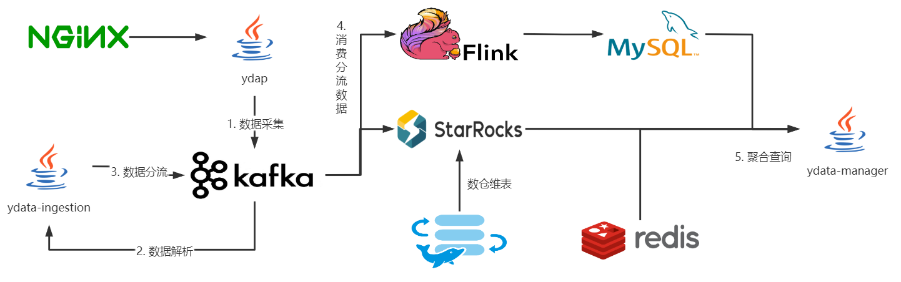
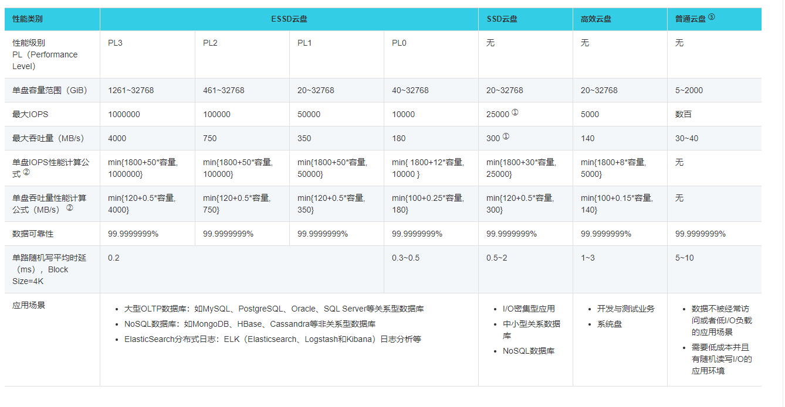
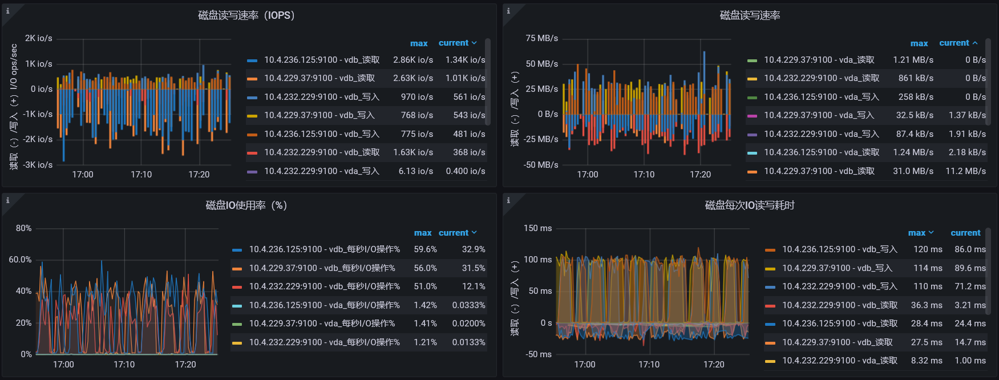
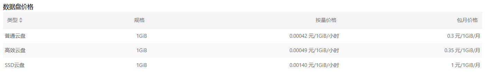
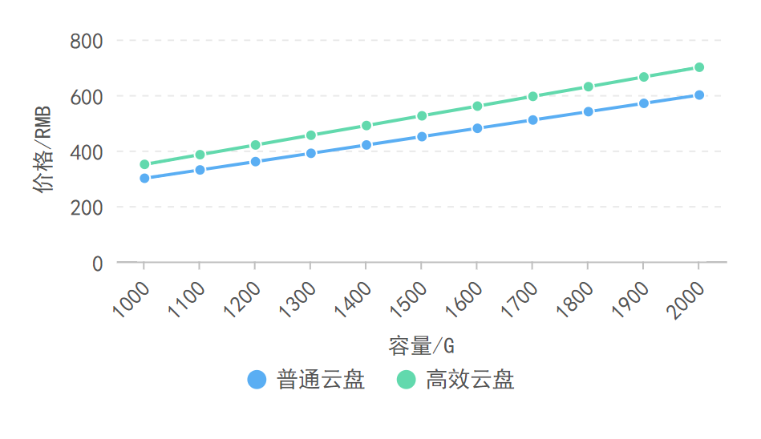
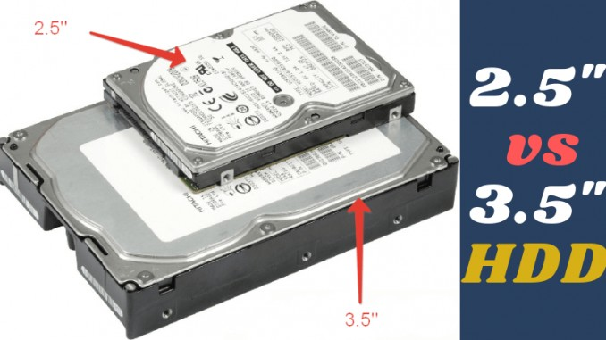
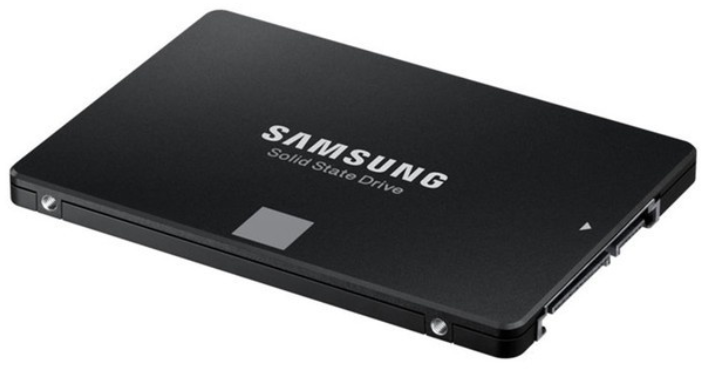
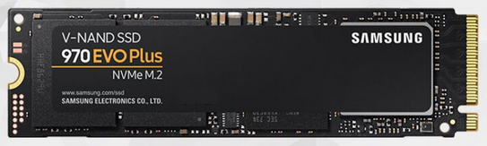
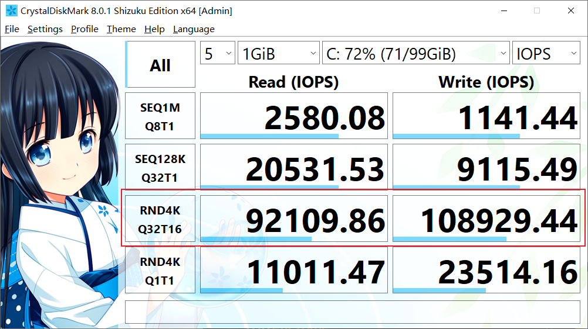
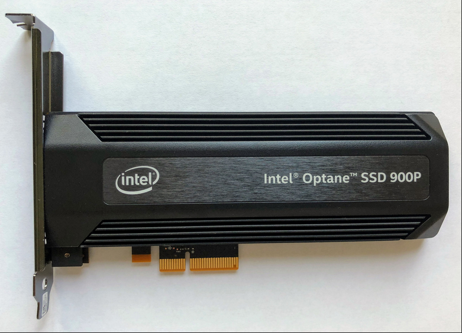

## 部署架构

### 总体架构

### StarRocks架构

现阶段的StarRocks使用3台Linux虚拟机进行部署，服务器规格为12核CPU，24G内存。Be作为存储节点，需要的内存资源较多，我们通过一些参数配置，给BE配置了18G左右的内存，同时在3台Linux上都部署了Be节点。Fe节点以管理StarRocks集群，但由于Fe选举算法的相关问题，我们没有使用3Fe节点进行部署。Broker用以进行数据导入导出。ProxySQL用以代理Fe节点。

## 云部署

当前我们的StarRocks集群都部署在阿里云的Linux服务器上。使用的磁盘为阿里云提供的高效云盘。

受限于阿里云和公司机房网络带宽的问题，存储冷数据，我们仅推荐使用阿里云提供的磁盘进行存储。

### 规格对比

以下为阿里云提供的磁盘存储性能规格的对比。存储冷数据，受限于价格，我们只考虑高效云盘和普通云盘。而在众多的性能指标中，最大IOPS和磁盘容量是我们最关心的。

普通云盘的最大iops没有具体的指标，只有"数百"，我们姑且以800计算。而高效云盘最小IOPS为1960，最大为5000，在400G以上时，IOPS就可达到最大值。由于冷数据的量会比较多，所以肯定是需要400G以上的容量的。

所以，高效云盘的IOPS性能会比普通云盘高出高出5倍。

对于热数据而言，使用高效云盘进行存储就比较困难了，下图是生产环境，StarRocks挂载的高效云盘使用率的情况。

可以看到，磁盘的使用率经常能够达到50%，所以，应该使用性能更高的ESSD进行存储。

### 存储成本

在阿里云[官方文档](https://www.aliyun.com/price/product?spm=5176.8030368.1058477.5.133d3aa4ckFtII#/disk/detail/disk)上，可以看到具体的价格。截取1T～2T时，存储成本的变化，制作成折线图。

从折线图可以很直观的看出，使用性能相当于高效云盘1/5的普通云盘，价格并不会便宜多少。

所以，我们从性能和存储成本综合考量，冷数据应该使用高效云盘进行存储。

### 规格建议

高效云盘的最大IOPS只有5000，1T和32T的磁盘的性能是一样的，所以，在软件允许的情况下，应该挂载多块硬盘以提高IOPS的上限。如3块10T的高效云盘和1块30T的高效云盘价格一样，但性能却高出了三倍。

StarRocks支持挂载多块磁盘，并且可以自动对数据进行均衡，所以，可以使用上述的策略，来提高冷数据盘的IOPS。**线上一天的数据量大约为10G，现有3个BE节点，每个节点挂载2块1T的高效云盘，可以支撑大约2年，一年的冷数据存储成本为12600元。**

而对于热数据而言，每个BE节点直接挂载1块PL1级别的ESSD硬盘，容量应在600G左右，一年的热数据存储成本为21600元。

## 机房部署

### 规格对比

#### 机械硬盘

- 3.5存机械硬盘

优点：容量大，单块至多18TB。故障率较为稳定。非严重物理损坏，数据可恢复。价格便宜。

缺点：体积大，发热大。4K读写速度慢，顺序读写约为200mb/s左右。

- 2.5寸机械硬盘

一般用于笔记本和服务器，较少用于家用台式机。

优点：体积小。非严重物理损坏，数据可恢复。

缺点：磁盘容量小，单块至多4TB。故障率高。4K读写速度慢，顺序读写约为200mb/s左右。价格比3.5寸硬盘贵。

机械硬盘的IOPS性能与上述的普通云盘比较接近，均为几百。但机械硬盘的顺序读写性能可答200mb/s。

#### SATA固态

与2.5寸硬盘大小一致，与机械硬盘一样，都是通过蓝桥芯片的Sata协议进行读写。

优点：发热小，体积小。4K读写速度快。

缺点：容量小，服务器常用的最大容量为4TB。数据丢失不可恢复。

SATA固态的读写速度受限于sata3协议，顺序读写速度上限为500mb/s，但IOPS可高达3W。

#### PCIE固态

PCIE是直连CPU的数据通道，因为直连CPU，所以速度会非常快。

- NVME & U2

NVME和U2固态实际上也是走的PCIE通道，家用主板通常有专门的NVME插槽，服务器主板一般还会有U2的插槽。

优点：发热小，体积小，4K和顺序读写非常快。

缺点：容量小，服务器常用的容量为2TB。数据丢失不可恢复。价格昂贵。插槽少，受限于CPU的PCIE的通道数，只能少量使用。

以下是三星PCIE3.0固态的性能图，顺序读写只有最新的PCIE4.0的一半，但IOPS仍然高达10W。

- PCIE

一般直接插PCIE的固态硬盘，都是专门为了热数据、非常珍贵的数据而准备的，价格也异常的昂贵。

优点：发热小，体积小，4K和顺序读写非常快。大多自带磁盘阵列，非物理损坏，否则不会丢失数据。

缺点：容量小，服务器常用的最大容量为4TB。价格昂贵，无法大规模使用。

### 存储成本

机房部署的成本，如果不考虑服务器费用、不考虑电费、不考虑机房运维、不考虑网费的情况下，肯定是比云部署便宜的。

而且，由于众所周知的原因，磁盘的性能和价格排序为**PCIE固态>SATA固态>机械硬盘**，所以也不需要再进行比较了。

所以，存储成本上考量，PCIE的NVME固态或者U2固态，应该用以存储热数据，而冷数据，只用机械硬盘来存储，不管是2.5寸还是3.5寸都可以。

### 规格建议

根据上述云部署中提及的数据量，购买相应规格的磁盘，组成阵列，部署即可。。
