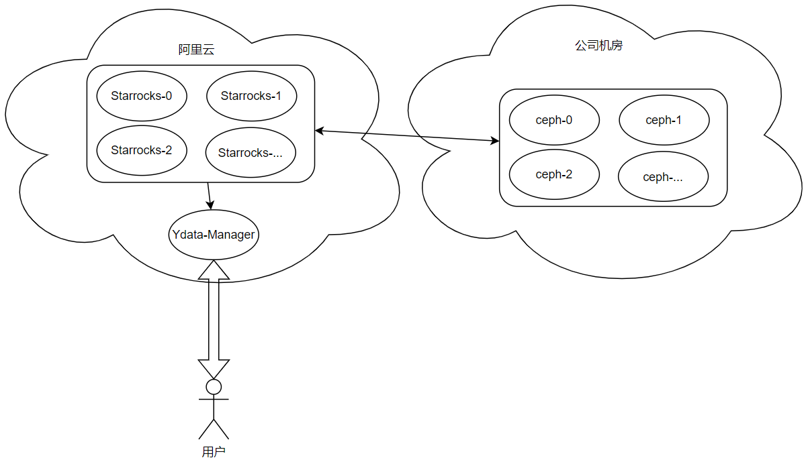
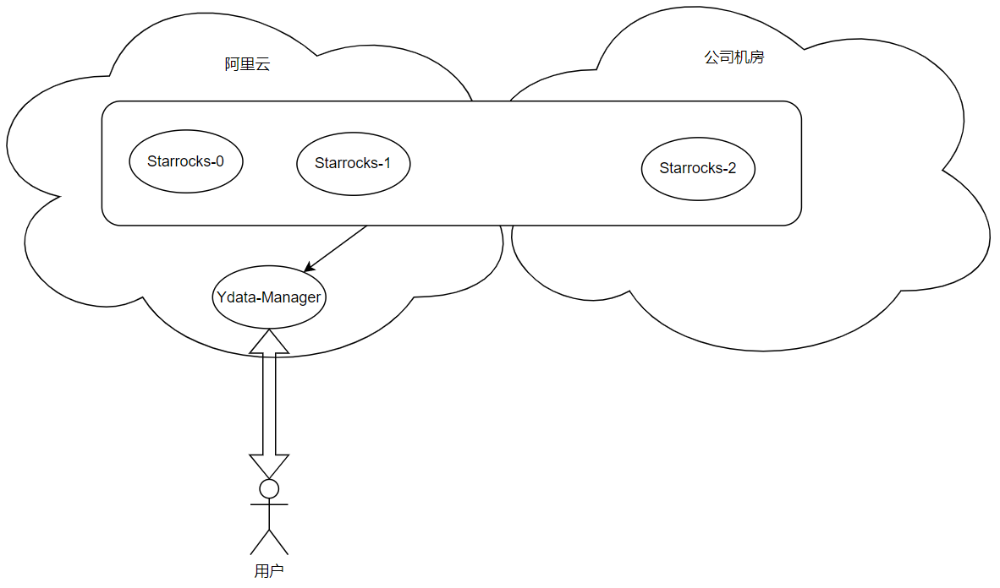
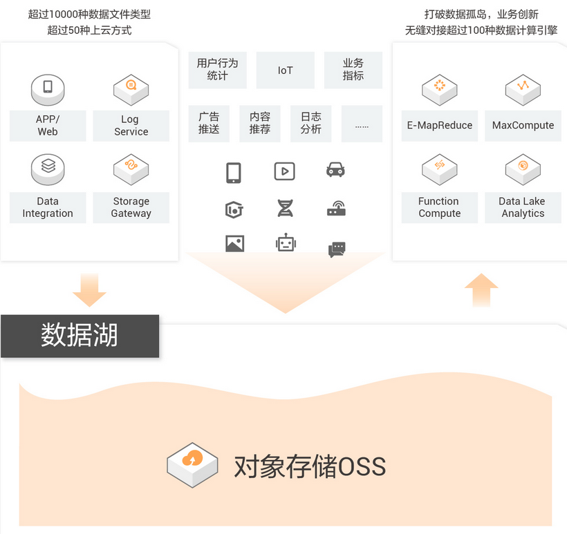
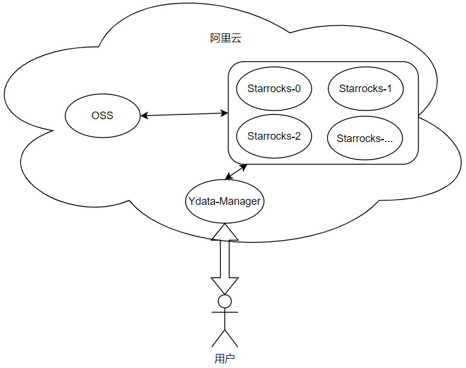
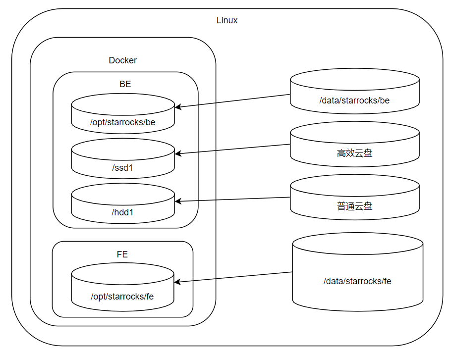
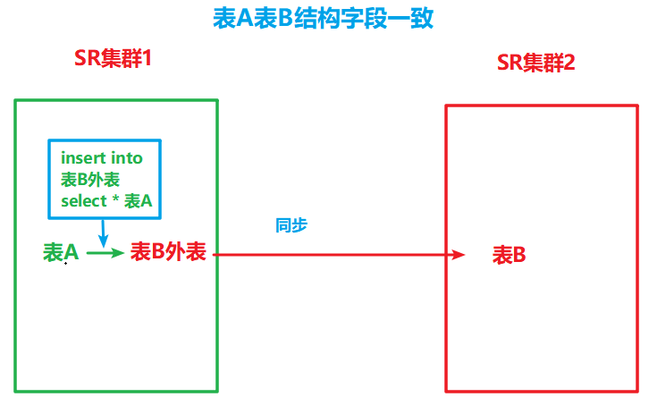
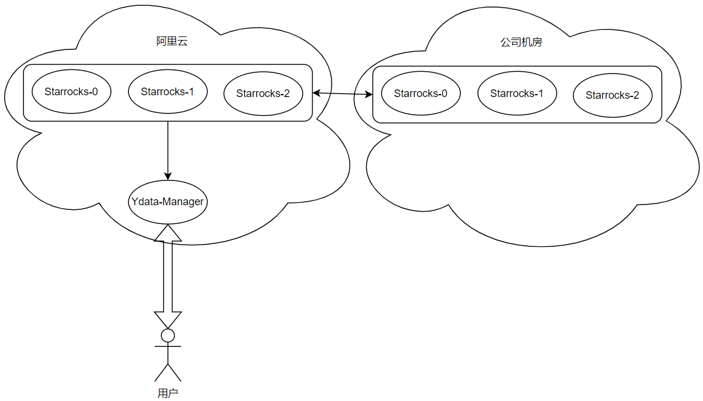
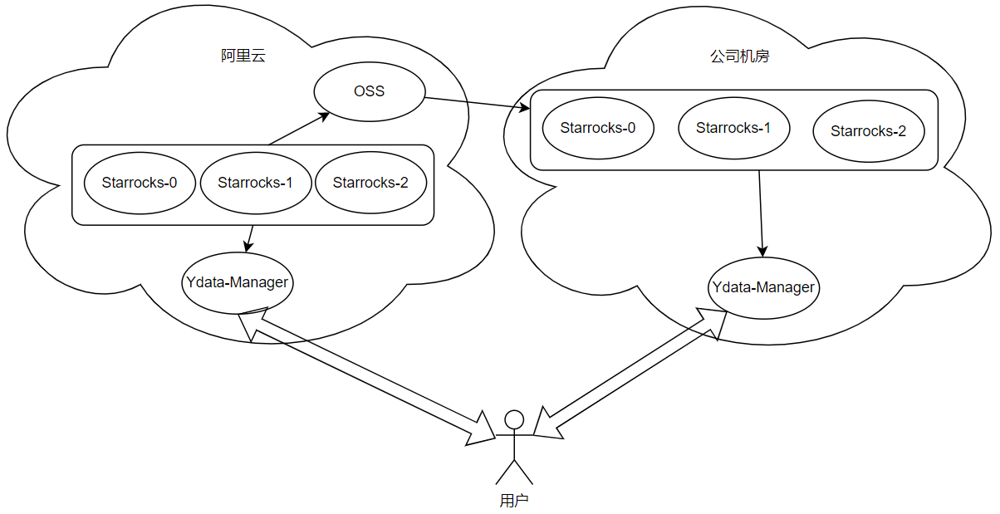
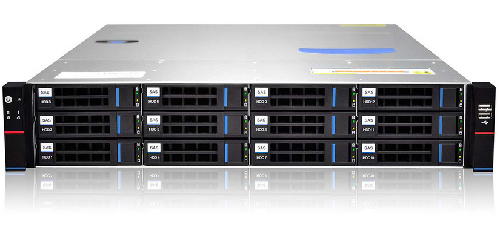
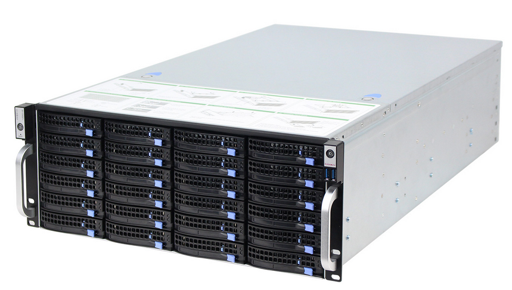

### 冷热数据

#### 单集群部署-Ceph

在阿里云上部署一套starrocks集群，在厦门机房部署ceph等分布式存储系统，将公司机房的存储资源，映射为阿里云的starrocks集群中的磁盘目录。

热数据使用阿里云提供的高效云盘，冷数据使用厦门机房存储资源映射的磁盘。



关注点：

- 分布式存储系统，如ceph等，映射为starrocks的磁盘目录，需要运维同事维护，开发不做过多的投入。
- 仅仅是将冷数据的存储转移到厦门机房中，但冷热数据的摄取、查询等，都需要阿里云的starrocks集群处理，随着数据量的增多，阿里云的starrocks还是得不可避免的扩资源、扩容。
- 厦门现有ceph系统，无需从零搭建，存储介质为机械硬盘，存储成本较低。
- 厦门机房服务器的上下行带宽只有1MB/s的网速，挂载磁盘后将会非常慢，甚至传输失败。


#### 单集群部署-跨网络

阿里云部署的starrocks节点，配置仅有SSD。厦门机房部署的starrocks节点，配置仅有HDD。通过建表时指定初始存储介质，机型



关注点：

- 该方案starrocks不一定支持，需要验证


#### 单集群部署-OSS

类似于之前亚马逊宣讲的数据湖



安装OSS的客户端，将现有的阿里云OSS服务映射成磁盘路径。在Starrocks中配置HDD的磁盘路径。




关注点：

- 本地机房部署，存储成本较低，但是阿里云的服务器和本地机房的网络带宽成本比较高。如一天30G的数据，传输到厦门的本地机房，1mb/s的传输速度，
- 阿里云的OSS服务，存储成本同样很低，starrocks集群部署在阿里云上，走的内部网络，速度更快。
- 阿里云的OSS服务映射为磁盘，有[官方的解决方案](https://github.com/aliyun/ossfs)。内网环境[性能](https://help.aliyun.com/document_detail/54464.html)比机械硬盘更佳，10 Gbit/s比raid的机械硬盘还要快几倍。
- ossfs是一个独立的进程，需要占用CPU和内存资源


验证结果：OSS在存储容量、成本、网速上都比较优秀。但是作为一个对象存储系统，过多的文件会造成瓶颈。而starrocks恰好会创建非常多的文件，14张表的情况下，会创建十几万个文件。导致与冷数据相关的DDL等，都会耗时非常久，基本不可用。


#### 单集群部署-高效云盘+普通云盘

阿里云提供普通云盘的块存储类型(亚马逊对应的硬盘类型为Cool HDD)，可以作为冷数据存储的介质。直接挂载在虚拟机上，然后在starrocks中配置即可，使用较为简单。



阿里云磁盘性能等级


关注点：

- 普通云盘最大容量为2T，但高效云盘和普通云盘都可以挂载多块，starrocks配置文件对应修改即可
- 普通云盘的速度仅有40mb/s,且支持的并发比较低，查询冷数据时会比机房部署的机械硬盘慢
- 基于starrocks原有功能，方案也较为简单，预计后期不会有太多bug
- starrocks支持热数据->冷数据的迁移，冷数据->热数据目前存在bug


#### 双集群部署-外表

在阿里云中部署一套用于写热数据的starrocks集群，在厦门本地机房，再部署一套用于读的starrocks集群。通过starrocks的[外部表](https://docs.starrocks.com/zh-cn/main/using_starrocks/External_table#starrocks%E5%A4%96%E9%83%A8%E8%A1%A8)功能，实现数据的迁移和读写。




步骤流程：

①集群1的starrocks挂载一块普通的、容量比较小的磁盘，作为临时的存储

②集群2的starrocks挂载一块高性能的、容量比较小的磁盘用于热数据读写，再挂载一块普通的、容量较大的磁盘用于冷数据读写

③集群2的冷热数据划分，可以在建表时，指定分区存储的路径

④将集群1中的数据定时迁移到集群2中，并定时将集群1中，已经迁移的数据给删除掉，避免数据的堆积



关注点：

- 外部表对查询性能的影响待评估，而且仅可以在外表上执行insert into 和show create table操作，不支持其他数据写入方式，也不支持查询和DDL
- 不管是热数据还是冷数据，都存储在公司机房的starrocks集群中，但外部表使用受限，数据备份等，还是得通过阿里云的starrocks集群进行
- 阿里云的starrocks集群理论上不会占用较多的资源，随着数据的增多，厦门机房的starrocks集群压力会更加明显
- 与厦门网络发生关联的方案，全部受20M网络带宽的限制，单节点传输仅有1mb/s的速度
- 需要维护两套集群


#### 双集群部署-

starrocks数据备份的方案，支持多数据源的导出，如HDFS、OSS、S3等。在国内，目前需要备份方案是OSS。冷热数据，可以是云端存热数据和一部分冷数据，在公司机房，存储全量的冷数据



关注点：

- 用户在查询冷数据时，需要到另一个页面进行查询
- 功能如果数据展示的数据跨度，既有热数据，也有在公司机房的冷数据，可能会导致功能出错
- OSS的数据比较多时，受网络带宽的限制，一天的数据，可能拉一天都不一定能拉到机房中，估算为80G时可能会出现
- 需要维护两套集群


### 磁盘性能评估

如设计要求：20并发查询2小时内的会议数据，响应时间在3s内。

设分区粒度为p（天数），分桶数为b，每天存储的数据量为d，响应时间为s，查询范围为r（天数，如1/12），starrocks的be节点数为n，并发数为c


$$
\frac {\frac{p*d}{b}*\frac{r*b}{p}}{n*s} *c
$$
p*d ： 表示一个分区存储的数据量

p*d/b：表示一个分桶存储的数据量

r/p：表示扫描的分区比例

r*b/p：表示扫描的分桶数


化简后：
$$
\frac {d*r}{n*s} *c
$$
如c=20，d=3G，r=1/12，n=3，s=3s，计算可得磁盘的速度要求在555mb/s左右（**仅供参考**）。

555mb/s的速度，贴近于sata固态硬盘的读取速度。三星860evo（企业级固态不会有太大差距）的速度大致约为500mb/s，该硬盘的IOPS约为20000，考虑到为生产环境留足余量，应使用ESSD的PL1以上的固态。 

   

### 磁盘实时监控

#### iostat

监视系统输入输出设备和CPU的使用情况


##### 补充说明

**iostat命令** 被用于监视系统输入输出设备和CPU的使用情况。它的特点是汇报磁盘活动统计情况，同时也会汇报出CPU使用情况。同vmstat一样，iostat也有一个弱点，就是它不能对某个进程进行深入分析，仅对系统的整体情况进行分析。


##### 语法

```shell
iostat(选项)(参数)
```


##### 选项

```shell
-c：仅显示CPU使用情况；
-d：仅显示设备利用率；
-k：显示状态以千字节每秒为单位，而不使用块每秒；
-m：显示状态以兆字节每秒为单位；
-p：仅显示块设备和所有被使用的其他分区的状态；
-t：显示每个报告产生时的时间；
-V：显示版号并退出；
-x：显示扩展状态。
```


##### 参数

- 间隔时间：每次报告的间隔时间（秒）；
- 次数：显示报告的次数。


##### 实例

用`iostat -x /dev/sda1`来观看磁盘I/O的详细情况：

```shell
iostat -x /dev/sda1 
Linux 2.6.18-164.el5xen (localhost.localdomain)
2010年03月26日  

avg-cpu:  %user   %nice %system %iowait 
%steal   %idle  
            0.11    0.02    0.18    0.35   
0.03    99.31  

Device:         tps   Blk_read/s    Blk_wrtn/s  
Blk_read   Blk_wrtn  
sda1                0.02          0.08       
0.00          2014               4 
```

详细说明：第二行是系统信息和监测时间，第三行和第四行显示CPU使用情况（具体内容和mpstat命令相同）。这里主要关注后面I/O输出的信息，如下所示：

| 标示     | 说明                              |
| -------- | --------------------------------- |
| Device   | 监测设备名称                      |
| rrqm/s   | 每秒需要读取需求的数量            |
| wrqm/s   | 每秒需要写入需求的数量            |
| r/s      | 每秒实际读取需求的数量            |
| w/s      | 每秒实际写入需求的数量            |
| rsec/s   | 每秒读取区段的数量                |
| wsec/s   | 每秒写入区段的数量                |
| rkB/s    | 每秒实际读取的大小，单位为KB      |
| wkB/s    | 每秒实际写入的大小，单位为KB      |
| avgrq-sz | 需求的平均大小区段                |
| avgqu-sz | 需求的平均队列长度                |
| await    | 等待I/O平均的时间（milliseconds） |
| svctm    | I/O需求完成的平均时间             |
| %util    | 被I/O需求消耗的CPU百分比          |


#### dstat-我比较喜欢

通用的系统资源统计工具，挺好用的，dstat -cdn 

##### 补充说明

**dstat命令** 是一个用来替换vmstat、iostat、netstat、nfsstat和ifstat这些命令的工具，是一个全能系统信息统计工具。与sysstat相比，dstat拥有一个彩色的界面，在手动观察性能状况时，数据比较显眼容易观察；而且dstat支持即时刷新，譬如输入`dstat 3`即每三秒收集一次，但最新的数据都会每秒刷新显示。和sysstat相同的是，dstat也可以收集指定的性能资源，譬如`dstat -c`即显示CPU的使用情况。

##### 下载安装

**方法一**

```shell
yum install -y dstat
```

**方法二**

官网下载地址：http://dag.wieers.com/rpm/packages/dstat

```shell
wget http://dag.wieers.com/rpm/packages/dstat/dstat-0.6.7-1.rh7.rf.noarch.rpm
rpm -ivh dstat-0.6.7-1.rh7.rf.noarch.rpm
```

##### 使用说明

安装完后就可以使用了，dstat非常强大，可以实时的监控cpu、磁盘、网络、IO、内存等使用情况。

直接使用dstat，默认使用的是`-cdngy`参数，分别显示cpu、disk、net、page、system信息，默认是1s显示一条信息。可以在最后指定显示一条信息的时间间隔，如`dstat 5`是没5s显示一条，`dstat 5 10`表示没5s显示一条，一共显示10条。

```shell
[root@iZ23uulau1tZ ~]# dstat
----total-cpu-usage---- -dsk/total- -net/total- ---paging-- ---system--
usr sys idl wai hiq siq| read  writ| recv  send|  in   out | int   csw
  0   0  99   0   0   0|7706B  164k|   0     0 |   0     0 | 189   225
  0   0 100   0   0   0|   0     0 |4436B  826B|   0     0 | 195   248
  1   0  99   0   0   0|   0     0 |4744B  346B|   0     0 | 203   242
  0   0 100   0   0   0|   0     0 |5080B  346B|   0     0 | 206   242
  0   1  99   0   0   0|   0     0 |5458B  444B|   0     0 | 214   244
  1   0  99   0   0   0|   0     0 |5080B  346B|   0     0 | 208   242
```

下面对显示出来的部分信息作一些说明：

1. cpu：hiq、siq分别为硬中断和软中断次数。
2. system：int、csw分别为系统的中断次数（interrupt）和上下文切换（context switch）。

其他的都很好理解。

###### 语法

```shell
dstat [-afv] [options..] [delay [count]]
```

###### 常用选项

```shell
-c：显示CPU系统占用，用户占用，空闲，等待，中断，软件中断等信息。
-C：当有多个CPU时候，此参数可按需分别显示cpu状态，例：-C 0,1 是显示cpu0和cpu1的信息。
-d：显示磁盘读写数据大小。
-D hda,total：include hda and total。
-n：显示网络状态。
-N eth1,total：有多块网卡时，指定要显示的网卡。
-l：显示系统负载情况。
-m：显示内存使用情况。
-g：显示页面使用情况。
-p：显示进程状态。
-s：显示交换分区使用情况。
-S：类似D/N。
-r：I/O请求情况。
-y：系统状态。
--ipc：显示ipc消息队列，信号等信息。
--socket：用来显示tcp udp端口状态。
-a：此为默认选项，等同于-cdngy。
-v：等同于 -pmgdsc -D total。
--output 文件：此选项也比较有用，可以把状态信息以csv的格式重定向到指定的文件中，以便日后查看。例：dstat --output /root/dstat.csv & 此时让程序默默的在后台运行并把结果输出到/root/dstat.csv文件中。
```

当然dstat还有很多更高级的用法，常用的基本这些选项，更高级的用法可以结合man文档。

###### 实例

如想监控swap，process，sockets，filesystem并显示监控的时间：

```shell
[root@iZ23uulau1tZ ~]# dstat -tsp --socket --fs
----system---- ----swap--- ---procs--- ------sockets------ --filesystem-
  date/time   | used  free|run blk new|tot tcp udp raw frg|files  inodes
26-07 09:23:48|   0     0 |  0   0 0.0|104   8   5   0   0|  704   6488
26-07 09:23:49|   0     0 |  0   0   0|104   8   5   0   0|  704   6488
26-07 09:23:50|   0     0 |  0   0   0|104   8   5   0   0|  704   6489
26-07 09:23:51|   0     0 |  0   0   0|104   8   5   0   0|  704   6489
26-07 09:23:52|   0     0 |  0   0   0|104   8   5   0   0|  704   6489
26-07 09:23:53|   0     0 |  0   0   0|104   8   5   0   0|  704   6489
```

若要将结果输出到文件可以加`--output filename`：

```shell
[root@iZ23uulau1tZ ~]# dstat -tsp --socket --fs --output /tmp/ds.csv
----system---- ----swap--- ---procs--- ------sockets------ --filesystem-
  date/time   | used  free|run blk new|tot tcp udp raw frg|files  inodes
26-07 09:25:31|   0     0 |  0   0 0.0|104   8   5   0   0|  736   6493
26-07 09:25:32|   0     0 |  0   0   0|104   8   5   0   0|  736   6493
26-07 09:25:33|   0     0 |  0   0   0|104   8   5   0   0|  736   6493
26-07 09:25:34|   0     0 |  0   0   0|104   8   5   0   0|  736   6493
26-07 09:25:35|   0     0 |  0   0   0|104   8   5   0   0|  736   6494
26-07 09:25:36|   0     0 |  0   0   0|104   8   5   0   0|  736   6494
```

这样生成的csv文件可以用excel打开，然后生成图表。

通过`dstat --list`可以查看dstat能使用的所有参数，其中上面internal是dstat本身自带的一些监控参数，下面`/usr/share/dstat`中是dstat的插件，这些插件可以扩展dstat的功能，如可以监控电源（battery）、mysql等。

下面这些插件并不是都可以直接使用的，有的还依赖其他包，如想监控mysql，必须要装python连接mysql的一些包。

```shell
[root@iZ23uulau1tZ ~]# dstat --list
internal:
        aio, cpu, cpu24, disk, disk24, disk24old, epoch, fs, int, int24, io, ipc, load, lock, mem, net, page, page24, proc, raw, socket, swap, swapold, sys, tcp, time, udp, unix, vm
/usr/share/dstat:
        battery, battery-remain, cpufreq, dbus, disk-util, fan, freespace, gpfs, gpfs-ops, helloworld, innodb-buffer, innodb-io, innodb-ops, lustre, memcache-hits, mysql-io, mysql-keys, mysql5-cmds, mysql5-conn, mysql5-io, mysql5-keys,
        net-packets, nfs3, nfs3-ops, nfsd3, nfsd3-ops, ntp, postfix, power, proc-count, rpc, rpcd, sendmail, snooze, thermal, top-bio, top-cpu, top-cputime, top-cputime-avg, top-io, top-latency, top-latency-avg, top-mem, top-oom, utmp,
        vm-memctl, vmk-hba, vmk-int, vmk-nic, vz-cpu, vz-io, vz-ubc, wifi
```


### 常见存储服务器种类

#### 硬盘种类


- 3.5存机械硬盘

优点：容量大，单块至多18TB。故障率较为稳定。非严重物理损坏，数据可恢复。价格便宜。

缺点：体积大，发热大。4K读写速度慢，顺序读写约为200mb/s左右。


- 2.5寸机械硬盘

一般用于笔记本和服务器，较少用于家用台式机。

优点：体积小。非严重物理损坏，数据可恢复。

缺点：磁盘容量小，单块至多4TB。故障率高。4K读写速度慢，顺序读写约为200mb/s左右。价格比3.5寸硬盘贵。


- sata固态硬盘


与2.5寸硬盘大小一致，与机械硬盘一样，都是通过蓝桥芯片的Sata协议进行读写。

优点：发热小，体积小。4K读写速度快。

缺点：容量小，服务器常用的最大容量为4TB。数据丢失不可恢复。读写速度受限于sata3协议，顺序读写速度上限为500mb/s。


- nvme固态硬盘


优点：发热小，体积小，4K和顺序读写非常快。

缺点：容量小，服务器常用的容量为2TB。数据丢失不可恢复。价格昂贵。插槽少，受限于CPU的PCIE的通道数，只能少量使用。


- PCIE固态硬盘


PCIE是直连CPU的数据通道，因为直连CPU，所以速度会非常快。

NVME协议实际上也是走的PCIE，但家用主板或者是服务器主板，通常有专门的NVME插槽。不过存在部分直接插PCIE通道的固态硬盘，这些固态硬盘无法插NVME的插槽（或需要转换），所以单独列出。

一般直接插PCIE的固态硬盘，都是专门为了热数据、非常珍贵的数据而准备的，价格也异常的昂贵。


优点：发热小，体积小，4K和顺序读写非常快。大多自带磁盘阵列，数据不会丢失。

缺点：容量小，服务器常用的最大容量为4TB。价格昂贵，无法大规模使用。


PCIE固态硬盘价格过于昂贵，不大可能通过审批。NVME和Sata协议的固态，可以当作热数据的存储介质，机械硬盘则作为冷数据的存储介质。


#### 2U通用服务器

U是服务器机柜的计量单位，可以看做是服务器的高度。

吴工之前买的6台服务器，都是2U高度的。



2U服务器可以塞下2个CPU核心，所以常用于CPU密集型的服务器，还拥有一定的扩展性，也可以作为分布式存储的服务器。前面板在物理上，至多能塞下12块3.5存的机械硬盘，24块2.5存的机械硬盘或sata协议的固态硬盘。最大容量在80T左右


#### 4U服务器

4U服务器一般作为存储服务器，或者深度学习服务器（空间比较大，可以塞多张显卡）。最大容量在160TB左右



#### 定制存储服务器

以希捷（一家硬盘厂商）的存储系统为例，单台至多可以提供2PB的存储容量。没什么不好的，就是贵到怀疑人生。


### 参考

- 磁盘监控：https://cloud.tencent.com/developer/article/1149190

- 外部表：https://docs.starrocks.com/zh-cn/main/using_starrocks/External_table#starrocks%E5%A4%96%E9%83%A8%E8%A1%A8
- CEPH挂载磁盘：https://www.imooc.com/article/277479
- OSS挂载磁盘：https://help.aliyun.com/document_detail/153892.html?spm=5176.21213303.J_6704733920.40.1f123edatqSKLb&scm=20140722.S_help%40%40%E6%96%87%E6%A1%A3%40%40153892.S_0%2Bos0.ID_153892-RL_ossfs-LOC_helpmain-OR_ser-V_2-P0_9
- OSS性能：https://help.aliyun.com/document_detail/54464.html
- ossfs映射工具：https://github.com/aliyun/ossfs

