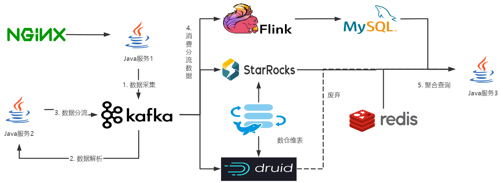
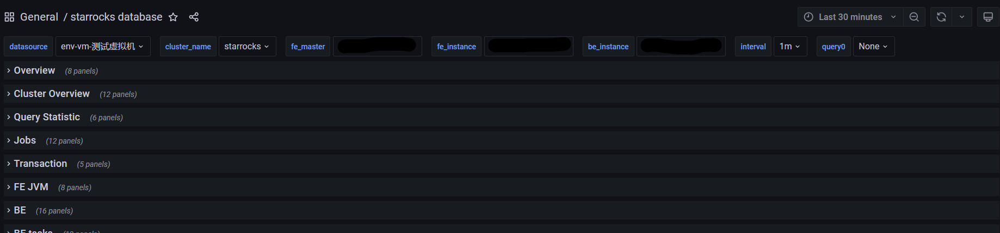
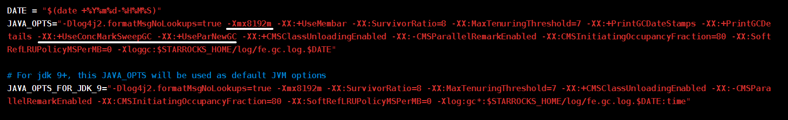
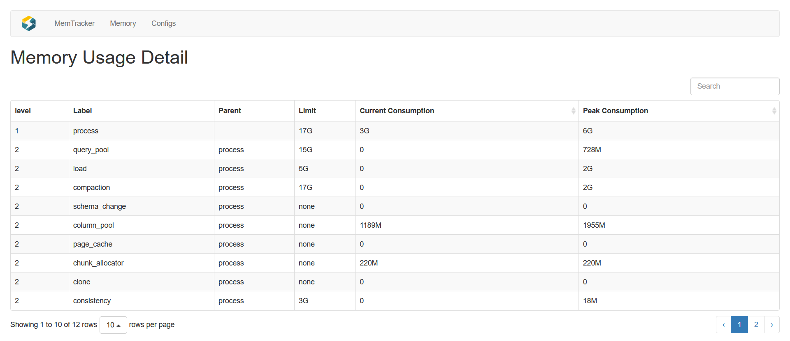
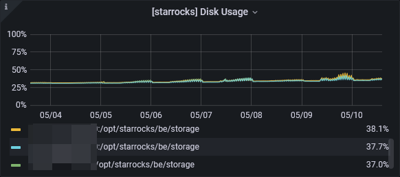
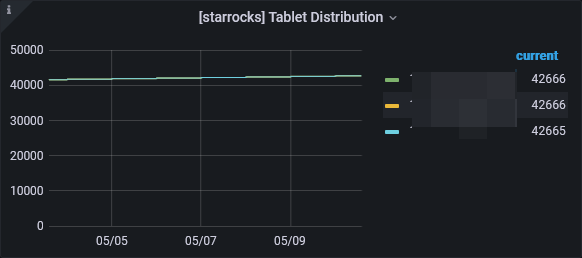

亿联网络 | 林蔚湘


厦门亿联网络技术股份有限公司（股票代码:300628）是面向全球的企业通信上市公司，提供国际品质、技术领先、极致体验的云+端视频会议、IP语音通信及协作解决方案，且与微软等国际品牌达成长期深度的战略合作。

亿联网络以研发为核心，坚持自主创新，拥有世界领先的云计算、音视频及图像处理等核心技术专利，致力于让沟通更简单、更高效，帮助各类企事业单位提高效率和竞争力。其自主品牌Yealink畅销美国、英国、澳大利亚等140多个国家和地区，SIP话机市场占有率为全球第—，用户满意度全球第一。


为了提供更好的音视频服务，亿联网络每天都有大量的日志数据需要存储和分析。基于Druid的数仓系统，虽然能够满足音视频领域维度众多的需求，但是在设计上不支持星型模型，查询上不支持Join语法，运维成本、服务器成本也都比较高。

基于StarRocks的数仓系统，是当今大数据领域的热门方向之一，希望我们的应用经验，可以给感兴趣的朋友带来一点参考。


### 平台架构说明




- Java服务1的作用是接收客户端上报的数据，并发送到Kafka中，外挂一个Nginx边车，作为对外的门面。

- Java服务2是将上报的数据进行解析和分流。为什么不将Java服务1和Java服务2进行合并呢？主要是服务调优上的考量。

  Java服务1直接与客户端对接，其需要面对的并发压力会很高，可以认为是IO密集型服务。Java服务2需要对数据进行解析，比较耗费CPU资源，是CPU密集型服务。如果将两个服务合为一个，可能会导致客户端响应时间增加，Kafka消费者吞吐量下降。

- 分流后的数据，会被Flink、StarRocks或Druid进行消费，Flink主要对一些边界数据、实时数据进行计算。在之前的版本中，我们采用的OLAP引擎是Druid，后续替换成了StarRocks。

- Flink sink的数据，用MySQL存储，主要是StarRocks会对每个insert语句的结果生成一个版本号，版本号堆积到一定量时会报错，当insert速度比较快时，出现的频率就会比较高。不如MySQL方便（也有Druid不支持insert的原因）。

- 使用海豚调度器，对原始数据进行维度抽取，建设DWD、ODS层等数仓维度。

- Java服务3对接具体的业务需求，从Redis、MySQL、StarRokcs中查询对应的数据，并进行聚合封装。


### 平台旧状的痛点

在原先系统设计的架构中，平台的数据存储基于Druid，在当时的时间点上，Druid确实是很多大数据团队，数据存储的首选，而我们在落地应用 Druid的过程中，也存在一些痛点。


例如，Druid对跨表连接查询支持不佳，在一些需要关联多张表的查询场景，只能够通过Java服务一次查单张表进行查询，并在Java服务内进行关联和聚合，该操作会比直接通过SQL连接查询要慢得多，而且内存开销也比较大。在查询并发比较大、查询数据量比较多的情况下，Java服务非常容易OOM。


Druid不支持对数据的删除操作，但是在一些场景下，如测试环境删除脏数据，该功能又是比较迫切的。这应该也是基于段文件存储的局限，但是在使用上却不是很方便，在开发中比较容易受到掣肘。


Druid的节点种类比较多，当集群出现一些异常场景时，如大SQL占用了比较多的资源，导致其它查询响应较久；或者某个节点出现瓶颈；这时，我们排查分析问题的链路会非常长，不大方便快速聚焦定位问题。


在上面描述的一些问题中，如Java程序聚合，除了该实现，目前还没有另外更好的解决方案。这其实已经非常影响到业务方的系统设计了，当在实现业务功能时，还得囿于最重要的数据库，其存储模型的支持程度，开发人员就比较难做出良好的系统设计。所以，我们也一直在关注主流的OLAP存储引擎，这时StarRocks就进入了我们的视野。


### StarRocks与Druid对比

| 对比          | Druid      | StarRocks              |
| ------------- | ---------- | ---------------------- |
| 架构          | 复杂       | 简单                   |
| SQL           | 部分支持   | 支持                   |
| 单表查询      | 快         | 快                     |
| 多表查询      | 基本不可用 | 快                     |
| 数仓建模      | 宽表       | 宽表、星型模型、雪花   |
| 自动Rebalance | 支持       | 支持                   |
| 数据模型      | 明细、聚合 | 明细、聚合、更新、主键 |
| 明细与聚合    | 支持完善   | 支持完善               |
| 数据update    | 不支持     | 支持较为完善           |
| 运维成本      | 高         | 低                     |
| 容器化支持    | 高         | 低                     |
| 社区活跃程度  | 一般       | 高度活跃、反馈力度强   |

在之前的架构中，OLAP使用的使用的是Druid，而StarRocks在上述的对比中，很多方面均优于Druid。

在架构上，Druid节点种类较多，并且还依赖Zookeeper进行元数据管理，查询的聚合操作依赖单节点完成，瓶颈较为明显。作为一个数据库，甚至还依赖了另外的事务数据库。而StarRocks只有FE、BE两种节点。查询时可以通过多层聚合、多节点聚合以提升查询速度。


StarRocks支持MySQL的语法，但其FE节点伪装的是一个低版本的MySQL，Schema存在差异，在一些周边软件（如Flyway）仍然存在兼容性问题， 一般的增删改查则支持良好；StarRocks对连接查询的支持、效率也非常优秀。而Druid则对一般的增删改查都支持不佳，既不支持insert和也不支持update。


从运维成本上看，Druid由于节点类型较多，部署较为复杂，但是Druid可以在K8S上进行容器化部署，基于K8S的运维能力，很大程度上降低了Druid的运维难度。StarRocks虽然只有两种节点，但是其元数据管理基于IP，K8S默认的网络组件不支持固定IP，所以StarRocks不支持K8S部署（可以替换K8S的网络组件以支持，但是对基础组件改动很难确保稳定），但是可以使用Docker的Host网络模式进行部署。


Druid提供一个网页入口，相当于自带一个管理系统，可以进行一些查询、数据导出、任务管理等。StarRocks则只有企业版才能使用网页管理系统，普通的社区版FE、BE节点虽然都有网页入口，但功能比较少，只有一些监控、配置查看的功能。StarRocks对普罗米修斯的支持倒是非常完善，可以查看节点状态、磁盘占用、查询统计、Load Job状态、FE和BE执行情况等信息。




Druid从Kafka拉取数据时，不同的Topic会启动若干个JVM进程进行拉取。不同Topic的数据量存在很大的差异，而Druid启动的JVM参数共用的同一份。如给一个Topic数据量比较大的JVM设置`-Xmx4g`的内存参数，那么所有的JVM进程都会应用上这个参数，即使数据量很少的JVM，也会应用上`-Xmx4g`的参数，导致内存整体上涨。如果将上述参数设置得小一点，多开几个JVM进程，Oricle版的JVM不能共用同一份方法区，导致方法区内存也会随之上涨（Taobao JVM可以，但是很少人用）。相关的JVM参数，如果设置得过小，那么JVM的性能提不上来，摄取的速度就会很慢。对Druid的调优，在实践的过程中比较困难的。

StarRocks从Kafka中拉取数据，是由BE节点完成的。Load期间的CPU和内存占用等已经比较到位，基本不用调优。不过BE节点作为Kafka的消费者，依赖了librdkafka（Kafka C++ SDK），该SDK不支持自动从上一次消费的位置开始消费，仅支持从头（OFFSET_BEGINNING）或从尾（OFFSET_END）开始消费，Routine Load故障时可能需要手动指定分区和偏移量进行重启。而Druid依赖的Kafka Java SDK则可以支持。


Starrokcs官网提供详细的[中文文档](https://docs.StarRocks.com/zh-cn/main/introduction/StarRocks_intro)，涵盖软件部署、核心设计原理、索引种类、数据导入、参考手册、管理手册等，内容非常全面，在公众号上还有更深入的技术原理分享、哔哩哔哩上也有一些原理视频。我们在前期的架构设计中，参考了非常多的StarRocks实时数仓的建设方案。在公众号上也有专门的微信群聊以快速反应问题。我们在微信群聊、官方论坛、github上都提过相关的问题，也都得到过回复，可以说目前StarRocks的社区活跃度非常高，并且反馈力度很强。

而我们在Druid的落地过程中，却并不是很顺利，Druid的文档建设并不完善，相关的原理也比较佶屈聱牙。我们也曾向Druid的开发人员反馈过若干问题，得到的反馈却很少。


### StarRocks调优实践

- FE内存评估

StarRocks的FE节点是一个Java服务，其特点是能够自动进行垃圾回收，所以评估其内存大小，主要看堆内存、直接内存和方法区的内存占用情况。粗暴的内存管理可以将这三块区域给一个大致的值即可。但是可能会造成服务器资源浪费、服务不够稳定、服务吞吐量降低。

FE的堆内存，主要通过fe.conf的JAVA_OPTS进行设置，默认是8G的堆内存，并使用ParNew+CMS+Serial Old的垃圾回收器组合。



评估堆内存的大小，可以通过观察存活对象的数据大小进行判断。节选一段FE的gc日志，可以看到FE的存活的对象大小在500M~1000M之间。将存活对象的大小乘以3，可以作为堆内存的大小。如对暂停时间要求较高，也可以适当加大。

```
107534.260: [GC pause (G1 Evacuation Pause) (young) 1153M->555M(2048M), 0.0410418 secs]
107534.351: [GC pause (G1 Evacuation Pause) (mixed) 574M->508M(2048M), 0.0316101 secs]
107704.880: [GC pause (G1 Evacuation Pause) (young) 1665M->659M(2048M), 0.0874104 secs]
107849.563: [GC pause (G1 Evacuation Pause) (young) 1661M->792M(2048M), 0.1157495 secs]
107985.433: [GC pause (G1 Evacuation Pause) (young) 1667M->911M(2048M), 0.1187512 secs]
108090.516: [GC pause (G1 Evacuation Pause) (young) 1672M->1012M(2048M), 0.0994080 secs]
```

1.x的版本，元数据会占用比较多的内存，导致需要更大堆内存，并且出现Full GC和OOM的概率会更高。而2.x的版本则大幅度减少了元数据的内存占用，我们在测试和生产实践的过程中，未再监测到Full GC和OOM。

垃圾回收的情况也可以通过StarRocks支持的普罗米修斯监控进行查看、或是jdk自带jstat、阿里的arthas。

方法区用的也是直接内存，但可以单独计算，在没有出现方法区内存泄露的情况下，200M是大多数Java服务使用的天花板。

FE还使用了Netty，作为一个高性能的NIO框架，大量使用了直接内存，在以往Netty服务的监测中，至多会用到300M的内存。

FE节点使用的其它框架/工具，这些框架，也可能会使用到直接内存，所以还需要为这些框架预留一些内存。


此外，CMS 的Major GC 对比 G1 的Mix GC，更容易并发失败（Concurrent Mode Failure），导致Full GC，CMS调优参数也过于复杂。我们在实践的过程中，更倾向于使用G1 GC。


- BE内存评估

BE节点是一个C++的服务，内存主要分为query_pool、load、compaction、page_cache、tablet_meta这几个区域。其它区域的内存占用不多，可以通过`http://BE_ip:BE_webserver_port/mem_tracker`。



query_pool是查询时所占用的内存，该内存区域的评估，与业务要求有关，如单个SQL的查询耗费的内存在500MB左右，业务要求支撑40个并发，那么query_pool峰值很可能就会占到500MB*40=20G。

单个查询计划实例所能使用的内存限制，可以通过下面的命令进行设置，如设置2G。该参数个人觉得是一个防御性参数，避免单个SQL把集群的资源榨干。

```
set GLOBAL exec_mem_limit = 2147483648;
```


load是Stream Load，Routine Load等所占用的MemTable内存。MemeTable是数据写入缓存，默认是100M。MemTable占用的内存与并行度、Tablet数以及磁盘Flush调度有关，上限由BE参数`mem_limit * load_process_max_memory_limit_percent / 100` 和 `load_process_max_memory_limit_bytes` 中较小的那个值确定，导入内存到达限制，会触发刷盘和反压逻辑。


compaction是进行数据版本合并时占用的内存。从Load拉取完数据后，会为这些数据生成一个rowset，BE会分两次将这些rowset进行合并，先进行一次小rowset的合并，生成中等规模的rowset，是为cumulative compaction。将中等规模的rowset进行合并，是为base compaction。需要注意的是，不同版本的compaction实现存在差异， 2.1.x以下的版本，compaction的内存占用会比实际数据的大小高很多。2.1.x以上的版本，内存占用的就会少很多，compaction占用的内存，与rowset的数据大小有关，如合并两个大小为300MB的rowset，内存占用大约在600MB以上。


page_cache是操作系统页缓存的大小，在我们的业务场景中，设置了4G的页缓存（我们小组的Java服务使用的Redis，单台内存占用也没有4G），但是在查询的压测中，提升不明显。并且，page_cache作为一个缓存，我们无法了解该区域内有哪些数据，也不清楚缓存命中率是多少，很难进行调优。


tablet_meta是元数据的缓存，一般随着业务方的接入而增大，新版本的BE元数据内存占用会少很多，也可以通过`tablet_meta_checkpoint_min_interval_secs`定期清除。


### StarRocks使用提升

- 运维方向

StarRocks只有两种类型的节点，架构简单，运维工程师在运维时，编排的脚本要比Druid少得多，而且也不用处理复杂的服务依赖。在部署时，StarRocks实质的部署命令不会超过10行，搭建也更简单。当StarRocks扩容时，BE节点也会根据tabletd的数量和磁盘空间进行均衡，默认的线程配置会导致均衡速度较慢，但是从实际的均衡效果上看，数据还是打得很散了。





- 业务方向

基于音视频质量分析的场景，需要查询的明细数据会比较多，由于之前是基于Druid的开发的功能，只能够单表查询，切换到StarRocks后，原先的单表SQL查询性能，综合对比Druid高出30%上下，并且后续可以通过关联查询，进一步提升整体查询的性能。在相同资源的情况下，StarRocks支持的查询并发也比Druid更高，较少出现SQL执行失败的场景，在并发较多的情况下，StarRocks系统的可用性更高。


### 总结和规划

在初期的规划中，我们完成了StarRocks的落地和部分业务功能的适配改造。在这个过程中，我们团队积累了StarRocks的运维经验，加上对FE\BE节点的内存管理，基本可以确保集群的稳定。后续的规划，是在确认组件稳定的情况下，逐步的利用StarRocks的查询计算能力，对旧的SQL和设计方案进行改造，新的业务则直接接入StarRocks进行存储。

原先基于Druid的查询，都是基于单表的方式，在切换成StarRocks后，原先的很多SQL查询，可以合成一条SQL，以减少查询的网络开销，利用StarRocks的分布式计算的能力，提升查询速度。但是SQL和具体的业务相关联，改动的风险和成本都很高。在初期已经验证了StarRocks稳定的情况下，后续我们也会逐步地对业务SQL进行改动，更好的发挥StarRocks的价值。

在实际的业务场景中，往往存在一些边界计算的需求，如会议的开始\结束时间，由于收集数据的不稳定性和Druid不支持对数据的更新等原因，原先我们使用了Flink进行这些边界计算，虽然功能简单，但消耗的资源却比较多，形成的计算逻辑也比较难维护。基于主键模型进行数据存储的话，如会议的结束时间，仅需要将最后上报的时间根据主键更新即可，设计思路非常简单，能够极大减少了消耗的资源和维护成本。主键模型的场景发掘和基于主键模型的业务功能实现方案，也是一个长期的、循序渐进的过程。


### 亿联与鼎石

在亿联网络落地StarRocks的过程中，虽然仅仅是普普通通的社区用户，但鼎石团队任然为我们提供了非常多的帮助，其中包括：

- 产品介绍：介绍StarRocks的产品特点、与CK和Druid的对比、以及架构设计和适合的应用场景等。

- 专项答疑：我们列出的疑问清单，售前联系开发的朋友开会帮忙释疑解惑。

- 功能增强和bug修复：我们提出一些功能建议时，StarRocks的开发人员能够积极的改进，Bug的修复时间也比较快。

  

在此，我们非常感谢鼎石团队在亿联网络落地StarRocks的过程中提供的帮助！


注：技术的发展总是日新月异，本文言及的技术原理和相关实现，也可能随着时间的推移发生了变更，不足之处虽望多多谅解。

