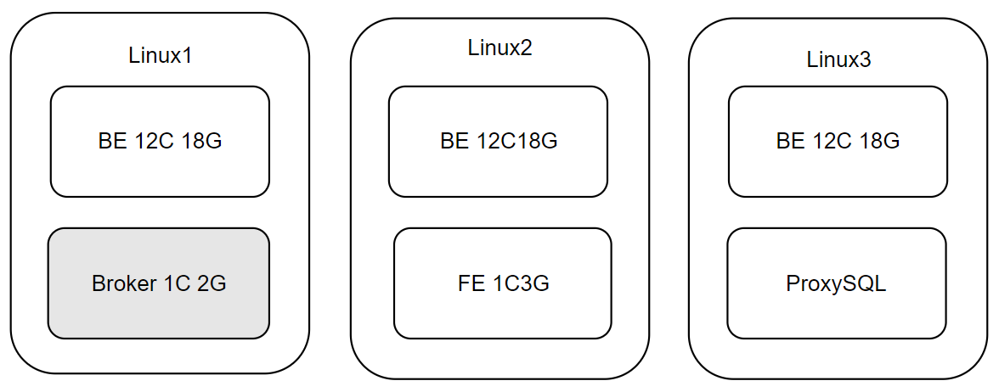
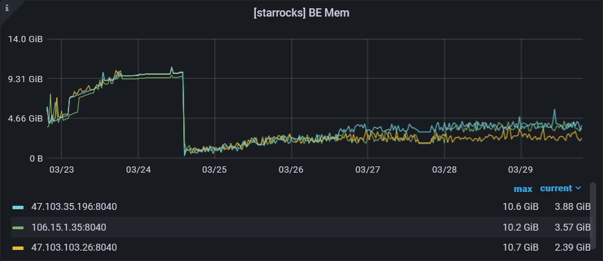
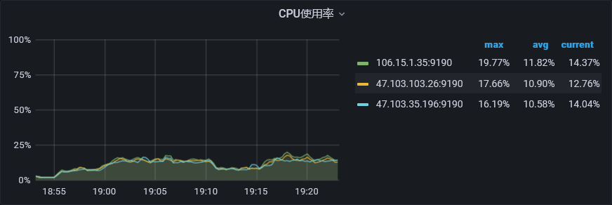
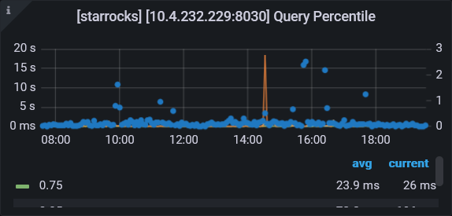

### 测试报告



- 3K数据上报

内存占用：17G的Be内存，使用不到5G，基本上在2G~4G间徘徊，使用率在30%左右。



CPU占用：12核的CPU，使用不到25%




- 查询



存在查询耗时比较就的查询，经排查，是一些跨周的会议查询，扫描的数据行数达到了上亿行。99%的查询响应时间在200+ms。


### 宕机原因总结

#### fe

在年前v22-sp提测的过程中，fe节点出现过多次宕机。经排查有如下原因：

1、fe 1.19的版本中，元数据、集群数据会占用较多的内存，导致堆内存oom。经过反馈后，2.x的版本中，starrocks重构了fe的元数据管理，内存使用率大幅度下降。

2、fe 与 be资源争抢，导致fe无足够的资源进行垃圾回收，Full GC的时间变长（检测最长为71s），造成假死。在使用Docker部署后，对be的CPU资源进行限制，通过mem_limit，对be内存的使用比例进行限制。

3、fe部署的虚拟机没有关闭swap分区，fe使用效率比较低的swap分区时，程序执行效率慢，对象堆积现象被放大，导致造成Full GC。swap内存有一定的使用价值，可以用来削峰等，但fe的最好都运行在真正的内存中，已关闭`swap off`。


目前fe节点在提测、生产部署的过程中，未再发生宕机。


#### be

在v22-sp、v23提测时，be节点宕机最为频繁，原因如下：

1、be有mem_limit内存限制，默认80%（实际计算不一定会很精准），be、fe资源（参数）规划不合理，be mem_limit的内存+fe内存，可能会超过虚拟机的内存。当虚拟机没有足够的内存可供分配时，会kill掉最bad的进程，最bad的进程就是内存占用最高的那个。

2、be 在进行数据合并（compaction）时，根据未合并数据的大小，在合并时占用一定的内存。在1.x的版本中，compaction的内存占用非常高，合并几百MB的数据可能会占用十几GB的内存，虚拟机内存太小就宕机了。经过反馈后，2.1.x的版本中，starrocks重构了compaction功能，合并几百MB的数据的内存占用，也就在几百MB~一两GB之间。

3、be 从kafka拉取数据后，会给这些数据一个临时版本号，Rowset，并将该版本号存入hashtable中。但是在starrocks 代码实现时，一份数据不止申请了一个rowset，并且在数据合并完成后，不会删除hashtable中的数据，导致内存泄露。后经反馈已修复。


#### linux

linux有防御机制（OOM-Killer），一般不会宕机。在be节点宕机时，排查方向错误的认为是linux的系统问题，对oom-killer进行了关闭。当进程向linux申请内存时，linux没有足够的内存，但是又无法kill掉最bad的进程，导致核心奔溃，linux宕机。


#### 防御机制

在实际的部署中，很难保证服务100%的可用，所以，我们采用docker进行部署，利用docker的重启机制进行防御性处理，在fe、be节点发生宕机时，可以通过docker进行快速调度进行重启，重启的时间一般在3~15s之内。

当linux发生宕机时，线上阿里云的虚拟机监控到后，会快速对linux进行重启，重启时间一般在1~3min之内。在虚拟机重启后，docker进程也会进行重启，并调度fe、be节点进行启动。


### fe内存评估

starrocks的fe节点是一个Java服务，Java服务的内存主要分为堆内存、直接内存和方法区。粗暴的内存管理可以将这三块区域给一个大致的值即可。但是可能会造成服务器资源浪费、服务不够稳定、服务吞吐量降低。

fe的堆内存，主要通过fe.conf的JAVA_OPTS进行设置，默认是8G的堆内存，并使用ParNew+CMS+Serial Old的垃圾回收器组合。

评估堆内存的大小，可以通过观察存活对象的数据大小进行判断。节选一段fe的gc日志，可以看到fe的存活的对象大小在500M~1000M之间。将存活对象的大小乘以3，可以作为堆内存的大小。如对暂停时间要求较高，也可以适当加大。

```json
107534.260: [GC pause (G1 Evacuation Pause) (young) 1153M->555M(2048M), 0.0410418 secs]
107534.351: [GC pause (G1 Evacuation Pause) (mixed) 574M->508M(2048M), 0.0316101 secs]
107704.880: [GC pause (G1 Evacuation Pause) (young) 1665M->659M(2048M), 0.0874104 secs]
107849.563: [GC pause (G1 Evacuation Pause) (young) 1661M->792M(2048M), 0.1157495 secs]
107985.433: [GC pause (G1 Evacuation Pause) (young) 1667M->911M(2048M), 0.1187512 secs]
108090.516: [GC pause (G1 Evacuation Pause) (young) 1672M->1012M(2048M), 0.0994080 secs]
```

垃圾回收的情况也可以通过starrocks支持的普罗米修斯监控进行查看、或是jdk自带jstat、阿里的arthas。

方法区用的也是直接内存，但可以单独计算，在没有出现方法区内存泄露的情况下，200M是大多数Java服务使用的天花板。

fe还使用了netty，作为一个高性能的nio框架，大量使用了直接内存，在以往netty服务的监测中，至多会用到300M的内存。

fe节点使用的其它框架\工具，这些框架，也可能会使用到直接内存，所以还需要为这些框架预留一些内存。


此外，CMS 的Major GC 对比 G1 的Mix GC，更容易并发失败（Concurrent Mode Failue），导致Full GC，CMS调优参数也过于复杂。我们在实践的过程中，会更倾向于使用G1 GC。


### be内存评估

be节点是一个C++的服务，内存主要分为query_pool、load、compaction、page_cache、tablet_meta这几个区域。其它区域的内存占用不多，可以通过`http://be_ip:be_webserver_port/mem_tracker`，在网页上进行查看，webserver_port默认是8040。

query_pool是查询时所占用的内存，该内存区域的评估，与业务要求有关，如单个SQL的查询耗费的内存在500MB左右，业务要求支撑40个并发，那么query_pool峰值很可能就会占到20G。

单个SQL的内存占用，可以通过下面的命令进行设置，如设置2G。该参数个人觉得是一个防御性参数，避免单个SQL把集群的资源榨干。

```sql
set GLOBAL exec_mem_limit = 2147483648;
```

load是Stream load，Routine load等load所占用的内存。以routine load为例，默认10s、满20W条数据从Kafka中拉一次数据（满足一个条件即可），假设一条数据大小为1.5KB，那么一次拉取20W条数据，load就得占用300MB以上的内存。一次拉取多少数据，可以通过Kafka消费者监控进行查看。

compaction是进行数据版本合并时占用的内存。从load拉取完数据后，会为这些数据生成一个rowset，be会分两次将这些rowset进行合并，先进行一次小rowset的合并，生成中等规模的rowset，是为cumulative compaction。将中等规模的rowset进行合并，是为base compaction。需要注意的是，不同版本的compaction实现存在差异， 2.1.x以下的版本，compaction的内存占用会比实际数据的大小高很多。2.1.x以上的版本，内存占用的就会少很多，compaction占用的内存，与rowset的数据大小有关，如合并两个大小为300MB的rowset，内存占用大约在600MB以上。

page_cache是操作系统页缓存的大小，在我们的业务场景中，设置了4G的页缓存（我们小组的Java服务使用的Redis，单台内存占用也没有4G），在查询的压测中，提升不明显。并且，page_cache作为一个缓存，我们无法了解该区域有哪些数据，也不清楚缓存命中率是多少，很难进行调优。

tablet_meta是元数据的缓存，一般随着业务的接入的增多而增大，新版本的be元数据内存占用会少很多，也可以通过`tablet_meta_checkpoint_min_interval_secs`定期清除。


### bug总结

https://worklink.yealink.com/issues/bug/974377、https://worklink.yealink.com/issues/bug/972833、https://worklink.yealink.com/issues/bug/973745：调优+设计问题兼有之。Starrocks的2.0.x版本以下存在技术设计缺陷。2.1.x以上，需要调优。

https://worklink.yealink.com/issues/bug/972906：设置了不存在的存储介质，fe节点找不到相应的资源，日志疯狂打印、CPU占用率飙升，Full GC线程资源紧张，导致假死。后续应制定集群规范。

Starrocks上线未评估好时间，之前觉得周末2天够了，所以没有及时提出，交项目组评审，所以导致延期。
