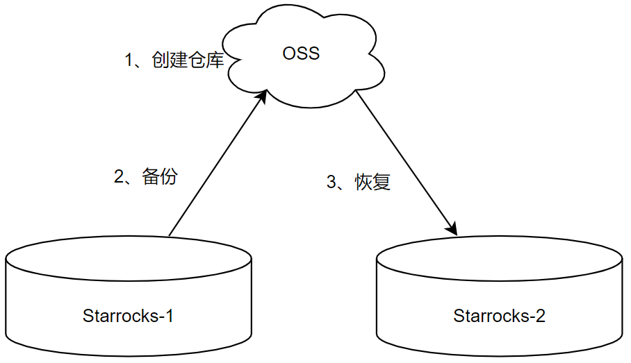

### Starrocks官方方案

在[官方文档](https://docs.starrocks.com/zh-cn/main/faq/Exporting_faq#%E5%A4%87%E4%BB%BD%E6%95%B0%E6%8D%AE%E8%A1%A8)中，明确支持阿里云OSS备份和数据恢复，如有两个starrocks集群的情况下，备份和数据恢复流程如下图：



- 创建仓库

```sql
CREATE REPOSITORY `仓库名称`
WITH BROKER `broker_name`
ON LOCATION "oss://存储桶名称/路径"
PROPERTIES
(
    "fs.oss.accessKeyId" = "xxx",
    "fs.oss.accessKeySecret" = "yyy",
    "fs.oss.endpoint" = "oss-cn-beijing.aliyuncs.com"
);
```


- 备份

```sql
BACKUP SNAPSHOT db_name.snapshot_name
TO `repository_name`
ON (
`table_name` PARTITION (`p1`, ...),
...
)
PROPERTIES ("key"="value", ...);
```

- db_name：备份数据库的名称
- snapshot_name：快照名称，建议table_partition_type，分区可以备份多次，如job备份的化，则为type=job，如人工备份则为type=hand
- PROPERTIES：可以指定一些参数，但默认的就够了


- 恢复

```sql
RESTORE SNAPSHOT db_name.snapshot_name
FROM `repository_name`
ON (
    'table_name' PARTITION ('p1', ...),
    ...
)
PROPERTIES ("backup_timestamp"="xxx");
```

- repository_name：需要于备份中的名称一致，可以根据环境命名，如生产prod、预生产staging
- backup_timestamp：为`SHOW SNAPSHOT ON repository_name`所显示的Timestamp

恢复是全量进行恢复，如果不指定分区，会将目标表中的数据全部删掉，拉去云端备份的全量数据。如指定分区，则将分区中的数据全部删掉。


### 方案不足

StarRocks目前不支持全数据库的备份，需要在ON (……)指定需要备份的表或分区，这些表或分区将并行的进行备份。

以表维度进行全量备份，开销巨大，所以应是增量进行备份，但是不管是表维度还是分区维度，**仅支持全量备份**，表和分区可以备份多次，通过一些约定的版本号标识即可。

以分区维度进行单个全量备份，开销相对比较小。如

| ...  | 2.2               | 2.3     | 2.4     | 2.5     | 2.6     | ...     |
| ---- | ----------------- | ------- | ------- | ------- | ------- | ------- |
|      | 备份1号分区的数据 | 备份2号 | 备份3号 | 备份4号 | 备份5号 | 备份6号 |

但是存在特殊情况，如以时间进行分区，当前时间为2022-2-10，已将之前时间的分区打包到oss中进行备份，starrocks可能会摄取到2022-2-1号的数据，但是1号的分区已经打包到oss中备份了。为这些迟到数据重新进行备份，开销比较大，所以应该**直接忽略掉这些迟到数据，不对其进行备份，已备份的数据会天然的清洗掉一部分异常数据**。

以分区维度备份还存在一个问题，若分区数量较大（每张表支持4096个分区），每次为一个分区执行备份任务，比较繁琐。所以需要对备份任务进行管理，使其自动进行备份。


### 数据备份管理


- 对所有表自动进行分区备份（已在ydata-manager实现，后续迁移到海豚）
- 对备份异常的任务进行告警
- 额外：对分区和备份文件进行映射、保存（方便知悉oss文件对应的分区）


### 参考

starrocks阿里云备份和恢复：https://docs.starrocks.com/zh-cn/main/faq/Exporting_faq#%E5%A4%87%E4%BB%BD%E6%95%B0%E6%8D%AE%E8%A1%A8

starrocks数据备份：https://docs.starrocks.com/zh-cn/main/administration/Backup_and_restore#%E5%A4%87%E4%BB%BD

