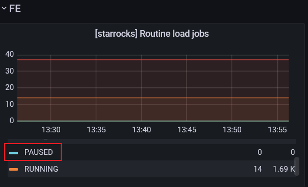

### 服务器环境

- 关闭OOM限制

> echo "1"> /proc/sys/vm/overcommit_memory


- 禁止transparent huge pages

> echo 'madvise' | sudo tee /sys/kernel/mm/transparent_hugepage/enabled


- 开启4G的交换区，防止be峰值内存不足


- Docker部署，Docker开机启动

> systemctl enable docker


- Docker服务自启动

> docker run --name xxx **--restart=always**  xxx


- 使用Docker的host网络部署


- kafka域名需映射，并且自动刷新


### 部署版本

starrocks有一个非常重要的功能，就是数据的合并（Compaction），把数据从kafka拉下来之后，与先前的数据进行合并，才能够有更快的查询速度。

在**2.1.0**版本之前，compaction的那部分代码的设计，偏向于大内存的机器，小内存的机器则可能存在**Memory limit excced**的错误。在与开发人员联系反馈后，在2.1.0版本中，进行了分组压缩，使得用于压缩的内存大幅减小。

所以，v23当以2.1.0 的以上的版本进行部署，若上线前官方推出新版本，则进行更新。


### 部署架构


- 使用docker的host网络部署，利用docker配置资源隔离
- FE 1G3G的考量点，1核CPU用于集群管理、查询连接维护、摄取任务管理等；3G内存，2G用于堆内存，1G用于堆外内存并留少量余量。日常观测，内存使用约为2.6G。
- BE 12C24G的考量点，12核CPU用于扫盘查询、摄取数据落盘、压缩、BE节点数据传输等；BE中主要有compaction和load两个操作会比较占内存。如load内存不足，无法大量从kafka中拉取消息，造成数据堆积，load根据观察，峰值可达5G内存；compaction作用为将load的数据，与原先磁盘中的数据进行合并，一个compaction线程内存约占3G，单be需要配置4个线程以上，才能满足数据合并的需求，所以compaction峰值需要用到12G。算上其它的内存和查询开销，24G以上的内存才能满足需求。
- Broker 为导出的任务的节点，没有其他配置，也不需要挂存储。用来将数据上传到阿里云进行备份，1C2G就足够了。**v23不需要部署**

- ProxySQL最好也能Docker部署，资源限制不应超过1C2G。


### 磁盘挂载、容量要求

- FE 磁盘挂载

需要将FE的meta，conf，log目录挂载到虚拟机中，meta的挂载是保证集群数据不丢失，conf挂载是为了方便配置修改，log目录挂载是为了方便查看日志


- BE 磁盘挂载

需要将conf，log目录进行挂载，理由同FE。此外，目前还需要将容器中的/ssd1目录挂载出来，ssd1名称在be.conf配置。starrocks能够配置多块磁盘，以提高查询速度，但目前的场景中，挂载1块ssd（高效云盘即可）。

在v23后面的周迭代中，可能会挂载多块hdd，命名如hdd1，hdd2，hdd3。


- 容量要求

目前druid线上的数据大约为1天10G，以这个数据量预估，starrocks存60天的数据（60天为产品要求），则需要**600G**的容量。

该容量为热数据的容量，v23后面的周迭代会进行冷热数据存储。


### 配置要求

#### fe.conf

端口，ip等，根据运维的场景配置即可，建议默认。

- JAVA_OPTS="-Xmx2g -Xms2g -XX:+UseG1GC -Xloggc:/opt/starrocks/fe/log/fe.gc.log.$DATE"

  Java8内存参数

- JAVA_OPTS_FOR_JDK_9="-Xmx3g -Xms3g -XX:+UseG1GC -Xlog:gc*:/opt/starrocks/fe/log/fe.gc.log.$DATE:time"

  Java9以上内存参数

- default_storage_medium = SSD 

  默认的存储媒介

- audit_log_modules=slow_query

  只打印慢日志

- qe_slow_log_ms=1000

  Slow query的认定时长

- max_routine_load_task_num_per_be=20

  fe配置，并发的摄取任务数

- max_batch_interval=10

  摄取任务的间隔，10s。和摄取任务的行数一样，达到其中一个条件就可以触发摄取。

- max_routine_load_task_num_per_be = 20

  摄取任务数，目前有14个摄取任务，所以配置个20。

  

  

#### be.conf

- storage_root_path = /ssd1,medium:SSD

  存储配置，与`磁盘挂载`中的要求相对应

- mem_limit=85%

  be使用内存的比例，默认80%，根据虚拟机的内存，预留一部分，计算而来

- routine_load_thread_pool_size=20

  be配置，可以理解为摄取任务的个数

- disable_storage_page_cache=true

  不用操作系统的页缓存，因为可能占了内存还没啥用

- max_compaction_concurrency=3

  压缩工作线程

- max_cumulative_compaction_num_singleton_deltas=50

  cumulative compaction合并指标

- max_base_compaction_num_singleton_deltas=5

  base compaction合并指标

- min_base_compaction_num_singleton_deltas=5

  base compaction合并指标

- enable_metric_calculator = false

  禁用metric_calculator，较少内存开销
  
- tablet_meta_checkpoint_min_interval_secs=60

  表的元数据缓存释放时间，默认值600秒，太耗内存拉

- tc_use_memory_min=2147483648

  默认值为10737418240，10G，表示保留内存，避免向操作系统多次申请。没那么多内存，不用保留那么多


#### session

session的参数，在控制台执行


- 设置单个查询的内存占用，2G

实际上可以更小一点，但是存在大会议的情况，所以给一个比较高的值，少点bug。

```sql
set GLOBAL exec_mem_limit = 2147483648;
```


### 用户管理

- 虚拟机

需要创建一个用户，并授予挂载目录的读权限，docker的操作权限


- Starrocks集群

需要创建一个拥有所有库、表、摄取任务读权限的starrocks用户，以便大数据团队的开发人员进行查看。

```
CREATE USER sr_observer@'%' IDENTIFIED BY "Yealink1105";
GRANT SELECT_PRIV ON *.* TO sr_observer@'%'
```


需要创建一个拥有所有集群、库、表、摄取任务读写权限的starrocks用户，以便集群管理员进行日常操作（袁丹成监督、林蔚湘负责）。

```
-- 密码需使用一个复杂密码
CREATE USER sr_admin@'%' IDENTIFIED BY "Trh5w1yheP4v";
GRANT Alter_priv ON *.* TO sr_admin@'%';
GRANT Load_priv ON *.* TO sr_admin@'%';
```


ydata-manager服务则单独提供一个业务账户。

```
CREATE USER ydata@'%' IDENTIFIED BY "ydata";
-- 限制访问ip，只能是k8s集群，可以是，10.22.%，10.22.11.%
GRANT Load_priv ON *.* TO ydata@'ip';
```


### 监控告警

以下条目达到**加粗**字体的条件时，需要告警

- 虚拟机CPU

  目前虚拟机的规格为8C16G，be分配6核，fe分配2核，broker分配1核

  **CPU使用率达到80%以上10分钟**

  

- 虚拟机内存

  目前docker限制fe节点内存为4G，be节点内存为10G，还剩2G的余量给虚拟机，所以内存90%则存在风险

  **内存使用率达到90%以上10分钟**

  

- fe/be节点状态

  **服务宕机**

  

- fe/be节点CPU

  fe节点采用docker部署，分配2个CPU，日常CPU使用率大约为10%以下，在出现一些异常时，CPU占用率会上升

  **CPU使用率达到80%以上10分钟**

  

  be节点采用docker部署，分配2个CPU，日常CPU使用率大约为70%以下，

  **CPU使用率达到90%以上10分钟**

  

  

- fe/be节点内存

  fe节点为Java服务，4G的内存分配3G的堆空间，其他为直接内存，日常内存使用率在85%左右

  **内存使用率达95%以上10分钟**，如没有总的使用率，则**JVM Old内存使用率达90%以上5分钟**

  

  

  be节点为C++服务，10G的内存日常使用率在40%以下

  **内存使用率达90%以上10分钟**，如没有使用率的话，则**内存使用达9G以上10分钟**

  

  

- 摄取任务（routine load）状态，**非常重要**

  v23版本有14个routine load，正常情况下都是RUNNING状态，但是存在异常情况如be节点宕机，将会导致routine load异常并处于PAUSED状态。进入该状态时，fe节点会调度进行恢复，并进行多次重试。

  **routine load 处于PAUSED状态10分钟以上**

  

- 磁盘空间使用量

  磁盘的使用量，线上预估时600G，以存储60天内的数据，be节点对存储的数据，目前采用的是对兼顾CPU使用率、速度、压缩效率较为优化的LZ4，会自动对数据进行压缩。但be节点和fe节点的日志等，可能会造成一定的磁盘占用，所以要预留一定的磁盘空间。

  **磁盘空间使用量达85以上1天**

  

- 磁盘IOPS

  目前starrocks挂载的是高效云盘，IOPS约为7800，若IOPS达到瓶颈时，查询性能将会受很大的影响

  **写入+读取的IOPS达到5000以上10分钟**

  


### Dockerfile参考

#### Dockerfile

```
ROM registry-cn-shanghai.yealinkops.com/common/jdk:1.8.0.201-mysql

ENV SERVICE_NAME=starrocks
ENV SERVICE_HOME=/opt/${SERVICE_NAME}
ENV SERVICE_EXEC_START_BE="${SERVICE_HOME}/be/bin/start_be.sh"
ENV SERVICE_EXEC_START_FE="${SERVICE_HOME}/fe/bin/start_fe.sh"
ENV SERVICE_EXEC_START_BROKER="${SERVICE_HOME}/apache_hdfs_broker/bin/start_broker.sh"

ENV FE_META="${SERVICE_HOME}/fe/meta"
ENV BE_DATA="${SERVICE_HOME}/be/storage"
ENV PATH=${SERVICE_HOME}/bin:$PATH

# 创建部署用户及部署路径
RUN groupadd ${SERVICE_NAME} && useradd -g ${SERVICE_NAME} ${SERVICE_NAME} 

RUN set -ex \
    && rm -f /etc/localtime \
    && ln -sf /usr/share/zoneinfo/Asia/Shanghai /etc/localtime \
    && echo Asia/Shanghai > /etc/timezone \
    && groupadd ${SERVICE_NAME} \
    && useradd -g ${SERVICE_NAME} ${SERVICE_NAME}
    
WORKDIR ${SERVICE_HOME}

COPY --chown=${SERVICE_NAME}:${SERVICE_NAME} StarRocks-1.19.1.tar.gz /opt/starrocks
COPY --chown=${SERVICE_NAME}:${SERVICE_NAME} docker-entrypoint.sh /docker-entrypoint.sh

RUN set -ex \
    && tar -xvf StarRocks-1.19.1.tar.gz -C /opt/starrocks \
    && rm -f StarRocks-1.19.1.tar.gz \
    && chmod +x /docker-entrypoint.sh \
    && chmod +x ${SERVICE_HOME} \
    && ln -s /docker-entrypoint.sh /usr/local/bin/docker-entrypoint.sh \
    && chown -R ${SERVICE_NAME}:${SERVICE_NAME} ${SERVICE_HOME}

ENTRYPOINT [ "/docker-entrypoint.sh" ]
CMD ["help"]
```


#### docker-entrypoint.sh

```sh
#!/bin/bash
set -e

if [ "$#" -eq 0 ] || [ "${1#-}" != "$1" ]; then
    set -- "${SERVICE_NAME}" "$@"
fi

# 配置默认的端口和配置文件中使用的默认端口保持一致
EDIT_LOG_PORT=${EDIT_LOG_PORT:-9010}
HEARTBEAT_SERVICE_PORT=${HEARTBEAT_SERVICE_PORT:-9050}
QUERY_PORT=${QUERY_PORT:-9030}
FE_LEADER_QUERY_PORT=${FE_LEADER_QUERY_PORT:-${QUERY_PORT}}

# FE
initFe(){
    echo "STARTING fe..."
    # export EXTERNAL_IP
    if [ -f /etc/fip/fip.data ] && [ -z "$EXTERNAL_IP" ]; then
        EXTERNAL_IP=$(cat /etc/fip/fip.data)
        export EXTERNAL_IP
    fi
    # 创建FE元数据目录
    if [ -n "$META_DIR" ];then
        if [ ! -d "$META_DIR" ];then
            mkdir -p "$META_DIR"
        fi
    else
        if [ ! -d "${SERVICE_HOME}/fe/meta" ];then
            mkdir -p "${SERVICE_HOME}/fe/meta"
        fi
    fi
    if [ "X${FE_ROLE}" == "Xleader" ];then
        exec ${SERVICE_EXEC_START_FE}
    elif [ "X${FE_ROLE}" == "Xfollower" ] || [ "X${FE_ROLE}" == "Xobserver" ];then
        if [ -n "$FE_LEADER_HOST" ] && [ -n "$FE_LEADER_QUERY_PORT" ] && [ -n "$FE_LEADER_EDIT_LOG_PORT" ];then
            # 启动follower 和 observer之前需要添加 follower 或 observer
            while true; do
                timeout 5 mysql -h"${FE_LEADER_HOST}" -P"${FE_LEADER_QUERY_PORT}" -uroot -e 'show databases;'
                if [ $? -eq 0 ];then
                    break
                elif [ $? -eq 124 ]; then
                    echo "info: timeout to connect $FE_LEADER_HOST:$FE_LEADER_QUERY_PORT, sleep 1 second then retry"
                    sleep 1
                else
                    echo "info: failed access database, sleep 1 second then retry"
                    sleep 1
                fi
                echo "info: successfully access database ${FE_LEADER_HOST}:${FE_LEADER_QUERY_PORT}"
            done
            COUNT=$(mysql -h"${FE_LEADER_HOST}" -P"${FE_LEADER_QUERY_PORT}" -uroot -e"SHOW PROC '/frontends'\G;" | grep "${FE_HOST}_${EDIT_LOG_PORT}" | wc -l)
            echo "COUNT: $COUNT"
            if [ "$COUNT" -lt 1 ];then
                echo "info: add ${FE_ROLE} in ${FE_LEADER_HOST}:${FE_LEADER_QUERY_PORT}"
                mysql -h"${FE_LEADER_HOST}" -P"${FE_LEADER_QUERY_PORT}" -uroot -e"ALTER SYSTEM ADD ${FE_ROLE} \"${FE_HOST}:$EDIT_LOG_PORT\";"
            fi
            exec ${SERVICE_EXEC_START_FE} --helper "${FE_LEADER_HOST}:${FE_LEADER_EDIT_LOG_PORT}"
        else
            echo "error: Parameters are missing FE_LEADER_HOST and FE_LEADER_QUERY_PORT and FE_LEADER_EDIT_LOG_PORT !!!"
            exit 1
        fi
    else
        echo -e "info: Parameters are missing FE_ROLE,Please set FE_ROLE in [leader | follower | observer]\n"
        exit 1
    fi
}

# BE
initBe(){
    echo "STARTING be..."
    # export EXTERNAL_IP
    if [ -f /etc/fip/fip.data ] && [ -z "$EXTERNAL_IP" ]; then
        EXTERNAL_IP=$(cat /etc/fip/fip.data)
        export EXTERNAL_IP
    fi
    # 创建数据目录
    if [ -n "$STORAGE_ROOT_PATH" ];then
        if [ ! -d "$STORAGE_ROOT_PATH" ];then
            mkdir -p "$STORAGE_ROOT_PATH"
        fi
    else
        if [ ! -d "${SERVICE_HOME}/be/storage" ];then
            mkdir -p "${SERVICE_HOME}/be/storage"
        fi
    fi
    exec ${SERVICE_EXEC_START_BE}
}

# BROKER
initBroker(){
    echo "STARTING be..."
    # export EXTERNAL_IP
    if [ -f /etc/fip/fip.data ] && [ -z "$EXTERNAL_IP" ]; then
        EXTERNAL_IP=$(cat /etc/fip/fip.data)
        export EXTERNAL_IP
    fi
    exec "${SERVICE_EXEC_START_BROKER}"
}

printUsage() {
    echo -e "Usage: [ fe | be | broker ]\n"
}

case "$1" in
    (fe)
        initFe
    ;;
    (be)
        initBe
    ;;
    (broker)
        initBroker
    ;;
    (help)
        printUsage
    ;;
    (*)
        printUsage
        exit 1
    ;;
esac

```


### 命令参考

- FE

按磁盘挂载的要求，将meta、log、conf挂载出来。cpu和内存资源以部署架构中的要求为准。

```sh
docker run -d  \
-v /data/starrocks/fe/meta:/opt/starrocks/fe/meta \
-v /data/starrocks/fe/log:/opt/starrocks/fe/log \
-v /data/starrocks/fe/conf:/opt/starrocks/fe/conf \
-e FE_ROLE=leader \
--net=host \
--memory-swap -1 \
--name fe \
--restart=always \
registry-cn-shanghai.yealinkops.com/ydata/starrocks:2.1.1 fe
```


查看fe节点的情况

```sql
SHOW PROC '/frontends'\G
```


- BE

将log、conf目录挂载出来。并且需要将虚拟机的ssd1（具体的目录依据挂载而定）磁盘挂载到容器的/ssd1（/ssd1在be.conf中配置）中

be节点的内存，通过be.conf中的men_limit进行限制

--restart：宕机重启

```sh
docker run -d  \
-v /data/starrocks/be/log:/opt/starrocks/be/log \
-v /data/starrocks/be/conf:/opt/starrocks/be/conf \
-v /data/starrocks/be/storage:/opt/starrocks/be/storage \
--net host \
--name be \
--restart always \
registry-cn-shanghai.yealinkops.com/ydata/starrocks:2.1.1 be
```


添加后端节点，查看

```sql
ALTER SYSTEM ADD BACKEND "10.132.248.74:9050";
ALTER SYSTEM ADD BACKEND "10.132.248.70:9050";
ALTER SYSTEM ADD BACKEND "10.132.248.71:9050";
SHOW PROC '/backends'\G
```


删除节点，取消删除

```
ALTER SYSTEM DECOMMISSION BACKEND "10.132.248.71:9050", "10.132.248.70:9050";
CANCEL DECOMMISSION BACKEND "10.132.248.71:9050"
```


- broker

```sh
docker run -d  \
--net host \
--cpus 1 \
-m 2g  \
--memory-swap -1 \
--name broker \
--restart always \
registry-cn-shanghai.yealinkops.com/ydata/starrocks:2.1.0 broker
```

添加查看broker

```sql
ALTER SYSTEM ADD BROKER broker2 "10.132.248.71:8000";
SHOW PROC '/brokers'\G
```

