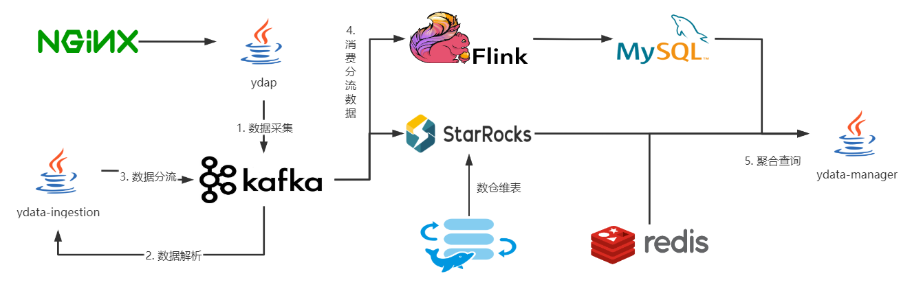
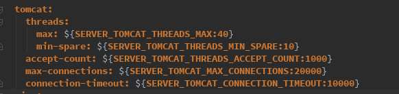
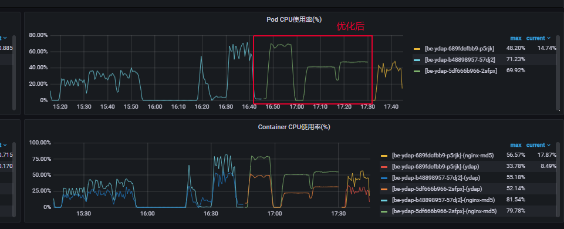
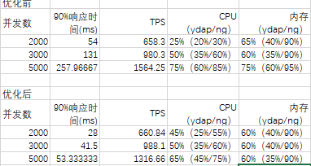
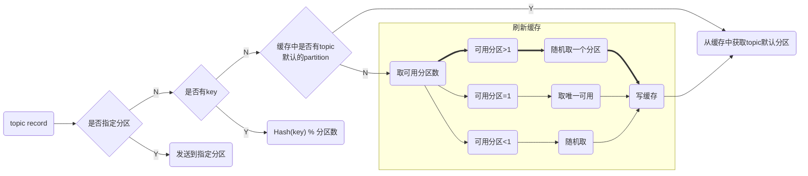
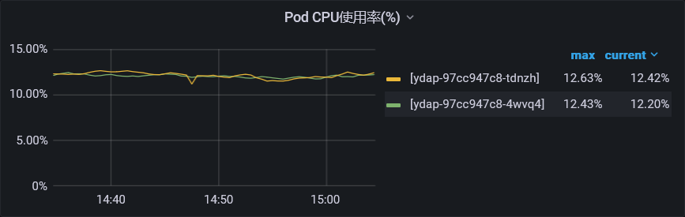
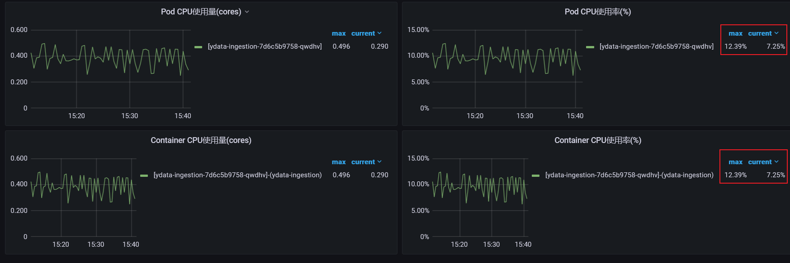
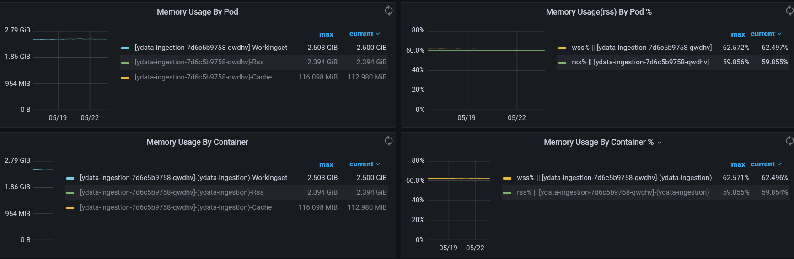

### 后端架构概览

### yiot-ydap

#### 功能介绍

ydap外挂一个nginx边车，提供443端口和ssl加密的功能，以接收终端和sfu上报的数据，然后作为生产者，将数据发送到kafka中。

ydap不属于ydata团队的维护范围，但是在整个后端集群中，ydap相当于入口，我们也需要关注ydap的一个整体情况，以排查可能出现的系统风险或者瓶颈。

#### 连接优化

由于上报终端的数量可能比较多，每个终端通过http向ydap发送上报请求时，ydap需要维护与终端间的tcp连接。在这个过程中，实际还存在一个Nginx边车，数据的流向是【终端】->【Nginx】->【ydap】。

在ydap的代码中，我们建议尽量减少tomcat-servlet线程的操作，以减少持有时间，尽快释放连接。例如将日志打印的步骤，转移至ydap内部的业务线程池中。

ydap是一个tomcat-servlet的服务，一般的优化点是加大tomcat-servlet线程的数量，以尽可能提升其负载能力。但是，我们观察了ydap的代码，并通过arthas向上报的接口做了asm-aop，得出tomcat-servlet线程处理请求的速度约为0.02ms。

也就是说ydap的一条连接，可以支持数万的并发。此时盲目加大tomcat-servlet线程的数量，反而会造成资源浪费。tomcat-threads线程默认是200，我们将其调小至40，足矣。

  

在调整前，ydap的内存抖动比较大，在调整后，ydap的内存曲线变得相对平缓。

 

在调整前，5K的压力下，90%的响应时间为250ms，而调整后，90%的响应时间为54ms，且从2k到5k，响应时间的增加也非常平缓。

  

在TCP连接数方面，原始的材料已缺失，调整前，大约有LISTEN状态数为800+，ESTABLISH状态数为2000+，在调整后LISTEN状态数为500+，ESTABLISH状态数为2300+，可以推断，调整后多了40%的握手连接被及时处理。

#### 消息均匀

ydap作为kafka的生产者，从终端接收消息，并发送到ydata集群的kafka中，所以，我们也关注于ydap生产者分区是否均匀。

kafka生产者分区是否均衡，主要是指发送到kafka服务端的分区消息是否均衡（分区相当于RocketMQ的队列），尽量避免出现一个分区的消息比另一个分区多出一个数量级的情况。

kafka2.8的版本，生产者默认的分区策略为的Strisky，通过生产者源码分析，得出的分区流程如下：

其中，在【刷新缓存】的过程中，大部分的请求会经过随机取一个分区的步骤，此时Kafka使用murmur2哈希算法，进行散列计算，以将数据尽可能地打散。murmur2地特点是速度快、低碰撞。

由于ydap仅仅只发送3个topic，所以我们在实际的使用中，不管是轮询还是Strisky，都可以让消息非常均匀。所以通过实际的源码分析和压测结果双向论证，ydap做为kafka的生产者，实际上表现是非常优秀的。

#### 生产负载

ydap上线至今，在生产上都没有出现过恶性bug，并且在1核3G的情况下，CPU负载基本在10%左右，表现非常良好。

#### 持续观察

Nginx边车，在客户端已经使用protobuffer协议的情况下，还使用GZIP压缩方式，对客户端流量、服务器带宽的影响。

### ydata-ingestion

#### 功能介绍

ydata-ingestion属于ydata团队维护的项目，主要负责对终端和mss上报数据的解析。其作为消费者，从kafka拉取ydap上报的数据，并进行消费。

从技术角度上进行预测，ydata-ingestion其可能存在瓶颈的地方，主要是消费者是否负载均匀，是否会发生单机瓶颈；消费者应该如何处理反压；垃圾回收的整体优化。

#### 消费者优化

在早期ydata-ingestion的版本中，为了提高ydata-ingestion的消费能力，我能使用了concurrency的配置，该配置如果设置为3，相当于一个ydata-ingestion，包含了3个kafka的消费者。除了kafka的客户端开销也是3倍之外，还非常容易导致消费不均匀。

如一个topic有十个分区，2台ydata-ingestion，那么就会导致出现这样的情况，导致消费不均匀

> ydata-ingestion-0，分配3个分区
>
> ydata-ingestion-1，分配3个分区
>
> ydata-ingestion-0，分配3个分区
>
> ydata-ingestion-1，分配1个分区

####　GC优化

#### 生产负载

CPU负载

内存负载，稳如老狗并不过分

### kafka

kafka是一个比较文档的服务，目前我们的topic也就几十个，并没有达到kafka的系统瓶颈。所以，整体运行也比较稳定，但是在之前的过程中，我们也曾出现过kafka断连的问题。

#### 集群重启导致客户端断连

#### 与StarRocks断连

### flink

#### 功能介绍

#### 会议列表的计算

#### 会议列表重构

### starrocks

#### 功能介绍

大数据存储的实时分析数据库，目前用以存储终端上报的音视频日志数据、用户行为日志数据、SFU服务器音视频链路日志数据。

#### 与Druid对比

#### v22-sp情况

#### 服务调优

#### 生产负载

### ydata-manager

#### 功能介绍

与前端交互的Java服务，用以提供子管理员鉴权、权限管控，会议数据查询等功能。

#### 查询优化

