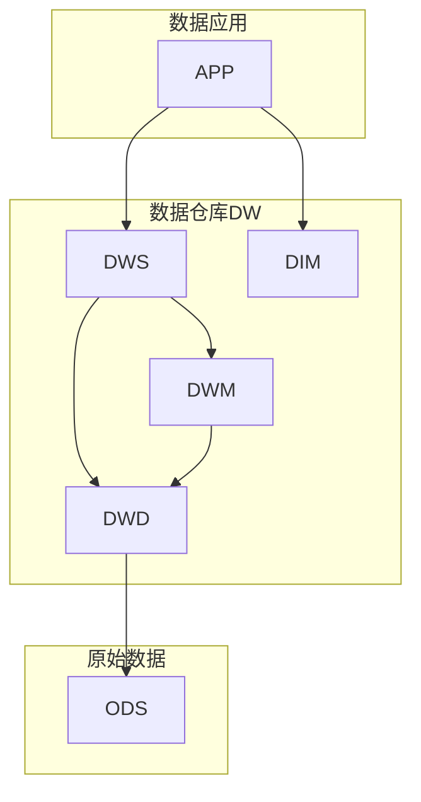
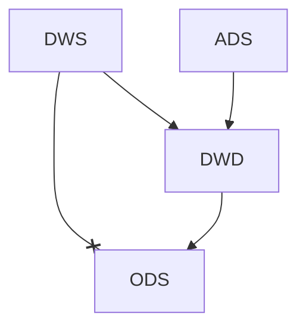
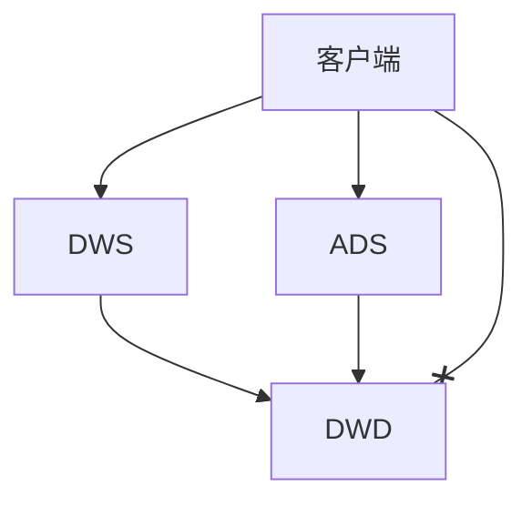
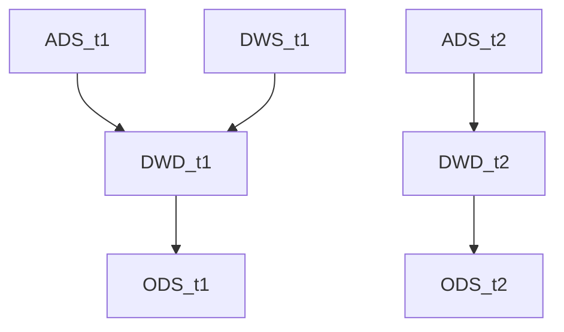
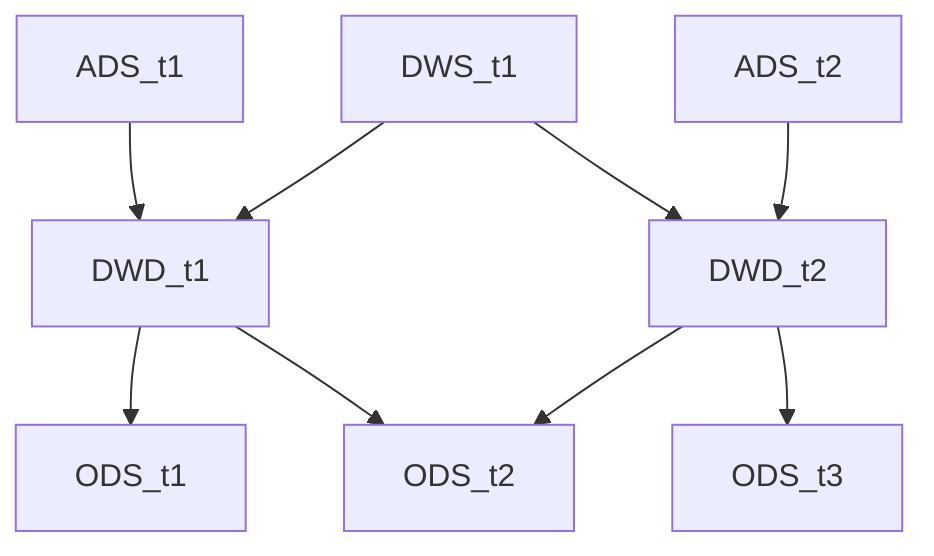

## 为什么要分层
1、业务需求和相关逻辑五花八门，**重复建设问题严重**，清洗规则混乱、业务逻辑无法复用，造成资源浪费

2、**数据故障影响范围难以评估**，且修复周期较长，异常排查时间和修复时间长

3、**数据膨胀导致计算资源紧张**，出数时间得不到保障

4、**无法屏蔽业务的变动影响**，改一次业务就需要重新接入数据，就会影响整个数据清洗流程，工作量巨大


最终结果：依赖混乱，层级混乱，复用性低


## 分层的好处

1、**数据结构清晰**，每一个数据分层都有它的作用域，这样我们在使用表的时候能更方便地定位和理解

2、**易于血缘追踪**，大数据建设，最终给业务呈现的是一张能够直接使用的业务表，但是它的来源有很多，如果有一张来源表出现问题，就需要快速准确地定位到问题，并清楚它的危害范围

3、**提高查询速度**，通过建设多层次的数据模型供用户使用，避免用户直接使用低维数据，可以更高效的进行访问

4、**减少重复开发**，规范数据分层，开发一些通用的中间层数据，能够减少大量的重复计算

5、**复杂问题工程化**，将一个复杂的任务分解成多个步骤来完成，每一层只处理单一的步骤，比较简单和容易理解。而且便于维护数据的准确性，当数据出现问题之后可以不用修复所有的数据，只需要从有问题的步骤开始修复。

6、**便于业务调整**，当业务发生变化时，只需要调整底层的数据，对应用层对业务的调整零感知


## 数仓分层明细

数仓分层的建设，应该时越靠上的层次，就应该对应用越友好。简单的数仓层次，可以分为数操作据层（DWD），数据仓库层（DW），数据应用层（APP）


操作数据层（DWD）：存放接入的原始数据
数据仓库层（DW）：存放重点设计的数据仓库中间层数据
数据应用层（APP）：面向业务定制的应用数据





### 操作数据层ODS
操作数据层ODS，Operational Data Store，是面向业务系统的数据，也就是最接近数据源的一层。**数据源中的数据，经过抽取、清洗、传输，也就是ETL之后，装入本层。**


该层需要做一些简单的处理工作：

1、去噪：比如用户年龄属性200岁，很明显这种数据属于异常数据，需要做些处理

2、去重：比如物料表信息同一个Id有重复的素材数据，在接入时需要做去重处理

3、字段规范：有些字段根据自己公司的业务系统来定义一些规范，比如金额字段的类型


注意：针对这一层的处理工作有很多理解不大一样的地方，是否需要做数据清洗处理，其实取决于团队习惯。有的团队在这一层之前，还会有一层“数据缓冲层”，目的就是做缓冲，缓冲的策略也是取决于表的重要性，以决定它的生命周期，在进行清洗落地到ODS层永久存放。

如果没有缓冲层，**建议ODS层不做过多的清洗工作，原封不动接入源数据即可，至于数据的去噪，去重，异常值处理，也可以放在后面的DW层做**


### 数据仓库层DW
数据仓库层，Data Warehouse，数据仓库层是数仓的核心，从ODS层获得数据，按照主题建立各种数据模型。

ODS层是范式模型，而在DW层基于Kimball的维度建模来构建，通过一致性维度和数据总线，来保证个主题维度的一致性。构建统一数仓是经过前面的业务理解的角度，定义一致的指标、维度、划分数据主题域，按规范来构建，形成统一规范的标准业务体系，实现数仓分层的真正意义。

**DW层又细分为DWD（Data Warehouse Detail）层，DWM（Data Warehouse Middle）层，DWS（Data Warehouse Service）层。**


#### 数据明细层DWD
该层一般保持和ODS同样的数据粒度，并且**提供一定的数据质量保证**。同时，为了提高数据明细层的易用性，该层会采用一些维度退化的手法，将维度退化至事实表中，减少事实表和维表的关联。


另外，在该层也会座椅i部分数据聚合，将相同主题的数据汇集到一张表中，提高数据的可用性。比如，在DWD层做了一张用户访问行为为天表，在这里，我们将会PC网页、H5、小程序和原生APP访问日志汇聚到一张表里面，统一字段名，提升数据质量，这样就有了一张可供大家方便使用的明细表了。


为了保留ODS层追溯历史问题，不建议过多的进行数据清洗处理，在DWD层要做的就是**将数据整合、规范化，脏数据、垃圾数据、规范不一致的、状态定义不一致的、命名不规范的数据进行处理**。


DWD层应该是负载所有系统的、完整的、干净的、具有一致性的数据层，在DWD层会根据维度模型，设计事实表和维度表，也就是说DWD层是一个非常规范，高质量，可信的数据层次。


#### 数据中间层DWM
该层会在DWD层的数据基础上，对数据做**轻度的聚合操作**，生成一系列中间表，提升公共指标的**复用性，减少重复加工**，主要发挥优化的作用。

直观来讲，就是对通用的核心维度（通用维度）进行聚合操作，算出相应的统计指标。


#### 数据服务层DWS
DWS为公共的汇总层，也叫**宽表**，按照业务抽象出主题，如用户、流量、订单等主题。生成字段比较多的宽表，用于提供后续业务查询，OLAP分析，数据分发等。


在实际计算中，如果直接从DWD或者ODS计算出宽表的统计指标，会存在计算量太大，并且维度太少的问题，因此一般的做法是，在DWM层先计算出多少个小的中间表，然后再拼接层一张DWS的宽表，其目的就是复用性。


由于宽和窄的界限不易界定，也可以去掉DWM这一层，只留DWS层，将所有的数据放在DWS即可。


DWM做轻度聚合操作，保留通用的维度，DWS做**更高的聚合操作**。可能只保留一到两个能表示当前描述主体的维度。


为了满足业务需求分析的需要，特别是数据分析师需要从这些宽表中取数来分析数据，否者数据分析师找不到可分析的数据，还需要从上游重新取数，加工处理，这样会造成资源浪费，服务器成本增加，也影响其他任务的产出。


**DWS层是一个不断迭代的过程，一般我们希望80%的需求都从DWS层进行查询**。DWS层支持不了，再用DWM和DWD来支持，而不是直接将原始数据暴露给应用方进行分析。


### 数据应用层APP

也可以叫做数据集市层（ADS），主要是提供给产品和数据分析师使用的数据，整合汇总成分析某一主题域的报表数据。

一般还会存放再ES、数据库中供线上系统访问，也可能存于Hive中，供数据分析和数据挖掘使用。


### 维表层DIM

维度指的是观察事物的角度，提供某一业务过程事件涉及用什么**过滤和分类的描述属性**。“什么时间，什么地点，干了什么”，如张三早上商店花费10元钱购买了电池，时间维度=早上，地点维度=商店，商品维度=电池，那么业务过程事件就是购买的一条记录。


**维度字段，在SQL语法中就是约束条件，分组条件，排序条件。**


所以可以看出，维度表包含了业务过程记录的上下文和环境。他有单一的主键列，维度表的主键，可以作为与之关联的任何事实表的外键。


维表层主要有两种类型
高基数维度数据：一般是用户资料表（性别、年龄、住址），商品资料表（种类、铭牌），类似的资料表，数据量可能是千万级或者上亿级。

低基数维度数据：一般是配置表，比如**枚举值**对应的中文含义，或者日期维表，设备类型的配置表等，数据量可能是个位数或者几千几万。


设计原则：
一致性维度规范，又叫统一维度，公共层的维度表中相同维度属性在不同物理表中的字段名称、数据类型、数据内容必须一致。 比如，业务线A中有会员属性，业务线B也有会员属性，为了能满足各业务线的数据理解一致，则按照统一的标准命名，实现数据共享。


维度的组合与拆分
将维度所描述业务相关性强的字段在一个物理维表实现，相关性强是指经常需要一起查询或进行报表展现，两个维度属性见是否存在天然的关联等。比如，商品基本属性和所属品牌。


##  数仓建设

### 查询完善度
数仓应覆盖尽可能多的业务场景，以便满足各业务复杂的数据需求且支持业务决策，也就是数据赋能业务发展时，能够满足快速的提供准确且完善的数据。


为覆盖尽可能多的场景，就**要求数仓开发人员，要时刻跟进业务变化，不断迭代模型，主动挖掘和建设数据模型，让数仓模型更完善**。同时业务运营人员、数据产品经理要构成组织，主动设计数据指标体系，减轻数仓开发的压力。

通常可以通过以下指标来衡量数仓的业务覆盖程度：
首选在衡量覆盖指标之前，先基于元数据提供血缘信息统计。
调度平台运行的**离线任务数**和近一周内分析**即席查询报告**。


#### 离线查询统计

表1

| 层级 | 表数量 | 被读数量 | 被写数量 | 读表任务数 |
|---|---|---|---|---|
|ODS|2328|705|1718|908|
|DWD|220|140|219|432|
|DWS|63|53|60|153|
|ADS|350|259|323|328|
|DIM|31|27|27|239|
|未识别层|1625|412|321|596|
|总数|4617|1596|2668|2656|


1、未识别层的表占总数的35%，**规范存在严重缺失**。
2、从识别的分层的读表任务中来看，ODS：DWD：DWS：ADS的读取任务时908：432：153：328，读取ODS的任务数站这四层总和的49%，从这比例说明**大量任务都是基于原始的ODS加工，中间模型复用性很差**。


#### 即席查询统计

表2

| 层次 | 查询数 |
| --- | ---|
| ODS | 656|
|DWD|1067|
|DWS | 113|
|ADS|305|
|DIM|673|
|未识别层|708|


已识别的分层查询中，ODS：DWD：DWS：ADS分别为656：1067：113：305，**有30%的查询命中ODS层，说明DWD、DWS、ADS层数据建设缺失严重。**
尤其是越过高层表去查询底层的表，就会导致扫描数据量巨大，并且查询耗时也更长，计算资源被严重浪费。
　

### 分层完善度

- DWD层的完善度

衡量DWD是否完善，最好看ODS层有多少张表被DWS/ADS层引用。

若DWD被其以上的表引用越多，说明越多的任务是基于明细数据进行深度汇总计算的。且明细层DWD一座了数据清洗、格式化清洗，避免了从ODS中重复的处理


所以，可以用**跨层引用率**指标衡量DWD的完善度

```
跨层引用率=ODS层被更高层引用的表数量 / ODS层经常被访问的表数量
```

**ODS跨层引用率越低越好，尽量要求不允许出现跨层引用，ODS层只能被DWD层引用。**



- DWS\ADS层完善度

DWS\ADS层完善度，主要看汇总数据直接满足多少查询的需求。

如果汇总数据无法满足需求，查询数据的人就得使用明细DWD，甚至之原始数据ODS。


```
DWS\ADS完善度  = DWS\ADS层查询数量 / 所有查询
```

完善度不可能做到完全100%，但值越高，说明上层的建设越完善，对于使用数据的人来说，查询速度和成本也会减少。



### 模型完善度

**数仓模型设计核心是追求复用性**。

通过元数据中心，可以查看表之间的血缘关系，举一个比较差的复用性比较差的例子



自上而下，几乎是一条线，说明复用行较差。

好的模型复用图应该是一种发散图



所以，**模型引用系数**可以作为一个衡量指标，引用系数越高，说明数仓的复用性越好。

例如，一张订单DWD层表被6张DWS层表引用，这张DWD层的表引用系数就是6，如果把**所有DWD层（有上游的表）引用系数取平均值，则为DWD的平均模型引用系数**。

一般低于2时，则比较差，**3以上是一个比较好的经验值。**


### 衡量规范度
在表1中，通过追钟血缘关系，如果超过40%的表没有分层信息，就说明数仓模型设计层面不规范。

比如那Order这个命名为例，当看到这张表时，就不知道它归属于哪一层，哪个主题域，或是业务过程？是全量数据表还是增量数据表，通过表的命名获取的信息非常少。

除了需要明确分层外，还需要明确主题域。若表没有归属的主题域就很难定位该表的职责作用，也无法复用及管理它的生命周期，甚至定位排查都是隐患


数仓表的命名规范，可以遵循：`分层_业务系统_主题域_表名_标记(增量\全量)`

如**ods_log_behavior_login_incr**，ods层，日志数据系统，用户行为分析，用户登录，增量实时数据


### 时效稳定性

数仓应该尽可能快的提供数据，满足业务需求中数据的分析决策

数据任务是否能够按时生成，按时推送，数据的延迟时长通常是H+1，T+1或者其他

任务的时效，以及数据的查询时间都是很好的评估点

比如：

1、从ETL任务开始，结束和消耗时间

2、结合调度系统ETL成功失败的分析，统计相关任务的成功，失败次数做评分标准。

3、单独对某些类型的ETL任务做实事采集记录

如一个加工链路很长，某一个节点步骤跑完后，王kafka消息队列推送一条数据消息，这样可以响应的实时监控到代码完成ETL日志情况，当长时间没有收到该任务消息时，就做响应的告警处理。

针对时效保障的指标分析，对相应的任务进行优化参考，提高整体时效稳定性。


### 准确性\一致性

数据仓库应该提供准确的数据，数仓不能提供未经验证的数据，因为会导致做出错误的业务决策。

- 准确性：直观来讲，就是看数据是否准确。一般准确性的监控，多集中在对业务结果数据的监控，比如每日的活跃、收入等数据是否正常。
- 一致性：数据不一致的情况，多出现在数据系统达到一定的复杂度后，同一指标会在多处进行计算，由于计算口径或者开发人员不同，容易造成同一指标出现不同的结果。

