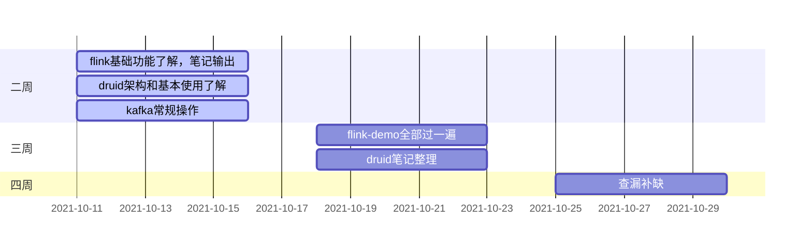

### 目前存在的问题

1、经常性喝茶，作息非常不规律

2、学习热情比较低迷

3、沉迷于其他的信息泡沫中

4、减肥、健身和做饭已经停滞了

### 问题解决的措施

1、以山苷芯、雪碧、益力多等代替茶，**所有的茶拿去公司，除在公司早上外，坚决不再喝茶**

2、哪里跌倒就从哪里爬起来，继续就flink的学习入手

3、在地铁上下班的过程中，**以学习代替刷哔站，总之，开卷有益**

4、周末，在家的话，固定每晚去跑5圈 + 锻炼腹肌

### 事项

1、需要提前制定后一天事项安排

| 时间       | 事项                                               |
| ---------- | ------------------------------------------------------------ |
| 2021-10-01| |
| 2021-10-02| |
| 2021-10-03| |
| 2021-10-04| |
| 2021-10-05| |
| 2021-10-06| |
| 2021-10-07| 1、跑步5圈（因下雨没去） 2、做饭去公司√ |
| 2021-10-08| 1、搞清楚flink的水位线机制 2、体检预约√ |
| 2021-10-09| 1、flink笔记完善 2、设计文档√ 3、了解了easyexcel的数据读取流程 |
| 2021-10-10| 1、自己做饭 2、跑步6圈 3、了解easyexcel落磁盘的逻辑 |
| 2021-10-11| 1、druid摄取规则√ 2、自定义属性的摄取约定√ 3、flink笔记整理 |
| 2021-10-12| 1、druid架构了解 |
| 2021-10-13| 1、druid功能了解 |
| 2021-10-14| 1、druid使用了解 |
| 2021-10-15|                                                              |
| 2021-10-16| 1、kafka操作整理 2、flink笔记整理 |
| 2021-10-17| |
| 2021-10-18| 1、excel表格导入导出 |
| 2021-10-19| |
| 2021-10-20| |
| 2021-10-21| |
| 2021-10-22| |
| 2021-10-23| |
| 2021-10-24| |
| 2021-10-25| |
| 2021-10-26| |
| 2021-10-27| |
| 2021-10-28| |
| 2021-10-29| |

