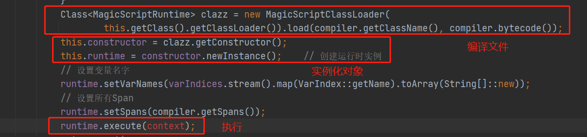
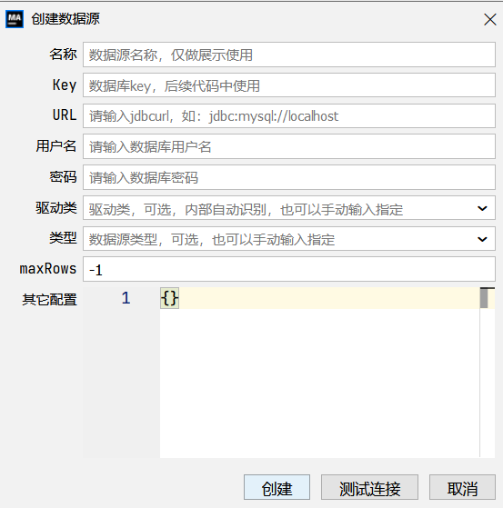
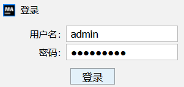

## magic-script

基于JVM编译能力的外层封装。**将脚本编译成对应的字节码文件，通过反射获取构造器，通过构造器实例化对象，并进行执行**。



### JVM编译能力

JVM语言：Java、Scala、Groovy、Kotlin

其他语言：C、C++、Rust、JavaScript、Ruby、Python、R语言


Java8 支持：JVM语言+JavaScript（引擎由Firefox贡献）

Graal VM支持：JVM语言和上诉列举的其他语言


如果使用magic-script的话，其**编译能力上限取决于所运行的JVM**，但目前功能较为强大的Graal VM还未大规模应用。

目前运行的jdk1.8 平台，支持JVM语言，其相关的语法糖使用上不会有太大的障碍，另外可以直接运行JavaScript


### 不足

1、复杂的运算可能会出错，需要关注magic-script官方的版本记录。查看官方过的git记录，大部分是复杂运算出了问题。

2、比较依赖于JVM的编译能力，目前对JVM【类加载子系统】了解不够深入


## magic-api

### 部署

magic-api可以配置本地的缓存路径，所以每个实例，可以挂载**单独的存储**。此外还可以配置其他实例的地址，以进行数据同步，所以需要配置**单独的网路标识**。也就是说，magic-api更偏向于有状态应用，但是它不是一个的组件，只实现了增删改查的功能的话，实际上不一定要有状态应用的部署方式。


- 无状态部署

如果不配置单独的存储的话，在pod重启后，磁盘中的数据会丢失，但是magic-api还可以从数据库中加载数据。磁盘中的数据在配置数据库的情况下只是缓存。

如果不配置其他实例的网络地址的话，那么无法使用数据同步的功能，**版本发布的时，每次都需要通过重启，以读取数据库中的数据进行同步**。


- 有状态部署

若配置了其他实例的网络地址，对接口等数据进行修改时，magic-api会将数据发送给其他的节点。但是该发送过程，并没有做raft算法相关的处理，只是简单的调一下接收数据的接口。**在高并发、弱网环境下，会出现数据不一致的情况**。和官方开发人员确认后，表示确实出现过这种情况，但是他们没能复现，猜测可能对raft算法不大了解，后续这方面的支持能力应该较差。

所以，数据同步的功能，实际上是**存在风险的**。


### 版本更新

- 通过数据库脚本更新，然后重启pod，以加载数据库中的数据

适用于多实例部署的情况，但是要求在线上不应对业务查询的功能进行修改。每次更新，需要走数据库更新的发版流程，在更新完脚本后，需要重启pod。


- 通过页面后台，运行数据库脚本更新

适用于多实例部署的情况，与上一种方式对比，减少了数据库更新的发版流程，但是需要自行开发一套数据库数据的更新功能（开发简单、管控可能比较复杂）。


- 通过页面，上传全量数据更新s


magic-api页面上可以上传全量的接口数据，可以从开发环境导出全部的接口数据，然后再生产上全量更新。如果是无状态部署的话，那么需要重启所有实例；如果是有状态部署的话，由于magic-api同步功能的不可靠性，所以仍然建议重启全部的实例。


- 通过本地文件进行更新

将接口等数据，缓存到代码仓库中，通过更新应用镜像，更新接口数据。每次更新都需要重启所有实例。


### 团队协作

如剑峰和蔚湘开发同一个模块的功能，修改了同一个接口的功能，那么到底以谁的为准呢？

如果不配置数据库，而使用本地文件存储的话，可以在仓库中创建一个专属的存储路径，通过git的版本控制解决冲突。

如果使用数据库作为存储的话，那么可能会对数据库中的数据同时进行修改，还需要配置一个不稳定的数据同步功能，仍然可能会导致数据出错。


从团队协作的需要上看，通过更新文件的方式进行发版，更符合需要。


### 多数据源

多数据源的需求，主要是想把增删改查的功能与dorisdb查询的功能合并到同一个实例上，节省资源，而不是分开部署。magic-api支持多数据源，不用额外开发。

多数据源的配置，可以写在多数据源的bean中，也可以在页面中进行配置。


- bean配置

```java
@Bean
public MagicDynamicDataSource magicDynamicDataSource(DataSource dataSource) {
    MagicDynamicDataSource dynamicDataSource = new MagicDynamicDataSource();
    dynamicDataSource.setDefault(dataSource); // 设置默认数据源
    dynamicDataSource.add("mysql", dataSource);//设置其他数据源
    return dynamicDataSource;
}
```

在bean中配置，则无法进行删除


- 页面配置



页面配置可以进行删除，数据保存在数据库中。


### 权限管控

magic-api有简单的权限配置，可以做一个初步的鉴权

```yml
security-config: # 安全配置
    username: admin # 登录用的用户名
    password: xxxx # 登录用的密码
```

登录页面



需要管理的权限包括数据源、函数、接口、接口中的分组，权限级别为【不可见】、【只读】、【读写】


magic-api预留了鉴权的相关功能，但基于域账号的权限管理，则需要自己实现。


### 学习成本

magic-script语言的编译，所以在页面上，既可以输入JavaScript，又可以使用Java的语法，还可以使用scala等，甚至还可以使用mybatis的标签，使用灵活的同时，也带来了一些学习成本和编程规范问题。


语法文档：https://www.ssssssss.org/magic-api/tutorials/grammar.html

编程规范：建议不要写JavaScript，只使用JVM语言


