### 简介

SvnAdmin为svn的网页管理系统，全中文的操作界面，仓库和用户的管理功能，也是比较完善的，系统完成度较高。

该软件基于GPL 3.0开源协议，没有二次开发的风险。另外，issue的反馈速度也挺快的，能够找到相应的开发人员。

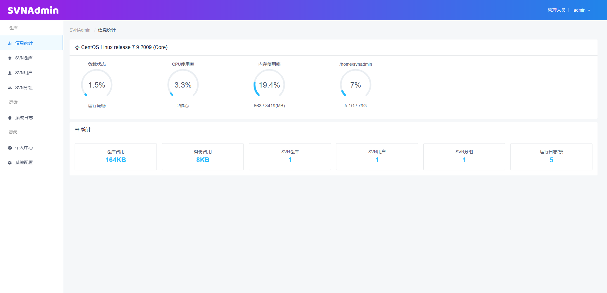


该管理系统由php编写，依赖php的环境。并且需要使用nginx等，对*.php文件进行映射。还需要数据库用以存储管理数据。技术栈还复杂的。

不过，该系统官方提供docker镜像部署，相对来说比较简单了。


### 应用部署

- 初始化一个临时容器

```sh
docker run -d \
-p 80:80 \
-p 3690:3690 \
--privileged \
--name=svnadmin \
witersencom/svnadmin:2.3.2
```


- 把临时容器的配置拷贝到宿主机

container_name是临时容器的名称，/home/svnadmin是容器固定的数据存储路径，/data是拷贝下来的路径，也可以换成别的

```sh
docker cp container_name:/home/svnadmin/ /data
```


- 创建容器，将磁盘挂进去

/data为刚刚的拷贝路径

```
sudo docker run -d \
-p 80:80 \
-p 3690:3690 \
-v "/data":"/home/svnadmin/" \
--privileged \
--name=svnadmin \
witersencom/svnadmin:2.3.2
```


- 其他

目前的版本，容器中存在一些权限问题，已向官方反馈，并于下版本修复。需要进入到容器中，对/home/svnadmin目录授一下权

```
# 进入容器
docker exec -it container_name /bin/bash
# 授权
chmod 777 /home/svnadmin/
```


这个问题，其实在这个镜像的dockerfile中，加一个chmod命令就可以处理了。


- svn的安装

该容器中，已经内置了一个svn服务，无需另外再安装一个svn，查看一下svn的版本

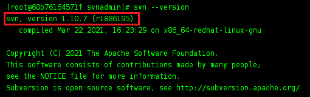

一般来说，除非有比较紧急的bug，否则不建议选择最新版本。

而1.10.7，最近的更新时间是去年4月，相对来说是个比较稳定的版本。

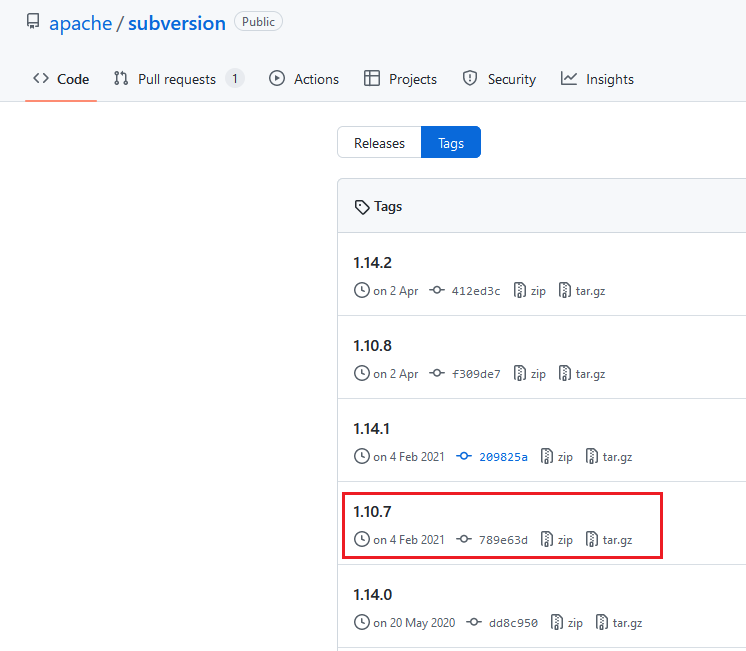


- 安全性问题考量

由于该管理系统，仅仅是对svn管理文件进行的修改，所以并不会影响实际的数据。相当于一个壳子，数据管理还是由svn进行的，没有管理系统也不影响svn的运行，如果有bug，也是在管理系统的高级功能层面。


### 管理系统使用

#### 概览

- 登录界面可分角色登录，配合后端实现的登录验证码（验证码可后台手动关闭开启）

  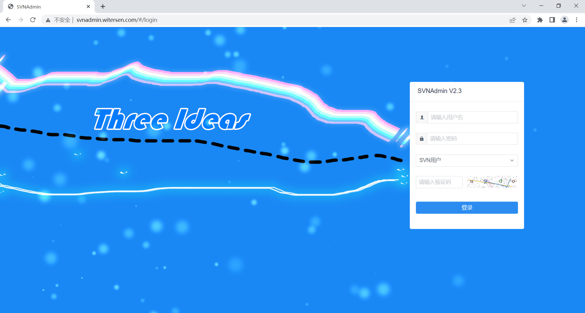

- 服务器状态监控和信息统计，对当前服务器状态和SVN仓库信息更加了解

  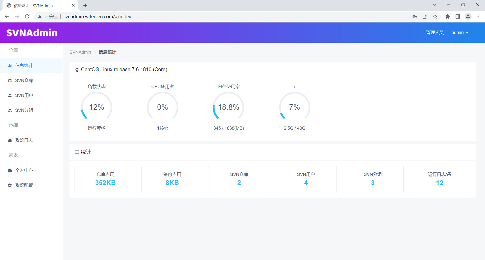

#### 仓库

- SVN仓库概览，提供了多种高级功能，还可根据仓库名、版本数、体积等一键排序

  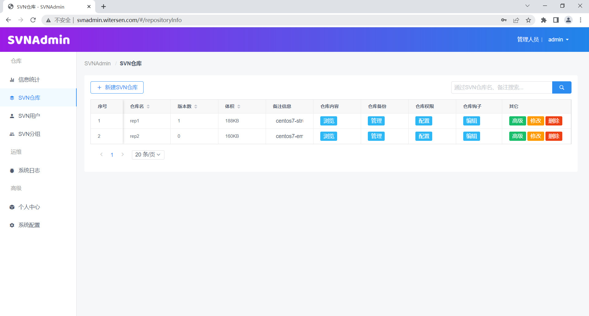

- 仓库目录浏览更加方便 逐层加载，服务资源占用更低

  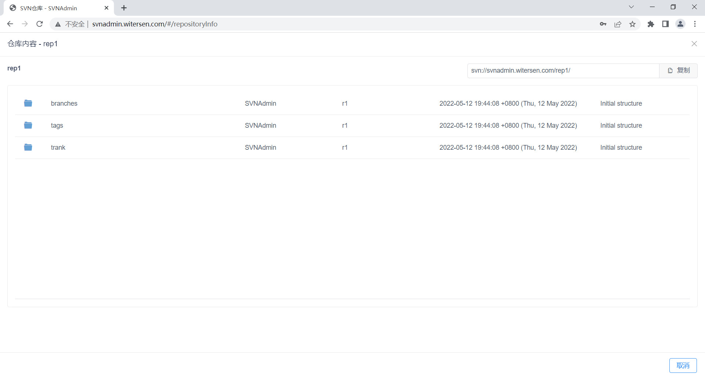

- **仓库授权精确到文件级别，可对用户和用户组快速授权和更改权限**

  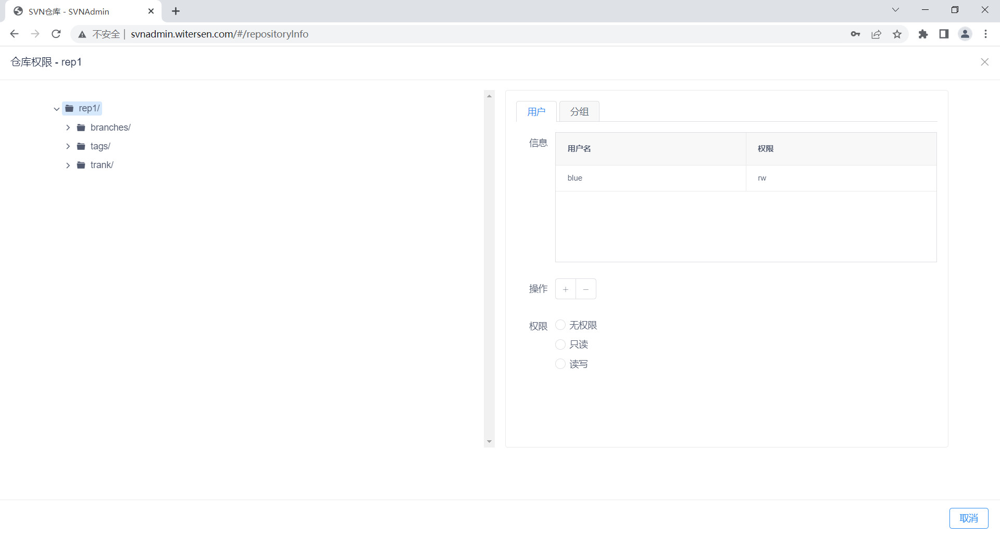

- 可以查看每个仓库的详细信息，一键复制详细信息更加方便

  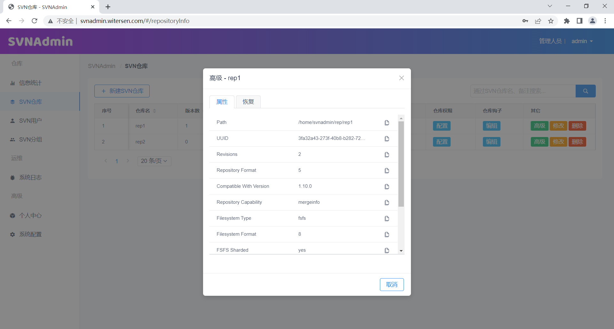

- 可以很方便的修改仓库名称，这会自动同步配置文件

  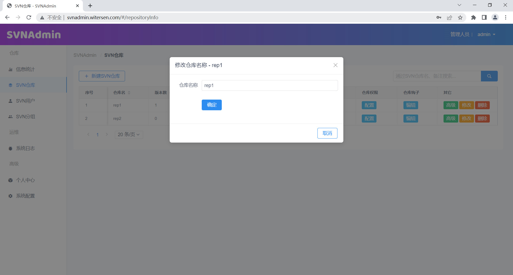

#### 用户管理

- SVN用户管理支持启用、禁用、添加备注信息，管理用户更加方便

  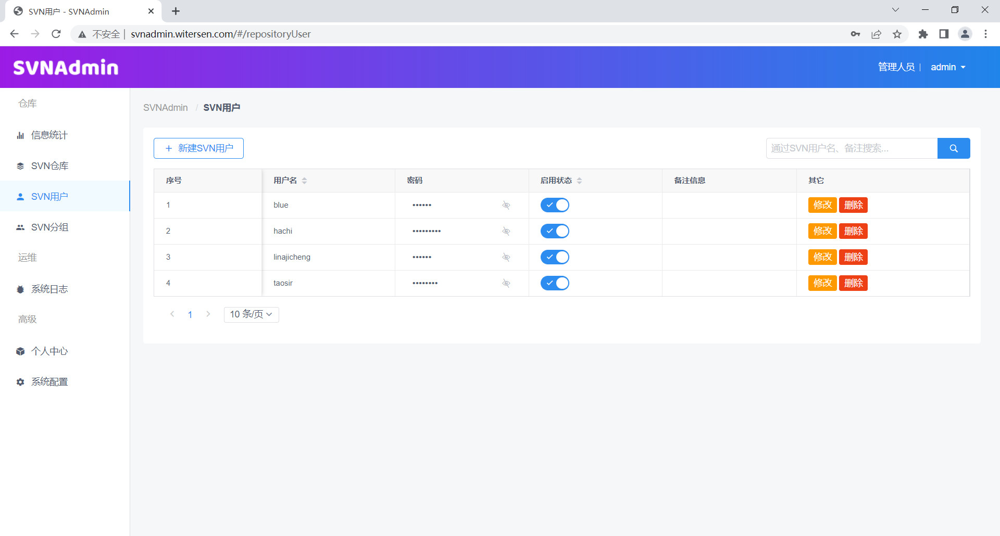

- SVN分组支持显示其包含的用户和分组数量 同时支持修改备注信息

  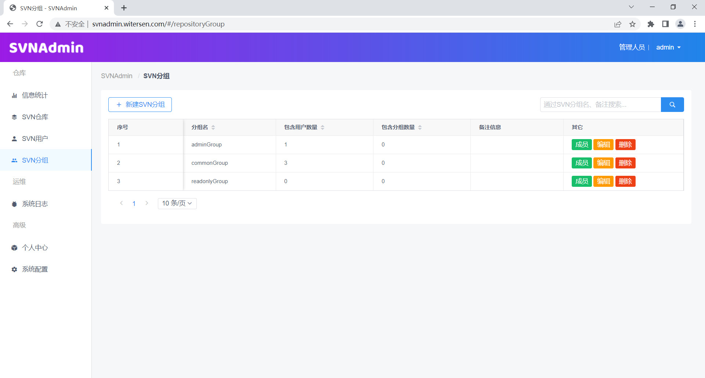

- 可以对分组进行用户成员编辑，系统会贴心的提示用户是否处于禁用状态

  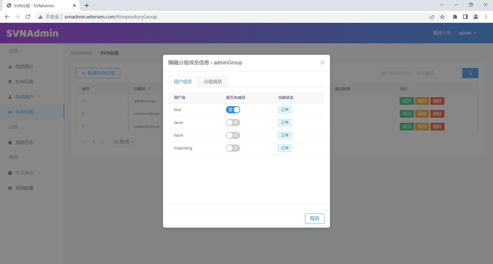

- 暂不支持

目前对用户的授权，只能通过管理账户进行，管理账户对所有仓库都是可见的。

效果就是，营销部门的管理账户，也可以看到开发部门的仓库。

官方反馈已经在开发这个功能了

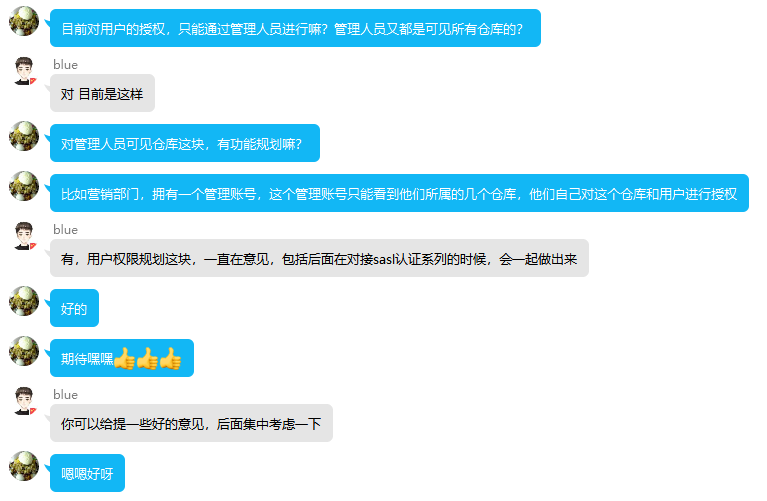


#### 备份

我们可能不会用到，而用别的方案，将整个仓库进行备份。

- 支持在线dump方式备份，备份文件可随时下载或删除

  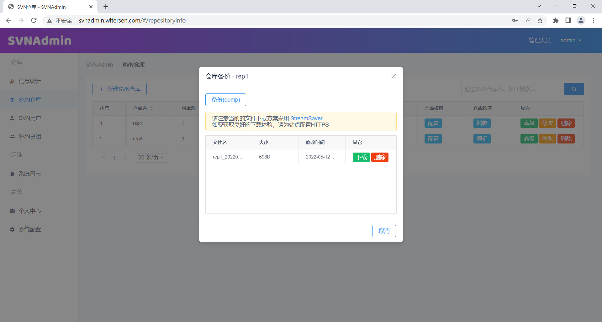

- 可以将通过dump方式备份的文件再导入仓库 实现SVN仓库的迁移

  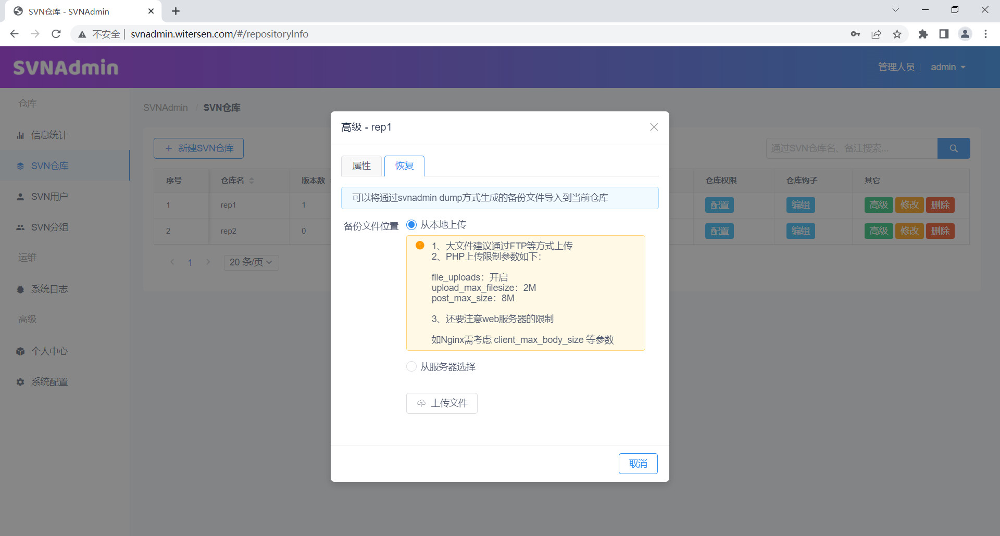

#### 其他

- 系统提供了svnserve主机和端口绑定功能 而且开启了svnserve的运行日志 为你多一层运维保障

  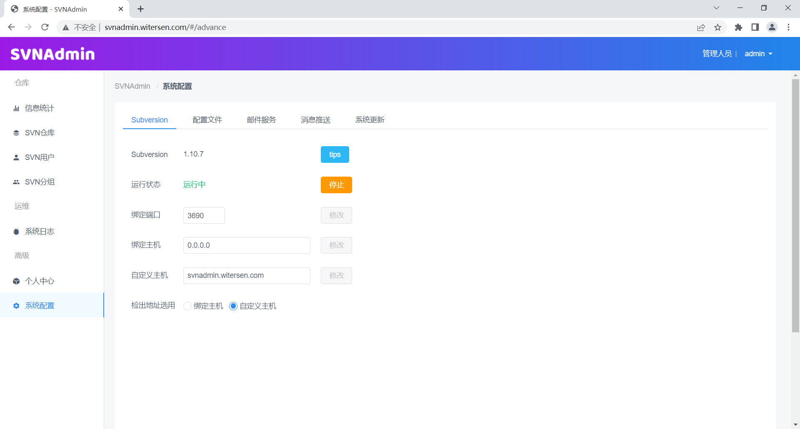

- 数据存储的路径查看

  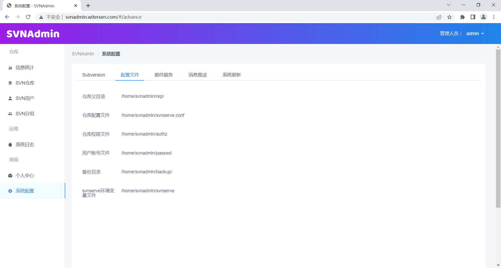

- 配置邮件通知服务

  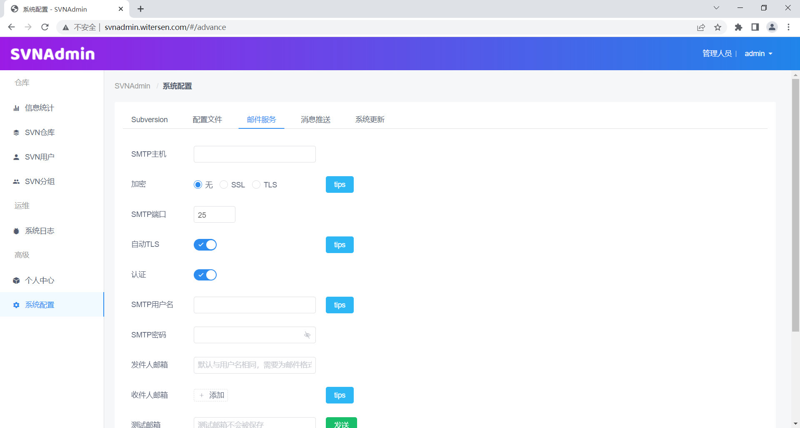

  


### 数据备份

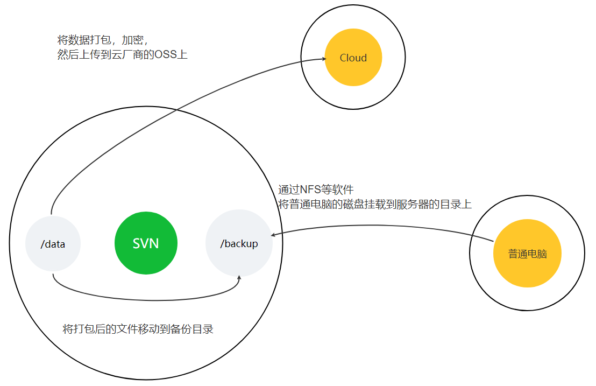


#### 云上备份

将数据打一个压缩包，并进行多层加密，然后上传到云厂商的的对象存储服务器上。


优点：

- 操作简单，云上存储无大小负担
- 成本较低
- 数据不会丢失

缺点：

- 需要开通oss等账号等，如之前没有用到，就会增加运维复杂度
- 加密数据可能被破解，尽管这个可能性极低，但仍有可能发生
- 备份上传的速度受限于出网带宽，后续压缩包很大时，备份时间会很长


#### 本地备份

在办公室，随便找一台电脑，挂几块大容量磁盘，也不用做raid。装一个ubuntu系统，再装个nfs服务端，然后在svn装一个nfs客户端，将nfs挂载到svn服务器上，直接当作磁盘用。备份时，直接把数据移动到nfs挂载的目录即可。


优点：

- 方案比较成熟，不会有比较复杂的技术问题
- 不会占用珍贵的服务器资源
- 成本较低
- 没有oss数据破解的风险
- 备份服务器后续可以给其它数据进行备份

缺点：

- 极低的可能，SVN和备份服务器一起损坏
- 备份的速度受限于备份服务器的网卡和磁盘，磁盘跑不满万兆网卡，百兆跑不满磁盘，千兆网卡比较合适，大部分办公主板都是千兆网卡。


#### 备份策略

备份策略受限与数据大小和磁盘空间。如数据量不是很大，就可以多保留几个副本。

- 一周备份一次，最多保留4个副本，即保留一个月内的数据
- 一天保存一次，最多保留3个副本，即保留前三天内的数据
- 一天保留一次，最多保留1个副本，即保留昨天的数据
- 一周保存一次，最多保留1个副本，一天保存一次，最多保存1个副本，即保留2个副本，保留一周前的数据，保留昨天的数据