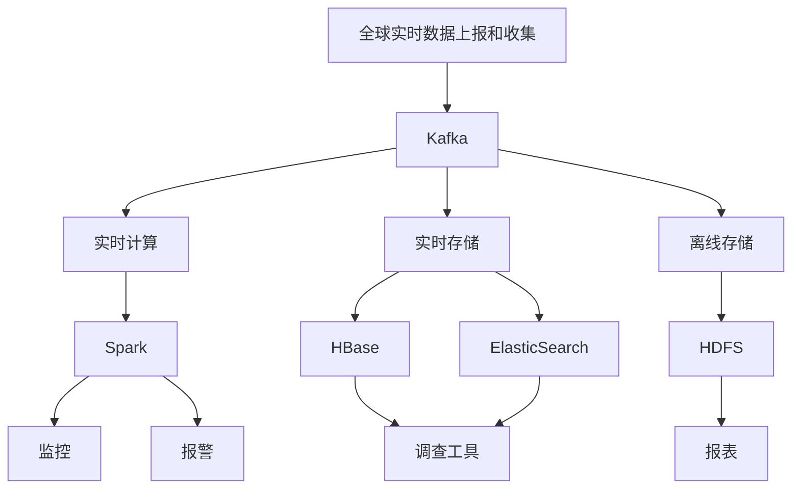

### 数据来源

1、招聘介绍，组件内容较多，但无法推断具体的架构

2、官网文档，无大数据组件架构的资料

3、峰会PPT，资料较老，在查阅了二十多个分享的PPT后，仅有2017年的一次分享提到了大数据组件架构

https://doc.huodongjia.com/detail-3366.html

https://pan.baidu.com/s/1brWgiQ9w3F4lHoCvIzGzsQ#list/path=%2F&parentPath=%2F

4、内部人员交流，无

### 组件架构

招聘介绍：HDFS、HBase、Kafka、Spark 、Flink、Presto、ClickHouse、ElasticSearch、Flume

计算层：Flink，Spark

流式存储：Kafka

存储层：HDFS，HBase，Druid，ClickHouse、Presto

### 质量实时监控

声网首席数据架构师，数据平台负责人何丰：

​        声网的实时监控体系，包含几百个指标，每个用户的数据都要实时收集、实时分析。所以，需要一个稳定的架构来支撑这样的海量数据和运算量。

​       声网的客户端和服务器节点是全球分布的，要保证端到端的质量监测，需要从四个系统来进行监测：“**第一是全球实时数据上报和收集。第二是实时计算系统、第三是实时存储系统、第四是离线存储系统。**实时收集是为了解决全球数据实时上报的。实时计算系统我们是做一些数据的实时统计和分析，有异常的时候进行告警。实时存储是把这些数据进行实时收集起来，能够做实时调查的一些工具，这里会用到HBase。最后是离线存储，我们后面会做整体的质量分析。”

​		目前，这个数据监测系统一天规模是一千亿条指标数据。并且在随着用户量的增加，逐渐提升。“目前声网整体监控的延迟性能大概是**10s**以内“

评价：

1、**根据业务功能，区分系统职责，避免单一组件的性能瓶颈**

2、声网人员招聘上，有Flume的相关要求，很有可能是作为Kafka的生产者，用于存储日志数据

3、该架构分享于2017年7月，随着功能的迭代，加招聘的描述，**很有可能增加了Druid、ClickHouse等实时数据库**。

4、可以明确，声网目前没有使用StarRocks

5、使用Spark做监控报警处理，必然时效性不佳，而监控报警系统，恰恰是需要高时效性的。招聘介绍中，也有Flink的相关要求，**很有可能也引入了Flink进行架构迭代**。

