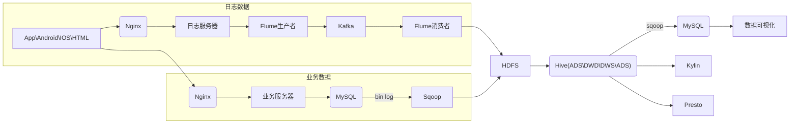
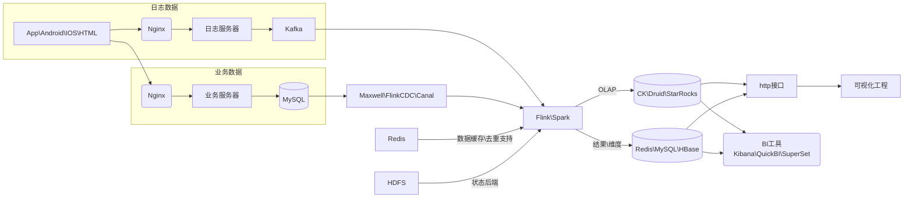
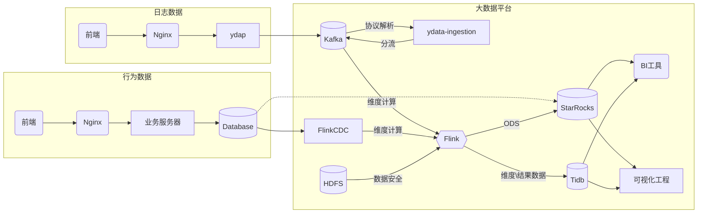

## 架构调研

在架构上，可以细分为批处理架构、流处理架构、实时架构、Kappa架构、离线架构、实时架构，从近些年的发展来看，在技术层面我们可能会更关心离线架构和实时架构，及其所运用到的组件，选型的依据，重点解决的问题等。

### 离线架构

- Flume：提供了大数据量log的存储能力，离线数据一次批量处理的日志可能很大。
- HDFS：数据存储
- Hive：分层建设
- Sqoop：用于MySQL<-->HDFS数据同步的工具，导入的方式有，全量、增量、新增及变化、特殊。特殊：只导入一次
- Kylin：Hadoop/Spark 之上的 SQL 查询接口及多维分析（OLAP）能力
- Presto：交互式分析查询，使用大型基于 Hadoop/HDFS 的集群构建

缺点：时效性差。跑离线任务时，CPU和内存会出现峰值。

优点：组件较为成熟，稳定性高。数据一致性较强。

### 实时架构

- Maxwell\FlinkCDC\Canal：流数据导入
- Redis：进行去重等操作
- HDFS：为Flink配置状态后端，暴涨其数据安全
- CK\Druid\StarRocks：实时数仓
- Redis\MySQL\HBase：数仓分层建设，结果数据保存
- BI工具：数据分析，数据仓库，以及相关报表的相关工具

缺点：部分组件稳定性有待评估。

优点：解决了时效性问题。

时效性和即席查询的需求，在当前音视频质量分析的场景中，允许分钟级别的时延。但在未来亿联网络的用户画像、推荐算法、日志异常分析等可能的场景中，时效性要求是比较高的。

而在现实中，采用离线架构进行处理的企业，只是因为前期在实时处理方面没有成熟稳定的方案或者架构。目前也有越来越多的企业朝着实时架构的方向进行迭代演进。

**实时架构能够实现离线架构的功能，而离线架构则无法满足实时的要求，若采用离线架构，无法拒绝的实时需求，也将导致架构朝着实时的方向进行演进。**所以，我们的核心目标应该是建立实时架构，尽管在数仓和流处理方面还面临着困难。但是选择离线架构，可能也会在Hive、Flume、Kylin和Presto上遇到更大的困难。

## 组件调研

### 数仓对比

数据来源：StarRocks官网测试报告，外部系统生产数据，Github，第三方调研测试。

对比选型：为Druid、ClickHouse和StarRocks的对比。Presto、Kylin、Hive、ES等，在外部系统的应用经验中，已被替换为CK，而CK又被替换为StarRocks。

|               | Druid                                                        | ClickHouse                                         | StarRocks                                               |
| ------------- | ------------------------------------------------------------ | -------------------------------------------------- | ------------------------------------------------------- |
| 简介          | -                                                            | -                                                  | 原DorisDB                                               |
| 架构          | 架构复杂，依赖zk。聚合操作依赖单点完成，瓶颈明显（在预生产环境出现过该问题）。 | 架构复杂，依赖zk。聚合操作依赖单点完成，瓶颈明显。 | MMP架构，FE调度节点，BE数据节点。多层聚合，扩展性较好。 |
| 标准SQL       | 部分支持                                                     | 不支持，但支持hsql，存在改造成本                   | 支持                                                    |
| 单表查询      | 快                                                           | 快                                                 | 最快                                                    |
| 多表查询      | 支持有限，速度一般                                           | 支持不佳                                           | 最快                                                    |
| 数据模型      | 宽表                                                         | 宽表                                               | 宽表，星型模型，雪花                                    |
| 自动Rebalance | 支持                                                         | 不支持                                             | 支持                                                    |
| 明细与聚合    | 支持完善                                                     | 不确定                                             | 支持完善                                                |
| 数据update    | 不支持                                                       | 不支持                                             | 支持完善                                                |
| 磁盘占用      | -                                                            | -                                                  | -                                                       |
| 可用性        | 高并发支持不佳                                               | 高并发支持不佳。小查询能够占用机器的大部分性能。   | 故障节点，几十秒内能进行切换，可以设置资源隔离。        |
| 运维成本      | 高                                                           | 高                                                 | 低                                                      |
| 可靠性        | worker内存不足可能宕机                                       | 故障恢复难度高                                     | 待验证                                                  |
| 扩展性        | 支持横扩                                                     | 支持横扩，但单机性能最高                           | 支持横扩，扩容代价小。                                  |
| 社区活跃度    | 高                                                           | 高，问题解决周期长                                 | 高，目前关注度较低                                      |

如果选型CK作为数仓，在未来出现多表查询的情况下，可能需要再搭建ES辅助进行多表查询。

StarRocks社区关注度一般，但活跃度很高，高于Flink，而且国内大厂，腾讯、阿里、美团、顺丰等都有世间。

数据update主要的场景是业务数据。

综合来看，StarRocks在架构、生态、运维、易用、扩展性等方便都非常出色。

StarRocks引进的相关问题或风险、建设

生态建设：

- 数据同步工具调研
- 可视化工具调研
- 元数据管理调研

原理研究：

| 系统架构            | 表设计       | 存储引擎                   | 计算引擎           |
| ------------------- | ------------ | -------------------------- | ------------------ |
| MMP架构             | 分区设计     | 列式存储                   | 向量化引擎         |
| 分布式调度+查询规划 | 分桶设计     | 前缀索引+ZoneMap           | SIMD指令           |
| 多机多核充分利用    | 排序键设计   | 延迟物化                   | 内存模型           |
|                     | 精确类型选择 | Bitmap索引\BloomFilter索引 | 两层聚合优化       |
|                     |              | pushdown + 向量化过滤      | Join & Join Filter |
|                     |              | 字符串低基数优化           | Pipeline原理       |

风险：

- 数据迁移，各种迁移工具的使用情况
- 运维，物理机\K8S部署
- 开发使用
- Full GC优化，FE节点的大堆可能导致较长时间的Full GC
- 安全的配置，资源隔离，熔断等

### 流处理平台对比

|          | Spark                                                        | Flink                                                        |
| -------- | ------------------------------------------------------------ | ------------------------------------------------------------ |
| 使用场景 | **批处理（微批）**                                           | **流处理**                                                   |
| 语言     | Scala                                                        | Scala                                                        |
| SQL      | Spark SQL                                                    | Table SQL                                                    |
| 数据模型 | **一组组的微批数据**                                         | **数据流模型**                                               |
| 架构     | Master、Worker、依赖Zookeeper 分阶段执行，一个完成进入下一个，颗粒度较大 | JobManager有状态，TaskManager无状态 流处理，一个事件在一个节点处理完才可以发往下一个节点，颗粒度小 |
| 时间机制 | Spark Streaming 只支持处理时间                               | 事件时间，注入时间，处理时间                                 |
| 生态     | 较为丰富                                                     | 一般，但不断完善                                             |
|          |                                                              |                                                              |
|          |                                                              |                                                              |
|          |                                                              |                                                              |

除去设计特点外，Spark较Flink，部署比较复杂，时间机制支持不够完善，虽然生态较为丰富，但不适用于实时架构的场景。

### 数据同步工具对比

|        | Flink-CDC                                                    | Maxwell                                                     | Canal                                                        | Sqoop                                  | DataX                                                        |
| ------ | ------------------------------------------------------------ | ----------------------------------------------------------- | ------------------------------------------------------------ | -------------------------------------- | ------------------------------------------------------------ |
| 介绍   | Fink社区开发了 flink-cdc-connectors组件，这是一个可以直接从MsQL、 PostgreSQL等数据库直接读取全量数据和増量变更数据的 source组件。 | Maxwell是由美国 Zendesk开源,用Java编写的MySQL实时抓取软件。 | Canal主要支持了 MySQL的 Binlog解析,解析完成后才利用 Canal client来处理获得的相关数据。 | 用以**MySQL<->HDFS**之间数据同步的工具 | DataX 是一个异构数据源离线同步工具，致力于实现包括关系型数据库(MySQL、Oracle等)、HDFS、Hive、ODPS、HBase、FTP等各种异构数据源之间稳定高效的数据同步功能。 |
| 特性   | 基于bin log，基于Debezium                                    | 基于bin log                                                 | 基于bin log                                                  |                                        |                                                              |
| 易用性 | 支持PG，与Flink配合使用，依次接收单条变更数据。              | 需要Kafka进行削峰，依次接收单条变更数据。                   | 可以直接接收处理，也可以推送到Kafka、RocketMQ中进行削峰。insert\update多条数据时，只接受一条聚合数据，需要自行解析。 |                                        |                                                              |

Sqoop用以MySQL和HDFS之间同步，但我们的数据不存HDFS中，所以不会对其进行使用。

DataX用以在传统数据库之间或者HDFS，进行数据同步，无OLAP数据库的同步功能。

结合Maxwell、Canal、FlinkCDC，从易用性上看，使用FlinkCDC较为合适。

## 外部系统调研

### 顺丰科技

#### 应用场景

#### 组件架构

|              | ES                                                           | Kylin                                                  | ClickHouse                                                   | Presto                                                       |
| ------------ | ------------------------------------------------------------ | ------------------------------------------------------ | ------------------------------------------------------------ | ------------------------------------------------------------ |
| 特性         | 支持全文索引、文本分词、同义词等搜索场景 近实时、高性能、横向扩展 | 预聚合                                                 | 支持数十亿级高性能的MPP数据库                                | 无需同步数据，直连大数据平台便捷的OLAP引擎                   |
| 使用情况     | 部署：物理机\K8S容器化部署 规模：最大 场景：日志类、搜索速度要求高、跨机房备份方案改造 | 部署：物理机 规模：小 场景：财务数据的预聚合 | 部署：物理机\K8S容器化部署 规模：中                     | 部署：基于yarn 场景：主要用于Hive数据的查询 规模：大 |
| **使用体验** | **各个版本兼容性差**，很难推动业务侧进行升级 版本升级工作量大，风险高 **性能好/整体成本高，性价比较容易被质疑** **一些OLAP场景也使用了ES进行实现，不一定是理想方案** 公共集群管理难度高，容易牵一发而动全身 |                                                        | 使用门槛高:**不支持标准sql**，作分片后关联需注意SQL写法 并发能力差，**join不理想** 分片数据**无法自动 rebalance** 高写入下，**zk容易被挑战** 文档、技术支持的难度高，有问题解决周期长 版本稳定性一般 **运维成本高，故障恢复难度高** 编译是个挑战 | **on yarn版本为定制化版本版本升级难度高** 资源分配固定，难以实现超卖 如何在小集群模式提高资源使用率 presto、tino选谁 |

#### 最终架构

完成灰度验证、机器采购、开发规划等，明年规模部署StarRocks，以替代Kylin，CK，Presto

### 小米有品

#### 应用场景

#### 组件架构

1、数据快速膨胀，查询性能成为瓶颈

2、维护多套系统，运维成本、机器成本高

3、Druid去重效果差，不支持明细数据

备注：Talos为小米自研的消息队列

#### 最终架构

1、实时数据通过Flink存储StarRocks

2、离线数据通过Hive导入到StarRocks

#### 维表建设

#### 数据建模

基于StarRocks支持星型模型的特点，进行数据建模，减少对大宽表的依赖。

#### 迭代演进

### 小红书

#### 应用场景

#### 组件架构

1、链路复杂，运维成本高

2、变更代价大，周期长

3、部分功能无法很好支持，如MySQL表变更实时同步到ClickHouse

4、可用性无法保障

#### 最终架构

经过对比Apache Doris与StarRocks之后，最终选型StarRocks

备注：RedKV为小红书的缓存K-V缓存系统

#### 数据实时同步

左侧为旧的同步方式，右侧为新的数据同步方式。

ClickHouse在多DDL操作时，可能会造成死锁。https://github.com/ClickHouse/ClickHouse/issues/11884

#### 可用性建议

#### 迭代演进

### 贝壳找房

#### 应用场景

#### 组件架构

- 指标平台

- 数据可视化

- 存在问题

1、历史数据实时Update支持不佳

2、表Join功能支持不佳

3、明细和聚合查询支持不佳

4、部分场景性能无法满足要求

5、OLAP引擎较多，运维复杂，用户、开发、运维学习成本较高

#### 最终架构

逐步以StarRocks替换其他OLAP引擎，目前由业务方根据现有条件选择查询引擎。业务方反馈的结果是StarRocks查询速度更快。

#### 迭代演进

#### 建议

- FE 失联

- create table较慢

### 跨越速运

#### 应用场景

#### 组件架构

1、组建太多，维护和使用成本高

2、复杂SQL，性能达不到预期

3、资源不能互相隔离，查询性能互相影响

#### 最终架构

- 总体架构

- BI查询提升30%

- 报表查询，大数据量下，较presto提升数倍

- 离线分析，提升3倍

- 实时分析，2小时更新->秒级更新

#### 迭代演进

#### 建议

## Ydata架构设计

### 业务特点

就v21\v22的需求来看，都只是对日志数据（行为数据）进行分析和存储。业务数据，目前没有相关的需求，但从公司业务线的扩展来看，在未来完全是有可能进行相关的接入的。

需要考虑到未来业务数据的接入情况。

### 架构设计

从外部系统调研的结果来看，架构设计应当尽量简单，尽可能地避免维护多套数仓。另外，在条件允许的情况下，进行双写，多集群备份。

主要的改动点是引入了HDFS、数据迁移工具、将Druid换成了StartRocks等，并且考虑到业务的支持情况，增加了业务数据的导入、BI工具建设等。

HDFS的是否引入，取决于Flink RocksDB功能是否满足当前业务场景的要求。

### 优势

- 历史数据的包袱较小
- 无复杂的数据统计指标
- 暂时无复杂的业务需求，容易进行架构演进

### 风险

- 避免使用yarn部署
- 若进行数据迁移，可能发生丢失
- 业务数据，消费错序可能会导致数据丢失

### 迭代演进

- StarRocks生态工具建设
- 音视频评价指标
- 接口查询统计
- 接口指标
- 用户画像
- 业务数据分析
- 推荐算法
- 职能细分
- 广告投放
- 新零售（公司最近推出了助听器）
- 企业需求挖掘

## 职能调研

### 大数据分析师

职位介绍：

- 了解数据统计、Excel、ETL等知识
- 开发要求较高，精通数据建模和经典算法

发展规划：大数据分析工程师->大数据资深分析师->数据分析专家

### 大数据平台工程师

职位介绍：

- 职责：Hadoop、Flume、Kafka、HBase、Spark等框架平台搭建，业务对接，集群性能监控、调优
- 技能：脚本语言能力；大数据相关技术Yarn、Hive、Spark、HBase、Kafka、Flume等运维；

发展规划：大数据平台工程师->大数据高级平台工程师->平台架构师

### 大数据离线仓库工程师

职位介绍：

- 职责：设计离线仓库（T+1），建模、规范及研发工作
- 技能：大数据生态相关技术，精通SQL以及SQL性能调优，会SparkSQL\FlinkSQL

发展规划：离线数仓工程师->高级离线数仓工程师->大数据架构师->资深架构师

### 大数据实时仓库工程师

职位介绍：

- 职责：设计实时数仓，监控、规范、调优及研发

- 技能：大数据生态相关技术，SparkStreaming，Flink流计算等

  

发展规划：实时数仓工程师->高级实时数仓工程师->大数据架构师->资深架构师

### 大数据用户画像工程师

职位介绍：

- 职责：负责标签定义、圈人、动查、机器学习打标签

发展规划：用户画像工程师->高级用户画像工程师->架构师

### 大数据推荐算法工程师

职位介绍：

- 一般要求211硕士起步
- 精通Java\Golang\Python\Spark\Hadoop\Flink
- 精通数据建模、机器学习和算法实现

发展规划：大数据算法工程师->大数据项目经理->大数据架构师->资深架构师->**大数据科学家**

